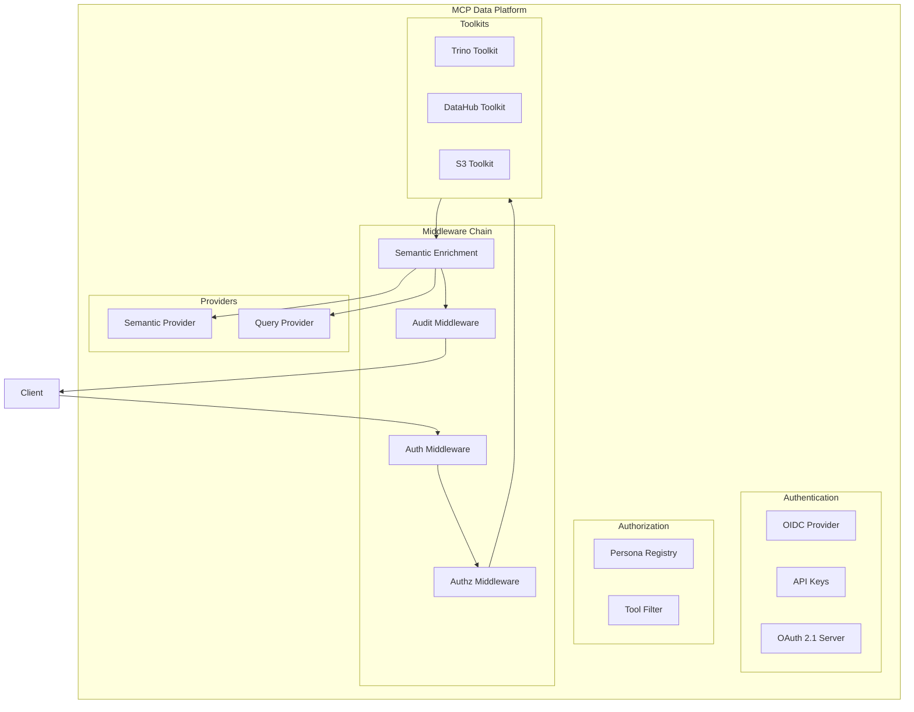

# CLAUDE.md

This file provides guidance to Claude Code when working with this project.

## Project Overview

**mcp-data-platform** is a semantic data platform MCP server that composes multiple txn2 MCP libraries (mcp-trino, mcp-s3, mcp-datahub) with required semantic layer integration. The key differentiator is **bidirectional cross-injection** where tool responses automatically include critical context from other services.

**Key Design Goals:**
- **Semantic-first**: All data access includes business context from the semantic layer
- **Composable**: Integrates multiple MCP toolkits (Trino, DataHub, S3) into a unified platform
- **Secure**: OAuth 2.1 authentication, role-based personas, and comprehensive audit logging
- **Extensible**: Plugin-based toolkit registry with middleware chain architecture

## Architecture



### Cross-Injection Pattern

**Trino → DataHub**: When describing a table in Trino, the response includes DataHub metadata (owners, tags, glossary terms, deprecation warnings, quality scores).

**DataHub → Trino**: When searching DataHub, results include query availability (can this be queried? how many rows? sample SQL).

## Code Standards

1. **Idiomatic Go**: All code must follow idiomatic Go patterns and conventions. Use `gofmt`, follow Effective Go guidelines, and adhere to Go Code Review Comments.

2. **Test Coverage**: Project must maintain >80% unit test coverage. Build mocks where necessary to achieve this. Use table-driven tests where appropriate.
   - **New code must have >80% coverage**: Run `go test -coverprofile=coverage.out ./pkg/...` and verify new/modified functions meet the threshold
   - Use `go tool cover -func=coverage.out | grep <function_name>` to check specific functions
   - Framework callbacks (e.g., MCP handlers that require client connections) may be excluded if the actual logic is extracted and tested separately

3. **Testing Definition**: When asked to "test" or "testing" the code, this means running the full CI test suite:
   - Unit tests with race detection (`go test -race ./...`)
   - Coverage verification (`go test -coverprofile=coverage.out ./... && go tool cover -func=coverage.out`)
   - Linting (`golangci-lint run ./...`)
   - Security scanning (`gosec ./...`)
   - All checks must pass locally before considering code "tested"

4. **Human Review Required**: A human must review and approve every line of code before it is committed. Therefore, commits are always performed by a human, not by Claude.

5. **Go Report Card**: The project MUST always maintain 100% across all categories on [Go Report Card](https://goreportcard.com/). This includes:
   - **gofmt**: All code must be formatted with `gofmt`
   - **go vet**: No issues from `go vet`
   - **gocyclo**: All functions must have cyclomatic complexity ≤10
   - **golint**: No lint issues
   - **ineffassign**: No ineffectual assignments
   - **license**: Valid license file present
   - **misspell**: No spelling errors in comments/strings

6. **Diagrams**: Use Mermaid for all diagrams. Never use ASCII art.

7. **Pinned Dependencies**: All external dependencies must be pinned to specific versions with SHA digests for reproducibility and security:
   - Docker base images: `alpine:3.21@sha256:...`
   - GitHub Actions: `actions/checkout@sha256:...`
   - Go modules are pinned via `go.sum`

8. **Documentation Updates**: When modifying documentation in `docs/`, also update the LLM-readable files:
   - `docs/llms.txt` - Index of documentation with brief descriptions
   - `docs/llms-full.txt` - Full documentation content for AI consumption
   These files follow the [llmstxt.org](https://llmstxt.org/) specification.

## Project Structure

```
mcp-data-platform/
├── cmd/mcp-data-platform/
│   └── main.go                    # Entry point
├── pkg/                           # PUBLIC API
│   ├── platform/                  # Core orchestration
│   │   ├── platform.go            # Platform facade (main entry point)
│   │   ├── config.go              # Configuration types and loading
│   │   ├── options.go             # Functional options
│   │   └── lifecycle.go           # Startup/shutdown coordination
│   ├── auth/                      # Authentication layer
│   │   ├── oidc.go                # Generic OIDC (discovery-based)
│   │   ├── apikey.go              # API key validation
│   │   ├── middleware.go          # Auth middleware
│   │   ├── claims.go              # Claims extraction
│   │   └── context.go             # UserContext type
│   ├── oauth/                     # OAuth 2.1 server
│   │   ├── server.go              # Authorization server
│   │   ├── dcr.go                 # Dynamic Client Registration
│   │   ├── pkce.go                # PKCE support
│   │   ├── storage.go             # Storage interface
│   │   └── postgres/
│   │       └── store.go           # PostgreSQL implementation
│   ├── persona/                   # Persona system
│   │   ├── persona.go             # Persona definition
│   │   ├── registry.go            # PersonaRegistry
│   │   ├── mapper.go              # RoleMapper (OIDC + static)
│   │   └── filter.go              # Tool filtering per persona
│   ├── semantic/                  # Semantic layer abstraction
│   │   ├── provider.go            # SemanticMetadataProvider interface
│   │   ├── types.go               # Semantic types
│   │   ├── datahub/
│   │   │   └── adapter.go         # DataHub implementation
│   │   ├── cache.go               # Caching decorator
│   │   └── noop.go                # No-op for testing
│   ├── query/                     # Query execution abstraction
│   │   ├── provider.go            # QueryExecutionProvider interface
│   │   ├── types.go               # Query types
│   │   ├── trino/
│   │   │   └── adapter.go         # Trino implementation
│   │   └── noop.go                # No-op for testing
│   ├── registry/                  # Toolkit registry
│   │   ├── registry.go            # ToolkitRegistry
│   │   ├── toolkit.go             # Toolkit interface
│   │   └── loader.go              # Config-driven loading
│   ├── middleware/                # MCP protocol middleware
│   │   ├── context.go             # PlatformContext
│   │   ├── mcp_toolcall.go        # Auth/authz middleware
│   │   ├── mcp_enrichment.go      # Semantic enrichment middleware
│   │   ├── mcp_audit.go           # Audit logging middleware
│   │   └── semantic.go            # Enrichment functions
│   ├── audit/                     # Audit logging
│   │   ├── logger.go              # AuditLogger interface
│   │   ├── event.go               # Event types
│   │   └── postgres/
│   │       └── store.go           # PostgreSQL implementation
│   ├── tuning/                    # Tuning layer
│   │   ├── prompts.go             # Prompt resources
│   │   ├── hints.go               # Tool hints
│   │   └── rules.go               # Operational rules
│   └── tools/                     # Base toolkit
│       └── toolkit.go             # Example toolkit
├── internal/server/               # Server factory
│   └── server.go
├── configs/                       # Example configurations
│   └── platform.yaml
├── migrations/                    # SQL migrations
│   ├── 001_oauth_clients.sql
│   └── 002_audit_logs.sql
├── go.mod
├── LICENSE
└── README.md
```

## Key Dependencies

- `github.com/modelcontextprotocol/go-sdk` - Official MCP SDK for Go (same as txn2 MCP ecosystem)
- `github.com/txn2/mcp-trino` - Trino MCP toolkit
- `github.com/txn2/mcp-datahub` - DataHub MCP toolkit
- `github.com/txn2/mcp-s3` - S3 MCP toolkit
- `golang.org/x/crypto` - Cryptographic utilities (bcrypt for OAuth)
- `gopkg.in/yaml.v3` - YAML configuration parsing

## Building and Running

```bash
# Build
go build -o mcp-data-platform ./cmd/mcp-data-platform

# Run with stdio transport (default)
./mcp-data-platform

# Run with config file
./mcp-data-platform --config configs/platform.yaml

# Run with SSE transport
./mcp-data-platform --transport sse --address :8080
```

## Configuration Reference

Configuration is loaded from YAML with environment variable expansion (`${VAR_NAME}`).

### Server Configuration
```yaml
server:
  name: mcp-data-platform
  transport: stdio          # stdio, sse
  address: ":8080"
```

### Authentication
```yaml
auth:
  oidc:
    enabled: true
    issuer: "https://auth.example.com/realms/platform"
    client_id: "mcp-data-platform"
    audience: "mcp-data-platform"
    role_claim_path: "realm_access.roles"
    role_prefix: "dp_"
  api_keys:
    enabled: true
    keys:
      - key: "${API_KEY_ADMIN}"
        name: "admin"
        roles: ["admin"]
```

### Personas
```yaml
personas:
  definitions:
    analyst:
      display_name: "Data Analyst"
      roles: ["analyst", "data_engineer"]
      tools:
        allow: ["trino_*", "datahub_*"]
        deny: ["*_delete_*"]
      prompts:
        system_prefix: "You are helping a data analyst."
    admin:
      display_name: "Administrator"
      roles: ["admin"]
      tools:
        allow: ["*"]
  default_persona: analyst
```

### Semantic Layer
```yaml
semantic:
  provider: datahub
  instance: primary
  cache:
    enabled: true
    ttl: 5m

injection:
  trino_semantic_enrichment: true
  datahub_query_enrichment: true
```

### Audit Logging
```yaml
audit:
  enabled: true
  log_tool_calls: true
  retention_days: 90

database:
  dsn: "${DATABASE_URL}"
```

## Core Interfaces

### SemanticMetadataProvider
```go
type Provider interface {
    Name() string
    GetTableContext(ctx context.Context, table TableIdentifier) (*TableContext, error)
    GetColumnContext(ctx context.Context, column ColumnIdentifier) (*ColumnContext, error)
    GetColumnsContext(ctx context.Context, table TableIdentifier) (map[string]*ColumnContext, error)
    GetLineage(ctx context.Context, table TableIdentifier, direction LineageDirection, maxDepth int) (*LineageInfo, error)
    GetGlossaryTerm(ctx context.Context, urn string) (*GlossaryTerm, error)
    SearchTables(ctx context.Context, filter SearchFilter) ([]TableSearchResult, error)
    Close() error
}
```

### QueryExecutionProvider
```go
type Provider interface {
    Name() string
    ResolveTable(ctx context.Context, urn string) (*TableIdentifier, error)
    GetTableAvailability(ctx context.Context, urn string) (*TableAvailability, error)
    GetQueryExamples(ctx context.Context, urn string) ([]QueryExample, error)
    GetExecutionContext(ctx context.Context, urns []string) (*ExecutionContext, error)
    GetTableSchema(ctx context.Context, table TableIdentifier) (*TableSchema, error)
    Close() error
}
```

### Toolkit Interface
```go
type Toolkit interface {
    Kind() string
    Name() string
    RegisterTools(server *mcp.Server)
    Tools() []string
    SetSemanticProvider(provider semantic.Provider)
    SetQueryProvider(provider query.Provider)
    Close() error
}
```

## MCP Protocol Middleware

Request processing flows through MCP protocol-level middleware registered via `server.AddReceivingMiddleware()`:

1. **MCPToolCallMiddleware** - Authenticates user, authorizes tool access
2. **MCPAuditMiddleware** - Logs tool calls asynchronously (after response)
3. **MCPSemanticEnrichmentMiddleware** - Adds cross-service context to results

All middleware intercepts `tools/call` requests at the MCP protocol level.

## Testing

```bash
# Run all tests with race detection
go test -race ./...

# Run linter
golangci-lint run ./...

# Run security scan
gosec ./...

# Run specific package tests
go test -race ./pkg/platform/...
```
