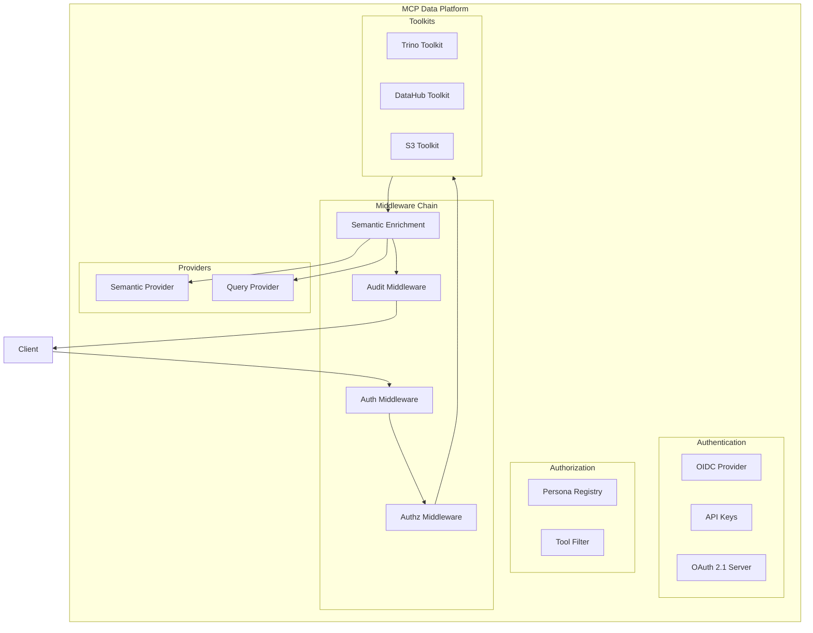

# CLAUDE.md

This file provides guidance to Claude Code when working with this project.

## Project Overview

**mcp-data-platform** is a semantic data platform MCP server that composes multiple txn2 MCP libraries (mcp-trino, mcp-s3, mcp-datahub) with required semantic layer integration. The key differentiator is **bidirectional cross-injection** where tool responses automatically include critical context from other services.

**Key Design Goals:**
- **Semantic-first**: All data access includes business context from the semantic layer
- **Composable**: Integrates multiple MCP toolkits (Trino, DataHub, S3) into a unified platform
- **Secure**: OAuth 2.1 authentication, role-based personas, and comprehensive audit logging
- **Extensible**: Plugin-based toolkit registry with middleware chain architecture

## Architecture



### Cross-Injection Pattern

**Trino → DataHub**: When describing a table in Trino, the response includes DataHub metadata (owners, tags, glossary terms, deprecation warnings, quality scores).

**DataHub → Trino**: When searching DataHub, results include query availability (can this be queried? how many rows? sample SQL).

## Code Standards

1. **Idiomatic Go**: All code must follow idiomatic Go patterns and conventions. Use `gofmt`, follow Effective Go guidelines, and adhere to Go Code Review Comments.

2. **Test Coverage**: Project must maintain >80% unit test coverage. Build mocks where necessary to achieve this. Use table-driven tests where appropriate.
   - **New code must have >80% coverage**: Run `go test -coverprofile=coverage.out ./...` and verify new/modified functions meet the threshold
   - Use `go tool cover -func=coverage.out | grep <function_name>` to check specific functions
   - Framework callbacks (e.g., MCP handlers that require client connections) may be excluded if the actual logic is extracted and tested separately

3. **Testing Definition**: When asked to "test" or "testing" the code, this means running `make verify`, which executes the full CI-equivalent suite:
   - Code formatting (`gofmt -s -w .`)
   - Unit tests with race detection (`go test -race ./...`)
   - Coverage verification — total must be ≥80% (hard gate)
   - Patch coverage — changed lines vs main must be ≥80% (mirrors codecov patch check)
   - Linting (`golangci-lint run ./...`) — cyclomatic complexity ≤10, cognitive complexity ≤15
   - Security scanning (`gosec ./...` + `govulncheck`)
   - Semgrep SAST — `p/golang` ruleset + custom `.semgrep/` rules (unbounded allocations, etc.)
   - CodeQL analysis — `security-and-quality` query suite, fails on error-level findings
   - Documentation check — warns when documentation-worthy changes lack doc updates (soft warning)
   - Dead code analysis
   - Mutation testing (`gremlins unleash --threshold-efficacy 60`) — ≥60% kill rate
   - GoReleaser dry-run — validates build, Docker, and release config
   - All checks must pass locally before considering code "tested"

4. **CRITICAL - Coverage Verification Before Completion**: Before declaring ANY implementation task complete:
   - Run `go test -coverprofile=coverage.out ./...` (note: `./...` not `./pkg/...` — covers `cmd/` too)
   - For EVERY new function or method added, run: `go tool cover -func=coverage.out | grep <function_name>`
   - **If ANY new function shows less than 80% coverage (or 0.0%), you MUST add tests before declaring done**
   - This is a BLOCKING requirement - do not tell the user the work is complete until all new code has adequate test coverage
   - The CI/CD pipeline includes Codecov patch coverage checks that will fail if new code lacks tests

5. **CRITICAL - Integration Tests for Cross-Component Behavior**: Unit tests are NOT sufficient for features that span multiple components (middleware chains, provider pipelines, context propagation). Before declaring such work complete:
   - **Write an integration test that exercises the real assembled system**, not just individual functions with hand-crafted inputs
   - For middleware: wire up the actual `mcp.Server` with all middleware via `AddReceivingMiddleware`, send a real request, and assert the end-to-end result (e.g., audit store received a complete event with non-empty fields)
   - For context propagation: verify that values set by one component are actually readable by downstream components through the real call chain
   - For provider injection: verify that cross-service enrichment actually produces enriched output, not just that the enrichment function works in isolation
   - **A unit test that passes because it manually constructs the correct input does NOT prove the system works.** The integration test must prove that component A's output actually reaches component B through the real wiring.
   - If you cannot write a full integration test (e.g., requires external services), document exactly what manual verification steps the human should perform before release, with expected outputs

6. **CRITICAL - Acceptance Criteria Before Implementation**: Before writing code for any feature or fix:
   - State the specific, observable acceptance criteria (e.g., "a tool call produces an audit_logs row with non-null user_id, duration_ms, and tool_name")
   - Write the test assertions FIRST, then implement the code to make them pass
   - The acceptance criteria must test the actual user-visible behavior, not internal implementation details
   - If you find yourself testing that "function X returns Y when given Z" but never testing that "Z actually arrives from the real system," the test is incomplete

7. **Human Review Required**: A human must review and approve every line of code before it is committed. Therefore, commits are always performed by a human, not by Claude.

8. **Go Report Card**: The project MUST always maintain 100% across all categories on [Go Report Card](https://goreportcard.com/). This includes:
   - **gofmt**: All code must be formatted with `gofmt`
   - **go vet**: No issues from `go vet`
   - **gocyclo**: All functions must have cyclomatic complexity ≤10
   - **golint**: No lint issues
   - **ineffassign**: No ineffectual assignments
   - **license**: Valid license file present
   - **misspell**: No spelling errors in comments/strings

9. **Diagrams**: Use Mermaid for all diagrams. Never use ASCII art.

10. **Pinned Dependencies**: All external dependencies must be pinned to specific versions with SHA digests for reproducibility and security:
    - Docker base images: `alpine:3.21@sha256:...`
    - GitHub Actions: `actions/checkout@sha256:...`
    - Go modules are pinned via `go.sum`

11. **Documentation Updates**: When modifying documentation in `docs/`, also update the LLM-readable files:
    - `docs/llms.txt` - Index of documentation with brief descriptions
    - `docs/llms-full.txt` - Full documentation content for AI consumption
    These files follow the [llmstxt.org](https://llmstxt.org/) specification.

12. **CRITICAL - Documentation Completeness**: `make doc-check` warns when documentation-worthy changes (new packages, config changes, new toolkits, new CLI flags, new Makefile targets, new migrations) are present but `README.md`, `docs/`, `docs/llms.txt`, and `docs/llms-full.txt` were not updated. While this is a soft warning for human developers, **it is a blocking requirement for AI agents**: if `make doc-check` emits a WARNING, you MUST update the relevant documentation before declaring the task complete.

## Project Structure

```
mcp-data-platform/
├── cmd/mcp-data-platform/
│   └── main.go                    # Entry point
├── pkg/                           # PUBLIC API
│   ├── platform/                  # Core orchestration
│   │   ├── platform.go            # Platform facade (main entry point)
│   │   ├── config.go              # Configuration types and loading
│   │   ├── options.go             # Functional options
│   │   └── lifecycle.go           # Startup/shutdown coordination
│   ├── auth/                      # Authentication layer
│   │   ├── oidc.go                # Generic OIDC (discovery-based)
│   │   ├── apikey.go              # API key validation
│   │   ├── middleware.go          # Auth middleware
│   │   ├── claims.go              # Claims extraction
│   │   └── context.go             # UserContext type
│   ├── oauth/                     # OAuth 2.1 server
│   │   ├── server.go              # Authorization server
│   │   ├── dcr.go                 # Dynamic Client Registration
│   │   ├── pkce.go                # PKCE support
│   │   ├── storage.go             # Storage interface
│   │   └── postgres/
│   │       └── store.go           # PostgreSQL implementation
│   ├── persona/                   # Persona system
│   │   ├── persona.go             # Persona definition
│   │   ├── registry.go            # PersonaRegistry
│   │   ├── mapper.go              # RoleMapper (OIDC + static)
│   │   └── filter.go              # Tool filtering per persona
│   ├── semantic/                  # Semantic layer abstraction
│   │   ├── provider.go            # SemanticMetadataProvider interface
│   │   ├── types.go               # Semantic types
│   │   ├── datahub/
│   │   │   └── adapter.go         # DataHub implementation
│   │   ├── cache.go               # Caching decorator
│   │   └── noop.go                # No-op for testing
│   ├── query/                     # Query execution abstraction
│   │   ├── provider.go            # QueryExecutionProvider interface
│   │   ├── types.go               # Query types
│   │   ├── trino/
│   │   │   └── adapter.go         # Trino implementation
│   │   └── noop.go                # No-op for testing
│   ├── registry/                  # Toolkit registry
│   │   ├── registry.go            # ToolkitRegistry
│   │   ├── toolkit.go             # Toolkit interface
│   │   └── loader.go              # Config-driven loading
│   ├── middleware/                # MCP protocol middleware
│   │   ├── context.go             # PlatformContext
│   │   ├── mcp_toolcall.go        # Auth/authz middleware
│   │   ├── mcp_enrichment.go      # Semantic enrichment middleware
│   │   ├── mcp_audit.go           # Audit logging middleware
│   │   └── semantic.go            # Enrichment functions
│   ├── audit/                     # Audit logging
│   │   ├── logger.go              # AuditLogger interface
│   │   ├── event.go               # Event types
│   │   └── postgres/
│   │       └── store.go           # PostgreSQL implementation
│   ├── database/                  # Database utilities
│   │   └── migrate/               # Database migrations (golang-migrate)
│   │       ├── migrate.go         # Migration runner
│   │       └── migrations/        # Embedded SQL migrations
│   │           ├── 000001_oauth_clients.up.sql
│   │           ├── 000001_oauth_clients.down.sql
│   │           ├── 000002_audit_logs.up.sql
│   │           └── 000002_audit_logs.down.sql
│   ├── tuning/                    # Tuning layer
│   │   ├── prompts.go             # Prompt resources
│   │   ├── hints.go               # Tool hints
│   │   └── rules.go               # Operational rules
│   └── tools/                     # Base toolkit
│       └── toolkit.go             # Example toolkit
├── internal/server/               # Server factory
│   └── server.go
├── configs/                       # Example configurations
│   └── platform.yaml
├── go.mod
├── LICENSE
└── README.md
```

## Key Dependencies

- `github.com/modelcontextprotocol/go-sdk` - Official MCP SDK for Go (same as txn2 MCP ecosystem)
- `github.com/txn2/mcp-trino` - Trino MCP toolkit
- `github.com/txn2/mcp-datahub` - DataHub MCP toolkit
- `github.com/txn2/mcp-s3` - S3 MCP toolkit
- `golang.org/x/crypto` - Cryptographic utilities (bcrypt for OAuth)
- `gopkg.in/yaml.v3` - YAML configuration parsing

## Building and Running

```bash
# Build
go build -o mcp-data-platform ./cmd/mcp-data-platform

# Run with stdio transport (default)
./mcp-data-platform

# Run with config file
./mcp-data-platform --config configs/platform.yaml

# Run with HTTP transport (serves both SSE and Streamable HTTP)
./mcp-data-platform --transport http --address :8080
```

## Configuration Reference

Configuration is loaded from YAML with environment variable expansion (`${VAR_NAME}`).

### Server Configuration
```yaml
server:
  name: mcp-data-platform
  transport: stdio          # stdio, http
  address: ":8080"
```

### Authentication
```yaml
auth:
  oidc:
    enabled: true
    issuer: "https://auth.example.com/realms/platform"
    client_id: "mcp-data-platform"
    audience: "mcp-data-platform"
    role_claim_path: "realm_access.roles"
    role_prefix: "dp_"
  api_keys:
    enabled: true
    keys:
      - key: "${API_KEY_ADMIN}"
        name: "admin"
        roles: ["admin"]
```

### Personas
```yaml
personas:
  definitions:
    analyst:
      display_name: "Data Analyst"
      roles: ["analyst", "data_engineer"]
      tools:
        allow: ["trino_*", "datahub_*"]
        deny: ["*_delete_*"]
      prompts:
        system_prefix: "You are helping a data analyst."
    admin:
      display_name: "Administrator"
      roles: ["admin"]
      tools:
        allow: ["*"]
  default_persona: analyst
```

### Semantic Layer
```yaml
semantic:
  provider: datahub
  instance: primary
  cache:
    enabled: true
    ttl: 5m

injection:
  trino_semantic_enrichment: true
  datahub_query_enrichment: true
```

### Audit Logging
```yaml
audit:
  enabled: true
  log_tool_calls: true
  retention_days: 90

database:
  dsn: "${DATABASE_URL}"
```

## Core Interfaces

### SemanticMetadataProvider
```go
type Provider interface {
    Name() string
    GetTableContext(ctx context.Context, table TableIdentifier) (*TableContext, error)
    GetColumnContext(ctx context.Context, column ColumnIdentifier) (*ColumnContext, error)
    GetColumnsContext(ctx context.Context, table TableIdentifier) (map[string]*ColumnContext, error)
    GetLineage(ctx context.Context, table TableIdentifier, direction LineageDirection, maxDepth int) (*LineageInfo, error)
    GetGlossaryTerm(ctx context.Context, urn string) (*GlossaryTerm, error)
    SearchTables(ctx context.Context, filter SearchFilter) ([]TableSearchResult, error)
    Close() error
}
```

### QueryExecutionProvider
```go
type Provider interface {
    Name() string
    ResolveTable(ctx context.Context, urn string) (*TableIdentifier, error)
    GetTableAvailability(ctx context.Context, urn string) (*TableAvailability, error)
    GetQueryExamples(ctx context.Context, urn string) ([]QueryExample, error)
    GetExecutionContext(ctx context.Context, urns []string) (*ExecutionContext, error)
    GetTableSchema(ctx context.Context, table TableIdentifier) (*TableSchema, error)
    Close() error
}
```

### Toolkit Interface
```go
type Toolkit interface {
    Kind() string
    Name() string
    RegisterTools(server *mcp.Server)
    Tools() []string
    SetSemanticProvider(provider semantic.Provider)
    SetQueryProvider(provider query.Provider)
    Close() error
}
```

## MCP Protocol Middleware

Request processing flows through MCP protocol-level middleware registered via `server.AddReceivingMiddleware()`.

**IMPORTANT**: `AddReceivingMiddleware` wraps the current handler — each call makes the new middleware the **outermost** layer. The LAST middleware added runs FIRST. In `finalizeSetup()`, middleware is added innermost-first:

Execution order (outermost to innermost):
1. **MCPAppsMetadataMiddleware** - Injects `_meta.ui` into tools/list responses
2. **MCPToolCallMiddleware** - Authenticates user, authorizes tool access, creates PlatformContext
3. **MCPAuditMiddleware** - Logs tool calls asynchronously (reads PlatformContext from ctx)
4. **MCPRuleEnforcementMiddleware** - Adds operational guidance to responses
5. **MCPSemanticEnrichmentMiddleware** - Adds cross-service context to results

All middleware intercepts `tools/call` requests at the MCP protocol level. MCPToolCallMiddleware must be **outer** to MCPAuditMiddleware so that `PlatformContext` (set via `context.WithValue`) is present in the `ctx` that MCPAuditMiddleware receives.

## Testing

```bash
# Run all tests with race detection
go test -race ./...

# Run linter
golangci-lint run ./...

# Run security scan
gosec ./...

# Run specific package tests
go test -race ./pkg/platform/...

# Run dead code analysis (informational)
make dead-code

# Run mutation testing (informational)
make mutate
```

## AI Verification Requirements

When AI (Claude Code or similar) contributes code, the following additional checks apply:

1. **No Tautological Tests**: Tests must verify behavior, not struct field assignment. A test that sets `x.Field = "value"` then asserts `x.Field == "value"` tests the Go compiler, not the application. Delete such tests on sight.

2. **Integration Tests for Multi-Component Features**: Unit tests alone are insufficient for features that span middleware chains, provider pipelines, or context propagation. Require an integration test that wires up the real assembled system (e.g., `mcp.Server` + `AddReceivingMiddleware` + in-memory transport + real `CallTool`).

3. **Mutation Survival Review**: After adding tests, run `make mutate` on the affected packages. Surviving mutants in security-critical paths (auth, audit, encryption) must be addressed with targeted tests. Informational mutants in logging or formatting may be deferred.

4. **Dead Code Audit**: Run `make dead-code` before submitting. Functions reported as dead should be either deleted or moved to test files. Public API functions may be false positives (library exports) and can be ignored with justification.

5. **No Vaporware**: Every database migration table must have corresponding DML (INSERT/SELECT/UPDATE/DELETE) in non-test Go source code. Every Go package under `pkg/` must be imported by at least one non-test file. Every interface with a noop implementation must also have a real (non-noop) implementation. These invariants are enforced by three tests:
   - `TestMigrationTablesHaveConsumers` (`pkg/database/migrate/`) — no orphaned migration tables
   - `TestNoDeadPackages` (`verify_test.go` at repo root) — no unimported packages
   - `TestNoopOnlyInterfaces` (`verify_test.go` at repo root) — no interfaces where the only implementation is a noop

   Do not create migrations, packages, or interfaces "for future use" — code that isn't wired into the running application is dead code regardless of whether it has its own unit tests.

   **The Noop Loophole**: A noop implementation satisfies compile checks, passes tests (returns nil), gets imported (not dead), and wires into the platform — yet does nothing. This is the most insidious form of vaporware because every automated gate reports green. `TestNoopOnlyInterfaces` closes this loophole by requiring that any interface with a noop also has a real implementation that performs actual work.

6. **Dependency-First Verification**: Before implementing features that depend on external system capabilities (writing to DataHub, calling a third-party API, etc.), VERIFY that the dependency actually supports the required operations. If the upstream library lacks the needed functionality, that gap must be surfaced IMMEDIATELY — do not build scaffolding (handlers, stores, migrations, admin APIs) around a capability that doesn't exist. The correct order is:
   1. Verify the external dependency supports the required operations
   2. Implement or extend the client for those operations
   3. Build the feature on top of the working client

   Building top-down from handlers to stores to admin APIs while leaving the actual external integration as a noop is **prohibited**. If the external system can't do what the feature requires, stop and report the gap instead of building theater around it.
