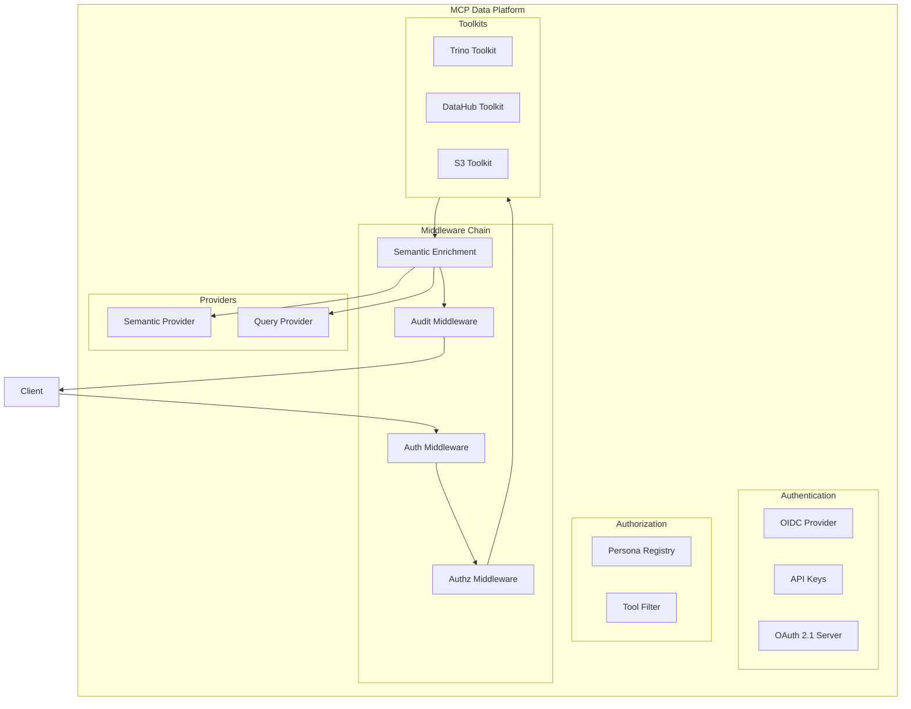

# CLAUDE.md

This file provides guidance to Claude Code when working with this project.

## Project Overview

**mcp-data-platform** is a semantic data platform MCP server that composes multiple txn2 MCP libraries (mcp-trino, mcp-s3, mcp-datahub) with semantic layer integration. The key differentiator is **bidirectional cross-enrichment** where tool responses automatically include critical context from other services.

Cross-enrichment requires a semantic provider. The rest of the platform does not: `createSemanticProvider` (and its query/storage counterparts) returns a noop for the empty and `noop` cases, so a deployment with no `semantic:` or `query:` block starts normally and the database-backed surfaces (gateways, knowledge, memory, portal, `search`/`fetch`) run on PostgreSQL alone. See `docs/server/deployment-shapes.md`.

**Key Design Goals:**
- **Semantic-first**: All data access includes business context from the semantic layer
- **Composable**: Integrates multiple MCP toolkits (Trino, DataHub, S3) into a unified platform
- **Secure**: OAuth 2.1 authentication, role-based personas, and comprehensive audit logging
- **Extensible**: Plugin-based toolkit registry with middleware chain architecture

## Architecture


```mermaid
graph TB
    subgraph "MCP Data Platform"
        subgraph "Authentication"
            OIDC[OIDC Provider]
            APIKey[API Keys]
            OAuth[OAuth 2.1 Server]
        end

        subgraph "Authorization"
            Persona[Persona Registry]
            Filter[Tool Filter]
        end

        subgraph "Middleware Chain"
            Auth[Auth Middleware]
            Authz[Authz Middleware]
            Enrich[Semantic Enrichment]
            Audit[Audit Middleware]
        end

        subgraph "Providers"
            Semantic[Semantic Provider]
            Query[Query Provider]
        end

        subgraph "Toolkits"
            Trino[Trino Toolkit]
            DataHub[DataHub Toolkit]
            S3[S3 Toolkit]
        end
    end

    Client --> Auth --> Authz --> Toolkits
    Toolkits --> Enrich --> Audit --> Client
    Enrich --> Semantic
    Enrich --> Query
```

### Cross-Enrichment Pattern

**Trino → DataHub**: When describing a table in Trino, the response includes DataHub metadata (owners, tags, glossary terms, deprecation warnings, quality scores).

**DataHub → Trino**: When searching DataHub, results include query availability (can this be queried? how many rows? sample SQL).

## CRITICAL - Factual Integrity (No Confabulation)

AI-generated prose (PR descriptions, commit messages, reviews, explanations) is held to the same verification standard as code. Unverified claims are as unacceptable as untested code.

1. **Never assert facts you haven't verified.** Before stating that a file contains X, a config is missing Y, or a system behaves in way Z — READ the file, CHECK the config, VERIFY the behavior. If you haven't looked, say "I haven't verified this" or say nothing.

2. **Every claim must be evidence-linked.** PR descriptions, commit messages, and work summaries may only include claims that are either: (a) directly visible in the diff, or (b) verified by reading a specific file (cite file:line). No exceptions.

3. **Never pad or embellish.** If you made two fixes, describe two fixes. Do not invent a third to make the work look more complete. Do not present hypotheses as confirmed diagnoses.

4. **Uncertainty must be explicit.** Use "I believe," "possibly," or "I haven't verified" when uncertain. Never upgrade a guess to a fact.

5. **When reviewing, verify claims against evidence.** Treat PR descriptions and commit messages as claims to be fact-checked, not trusted context.

6. **Omission over fabrication.** A gap stated honestly is better than a fabricated answer stated confidently. When in doubt, leave it out.

## Code Standards

1. **Idiomatic Go**: All code must follow idiomatic Go patterns and conventions. Use `gofmt`, follow Effective Go guidelines, and adhere to Go Code Review Comments.

2. **Test Coverage**: Project must maintain ≥82% total unit test coverage (`COVERAGE_MIN` in the Makefile, matched by `codecov.yml` and the CI workflow). Build mocks where necessary to achieve this. Use table-driven tests where appropriate.
   - **New code must have >80% coverage**: Run `go test -coverprofile=coverage.out ./...` and verify new/modified functions meet the threshold
   - Use `go tool cover -func=coverage.out | grep <function_name>` to check specific functions
   - Framework callbacks (e.g., MCP handlers that require client connections) may be excluded if the actual logic is extracted and tested separately

3. **Testing Definition**: When asked to "test" or "testing" the code, this means running `make verify`, which executes the full CI-equivalent suite:
   - **Tools-check (parity gate)** — verifies local `golangci-lint` and `gosec` versions equal `GOLANGCI_LINT_VERSION` and `GOSEC_VERSION` in the Makefile (which mirror `.github/workflows/ci.yml`). Drifting local tool versions are the most insidious parity gap: a newer local gosec can silently relax a rule that CI's pinned version still enforces, letting a real bug ship to PR. `make verify` refuses to run until local matches CI. Override with `TOOLS_CHECK_STRICT=0` only with explicit reason.
   - **Diff-scoped gates first (`make preverify-fast`, #1856)** — `semgrep-diff`, `doc-check`, `acceptance-check`, `state-readers-check` and `dead-code` run in verify's serial preamble, about fifteen seconds, and the Go lane starts with the changed-package schedule lane rather than ending with it. They used to run after the full race+coverage unit run, so a finding surfaced thirteen minutes in and needed a second full run. The patch-scoped `lint` follows them in the same serial preamble, before any lane starts, so a lint finding fails verify in its first minutes rather than beside the unit run. **`make preverify`** runs those plus the patch-scoped lint and the schedule lane: run it before `make verify`, and a verify that follows a green preverify fails only on the full unit run, coverage, security, the real-DB lane or the UI lane. `TestVerifyReportsTheCheapGatesFirst` (`test/gates/verify_order_test.go`) pins the order.
   - Code formatting (`gofmt -s -w .`)
   - **Tagged build (`make vet-tags`, #1799)** — `go vet -tags=integration ./...`, run in verify's serial preamble before the lanes fan out. Nothing else cheap compiles a file behind `//go:build integration`: every other consumer of the tag wants a machine (`test-realdb` Docker and a migrated Postgres, `acceptance` a dev stack and a renderer, `smoke` a running server), `.golangci.yml` sets no build tags, and `npm run build` is not Go. So a one-character compile error in a tagged file used to be reported by `verify-docker` after the daemon was up and the migrations had replayed: on #1794 three tagged files referenced two deleted constants, every cheap gate passed, and the Docker lane failed six minutes in. This answers the same question in about a second. **Run it yourself before `make verify`**, beside `make lint` and `make patch-coverage` — those two are the gates the pre-verify list already names, and neither reads a tagged file.
   - Unit tests with race detection (`go test -race ./...`)
   - Schedule lane (`make schedule-lane`, #1711) — every Go package with a changed file against `main` runs `go test -race -cpu=1,2 -count=5`, and fails with the command that reproduces a failure; CI runs the same target on every pull request. `make test` runs each test once at this machine's CPU count, which is not the schedule a loaded CI runner chooses: `TestWithRevocations_WiredLate` passed two `make verify` runs on 18 cores and fails 140 of 300 runs at `-cpu=1`. The frontend half (`make schedule-lane-ui`, in place of `frontend-test`) runs every changed `*.test.ts(x)` file five times beside the full vitest suite.
   - Coverage verification — total must be ≥82% (hard gate, `COVERAGE_MIN`)
   - Patch coverage — changed lines vs main must be ≥80% (mirrors codecov patch check). Which paths sit outside it is written twice, in `scripts/patch-coverage.sh` and in `codecov.yml`'s `ignore:`, and `TestCoverageExclusionsAgree` (`test/structure/pins_test.go`) resolves both against the repository's real Go files and fails when they describe different sets. #1747 read 88.8% here and 64.20% in CI off one diff because they did
   - Linting (`golangci-lint run ./...` plus `--new-from-rev=$MERGE_BASE` to mirror CI's `only-new-issues: true`) — cyclomatic complexity ≤10, cognitive complexity ≤15
   - Security scanning (`gosec ./...` + `govulncheck`, whose report is judged against `.govulncheck-allow.txt` by `scripts/govulncheck-gate.py`: an advisory with no patched release may be accepted with a written reason, and the gate fails when an accepted advisory gains a fix or stops being reported)
   - Semgrep SAST — `p/golang` ruleset + custom `.semgrep/` rules (unbounded allocations, etc.), plus `make semgrep-diff`, which runs `.semgrep-diff/` against the lines this branch changed. That directory holds the rules that refuse a SHAPE a diff-scoped CI check rejects using reasoning Semgrep does not have: `go/allocation-size-overflow` rejected `make(map[string]any, len(fields)+1)` on #1747 after a green local verify, and the syntactic form it refuses appears 55 times in this tree without being a defect once. Scoping those to the diff is what CI already does with them, and what `make lint` does with `--new-from-patch`
   - Real-Postgres gate (`make test-realdb`, in the Docker lane) — every test named `*RealDB*` against a migrated database, including the statement gate `internal/sqlgate` added by #1512: each SQL statement in the module is handed to PostgreSQL to parse and plan. sqlmock matches a statement as a string and returns rows the test supplies, so it rubber-stamps SQL the database rejects; #1506 shipped an ambiguous column reference with 100% patch coverage and a green CI. A statement assembled at run time has no text to prepare, so its package renders it through `SQLSamples` (see `pkg/resource/sqlsamples_integration.go`) or is recorded in `internal/sqlgate/templated_pending.txt` — a package that does neither fails rather than being skipped.
   - Documentation check — warns when documentation-worthy changes lack doc updates (soft warning)
   - Acceptance check (`make acceptance-check`) — warns when production Go under `pkg/`, `internal/` or `cmd/` changed against `main` and no `test/acceptance/*_test.go` changed (soft warning; blocking for AI agents, see rule 6), and FAILS when an acceptance file did change and its criteria have no passing run recorded at `build/<n>/acceptance.jsonl`, or the diff registers a tool no criterion calls
   - State-readers check (`make state-readers-check`, #1709) — warns when a `json:"..."` field on a struct under `internal/admin`, `internal/httpserver`, `pkg/admin`, `pkg/portal` or `internal/portal` was added, removed or retyped, or `internal/apidocs/swagger.json` changed (a route or definition, its description included), and nothing under `ui/src` changed (soft warning; blocking for AI agents). It lists the changes either way; the PR names the readers it checked for each under "Readers of this state". #1676 changed only a route description and left the Schema card behind (#1689) along with the other replica (#1703)
   - Dead code analysis
   - GoReleaser dry-run — validates build, Docker, and release config
   - All checks must pass locally before considering code "tested"

   CodeQL is deliberately **not** part of `make verify`, and this list claimed it was until #1327. The Makefile removed it: ~4 minutes of serial wall clock, more than the whole concurrent phase, on the reasoning that `.github/workflows/codeql.yml` runs the same suite on every pull request.

   **Running `make codeql` locally is not a substitute, and does not clear you to push.** On #1327 GitHub Code Scanning reported `go/log-injection` (medium) at `internal/httpserver/tablehttp/tablehttp.go:179`; a local `make codeql` on the identical unsanitized source produced **zero** log-injection results and exited 0. The file was in the database (it is listed in the SARIF artifacts), so this is not a coverage gap — the local CLI's bundled query pack does not reproduce what GitHub's scanning reports. Treat local CodeQL as advisory for this class.

   **A GHAS finding is a review comment, not a failing check.** `gh pr checks` showed CodeQL `pass` on #1427 while `go/log-injection` was open against the diff. After every push, read `gh api repos/<owner>/<repo>/pulls/<n>/comments` and look for `github-advanced-security[bot]`; a green check list does not mean Advanced Security is clean.

   Sanitize every value that reaches a log sink with `internal/logsan.SanitizeForLog` — including `err.Error()`, since a wrapped error carries whatever caller-supplied names the layers below put in it.

   Mutation testing (`gremlins unleash --threshold-efficacy 60`, ≥60% kill rate) is deliberately **not** part of `make verify` — it is too slow for a per-commit gate (the Makefile `verify` target carries a comment forbidding its re-addition). It runs in `make verify-release` (pre-tag, local) and on a weekly schedule in CI via `.github/workflows/mutation.yml`; gremlins is version-pinned by `GREMLINS_VERSION` and enforced by tools-check like the other tools.

   **Parity-gap incident (2026-05-08, PR #377)**: local `gosec 2.26.1` silently dropped the G704 SSRF taint rule that CI's pinned `v2.22.0` enforces. `make verify` passed locally; CI rejected the same diff with a real SSRF bug. The tools-check version pin is the structural fix — discipline alone has been insufficient.

4. **CRITICAL - Coverage Verification Before Completion**: Before declaring ANY implementation task complete:
   - Run `go test -coverprofile=coverage.out ./...` (note: `./...` not `./pkg/...` — covers `cmd/` too)
   - For EVERY new function or method added, run: `go tool cover -func=coverage.out | grep <function_name>`
   - **If ANY new function shows less than 80% coverage (or 0.0%), you MUST add tests before declaring done**
   - This is a BLOCKING requirement - do not tell the user the work is complete until all new code has adequate test coverage
   - The CI/CD pipeline includes Codecov patch coverage checks that will fail if new code lacks tests

5. **CRITICAL - Integration Tests for Cross-Component Behavior**: Unit tests are NOT sufficient for features that span multiple components (middleware chains, provider pipelines, context propagation). Before declaring such work complete:
   - **Write an integration test that exercises the real assembled system**, not just individual functions with hand-crafted inputs
   - For middleware: wire up the actual `mcp.Server` with all middleware via `AddReceivingMiddleware`, send a real request, and assert the end-to-end result (e.g., audit store received a complete event with non-empty fields)
   - For context propagation: verify that values set by one component are actually readable by downstream components through the real call chain
   - For provider enrichment: verify that cross-service enrichment actually produces enriched output, not just that the enrichment function works in isolation
   - **A unit test that passes because it manually constructs the correct input does NOT prove the system works.** The integration test must prove that component A's output actually reaches component B through the real wiring.
   - If you cannot write a full integration test (e.g., requires external services), document exactly what manual verification steps the human should perform before release, with expected outputs

6. **CRITICAL - Acceptance Criteria Before Implementation**: Before writing code for any feature or fix:
   - State the specific, observable acceptance criteria (e.g., "a tool call produces an audit_logs row with non-null user_id, duration_ms, and tool_name")
   - Write the test assertions FIRST, then implement the code to make them pass
   - The acceptance criteria must test the actual user-visible behavior, not internal implementation details
   - If you find yourself testing that "function X returns Y when given Z" but never testing that "Z actually arrives from the real system," the test is incomplete
   - **CRITICAL - The criteria are then executed through the real surface, locally, before `make verify`.** Write them as `test/acceptance/issue_<n>_test.go`: a real MCP client against a running platform, calling the tool or route a user calls, asserting the ticket's acceptance sentences. Run it with the local stack up (`make dev`; `make e2e-up` when Trino or S3 are involved) via `make acceptance`, and keep the transcript under `build/<n>/acceptance.md`. `make verify-release` requires `make acceptance`; `make verify` warns (`acceptance-check`) when production Go changed with no acceptance file, and for an AI agent that warning is blocking. Production is never the first place a feature runs: 1.126.5 shipped four defects (#1543-#1546) from features whose unit, integration and real-database gates were all green, each found within minutes of the first call through the real surface. Where the platform integrates with an upstream the deployments run (the api-test and mcp-test fixtures, SeaweedFS, Trino, Keycloak), the acceptance test uses that upstream, not a stand-in written for the test.
   - **CRITICAL - The acceptance test sends every JSON form the schema admits.** MCP is JSON-RPC: `tools/call` params are JSON, and a parameter whose schema is untyped or `any` accepts more than one form (`api_invoke_endpoint.body` takes an object and a string of JSON). #1548 shipped in 1.126.6 with `TestIssue1544_*` green because every check sent the body as an object and the client sent it as a string. Before writing the test, list each touched parameter and the forms its schema admits; the acceptance test sends each one as literal params and asserts the same result for all. The transcript of the run is kept at `build/<n>/acceptance.md`, opening with a `Wire forms:` line naming the forms sent. `make acceptance-check` fails when a `test/acceptance/issue_<n>_test.go` changed and that transcript is absent: no transcript, no check.

   - **CRITICAL - A criterion that did not run blocks the PR.** It is not a paragraph in the transcript. `make acceptance` records the run as a `go test -json` stream at `build/<n>/acceptance.jsonl`, and `make acceptance-check` fails unless every `func TestIssue<n>_` in each changed `test/acceptance/issue_<n>_test.go` has a terminal pass event in it — absent, skipped and failed are one verdict. When the acceptance upstream cannot be started, the PR waits for the upstream: unit, integration and real-database coverage are never offered in its place, and neither is a section headed "not executed here". #1663 shipped behind exactly that section and 1.131.0 shipped the tool it covered unknown to every server (#1675). `make verify-release` applies the same rule to every acceptance file changed since the last tag, and `make acceptance ISSUE=<n>` records one ticket's run.
   - **CRITICAL - Every tool a ticket registers has a criterion that calls it through the real client.** #1277 registered three tools and closed with criteria for two, which is how `graphql_export` reached a release having never been called. `make acceptance-check` fails when the diff registers a tool name that no changed acceptance file names. On the running side, the platform compares each toolkit's `Tools()` list with the tools its MCP server holds after `WireRuntime` and refuses to start on a name it cannot honor, so a dependency wired after registration is a crash at boot rather than a tool listed everywhere and callable nowhere.

7. **Human Review Required**: A human must review and approve every line of code before it is committed. Therefore, commits are always performed by a human, not by Claude.

8. **Go Report Card**: The project MUST always maintain 100% across all categories on [Go Report Card](https://goreportcard.com/). This includes:
   - **gofmt**: All code must be formatted with `gofmt`
   - **go vet**: No issues from `go vet`
   - **gocyclo**: All functions must have cyclomatic complexity ≤10
   - **golint**: No lint issues
   - **ineffassign**: No ineffectual assignments
   - **license**: Valid license file present
   - **misspell**: No spelling errors in comments/strings

9. **Diagrams**: Use Mermaid for all diagrams. Never use ASCII art.

10. **Pinned Dependencies**: All external dependencies must be pinned to specific versions with SHA digests for reproducibility and security:
    - Docker base images: `alpine:3.21@sha256:...`
    - GitHub Actions: `actions/checkout@sha256:...`
    - Go modules are pinned via `go.sum`

11. **Documentation Updates**: When modifying documentation in `docs/`, also update the LLM-readable files:
    - `docs/llms.txt` - Index of documentation with brief descriptions
    - `docs/llms-full.txt` - Full documentation content for AI consumption
    These files follow the [llmstxt.org](https://llmstxt.org/) specification.

12. **CRITICAL - Documentation Completeness**: `make doc-check` warns when documentation-worthy changes (new packages, config changes, new toolkits, new CLI flags, new Makefile targets, new migrations) are present but `README.md`, `docs/`, `docs/llms.txt`, and `docs/llms-full.txt` were not updated. While this is a soft warning for human developers, **it is a blocking requirement for AI agents**: if `make doc-check` emits a WARNING, you MUST update the relevant documentation before declaring the task complete.

## Project Structure

`pkg/` holds 43 top-level packages (all public API). Depth-2 subdirectories are
shown where they represent a distinct implementation (a storage backend, an
adapter); helper subpackages are omitted for brevity. Regenerate this list with
`find pkg -mindepth 1 -maxdepth 1 -type d | sort` and diff against the packages
below when adding or removing a `pkg/` directory.

Before adding a package under `pkg/`, note that `TestPublicSurfacePolicy`
(#1076) refuses a package that is outside the supported import surface named in
`docs/library/stability.md` and has a single first-party importer: that shape is
an implementation seam and belongs under `internal/`.

```
mcp-data-platform/
├── cmd/mcp-data-platform/          # Entry point (main.go)
├── pkg/                            # PUBLIC API (43 top-level packages)
│   ├── admin/                      # REST API endpoints for administrative operations
│   ├── audit/                      # Audit logging (postgres/ = PostgreSQL implementation)
│   ├── auth/                       # Authentication: OIDC, API keys, claims, middleware
│   ├── authevents/                 # Durable audit history for the OAuth authorization flow
│   ├── blobserve/                  # Raw-content HTTP writer: sanitized type, nosniff, disposition, byte ranges
│   ├── browsersession/             # Browser-based OIDC authentication (cookie sessions)
│   ├── configstore/                # Granular key/value storage for platform config (postgres/)
│   ├── connoauth/                  # Shared OAuth-to-upstream-MCP implementation across connection kinds
│   ├── connreconcile/              # Shared remove/add reconcile of a DB connection onto live toolkits (admin hot-reload + reload bus)
│   ├── connid/                     # Connection identity: the instance a connection is stored under, the name a call binds it by, the toolkit serving it, and which half of the config owns it — one Resolver, distinct types
│   ├── connview/                   # Builds the list_connections view (configured + discovered)
│   ├── contenttype/                # Media-type detection and normalization for every content write path
│   ├── database/                   # Database utilities (migrate/ = golang-migrate runner + 160 embedded SQL migrations)
│   ├── embedding/                  # Text embedding generation for memory vector search
│   ├── indexjobs/                  # Postgres-backed, source-kind-agnostic background indexer
│   ├── knowledge/                  # Unified read path for platform knowledge (federation/ = live toolkit registry adapter)
│   ├── mcpcontext/                 # Context helpers for MCP session state
│   ├── memory/                     # Persistent memory storage for agent/analyst sessions
│   ├── middleware/                 # MCP protocol middleware chain (auth, authz, enrichment, audit, rules)
│   ├── notification/               # Email-notification domain: event/preference model, store contracts, enqueue path (smtp/ = admin mail-server settings, validation and store; delivery layers live under internal/notification/) — decomposed by #1080
│   ├── oauth/                      # OAuth 2.1 authorization server (postgres/ = storage implementation)
│   ├── observability/              # OpenTelemetry metrics (proxy/ = authenticated PromQL query proxy)
│   ├── oidcdiscovery/              # Shared OIDC discovery-document fetch/parse (used by auth JWKS + oauth broker)
│   ├── persona/                    # Persona-based access control and customization
│   ├── pkcestore/                  # In-flight PKCE state for outbound OAuth (oauth-start → callback)
│   ├── platform/                   # Core orchestration: facade, config, options, lifecycle (fieldcrypt/, instructions/, personastore/ = seams shared with pkg/admin; other facade-internal seams live under internal/platform/)
│   ├── portal/                     # Asset portal HTTP surface + aliases over its seams (knowledgepage/, mention/, shareaccess/, shareguest/, threads/, ...)
│   ├── prompt/                     # Prompt management: versioned store contract, review gate (attachserve/, postgres/)
│   ├── query/                      # Query execution provider abstraction (trino/ = Trino adapter)
│   ├── ratelimit/                  # Shared per-IP token-bucket limiter + trusted-proxy client-IP resolver (portal viewer, OAuth endpoints)
│   ├── registry/                   # Toolkit registration and management
│   ├── resource/                   # Managed resources: human-uploaded reference files
│   ├── script/                     # Managed-script domain: record, typed params, version history, edit funnel (engine + MCP surface live under internal/platform/)
│   ├── searchgate/                 # Per-session discovery signal for the search-first gate (postgres/ = replica-shared backend)
│   ├── semantic/                   # Semantic layer abstraction (datahub/ = DataHub adapter)
│   ├── session/                    # Session externalization (postgres/ = multi-replica backend)
│   ├── storage/                    # Storage provider abstraction (s3/ = S3 adapter)
│   ├── textpatch/                  # Kind-agnostic anchored text editing: outline, locate, patch, unified diff (patchmcp/ = MCP error adapter)
│   ├── toolkit/                    # Shared types for toolkit implementations
│   ├── toolkits/                   # Toolkit adapters registered with the platform:
│   │   ├── apigateway/             #   HTTP API gateway proxy toolkit
│   │   ├── datahub/                #   DataHub toolkit
│   │   ├── gateway/                #   MCP gateway toolkit (proxies tools from upstream MCP servers)
│   │   ├── graphql/                #   GraphQL connection kind: one endpoint, an introspected schema kept per connection, graphql_discover/query/export
│   │   ├── knowledge/              #   Knowledge capture toolkit
│   │   ├── memory/                 #   memory_manage / memory_capture tools
│   │   ├── portal/                 #   Save/manage-asset toolkit
│   │   ├── s3/                     #   S3 toolkit
│   │   ├── search/                 #   Universal, topology-free discovery entry point
│   │   ├── tools/                  #   toolsindex/ = tools-discovery indexjobs consumer
│   │   └── trino/                  #   Trino toolkit
│   ├── tuning/                     # AI tuning: prompts, hints, operational rules
│   ├── urnbuild/                   # Constructs DataHub dataset URNs from query-engine table identifiers
│   └── user/                       # Directory of known people keyed by email
├── internal/                       # Non-exported implementation (not part of the supported library surface)
│   ├── agentinstructions/          # The deployment's customized agent-instruction layer as a policy rather than a config value (#1607): the byte bound and size advisory both its writers enforce, the config-store adapter it is read and written through, and the `mcp:knowledge_page:<slug>` index-entry form BOTH instruction layers point at a page with
│   ├── admin/                      # Admin-API seams built only by pkg/admin: auditapi/ (events + metrics), callapi/ (the call catalog + its review actions), catalogapi/ (OpenAPI spec bundles + embedding jobs), connoauthapi/ (connection OAuth, unified + legacy per-kind), graphqlapi/ (a graphql connection's schema: read the state, re-read it from the endpoint, or take the one an operator pastes for an endpoint that disables introspection), notifyapi/ (notification delivery history + status counts), settingsapi/ (SMTP + review-queue-alert settings REST) — extracted by #1078
│   ├── apigwmetrics/               # The api gateway's outbound HTTP instrumentation as an http.RoundTripper: the connection/status labels, and the persona the call was authorized under, read off the request context the tool call carries (#1615). Holds no gateway types, and was extracted when pkg/toolkits/apigateway reached its package-size budget
│   ├── gqlschema/                  # The GraphQL schema machinery the graphql kind is built on: the compatibility-floor introspection query, introspection JSON rendered to SDL, the namespace descent that walks a schema into dotted operation ids, the runnable skeleton and variables stub a caller edits, and what a document is allowed to be (parse, validate, depth, the operations it invokes). Knows nothing about connections or HTTP, which is what makes descent testable against a hand-authored schema
│   ├── opranking/                  # The relevance arithmetic both operation-ranking kinds score with: the lexical AND filter, the hybrid blend and its weight, and where a ranked result stops being relevant. Holds no record type — a caller ranks Candidates carrying an opaque id — which is what keeps the OpenAPI operation and the GraphQL operation out of it
│   ├── apigwtls/                   # The TLS material an HTTP upstream connection carries: what its mTLS keypair and CA bundle must satisfy, and the *tls.Config its outbound transport is built with. Knows nothing about API connections — it takes the values one carries, including the kind name its refusals speak in — and is reached through internal/upstreamauth (#1626, #1647)
│   ├── upstreamauth/               # What every HTTP-based connection kind does to reach its upstream, in one copy: the Authenticator and its modes (none, bearer, api_key, basic, oauth, mtls), the operator-owned static headers and the header names a model may not claim, the connect/call timeouts and response read cap, and the TLS material. Owns the config keys those rules belong to and validates them; error text is the caller's, through Config.ErrPrefix. Extracted from pkg/toolkits/apigateway so a second kind reuses it instead of forking it (#1647)
│   ├── buildinfo/                  # The identity of the running binary: the version, commit and build date the release stamps in through ldflags. The one place those live, so --version, the admin system route and the outbound User-Agent report the same build; it imports nothing first-party because the transport seam needs it and cannot import internal/server (#1679)
│   ├── useragent/                  # The User-Agent the platform presents to an upstream (`mcp-data-platform/<version>`) and the one rule for when it is sent: on every outbound request that does not already carry one, applied as an http.RoundTripper over every client internal/upstreamauth and pkg/connoauth build. A static_headers or per-call value is already on the request and is left alone (#1679)
│   ├── connprobe/                  # Opening one of a toolkit's connections on request and reporting what its upstream said: the Prober a kind implements, the Result an operator reads, and the scrub that keeps a DSN's password out of it. Its own package rather than a corner of pkg/toolkit, which describes what a toolkit reports about a connection WITHOUT being asked (#1805)
│   ├── cfgmap/                     # The typed readers over the map[string]any a connection is stored as: the tolerant String/Duration/Int64/Bool/StringMap that absorb what a JSON round-trip did to an operator's value, in one place so two kinds cannot disagree about what `"call_timeout": 30` means (#1647)
│   ├── httpjson/                   # RFC 9457 Problem Details responder + admin list-query param parsing, shared by the admin/portal decomposition seams (#1078)
│   ├── httpserver/                 # HTTP composition root: mux/route assembly (MCP streamable+SSE, OAuth, admin/portal/resources/gateway/observability REST, portal UI), CORS, drain/shutdown sequencing — extracted from main.go (#895). Subpackages are the adapters it mounts: accessgate/, attachhttp/, datahubapi/, gatewayhttp/, health/, httpauth/, instanceheader/ (the `X-Platform-Instance` response header naming the process that served a request, #1708), mentionhttp/, notifyhttp/ (self-scoped notification prefs), scripthttp/ (managed-script admin + portal routes, including the administrator's owner transfer; its subpackages statehttp/, granthttp/ and outputshttp/ serve a script's state, its run grants (#1846) and the outputs of the caller's runs (#1848)), sources/, thumbwire/ (assembles and starts the tile worker from the platform's stores, buckets and the assembled mux, #1787), unsubhttp/ (no-login unsubscribe + its tokens), versionhttp/ (#1076, #1080)
│   ├── sqlgate/                    # Collects the module's SQL and hands each statement to a real PostgreSQL to parse and plan (#1512); integration-tagged, so it is absent from the default build
│   ├── sqltables/                  # The one lexical extractor of the tables a SQL statement reads (enrichment + call targets)
│   ├── tabletype/                  # The one model of a column type a table is declared with or a typed file is written from (#1833): the Trino types, the parse of the type text Trino reports for a query column, the ordered JSON decode, and the type inference a JSON-lines registration and a script's Parquet export share
│   ├── tableparquet/               # Parquet for registered tables (#1833): a file's columns from its footer alone (read by range), the Parquet-to-Trino mapping and its refusals, and the writer trino_export and platform.export write Parquet through (ordered columns, Dremel levels, ZSTD)
│   ├── tablexlsx/                  # Excel workbooks a script exports (#1849): the sheet/column/type model and its checks (sheet-name rules, 15-significant-digit limit, exact decimal currency, the cell cap), and the deterministic excelize writer
│   ├── tablecsv/                   # CSV inspection and correction for a table registration: the defects a query engine cannot read through, the reason and remedy a refusal names, the corrected version, and the columns a header declares (extracted from tableregister for its size budget)
│   ├── toolnames/                  # Does a piece of written guidance name a tool this deployment does not register? Prefixes are derived from the live inventory plus a floor list, so a retired `api_`/`manage_`/`memory_`/`save_` name is caught as readily as a `trino_` one (#1607). Asked by the startup instructions lint and by the apply_knowledge agent_instructions sink
│   ├── thumbtypes/                 # The one Go definition of which content families get a tile and which need a second dark one; the browser's counterpart is ui/src/lib/thumbnailSupport.ts and a test holds the two together (#1568)
│   ├── headless/                   # The platform's client for the headless Chrome every thumbnail is drawn in (#1787): a hand-written DevTools-protocol client over one WebSocket, and Render, which draws one page in a fresh browser context behind a dead proxy, answers every request the page, its frames and its workers make (its own files in-process, a public URL through internal/egressguard), removes the socket constructors before any script runs, and screenshots it once the page reports itself drawn
│   ├── egressguard/                # The SSRF guard for a fetch whose destination a caller or a document chose: resolve, refuse private/loopback/link-local/CGNAT/metadata addresses, dial the address that was checked. Shared by the util connection and the thumbnail renderer (#1787)
│   ├── pagewalk/                   # The api gateway's page walk behind `paginate` (#1535): pagination-signal detection, the address a walk moves (path+query, or the util fetch body url), the follow step, the Retry-After pause, and the loop over a Requester the gateway supplies
│   ├── runstate/                   # The vocabulary of a managed-script run's queue history (#1859, #1860): how each attempt ended (finished, retried, released, shed, lease_expired, unresponsive), why a failed run failed (script, upstream, memory, worker_lost, platform, state_conflict) and whether a retry is expected to help, a running run's liveness, the heartbeat window and the reclaim default. Its own package so pkg/script's run record carries it without growing that package's public surface
│   ├── scriptdest/                 # Resolves the destination a script names for an output to the address configuration declares; the one resolution the run and validate share
│   ├── upstreamretry/              # The one reading of when an upstream HTTP answer is worth asking again (#1859): 429 any method, 503 to a read, Retry-After in both RFC 9110 forms; the advice the api gateway reports on a result, the host-side wait a script's host makes on it (at most three retries within the deadline), and the upstream_unavailable error code/category. The gateway's page walk pauses by the same Retry-After parse
│   ├── formdata/                   # The multipart/form-data body encoder the api gateway sends an operation that takes form data through (#1296), extracted from pkg/toolkits/apigateway for its size budget
│   ├── procload/                   # How much of the memory and CPU the container allows this process it is using now: Go runtime memory against the cgroup limit or GOMEMLIMIT, getrusage CPU over a one-second window against the cgroup quota or GOMAXPROCS, and "unknown" where either cannot be read. The managed-script run worker's adaptive admission reads it before every claim (#1843)
│   ├── resourcetemplates/          # The three read-only MCP resource templates (schema://, glossary://, availability://) and the URI patterns they are addressed by, which the completion layer also matches on. Answers from the two providers and the URN mapping alone and writes nothing, which is why it needed no part of the platform facade; extracted from pkg/platform for its size budget (#1628)
│   ├── pglisten/                   # Shared LISTEN adapter: one goroutine per pg_notify channel waking the workers registered on it (notification delivery, managed-script runs)
│   ├── notification/               # Notification delivery layers built only by internal/platform/notifydelivery, extracted by #1080: notifyprefs/ (preference persistence), notifyqueue/ (queue persistence + LISTEN wakeup), notifyrender/ (branded templates), notifysend/ (SMTP transport), notifyworker/ (send worker)
│   ├── platform/                   # Facade-internal seams composed only by pkg/platform (mwchain, iam, sessionsync, oauthserver, auditwiring (the audit store + delivery writer + call-record decorator + provenance capturer, assembled in one place), callrecord (the call catalog: records, derived outcomes, reuse, promotion), the indexjobs consumers (including datasetindex, the catalog-dataset semantic index, and scriptindex, the managed-script one), mcpapps, connbackfill, reviewalert, the managed-script seams scriptlayer/scriptrun/scriptstore/scriptexec/scriptdraft/scriptauto/scriptadmit/scriptlex (authoring tools, engine, Postgres stores, run worker + script principal + output writer, the one draft-run implementation the `manage_script` tool and the portal editor share, the automatic approval of a personal script for its own owner, how many runs a replica executes at once and the `scripts.worker` capacity settings (#1843), and the lexical source checks `validate` runs over code with strings and comments blanked (#1853)), scriptout (the output serializers platform.export writes through: rows, documents, workbooks, the append=True spool that pages rows into one output (#1861), and the tags=/metadata= reader, #1848/#1849; exportrecord/ is what one export call did and the dict the script is handed back), scriptguard (what stops a run apart from its own logic and what that is recorded as: the per-run memory budget measured over the Starlark values a run can reach at every host call, and the failure cause read from the error's type, #1859/#1861), scriptgrant (who other than the owner may run a script, and the binding of a caller.<claim> parameter from the caller's claims, #1846), thumbworker (the tile worker: claims the assets, resources and collections owed a tile, draws each through internal/headless, records the tile or the reason it could not be drawn; also owns the `thumbnails:` config section), connreach (the one connection enumeration a picker is filled from and an automatic approval is checked against), the graphql kind's seams graphqlwiring/graphqlstore/graphqlindex (the dependency attachment and first schema read, the Postgres schema store + vector reader, and the indexjobs consumer that embeds a connection's operations), apikeystore, ... — moved out of the public surface by #894 and #1076)
│   ├── portal/                     # Portal seams built only by pkg/portal, extracted by #1121: callapi/ (the caller's own call catalog), portaldomain/ (domain types, store contracts, validation, and BuildShare — the one share constructor, also called by the asset toolkit's share action; aliased back so portal.Asset etc. are unchanged), portalstore/ (PostgreSQL asset/share/collection stores + ranked search), portalversions/ (version history store), contenturl/ (the expiring signed URL that reads one asset version without a session, #1848), portalnoop/ (no-database stores), access/ (the authorization core + the User principal), feedbackapi/ (threads, activity, worklists, sign-off, validation, capture-as-insight), assetrefs/ + assetrefstore/ (the managed resources an asset's content references: the URL, the serve-time rewrite, the serving route, the declaration check, and their Postgres store), plus publicviewer/ (embedded public share templates + CSP), viewerlimit/, sharecache/
│   └── server/                     # Server factory (server.go)
├── configs/                        # Example configurations
│   └── platform.yaml
├── go.mod
├── LICENSE
└── README.md
```

## Key Dependencies

- `github.com/modelcontextprotocol/go-sdk` - Official MCP SDK for Go (same as txn2 MCP ecosystem)
- `github.com/txn2/mcp-trino` - Trino MCP toolkit
- `github.com/txn2/mcp-datahub` - DataHub MCP toolkit
- `github.com/txn2/mcp-s3` - S3 MCP toolkit
- `golang.org/x/crypto` - Cryptographic utilities (bcrypt for OAuth)
- `gopkg.in/yaml.v3` - YAML configuration parsing

## Building and Running

```bash
# Build
go build -o mcp-data-platform ./cmd/mcp-data-platform

# Run with stdio transport (default)
./mcp-data-platform

# Run with config file
./mcp-data-platform --config configs/platform.yaml

# Run with HTTP transport (serves both SSE and Streamable HTTP)
./mcp-data-platform --transport http --address :8080
```

## Configuration Reference

Configuration is loaded from YAML with environment variable expansion (`${VAR_NAME}`).

### Server Configuration
```yaml
server:
  name: mcp-data-platform
  transport: stdio          # stdio, http
  address: ":8080"
```

### Authentication
```yaml
auth:
  oidc:
    enabled: true
    issuer: "https://auth.example.com/realms/platform"
    client_id: "mcp-data-platform"
    audience: "mcp-data-platform"
    role_claim_path: "realm_access.roles"
    role_prefix: "dp_"
  api_keys:
    enabled: true
    keys:
      - key: "${API_KEY_ADMIN}"
        name: "admin"
        roles: ["admin"]
```

### Personas
```yaml
personas:
  analyst:
    display_name: "Data Analyst"
    roles: ["analyst", "data_engineer"]
    tools:
      # Prefer "*" with a targeted deny. An enumerated allow-list silently
      # loses every tool a later upgrade adds, and it drops the tools others
      # depend on: the search-first gate refuses trino_query until "search" is
      # called, and "fetch" is the only tool that dereferences a search result's
      # reference. See docs/personas/overview.md#some-tools-are-a-unit.
      allow: ["*"]
      deny: ["*_delete_*"]
    connections:
      allow: ["*"]
    context:
      description_prefix: "You are helping a data analyst."
  admin:
    display_name: "Administrator"
    roles: ["admin"]
    tools:
      allow: ["*"]
    connections:
      allow: ["*"]
```

`PersonasConfig.Definitions` is an inline map (`pkg/platform/config.go`), so
persona names go directly under `personas:` — not under a `definitions:` key.
Connections are deny-by-default (`pkg/persona/filter.go`), so every persona
needs its own `connections:` block; `personas.default_persona` was removed and
a config that still sets it is refused at startup (`pkg/platform/config.go`).

### Semantic Layer
```yaml
semantic:
  provider: datahub
  instance: primary
  cache:
    enabled: true
    ttl: 5m

enrichment:
  trino_semantic_enrichment: true
  datahub_query_enrichment: true
  unwrap_json: true                # Auto-unwrap single-row VARCHAR-of-JSON results (default: true)
  column_context_filtering: true   # Only enrich columns referenced in SQL (default: true)
  semantic_fallback: false         # Issue #444: fall back to similarity search on URN miss (default: false)
  semantic_fallback_top_k: 1       # Suggested matches per URN miss (default: 1, clamped to [1,10])
```

### Managed Resources
```yaml
resources:
  managed:
    enabled: true             # auto-enabled when database is available; set false to disable
    uri_scheme: "mcp"         # URI prefix for resource URIs (default: "mcp")
    s3_connection: "primary"  # name of S3 toolkit instance for blob storage
    s3_bucket: "resources"    # S3 bucket for uploaded files
```

### Export to Asset
```yaml
portal:
  export:
    enabled: true             # auto-enabled when portal + trino are configured
    max_rows: 100000          # hard row cap per export
    max_bytes: 104857600      # hard byte cap (100 MB)
    default_timeout: "5m"     # default query timeout
    max_timeout: "10m"        # maximum allowed timeout
```

### Audit Logging

Both `enabled` and `log_tool_calls` are `*bool` defaulting to on when a database is available; with no `audit:` block a DB-backed deployment logs tool calls out of the box. Set `enabled: false` to disable audit entirely, or `log_tool_calls: false` to keep audit on but skip per-tool-call rows.

```yaml
audit:
  enabled: false          # opt out of audit logging
  log_tool_calls: false   # keep audit on but skip per-tool-call rows
  retention_days: 90

database:
  dsn: "${DATABASE_URL}"
```

### Email Notifications

Enabled by default when a database is available (`*bool`, nil = enabled). The
YAML controls only enqueue/delivery; SMTP host/credentials are admin-configured
at runtime (portal Admin > Settings or `/api/v1/admin/settings/smtp`,
password encrypted via `FieldEncryptor`, write-only in the API).

```yaml
notifications:
  enabled: false        # opt out of email notifications
  digest_hour_utc: 13   # UTC hour (0-23) daily digests are sent
```

### Call Catalog

Nothing here turns the catalog on: it is written from the audit pipeline and
exists wherever audit does. What a deployment chooses is how long a call that
came to nothing is kept, and whose calls are worth keeping at all. A record an
asset or a capture cites, one that was promoted or declined, and one another
session re-ran are evidence and are never swept, whatever their age.

```yaml
calls:
  retention_days: 90   # how long an UNUSED call record is kept (default 90)
  exclude_personas:    # personas whose calls are machinery: audited, not cataloged
    - ingest-service
```

An automated system driving ingestion through the same tools people use writes
a record per fetch that nobody will re-run, and every one of them is embedded
(#1614). Naming its persona stops the record being written, and sweeps the ones
written before it was named, evidence clauses intact, and withholds the
`mcp:call:<id>` reference such a call would otherwise be told to cite. The audit
row, its retention and the API gateway's metrics are untouched, so what an
automated system did stays fully visible. Persona is the discriminator because
it is the layer an operator already assigns per API key. Empty catalogs every
call.

A managed script run's calls are not cataloged either, and that one takes no
knob (#1624). The scheduler is the automated system, a run is by construction
the re-run, and a run presents its author's persona, so `exclude_personas`
cannot name it: the rule is keyed on the audit event's `source` being `script`.
The calls are audited in full, the run is handed no `mcp:call:<id>` reference,
and the sweep's third arm (`user_id LIKE 'script:%'`) clears the rows written
before this existed. A person's call in the same persona is cataloged as
before.

### Managed Scripts

Authoring needs no configuration and is available wherever there is a database.
A saved script runs: `run_script` and a schedule execute the latest saved
version, presenting the roles its author held at the save, and the persona
filter authorizes every call at run time. A script is personal: its owner sees
it, edits it, runs it, and schedules it, administrators do all four on every
script, and an administrator can move a script to another owner (which
re-captures the run identity from the administrator making the move). Its
definition -- source and version history, without the authors' roles -- is
readable by everyone signed in (#1866); acting on it and reading its runs stay
the owner's and an administrator's. The knobs
are how long the record of a run is kept, whether this replica executes runs at
all, and which bucket destinations a script's output may be delivered to.

```yaml
scripts:
  run_retention_days: 365   # how long a FINISHED run is kept (default 365)
  worker:
    enabled: false          # this replica enqueues runs but never claims them
    concurrency: adaptive   # default; claims while memory/CPU have headroom; a number fixes it, 1 is serial
    run_timeout: 15m        # wall-clock cap for one platform run (lease = timeout + 5m)
    max_run_memory: 50%     # default; what one run may hold: a size, a share of the memory limit, or unlimited
    max_reclaims: 2         # default; take-overs from a dead worker before the run is failed
  destinations:             # named bucket destinations platform.export may write to
    - name: acme-drop
      connection: acme-s3
      bucket: acme-exports
      prefix: weekly
```

A script carries one JSON object of state between runs (`run.state` in,
`platform.save_state` out, 64 KiB): applied when the run succeeds, in the
transaction that marks it so, under a compare-and-set on the revision the run
read at creation; a failed run leaves it alone, the loser of two runs that read
one revision fails naming the winner, and the owner or an administrator resets
it with `manage_script command=state` or on the script's page.

A run still pending or running is never swept. The default is far longer than
the notification queue's because a scheduled script's run history is its refresh
history — product surface, not queue residue. `worker.concurrency` is adaptive
by default (#1843): a replica claims another run only while its memory and CPU
are under `max_memory_percent`/`max_cpu_percent` of the container's limits,
between `min_concurrency` and `max_concurrency`, and stops and requeues its
newest run past `shed_memory_percent`, failing the run instead when it is the
only one executing (#1861); see `docs/scripts/running.md`. A run is measured at
every host call -- walked whenever the process's heap growth since the last
walk could cross the budget, and once more when it ends (#1867) -- and fails
with cause `memory` past `max_run_memory`; a run whose
worker died is taken over at most `max_reclaims` times, then failed with cause
`worker_lost` (#1860). A failed run records its `cause` (`script`, `upstream`,
`memory`, `worker_lost`, `platform`, `state_conflict`) and whether it is
`retryable`; the platform never re-executes a run on its own (#1859).
`worker.enabled` is a `*bool`
defaulting to on: one process serves and executes unless a deployment splits
them, and a worker-off replica still registers `run_script`, enqueues, and waits
on the result a worker deployment produces. A destination is resolved by name at
run time, so repointing one here takes effect on the next run; the portal is
built in and never declared. See `docs/scripts/running.md` and
`docs/scripts/security.md`.

### Thumbnails

The platform draws every asset, resource and collection tile itself, in a headless Chrome (`chromedp/headless-shell`, pinned by digest) that runs as a second container in the platform's pod (#1787). Enabled by default (`*bool`); the default renderer address is the container beside it, so a deployment sets nothing.

```yaml
thumbnails:
  enabled: false                        # opt out; stored tiles keep serving
  renderer_url: "http://127.0.0.1:9222" # default
```

The platform dials the renderer and answers every request a page makes (its own routes in-process, public URLs through `internal/egressguard`); the renderer is never given an address to call. With no renderer answering, tiles keep their content-type icons. A document that cannot be drawn is recorded (`thumbnail_failure`) and held until it changes or its owner clears the tile. Every claim charges an attempt (`thumbnail_attempts`); an attempt that does not finish (renderer gone mid-render, stored file unreadable) holds the row back with backoff and, at `max_attempts`, records it as not drawable (#1868). Pages load with their animation timeline stopped and are settled before capture. `concurrency`, `render_timeout`, `batch`, `lease`, `poll`, `max_attempts` and `retry_backoff` pace the worker. `make dev` runs the renderer as the `renderer` service in `dev/docker-compose.yml`.

### Progress, Client Logging, Icons & Elicitation

All four are enabled by default (`*bool` field, nil = enabled); set `enabled: false` to opt out. No block is needed to turn them on.

```yaml
progress:
  enabled: false        # opt out of Trino query progress notifications

client_logging:
  enabled: false        # opt out of server-to-client log messages

icons:
  enabled: false        # opt out of icon injection middleware

elicitation:
  enabled: false        # opt out of all elicitation (also disables the two below)
  cost_estimation:
    enabled: false      # opt out of pre-query cost-estimation prompts
    row_threshold: 1000000
  pii_consent:
    enabled: false      # opt out of PII-access consent prompts
```

Elicitation is user-facing: with no config at all, cost-estimation and PII-consent prompts fire out of the box (`cost_estimation` still respects `row_threshold`, so it only prompts above 1M estimated rows).

## Core Interfaces

### SemanticMetadataProvider
```go
type Provider interface {
    Name() string
    GetTableContext(ctx context.Context, table TableIdentifier) (*TableContext, error)
    GetColumnContext(ctx context.Context, column ColumnIdentifier) (*ColumnContext, error)
    GetColumnsContext(ctx context.Context, table TableIdentifier) (map[string]*ColumnContext, error)
    GetLineage(ctx context.Context, table TableIdentifier, direction LineageDirection, maxDepth int) (*LineageInfo, error)
    GetGlossaryTerm(ctx context.Context, urn string) (*GlossaryTerm, error)
    SearchTables(ctx context.Context, filter SearchFilter) ([]TableSearchResult, error)
    Close() error
}
```

### QueryExecutionProvider
```go
type Provider interface {
    Name() string
    ResolveTable(ctx context.Context, urn string) (*TableIdentifier, error)
    GetTableAvailability(ctx context.Context, urn string) (*TableAvailability, error)
    GetQueryExamples(ctx context.Context, urn string) ([]QueryExample, error)
    GetExecutionContext(ctx context.Context, urns []string) (*ExecutionContext, error)
    GetTableSchema(ctx context.Context, table TableIdentifier) (*TableSchema, error)
    Close() error
}
```

### Resource Store
```go
type Store interface {
    Insert(ctx context.Context, r Resource) error
    Get(ctx context.Context, id string) (*Resource, error)
    GetByURI(ctx context.Context, uri string) (*Resource, error)
    List(ctx context.Context, filter Filter) ([]Resource, int, error)
    Update(ctx context.Context, id string, u Update) error
    Delete(ctx context.Context, id string) error
}
```

### Toolkit Interface
```go
type Toolkit interface {
    Kind() string
    Name() string
    RegisterTools(server *mcp.Server)
    Tools() []string
    SetSemanticProvider(provider semantic.Provider)
    SetQueryProvider(provider query.Provider)
    Close() error
}
```

## MCP Protocol Middleware

Request processing flows through MCP protocol-level middleware registered via `server.AddReceivingMiddleware()`.

**IMPORTANT**: `AddReceivingMiddleware` wraps the current handler — each call makes the new middleware the **outermost** layer. The LAST middleware added runs FIRST. In `finalizeSetup()`, middleware is added innermost-first:

Execution order (outermost to innermost):
0. **MCPResultTypeMiddleware** - Outermost: types every tools/call, prompts/get and resources/read result with the `resultType` the negotiated protocol revision requires (#1382, #1383). The SDK stamps only the result its own handler returns; a gate's refusal, the error contract's rebuild and the managed resource read are built by the layers below and are typed here. The list decorators (icons, descriptions, visibility, session-handle and purpose schemas, **MCPOutputSchemaMiddleware** opening every advertised output schema to the platform's keys (#1381)) sit between it and MCPAppsMetadataMiddleware.
1. **MCPAppsMetadataMiddleware** - Injects `_meta.ui` into tools/list responses
2. **MCPToolCallMiddleware** - Authenticates user, authorizes tool access, creates PlatformContext
3. **MCPWorkflowGateMiddleware** - Search-first hard gate (#787): refuses query tools until `search` is called in the session, short-circuiting with a `SEARCH_REQUIRED` error before the handler runs. Default-on; disabled by `workflow.require_search: false`.
4. **MCPAuditMiddleware** - Logs tool calls asynchronously (reads PlatformContext from ctx)
5. **MCPSemanticEnrichmentMiddleware** - Adds cross-service context to results

All middleware intercepts `tools/call` requests at the MCP protocol level. MCPToolCallMiddleware must be **outer** to MCPAuditMiddleware so that `PlatformContext` (set via `context.WithValue`) is present in the `ctx` that MCPAuditMiddleware receives. MCPWorkflowGateMiddleware is inner to MCPToolCallMiddleware (needs PlatformContext and the recorded tool call) and outer to Audit/enrichment so a gated call never reaches them, mirroring the session gate.

## Testing

```bash
# Run all tests with race detection
go test -race ./...

# Run linter
golangci-lint run ./...

# Run security scan
gosec ./...

# Run specific package tests
go test -race ./pkg/platform/...

# Run dead code analysis (informational)
make dead-code

# Run mutation testing (informational)
make mutate
```

## AI Verification Requirements

When AI (Claude Code or similar) contributes code, the following additional checks apply:

1. **No Tautological Tests**: Tests must verify behavior, not struct field assignment. A test that sets `x.Field = "value"` then asserts `x.Field == "value"` tests the Go compiler, not the application. Delete such tests on sight.

2. **Integration Tests for Multi-Component Features**: Unit tests alone are insufficient for features that span middleware chains, provider pipelines, or context propagation. Require an integration test that wires up the real assembled system (e.g., `mcp.Server` + `AddReceivingMiddleware` + in-memory transport + real `CallTool`).

3. **Mutation Survival Review**: After adding tests, run `make mutate` on the affected packages. Surviving mutants in security-critical paths (auth, audit, encryption) must be addressed with targeted tests. Informational mutants in logging or formatting may be deferred.

4. **Dead Code Audit**: Run `make dead-code` before submitting. Functions reported as dead should be either deleted or moved to test files. Public API functions may be false positives (library exports) and can be ignored with justification.

5. **No Vaporware**: Every database migration table must have corresponding DML (INSERT/SELECT/UPDATE/DELETE) in non-test Go source code. Every Go package under `pkg/` must be imported by at least one non-test file. Every interface with a noop implementation must also have a real (non-noop) implementation. These invariants are enforced by three tests:
   - `TestMigrationTablesHaveConsumers` (`pkg/database/migrate/`) — no orphaned migration tables
   - `TestNoDeadPackages` (`test/structure/verify_test.go`) — no unimported packages
   - `TestNoopOnlyInterfaces` (`test/structure/verify_test.go`) — no interfaces where the only implementation is a noop

   Do not create migrations, packages, or interfaces "for future use" — code that isn't wired into the running application is dead code regardless of whether it has its own unit tests.

   **The Noop Loophole**: A noop implementation satisfies compile checks, passes tests (returns nil), gets imported (not dead), and wires into the platform — yet does nothing. This is the most insidious form of vaporware because every automated gate reports green. `TestNoopOnlyInterfaces` closes this loophole by requiring that any interface with a noop also has a real implementation that performs actual work.

6. **Dependency-First Verification**: Before implementing features that depend on external system capabilities (writing to DataHub, calling a third-party API, etc.), VERIFY that the dependency actually supports the required operations. If the upstream library lacks the needed functionality, that gap must be surfaced IMMEDIATELY — do not build scaffolding (handlers, stores, migrations, admin APIs) around a capability that doesn't exist. The correct order is:
   1. Verify the external dependency supports the required operations
   2. Implement or extend the client for those operations
   3. Build the feature on top of the working client

   Building top-down from handlers to stores to admin APIs while leaving the actual external integration as a noop is **prohibited**. If the external system can't do what the feature requires, stop and report the gap instead of building theater around it.
