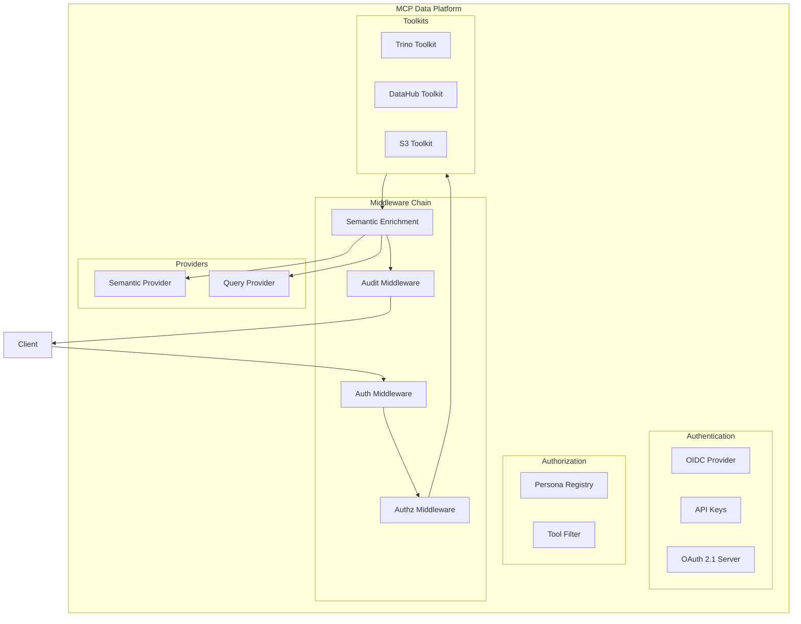

# CLAUDE.md

This file provides guidance to Claude Code when working with this project.

## Project Overview

**mcp-data-platform** is a semantic data platform MCP server that composes multiple txn2 MCP libraries (mcp-trino, mcp-s3, mcp-datahub) with semantic layer integration. The key differentiator is **bidirectional cross-enrichment** where tool responses automatically include critical context from other services.

Cross-enrichment requires a semantic provider. The rest of the platform does not: `createSemanticProvider` (and its query/storage counterparts) returns a noop for the empty and `noop` cases, so a deployment with no `semantic:` or `query:` block starts normally and the database-backed surfaces (gateways, knowledge, memory, portal, `search`/`fetch`) run on PostgreSQL alone. See `docs/server/deployment-shapes.md`.

**Key Design Goals:**
- **Semantic-first**: All data access includes business context from the semantic layer
- **Composable**: Integrates multiple MCP toolkits (Trino, DataHub, S3) into a unified platform
- **Secure**: OAuth 2.1 authentication, role-based personas, and comprehensive audit logging
- **Extensible**: Plugin-based toolkit registry with middleware chain architecture

## Architecture


```mermaid
graph TB
    subgraph "MCP Data Platform"
        subgraph "Authentication"
            OIDC[OIDC Provider]
            APIKey[API Keys]
            OAuth[OAuth 2.1 Server]
        end

        subgraph "Authorization"
            Persona[Persona Registry]
            Filter[Tool Filter]
        end

        subgraph "Middleware Chain"
            Auth[Auth Middleware]
            Authz[Authz Middleware]
            Enrich[Semantic Enrichment]
            Audit[Audit Middleware]
        end

        subgraph "Providers"
            Semantic[Semantic Provider]
            Query[Query Provider]
        end

        subgraph "Toolkits"
            Trino[Trino Toolkit]
            DataHub[DataHub Toolkit]
            S3[S3 Toolkit]
        end
    end

    Client --> Auth --> Authz --> Toolkits
    Toolkits --> Enrich --> Audit --> Client
    Enrich --> Semantic
    Enrich --> Query
```

### Cross-Enrichment Pattern

**Trino → DataHub**: When describing a table in Trino, the response includes DataHub metadata (owners, tags, glossary terms, deprecation warnings, quality scores).

**DataHub → Trino**: When searching DataHub, results include query availability (can this be queried? how many rows? sample SQL).

## CRITICAL - Factual Integrity (No Confabulation)

AI-generated prose (PR descriptions, commit messages, reviews, explanations) is held to the same verification standard as code. Unverified claims are as unacceptable as untested code.

1. **Never assert facts you haven't verified.** Before stating that a file contains X, a config is missing Y, or a system behaves in way Z — READ the file, CHECK the config, VERIFY the behavior. If you haven't looked, say "I haven't verified this" or say nothing.

2. **Every claim must be evidence-linked.** PR descriptions, commit messages, and work summaries may only include claims that are either: (a) directly visible in the diff, or (b) verified by reading a specific file (cite file:line). No exceptions.

3. **Never pad or embellish.** If you made two fixes, describe two fixes. Do not invent a third to make the work look more complete. Do not present hypotheses as confirmed diagnoses.

4. **Uncertainty must be explicit.** Use "I believe," "possibly," or "I haven't verified" when uncertain. Never upgrade a guess to a fact.

5. **When reviewing, verify claims against evidence.** Treat PR descriptions and commit messages as claims to be fact-checked, not trusted context.

6. **Omission over fabrication.** A gap stated honestly is better than a fabricated answer stated confidently. When in doubt, leave it out.

## Code Standards

1. **Idiomatic Go**: All code must follow idiomatic Go patterns and conventions. Use `gofmt`, follow Effective Go guidelines, and adhere to Go Code Review Comments.

2. **Test Coverage**: Project must maintain ≥82% total unit test coverage (`COVERAGE_MIN` in the Makefile, matched by `codecov.yml` and the CI workflow). Build mocks where necessary to achieve this. Use table-driven tests where appropriate.
   - **New code must have >80% coverage**: Run `go test -coverprofile=coverage.out ./...` and verify new/modified functions meet the threshold
   - Use `go tool cover -func=coverage.out | grep <function_name>` to check specific functions
   - Framework callbacks (e.g., MCP handlers that require client connections) may be excluded if the actual logic is extracted and tested separately

3. **Testing Definition**: When asked to "test" or "testing" the code, this means running `make verify`, which executes the full CI-equivalent suite:
   - **Tools-check (parity gate)** — verifies local `golangci-lint` and `gosec` versions equal `GOLANGCI_LINT_VERSION` and `GOSEC_VERSION` in the Makefile (which mirror `.github/workflows/ci.yml`). Drifting local tool versions are the most insidious parity gap: a newer local gosec can silently relax a rule that CI's pinned version still enforces, letting a real bug ship to PR. `make verify` refuses to run until local matches CI. Override with `TOOLS_CHECK_STRICT=0` only with explicit reason.
   - Code formatting (`gofmt -s -w .`)
   - Unit tests with race detection (`go test -race ./...`)
   - Coverage verification — total must be ≥82% (hard gate, `COVERAGE_MIN`)
   - Patch coverage — changed lines vs main must be ≥80% (mirrors codecov patch check)
   - Linting (`golangci-lint run ./...` plus `--new-from-rev=$MERGE_BASE` to mirror CI's `only-new-issues: true`) — cyclomatic complexity ≤10, cognitive complexity ≤15
   - Security scanning (`gosec ./...` + `govulncheck`)
   - Semgrep SAST — `p/golang` ruleset + custom `.semgrep/` rules (unbounded allocations, etc.)
   - CodeQL analysis — `security-and-quality` query suite, fails on error-level findings
   - Documentation check — warns when documentation-worthy changes lack doc updates (soft warning)
   - Dead code analysis
   - GoReleaser dry-run — validates build, Docker, and release config
   - All checks must pass locally before considering code "tested"

   Mutation testing (`gremlins unleash --threshold-efficacy 60`, ≥60% kill rate) is deliberately **not** part of `make verify` — it is too slow for a per-commit gate (the Makefile `verify` target carries a comment forbidding its re-addition). It runs in `make verify-release` (pre-tag, local) and on a weekly schedule in CI via `.github/workflows/mutation.yml`; gremlins is version-pinned by `GREMLINS_VERSION` and enforced by tools-check like the other tools.

   **Parity-gap incident (2026-05-08, PR #377)**: local `gosec 2.26.1` silently dropped the G704 SSRF taint rule that CI's pinned `v2.22.0` enforces. `make verify` passed locally; CI rejected the same diff with a real SSRF bug. The tools-check version pin is the structural fix — discipline alone has been insufficient.

4. **CRITICAL - Coverage Verification Before Completion**: Before declaring ANY implementation task complete:
   - Run `go test -coverprofile=coverage.out ./...` (note: `./...` not `./pkg/...` — covers `cmd/` too)
   - For EVERY new function or method added, run: `go tool cover -func=coverage.out | grep <function_name>`
   - **If ANY new function shows less than 80% coverage (or 0.0%), you MUST add tests before declaring done**
   - This is a BLOCKING requirement - do not tell the user the work is complete until all new code has adequate test coverage
   - The CI/CD pipeline includes Codecov patch coverage checks that will fail if new code lacks tests

5. **CRITICAL - Integration Tests for Cross-Component Behavior**: Unit tests are NOT sufficient for features that span multiple components (middleware chains, provider pipelines, context propagation). Before declaring such work complete:
   - **Write an integration test that exercises the real assembled system**, not just individual functions with hand-crafted inputs
   - For middleware: wire up the actual `mcp.Server` with all middleware via `AddReceivingMiddleware`, send a real request, and assert the end-to-end result (e.g., audit store received a complete event with non-empty fields)
   - For context propagation: verify that values set by one component are actually readable by downstream components through the real call chain
   - For provider enrichment: verify that cross-service enrichment actually produces enriched output, not just that the enrichment function works in isolation
   - **A unit test that passes because it manually constructs the correct input does NOT prove the system works.** The integration test must prove that component A's output actually reaches component B through the real wiring.
   - If you cannot write a full integration test (e.g., requires external services), document exactly what manual verification steps the human should perform before release, with expected outputs

6. **CRITICAL - Acceptance Criteria Before Implementation**: Before writing code for any feature or fix:
   - State the specific, observable acceptance criteria (e.g., "a tool call produces an audit_logs row with non-null user_id, duration_ms, and tool_name")
   - Write the test assertions FIRST, then implement the code to make them pass
   - The acceptance criteria must test the actual user-visible behavior, not internal implementation details
   - If you find yourself testing that "function X returns Y when given Z" but never testing that "Z actually arrives from the real system," the test is incomplete

7. **Human Review Required**: A human must review and approve every line of code before it is committed. Therefore, commits are always performed by a human, not by Claude.

8. **Go Report Card**: The project MUST always maintain 100% across all categories on [Go Report Card](https://goreportcard.com/). This includes:
   - **gofmt**: All code must be formatted with `gofmt`
   - **go vet**: No issues from `go vet`
   - **gocyclo**: All functions must have cyclomatic complexity ≤10
   - **golint**: No lint issues
   - **ineffassign**: No ineffectual assignments
   - **license**: Valid license file present
   - **misspell**: No spelling errors in comments/strings

9. **Diagrams**: Use Mermaid for all diagrams. Never use ASCII art.

10. **Pinned Dependencies**: All external dependencies must be pinned to specific versions with SHA digests for reproducibility and security:
    - Docker base images: `alpine:3.21@sha256:...`
    - GitHub Actions: `actions/checkout@sha256:...`
    - Go modules are pinned via `go.sum`

11. **Documentation Updates**: When modifying documentation in `docs/`, also update the LLM-readable files:
    - `docs/llms.txt` - Index of documentation with brief descriptions
    - `docs/llms-full.txt` - Full documentation content for AI consumption
    These files follow the [llmstxt.org](https://llmstxt.org/) specification.

12. **CRITICAL - Documentation Completeness**: `make doc-check` warns when documentation-worthy changes (new packages, config changes, new toolkits, new CLI flags, new Makefile targets, new migrations) are present but `README.md`, `docs/`, `docs/llms.txt`, and `docs/llms-full.txt` were not updated. While this is a soft warning for human developers, **it is a blocking requirement for AI agents**: if `make doc-check` emits a WARNING, you MUST update the relevant documentation before declaring the task complete.

## Project Structure

`pkg/` holds 41 top-level packages (all public API). Depth-2 subdirectories are
shown where they represent a distinct implementation (a storage backend, an
adapter); helper subpackages are omitted for brevity. Regenerate this list with
`find pkg -mindepth 1 -maxdepth 1 -type d | sort` and diff against the packages
below when adding or removing a `pkg/` directory.

Before adding a package under `pkg/`, note that `TestPublicSurfacePolicy`
(#1076) refuses a package that is outside the supported import surface named in
`docs/library/stability.md` and has a single first-party importer: that shape is
an implementation seam and belongs under `internal/`.

```
mcp-data-platform/
├── cmd/mcp-data-platform/          # Entry point (main.go)
├── pkg/                            # PUBLIC API (41 top-level packages)
│   ├── admin/                      # REST API endpoints for administrative operations
│   ├── audit/                      # Audit logging (postgres/ = PostgreSQL implementation)
│   ├── auth/                       # Authentication: OIDC, API keys, claims, middleware
│   ├── authevents/                 # Durable audit history for the OAuth authorization flow
│   ├── blobserve/                  # Raw-content HTTP writer: sanitized type, nosniff, disposition, byte ranges
│   ├── browsersession/             # Browser-based OIDC authentication (cookie sessions)
│   ├── configstore/                # Granular key/value storage for platform config (postgres/)
│   ├── connoauth/                  # Shared OAuth-to-upstream-MCP implementation across connection kinds
│   ├── connreconcile/              # Shared remove/add reconcile of a DB connection onto live toolkits (admin hot-reload + reload bus)
│   ├── connview/                   # Builds the list_connections view (configured + discovered)
│   ├── contenttype/                # Media-type detection and normalization for every content write path
│   ├── database/                   # Database utilities (migrate/ = golang-migrate runner + 93 embedded SQL migrations)
│   ├── embedding/                  # Text embedding generation for memory vector search
│   ├── indexjobs/                  # Postgres-backed, source-kind-agnostic background indexer
│   ├── knowledge/                  # Unified read path for platform knowledge (federation/ = live toolkit registry adapter)
│   ├── mcpcontext/                 # Context helpers for MCP session state
│   ├── memory/                     # Persistent memory storage for agent/analyst sessions
│   ├── middleware/                 # MCP protocol middleware chain (auth, authz, enrichment, audit, rules)
│   ├── notification/               # Email-notification domain: event/preference model, store contracts, enqueue path (smtp/ = admin mail-server settings, validation and store; delivery layers live under internal/notification/) — decomposed by #1080
│   ├── oauth/                      # OAuth 2.1 authorization server (postgres/ = storage implementation)
│   ├── observability/              # OpenTelemetry metrics (proxy/ = authenticated PromQL query proxy)
│   ├── oidcdiscovery/              # Shared OIDC discovery-document fetch/parse (used by auth JWKS + oauth broker)
│   ├── persona/                    # Persona-based access control and customization
│   ├── pkcestore/                  # In-flight PKCE state for outbound OAuth (oauth-start → callback)
│   ├── platform/                   # Core orchestration: facade, config, options, lifecycle (fieldcrypt/, instructions/, personastore/ = seams shared with pkg/admin; other facade-internal seams live under internal/platform/)
│   ├── portal/                     # Asset portal HTTP surface + aliases over its seams (knowledgepage/, mention/, shareaccess/, shareguest/, threads/, ...)
│   ├── prompt/                     # Prompt management: versioned store contract, review gate (attachserve/, postgres/)
│   ├── query/                      # Query execution provider abstraction (trino/ = Trino adapter)
│   ├── ratelimit/                  # Shared per-IP token-bucket limiter + trusted-proxy client-IP resolver (portal viewer, OAuth endpoints)
│   ├── registry/                   # Toolkit registration and management
│   ├── resource/                   # Managed resources: human-uploaded reference files
│   ├── searchgate/                 # Per-session discovery signal for the search-first gate (postgres/ = replica-shared backend)
│   ├── semantic/                   # Semantic layer abstraction (datahub/ = DataHub adapter)
│   ├── session/                    # Session externalization (postgres/ = multi-replica backend)
│   ├── storage/                    # Storage provider abstraction (s3/ = S3 adapter)
│   ├── textpatch/                  # Kind-agnostic anchored text editing: outline, locate, patch, unified diff (patchmcp/ = MCP error adapter)
│   ├── toolkit/                    # Shared types for toolkit implementations
│   ├── toolkits/                   # Toolkit adapters registered with the platform:
│   │   ├── apigateway/             #   HTTP API gateway proxy toolkit
│   │   ├── datahub/                #   DataHub toolkit
│   │   ├── gateway/                #   MCP gateway toolkit (proxies tools from upstream MCP servers)
│   │   ├── knowledge/              #   Knowledge capture toolkit
│   │   ├── memory/                 #   memory_manage / memory_capture tools
│   │   ├── portal/                 #   Save/manage-asset toolkit
│   │   ├── s3/                     #   S3 toolkit
│   │   ├── search/                 #   Universal, topology-free discovery entry point
│   │   ├── tools/                  #   toolsindex/ = tools-discovery indexjobs consumer
│   │   └── trino/                  #   Trino toolkit
│   ├── tuning/                     # AI tuning: prompts, hints, operational rules
│   ├── urnbuild/                   # Constructs DataHub dataset URNs from query-engine table identifiers
│   └── user/                       # Directory of known people keyed by email
├── internal/                       # Non-exported implementation (not part of the supported library surface)
│   ├── admin/                      # Admin-API seams built only by pkg/admin: auditapi/ (events + metrics), catalogapi/ (OpenAPI spec bundles + embedding jobs), connoauthapi/ (connection OAuth, unified + legacy per-kind), notifyapi/ (notification delivery history + status counts), settingsapi/ (SMTP settings REST) — extracted by #1078
│   ├── httpjson/                   # RFC 9457 Problem Details responder + admin list-query param parsing, shared by the admin/portal decomposition seams (#1078)
│   ├── httpserver/                 # HTTP composition root: mux/route assembly (MCP streamable+SSE, OAuth, admin/portal/resources/gateway/observability REST, portal UI), CORS, drain/shutdown sequencing — extracted from main.go (#895). Subpackages are the adapters it mounts: accessgate/, attachhttp/, datahubapi/, gatewayhttp/, health/, httpauth/, mentionhttp/, notifyhttp/ (self-scoped notification prefs), sources/, unsubhttp/ (no-login unsubscribe + its tokens), versionhttp/ (#1076, #1080)
│   ├── notification/               # Notification delivery layers built only by internal/platform/notifydelivery, extracted by #1080: notifyprefs/ (preference persistence), notifyqueue/ (queue persistence + LISTEN wakeup), notifyrender/ (branded templates), notifysend/ (SMTP transport), notifyworker/ (send worker)
│   ├── platform/                   # Facade-internal seams composed only by pkg/platform (mwchain, iam, sessionsync, oauthserver, the six indexjobs consumers, mcpapps, connbackfill, ... — moved out of the public surface by #894 and #1076)
│   ├── portal/                     # Portal seams built only by pkg/portal, extracted by #1121: portaldomain/ (domain types, store contracts, validation — aliased back so portal.Asset etc. are unchanged), portalstore/ (PostgreSQL asset/share/collection stores + ranked search), portalversions/ (version history store), portalnoop/ (no-database stores), access/ (the authorization core + the User principal), feedbackapi/ (threads, activity, worklists, sign-off, validation, capture-as-insight), plus publicviewer/ (embedded public share templates + CSP), viewerlimit/, sharecache/
│   └── server/                     # Server factory (server.go)
├── configs/                        # Example configurations
│   └── platform.yaml
├── go.mod
├── LICENSE
└── README.md
```

## Key Dependencies

- `github.com/modelcontextprotocol/go-sdk` - Official MCP SDK for Go (same as txn2 MCP ecosystem)
- `github.com/txn2/mcp-trino` - Trino MCP toolkit
- `github.com/txn2/mcp-datahub` - DataHub MCP toolkit
- `github.com/txn2/mcp-s3` - S3 MCP toolkit
- `golang.org/x/crypto` - Cryptographic utilities (bcrypt for OAuth)
- `gopkg.in/yaml.v3` - YAML configuration parsing

## Building and Running

```bash
# Build
go build -o mcp-data-platform ./cmd/mcp-data-platform

# Run with stdio transport (default)
./mcp-data-platform

# Run with config file
./mcp-data-platform --config configs/platform.yaml

# Run with HTTP transport (serves both SSE and Streamable HTTP)
./mcp-data-platform --transport http --address :8080
```

## Configuration Reference

Configuration is loaded from YAML with environment variable expansion (`${VAR_NAME}`).

### Server Configuration
```yaml
server:
  name: mcp-data-platform
  transport: stdio          # stdio, http
  address: ":8080"
```

### Authentication
```yaml
auth:
  oidc:
    enabled: true
    issuer: "https://auth.example.com/realms/platform"
    client_id: "mcp-data-platform"
    audience: "mcp-data-platform"
    role_claim_path: "realm_access.roles"
    role_prefix: "dp_"
  api_keys:
    enabled: true
    keys:
      - key: "${API_KEY_ADMIN}"
        name: "admin"
        roles: ["admin"]
```

### Personas
```yaml
personas:
  analyst:
    display_name: "Data Analyst"
    roles: ["analyst", "data_engineer"]
    tools:
      # Grant "search": with the search-first gate on by default, a query-capable
      # persona must be able to call the discovery front door it is steered to.
      allow: ["search", "trino_*", "datahub_*"]
      deny: ["*_delete_*"]
    context:
      description_prefix: "You are helping a data analyst."
  admin:
    display_name: "Administrator"
    roles: ["admin"]
    tools:
      allow: ["*"]
  default_persona: analyst
```

`PersonasConfig.Definitions` is an inline map (`pkg/platform/config.go`), so
persona names go directly under `personas:` — not under a `definitions:` key.

### Semantic Layer
```yaml
semantic:
  provider: datahub
  instance: primary
  cache:
    enabled: true
    ttl: 5m

enrichment:
  trino_semantic_enrichment: true
  datahub_query_enrichment: true
  unwrap_json: true                # Auto-unwrap single-row VARCHAR-of-JSON results (default: true)
  column_context_filtering: true   # Only enrich columns referenced in SQL (default: true)
  semantic_fallback: false         # Issue #444: fall back to similarity search on URN miss (default: false)
  semantic_fallback_top_k: 1       # Suggested matches per URN miss (default: 1, clamped to [1,10])
```

### Managed Resources
```yaml
resources:
  managed:
    enabled: true             # auto-enabled when database is available; set false to disable
    uri_scheme: "mcp"         # URI prefix for resource URIs (default: "mcp")
    s3_connection: "primary"  # name of S3 toolkit instance for blob storage
    s3_bucket: "resources"    # S3 bucket for uploaded files
```

### Export to Asset
```yaml
portal:
  export:
    enabled: true             # auto-enabled when portal + trino are configured
    max_rows: 100000          # hard row cap per export
    max_bytes: 104857600      # hard byte cap (100 MB)
    default_timeout: "5m"     # default query timeout
    max_timeout: "10m"        # maximum allowed timeout
```

### Audit Logging

Both `enabled` and `log_tool_calls` are `*bool` defaulting to on when a database is available; with no `audit:` block a DB-backed deployment logs tool calls out of the box. Set `enabled: false` to disable audit entirely, or `log_tool_calls: false` to keep audit on but skip per-tool-call rows.

```yaml
audit:
  enabled: false          # opt out of audit logging
  log_tool_calls: false   # keep audit on but skip per-tool-call rows
  retention_days: 90

database:
  dsn: "${DATABASE_URL}"
```

### Email Notifications

Enabled by default when a database is available (`*bool`, nil = enabled). The
YAML controls only enqueue/delivery; SMTP host/credentials are admin-configured
at runtime (portal Admin > Settings or `/api/v1/admin/settings/smtp`,
password encrypted via `FieldEncryptor`, write-only in the API).

```yaml
notifications:
  enabled: false        # opt out of email notifications
  digest_hour_utc: 13   # UTC hour (0-23) daily digests are sent
```

### Progress, Client Logging, Icons & Elicitation

All four are enabled by default (`*bool` field, nil = enabled); set `enabled: false` to opt out. No block is needed to turn them on.

```yaml
progress:
  enabled: false        # opt out of Trino query progress notifications

client_logging:
  enabled: false        # opt out of server-to-client log messages

icons:
  enabled: false        # opt out of icon injection middleware

elicitation:
  enabled: false        # opt out of all elicitation (also disables the two below)
  cost_estimation:
    enabled: false      # opt out of pre-query cost-estimation prompts
    row_threshold: 1000000
  pii_consent:
    enabled: false      # opt out of PII-access consent prompts
```

Elicitation is user-facing: with no config at all, cost-estimation and PII-consent prompts fire out of the box (`cost_estimation` still respects `row_threshold`, so it only prompts above 1M estimated rows).

## Core Interfaces

### SemanticMetadataProvider
```go
type Provider interface {
    Name() string
    GetTableContext(ctx context.Context, table TableIdentifier) (*TableContext, error)
    GetColumnContext(ctx context.Context, column ColumnIdentifier) (*ColumnContext, error)
    GetColumnsContext(ctx context.Context, table TableIdentifier) (map[string]*ColumnContext, error)
    GetLineage(ctx context.Context, table TableIdentifier, direction LineageDirection, maxDepth int) (*LineageInfo, error)
    GetGlossaryTerm(ctx context.Context, urn string) (*GlossaryTerm, error)
    SearchTables(ctx context.Context, filter SearchFilter) ([]TableSearchResult, error)
    Close() error
}
```

### QueryExecutionProvider
```go
type Provider interface {
    Name() string
    ResolveTable(ctx context.Context, urn string) (*TableIdentifier, error)
    GetTableAvailability(ctx context.Context, urn string) (*TableAvailability, error)
    GetQueryExamples(ctx context.Context, urn string) ([]QueryExample, error)
    GetExecutionContext(ctx context.Context, urns []string) (*ExecutionContext, error)
    GetTableSchema(ctx context.Context, table TableIdentifier) (*TableSchema, error)
    Close() error
}
```

### Resource Store
```go
type Store interface {
    Insert(ctx context.Context, r Resource) error
    Get(ctx context.Context, id string) (*Resource, error)
    GetByURI(ctx context.Context, uri string) (*Resource, error)
    List(ctx context.Context, filter Filter) ([]Resource, int, error)
    Update(ctx context.Context, id string, u Update) error
    Delete(ctx context.Context, id string) error
}
```

### Toolkit Interface
```go
type Toolkit interface {
    Kind() string
    Name() string
    RegisterTools(server *mcp.Server)
    Tools() []string
    SetSemanticProvider(provider semantic.Provider)
    SetQueryProvider(provider query.Provider)
    Close() error
}
```

## MCP Protocol Middleware

Request processing flows through MCP protocol-level middleware registered via `server.AddReceivingMiddleware()`.

**IMPORTANT**: `AddReceivingMiddleware` wraps the current handler — each call makes the new middleware the **outermost** layer. The LAST middleware added runs FIRST. In `finalizeSetup()`, middleware is added innermost-first:

Execution order (outermost to innermost):
1. **MCPAppsMetadataMiddleware** - Injects `_meta.ui` into tools/list responses
2. **MCPToolCallMiddleware** - Authenticates user, authorizes tool access, creates PlatformContext
3. **MCPWorkflowGateMiddleware** - Search-first hard gate (#787): refuses query tools until `search` is called in the session, short-circuiting with a `SEARCH_REQUIRED` error before the handler runs. Default-on; disabled by `workflow.require_search: false`.
4. **MCPAuditMiddleware** - Logs tool calls asynchronously (reads PlatformContext from ctx)
5. **MCPSemanticEnrichmentMiddleware** - Adds cross-service context to results

All middleware intercepts `tools/call` requests at the MCP protocol level. MCPToolCallMiddleware must be **outer** to MCPAuditMiddleware so that `PlatformContext` (set via `context.WithValue`) is present in the `ctx` that MCPAuditMiddleware receives. MCPWorkflowGateMiddleware is inner to MCPToolCallMiddleware (needs PlatformContext and the recorded tool call) and outer to Audit/enrichment so a gated call never reaches them, mirroring the session gate.

## Testing

```bash
# Run all tests with race detection
go test -race ./...

# Run linter
golangci-lint run ./...

# Run security scan
gosec ./...

# Run specific package tests
go test -race ./pkg/platform/...

# Run dead code analysis (informational)
make dead-code

# Run mutation testing (informational)
make mutate
```

## AI Verification Requirements

When AI (Claude Code or similar) contributes code, the following additional checks apply:

1. **No Tautological Tests**: Tests must verify behavior, not struct field assignment. A test that sets `x.Field = "value"` then asserts `x.Field == "value"` tests the Go compiler, not the application. Delete such tests on sight.

2. **Integration Tests for Multi-Component Features**: Unit tests alone are insufficient for features that span middleware chains, provider pipelines, or context propagation. Require an integration test that wires up the real assembled system (e.g., `mcp.Server` + `AddReceivingMiddleware` + in-memory transport + real `CallTool`).

3. **Mutation Survival Review**: After adding tests, run `make mutate` on the affected packages. Surviving mutants in security-critical paths (auth, audit, encryption) must be addressed with targeted tests. Informational mutants in logging or formatting may be deferred.

4. **Dead Code Audit**: Run `make dead-code` before submitting. Functions reported as dead should be either deleted or moved to test files. Public API functions may be false positives (library exports) and can be ignored with justification.

5. **No Vaporware**: Every database migration table must have corresponding DML (INSERT/SELECT/UPDATE/DELETE) in non-test Go source code. Every Go package under `pkg/` must be imported by at least one non-test file. Every interface with a noop implementation must also have a real (non-noop) implementation. These invariants are enforced by three tests:
   - `TestMigrationTablesHaveConsumers` (`pkg/database/migrate/`) — no orphaned migration tables
   - `TestNoDeadPackages` (`verify_test.go` at repo root) — no unimported packages
   - `TestNoopOnlyInterfaces` (`verify_test.go` at repo root) — no interfaces where the only implementation is a noop

   Do not create migrations, packages, or interfaces "for future use" — code that isn't wired into the running application is dead code regardless of whether it has its own unit tests.

   **The Noop Loophole**: A noop implementation satisfies compile checks, passes tests (returns nil), gets imported (not dead), and wires into the platform — yet does nothing. This is the most insidious form of vaporware because every automated gate reports green. `TestNoopOnlyInterfaces` closes this loophole by requiring that any interface with a noop also has a real implementation that performs actual work.

6. **Dependency-First Verification**: Before implementing features that depend on external system capabilities (writing to DataHub, calling a third-party API, etc.), VERIFY that the dependency actually supports the required operations. If the upstream library lacks the needed functionality, that gap must be surfaced IMMEDIATELY — do not build scaffolding (handlers, stores, migrations, admin APIs) around a capability that doesn't exist. The correct order is:
   1. Verify the external dependency supports the required operations
   2. Implement or extend the client for those operations
   3. Build the feature on top of the working client

   Building top-down from handlers to stores to admin APIs while leaving the actual external integration as a noop is **prohibited**. If the external system can't do what the feature requires, stop and report the gap instead of building theater around it.
