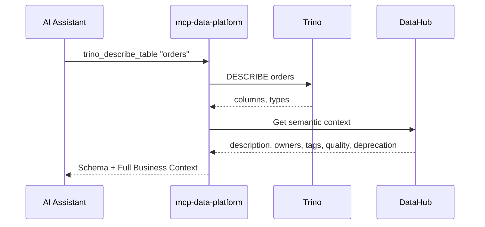
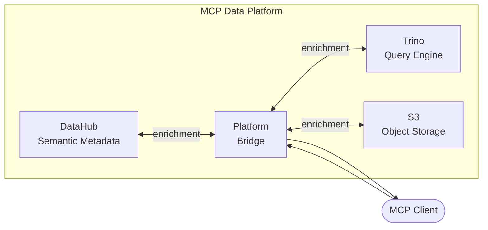

[](https://github.com/txn2/mcp-data-platform/blob/main/LICENSE)
[](https://pkg.go.dev/github.com/txn2/mcp-data-platform)
[](https://codecov.io/gh/txn2/mcp-data-platform)
[](https://goreportcard.com/report/github.com/txn2/mcp-data-platform)
[](https://scorecard.dev/viewer/?uri=github.com/txn2/mcp-data-platform)
[](https://slsa.dev)


**[Documentation](https://txn2.github.io/mcp-data-platform/)** | **[Installation](https://txn2.github.io/mcp-data-platform/server/overview/)** | **[Library Docs](https://txn2.github.io/mcp-data-platform/library/overview/)**

**Your AI assistant can run SQL. But it doesn't know that `cust_id` contains PII, that the table was deprecated last month, or who to ask when something breaks.**

mcp-data-platform fixes that. It connects AI assistants to your data infrastructure and adds business context from your semantic layer. Query a table and get its meaning, owners, quality scores, and deprecation warnings in the same response.

The only requirement is [DataHub](https://datahubproject.io/) as your semantic layer. Add [Trino](https://trino.io/) for SQL queries and [S3](https://aws.amazon.com/s3/) for object storage when you're ready. [Learn why this stack →](https://txn2.github.io/mcp-data-platform/concepts/components/)

---

## Why mcp-data-platform?

**The Problem**: AI assistants are powerful at querying data, but they're working blind. When Claude asks "What's in the orders table?", it gets column names and types. It doesn't know:

- The `customer_id` column contains PII requiring special handling
- The table is deprecated in favor of `orders_v2`
- The data quality score dropped last week
- Who to contact when something looks wrong

**The Solution**: mcp-data-platform injects semantic context at the protocol level. Your AI assistant gets business meaning automatically—before it even asks.

### Without vs With

```
# Without mcp-data-platform
─────────────────────────────────────────────────────────────────────
User:      "Describe the orders table"
AI:        Queries Trino → gets columns and types
User:      "Who owns this data?"
AI:        Queries DataHub → finds owners
User:      "Is this table still active?"
AI:        Queries DataHub again → finds deprecation status
User:      "What does customer_id actually mean?"
AI:        Queries DataHub again → finds column descriptions
─────────────────────────────────────────────────────────────────────
4 round trips. Context scattered across conversations. Easy to miss warnings.
```

```
# With mcp-data-platform
─────────────────────────────────────────────────────────────────────
User:      "Describe the orders table"
AI:        Gets everything in one response:
           → Schema: columns and types
           → ⚠️ DEPRECATED: Use orders_v2 instead
           → Owners: Data Platform Team
           → Tags: pii, financial
           → Quality Score: 87%
           → Column meanings and business definitions
─────────────────────────────────────────────────────────────────────
1 call. Complete context. Warnings front and center.
```

---

## How It Works



The platform intercepts tool responses and enriches them with semantic metadata. This **cross-injection** pattern means:

- **Trino → DataHub**: Query results include owners, tags, glossary terms, deprecation warnings, quality scores
- **DataHub → Trino**: Search results include query availability (can this dataset be queried? what's the SQL?)
- **S3 → DataHub**: Object listings include matching dataset metadata
- **DataHub → S3**: Dataset searches show storage availability

---

## Features

### Semantic-First Data Access
Every data query includes business context from DataHub. Table descriptions, column meanings, data quality scores, and ownership information flow automatically. Your AI assistant understands what data means, not just what it contains.

### Bidirectional Cross-Injection
Context flows between services automatically. Trino results come enriched with DataHub metadata. DataHub searches show which datasets are queryable in Trino. No manual lookups or separate API calls needed.

### Enterprise Security
Built with a **fail-closed** security model. Missing credentials deny access—never bypass. TLS enforcement for HTTP transport, prompt injection protection, and read-only mode enforcement for sensitive environments. See [MCP Defense: A Case Study in AI Security](https://imti.co/mcp-defense/) for the security architecture rationale.

### OAuth 2.1 Authentication
Native support for OIDC providers (Keycloak, Auth0, Okta), API keys for service accounts, PKCE for public clients, and Dynamic Client Registration. Claude Desktop can authenticate through your existing identity provider.

### Role-Based Personas
Define who can use which tools. Analysts get read access to queries and searches. Admins get everything. Tool filtering uses wildcard patterns (allow/deny rules) mapped from your identity provider's roles.

### Comprehensive Audit Logging
Every tool call is logged with user identity, persona, request details, and timing. PostgreSQL-backed for querying and compliance. Know who queried what, when, and why.

### Knowledge Capture
AI sessions generate valuable domain knowledge: column meanings, data quality issues, business rules. The `capture_insight` tool records these observations during sessions, and `apply_knowledge` provides admins with a structured review workflow. Approved insights are written back to DataHub with full changeset tracking and rollback. An [Admin REST API](https://txn2.github.io/mcp-data-platform/knowledge/admin-api/) supports integration with existing governance tools. See the [Knowledge Capture documentation](https://txn2.github.io/mcp-data-platform/knowledge/overview/) for details.

### Extensible Middleware Architecture
Add custom authentication, rate limiting, or logging. Swap providers to integrate different semantic layers or query engines. The Go library exposes everything—build the platform your organization needs.

---

## Use Cases

### Enterprise Data Governance
- **Compliance-Ready Audit Trails**: Every query logged with user identity and business justification
- **PII Protection**: Tag-based warnings ensure AI assistants acknowledge sensitive data handling requirements
- **Access Control**: Persona system enforces who can query what, mapped from your IdP
- **Deprecation Enforcement**: Deprecated tables surface warnings before AI assistants use stale data

### Data Democratization
- **Self-Service Analytics**: Business users explore data through AI with context they'd otherwise need to ask engineers for
- **Cross-Team Discovery**: Search finds datasets across all systems with unified metadata
- **Onboarding Acceleration**: New team members understand data assets immediately—meanings, owners, quality, and lineage included
- **Glossary-Driven Exploration**: Business terms connect to actual tables and columns automatically

### AI/ML Workflows
- **Autonomous Data Exploration**: AI agents discover and understand datasets without human guidance
- **Feature Discovery**: Find and evaluate potential ML features with quality scores and lineage
- **Pipeline Understanding**: Trace data lineage to understand feature provenance
- **Quality Gates**: Data quality scores help AI agents avoid problematic datasets

---

## Architecture



---

## Security

mcp-data-platform implements a **fail-closed** security model designed for enterprise deployments. See [MCP Defense: A Case Study in AI Security](https://imti.co/mcp-defense/) for the security architecture rationale.

| Feature | Description |
|---------|-------------|
| **Fail-Closed Authentication** | Missing or invalid credentials deny access (never bypass) |
| **Required JWT Claims** | Tokens must include `sub` and `exp` claims |
| **TLS for HTTP Transport** | Configurable TLS with warnings for plaintext connections |
| **Prompt Injection Protection** | Metadata sanitization prevents injection attacks |
| **Read-Only Mode** | Trino and S3 toolkits support enforced read-only access |
| **Default-Deny Personas** | Users without explicit persona assignment have no tool access |
| **Cryptographic Request IDs** | Request tracing uses secure random identifiers |

### Transport Security

| Transport | Authentication | TLS |
|-----------|---------------|-----|
| **stdio** | Not required (local execution) | N/A |
| **HTTP** | Required (Bearer token or API key) | Strongly recommended |

---

## Installation

### Go Install

```bash
go install github.com/txn2/mcp-data-platform/cmd/mcp-data-platform@latest
```

### From Source

```bash
git clone https://github.com/txn2/mcp-data-platform.git
cd mcp-data-platform
go build -o mcp-data-platform ./cmd/mcp-data-platform
```

---

## Quick Start

### Standalone Server

```bash
# Run with stdio transport (default)
./mcp-data-platform

# Run with configuration file
./mcp-data-platform --config configs/platform.yaml

# Run with HTTP transport (serves both SSE and Streamable HTTP)
./mcp-data-platform --transport http --address :8080
```

### Claude Code CLI

```bash
claude mcp add mcp-data-platform -- mcp-data-platform
```

### Claude Desktop (Local)

Add to your `claude_desktop_config.json`:

```json
{
  "mcpServers": {
    "mcp-data-platform": {
      "command": "mcp-data-platform",
      "args": ["--config", "/path/to/platform.yaml"]
    }
  }
}
```

### Claude Desktop (Remote with OAuth)

For connecting Claude Desktop to a remote MCP server with Keycloak authentication:

1. **Configure the MCP server** with OAuth and upstream IdP:

```yaml
server:
  transport: http
  address: ":8080"

oauth:
  enabled: true
  issuer: "https://mcp.example.com"
  clients:
    - id: "claude-desktop"
      secret: "${CLAUDE_CLIENT_SECRET}"
      redirect_uris:
        - "http://localhost"
        - "http://127.0.0.1"
  upstream:
    issuer: "https://keycloak.example.com/realms/your-realm"
    client_id: "mcp-data-platform"
    client_secret: "${KEYCLOAK_CLIENT_SECRET}"
    redirect_uri: "https://mcp.example.com/oauth/callback"
```

2. **In Claude Desktop**, add the server with OAuth credentials:
   - **URL**: `https://mcp.example.com`
   - **Client ID**: `claude-desktop`
   - **Client Secret**: (the secret you configured)

When you connect, Claude Desktop will open your browser for Keycloak login, then automatically complete the OAuth flow.

See [OAuth 2.1 Server documentation](https://txn2.github.io/mcp-data-platform/auth/oauth-server/) for complete setup instructions.

---

## Configuration

Create a `platform.yaml` configuration file:

```yaml
server:
  name: mcp-data-platform
  transport: stdio

auth:
  oidc:
    enabled: true
    issuer: "https://auth.example.com/realms/platform"
    client_id: "mcp-data-platform"
  api_keys:
    enabled: true
    keys:
      - key: "${API_KEY_ADMIN}"
        name: "admin"
        roles: ["admin"]

personas:
  definitions:
    analyst:
      display_name: "Data Analyst"
      roles: ["analyst"]
      tools:
        allow: ["trino_*", "datahub_*"]
        deny: ["*_delete_*"]
    admin:
      display_name: "Administrator"
      roles: ["admin"]
      tools:
        allow: ["*"]
  default_persona: analyst

semantic:
  provider: datahub
  cache:
    enabled: true
    ttl: 5m

injection:
  trino_semantic_enrichment: true
  datahub_query_enrichment: true

audit:
  enabled: true
  log_tool_calls: true
  retention_days: 90

database:
  dsn: "${DATABASE_URL}"
```

### Environment Variables

| Variable | Description | Default |
|----------|-------------|---------|
| `DATABASE_URL` | PostgreSQL connection string for audit logs | - |
| `API_KEY_ADMIN` | Admin API key (if using API key auth) | - |

---

## Core Packages

| Package | Description |
|---------|-------------|
| `pkg/platform` | Main platform facade and configuration |
| `pkg/auth` | OIDC and API key authentication |
| `pkg/oauth` | OAuth 2.1 server with DCR and PKCE |
| `pkg/persona` | Role-based personas and tool filtering |
| `pkg/semantic` | Semantic metadata provider abstraction |
| `pkg/query` | Query execution provider abstraction |
| `pkg/middleware` | Request/response middleware chain |
| `pkg/registry` | Toolkit registration and management |
| `pkg/audit` | Audit logging with PostgreSQL storage |
| `pkg/tuning` | Prompts, hints, and operational rules |
| `pkg/storage` | S3-compatible storage provider abstraction |
| `pkg/toolkits` | Toolkit implementations (Trino, DataHub, S3, Knowledge) |
| `pkg/admin` | Admin REST API for knowledge management |
| `pkg/client` | Platform client utilities |

---

## Library Usage

The platform can be imported and used as a library:

```go
import (
    "github.com/txn2/mcp-data-platform/pkg/platform"
)

// Load configuration
cfg, err := platform.LoadConfig("platform.yaml")
if err != nil {
    log.Fatal(err)
}

// Create platform
p, err := platform.New(platform.WithConfig(cfg))
if err != nil {
    log.Fatal(err)
}
defer p.Close()

// Start the platform
if err := p.Start(ctx); err != nil {
    log.Fatal(err)
}

// Access the MCP server
mcpServer := p.MCPServer()
```

---

## Development

```bash
# Run tests with race detection
go test -race ./...

# Run linter
golangci-lint run ./...

# Run security scan
gosec ./...

# Build
go build -o mcp-data-platform ./cmd/mcp-data-platform
```

---

## Documentation

Full documentation is available at [txn2.github.io/mcp-data-platform](https://txn2.github.io/mcp-data-platform/).

- [Server Guide](https://txn2.github.io/mcp-data-platform/server/overview/) - Configuration and deployment
- [Cross-Injection](https://txn2.github.io/mcp-data-platform/cross-injection/overview/) - How automatic enrichment works
- [Authentication](https://txn2.github.io/mcp-data-platform/auth/overview/) - OIDC, API keys, and OAuth 2.1
- [Go Library](https://txn2.github.io/mcp-data-platform/library/overview/) - Build custom MCP servers
- [API Reference](https://txn2.github.io/mcp-data-platform/reference/tools-api/) - Complete tool documentation

---

## Contributing

We welcome contributions for bug fixes, tests, and documentation. Please ensure:

1. All tests pass (`go test -race ./...`)
2. Code is formatted (`gofmt`)
3. Linter passes (`golangci-lint run ./...`)
4. Security scan passes (`gosec ./...`)

---

## License

[Apache License 2.0](LICENSE)

---

Open source by [Craig Johnston](https://twitter.com/cjimti), sponsored by [Deasil Works, Inc.](https://deasil.works/)
