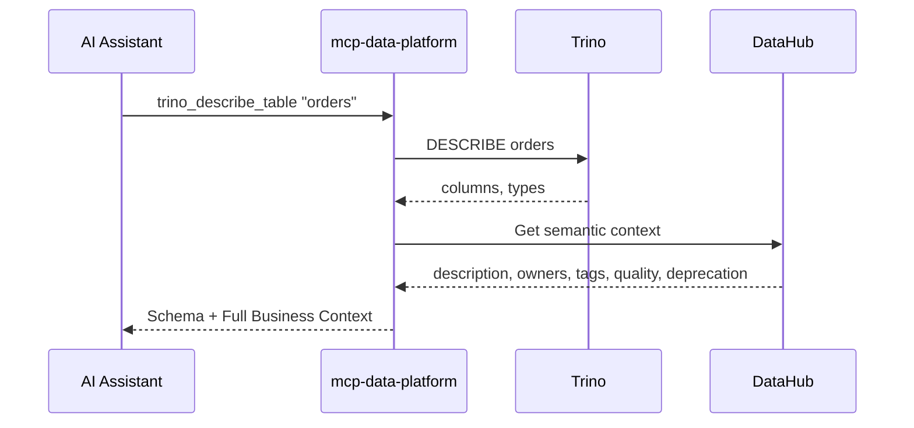

[](https://mcp-data-platform.txn2.com)

[](https://github.com/txn2/mcp-data-platform/blob/main/LICENSE)
[](https://pkg.go.dev/github.com/txn2/mcp-data-platform)
[](https://modelcontextprotocol.io)
[](https://github.com/txn2/mcp-data-platform/releases/latest)
[](https://github.com/txn2/mcp-data-platform/actions/workflows/ci.yml)
[](https://github.com/txn2/mcp-data-platform/actions/workflows/codeql.yml)
[](https://codecov.io/gh/txn2/mcp-data-platform)
[](https://www.bestpractices.dev/projects/13548)
[](https://scorecard.dev/viewer/?uri=github.com/txn2/mcp-data-platform)
[](https://github.com/sigstore/cosign)
[](https://github.com/txn2/mcp-data-platform/pkgs/container/mcp-data-platform)
[](https://doi.org/10.5281/zenodo.21438044)
[](https://doi.org/10.5281/zenodo.21614058)
[](https://doi.org/10.5281/zenodo.21834812)

**[Documentation](https://mcp-data-platform.txn2.com/)** | **[Installation](https://mcp-data-platform.txn2.com/server/installation/)** | **[Quick Start](#quick-start)** | **[Go Library](https://mcp-data-platform.txn2.com/library/overview/)**

**Your AI assistant can run SQL. But it doesn't know that `cust_id` contains PII, that the table was deprecated last month, or who to ask when something breaks.**

mcp-data-platform fixes that. It is a single MCP server that connects AI assistants to your data infrastructure and enriches every response with business context from your semantic layer: query a table and get its meaning, owners, quality scores, and deprecation warnings in the same call.

It is a platform, not just a bridge. The same endpoint gives agents persistent memory and a governed path to write knowledge back to the catalog, proxies third-party MCP servers and REST APIs through one authentication, persona, and audit pipeline, and ships a web portal where AI-generated assets are saved, organized into collections, and shared with teammates.

---

## Do you need DataHub? Only for cross-enrichment

[DataHub](https://datahubproject.io/), [Trino](https://trino.io/), and [S3](https://aws.amazon.com/s3/) are components this platform composes, not infrastructure it expects you to already run. The platform needed a metadata layer and a federating query engine; reimplementing either mature open-source system would have been the wrong call, so it adapts them behind provider interfaces instead. DataHub can run as a silent backend the operator never surfaces, which is the usual shape for the many organizations that have no metadata layer today.

Cross-enrichment is what DataHub is for: point the platform at it as the semantic layer, then add Trino for SQL and S3 for object storage when you're ready. [Learn why this stack.](https://mcp-data-platform.txn2.com/concepts/components/)

**Everything else runs without it.** DataHub is an adapter behind a provider interface, not a substrate the platform is built on. Omit the `semantic:` block and the semantic provider resolves to a noop, the server starts normally, and the gateways, knowledge layer, memory, portal, and `search`/`fetch` run on PostgreSQL alone. What you give up is cross-enrichment and the `datahub_*` tools, not the platform: `semantic:`, `query:`, `storage:`, and `toolkits:` are independent config blocks, so Trino and S3 stay available on their own terms and simply stop being enriched. See [Deployment Shapes](https://mcp-data-platform.txn2.com/server/deployment-shapes/) for exactly what each shape includes and leaves out.

---

## Why

AI assistants are powerful at querying data, but they work blind. When an agent asks "What's in the orders table?", it gets column names and types. It doesn't know that `customer_id` is PII, that the table is deprecated in favor of `orders_v2`, that the quality score dropped last week, or who to contact when something looks wrong.

```
# Without mcp-data-platform
─────────────────────────────────────────────────────────────────────
User:      "Describe the orders table"
AI:        Queries Trino → gets columns and types
User:      "Who owns this data?"
AI:        Queries DataHub → finds owners
User:      "Is this table still active?"
AI:        Queries DataHub again → finds deprecation status
User:      "What does customer_id actually mean?"
AI:        Queries DataHub again → finds column descriptions
─────────────────────────────────────────────────────────────────────
4 round trips. Context scattered across conversations. Easy to miss warnings.
```

```
# With mcp-data-platform
─────────────────────────────────────────────────────────────────────
User:      "Describe the orders table"
AI:        Gets everything in one response:
           → Schema: columns and types
           → ⚠️ DEPRECATED: Use orders_v2 instead
           → Owners: Data Platform Team
           → Tags: pii, financial
           → Quality Score: 87%
           → Column meanings and business definitions
─────────────────────────────────────────────────────────────────────
1 call. Complete context. Warnings front and center.
```

## How It Works


```mermaid
sequenceDiagram
    participant AI as AI Assistant
    participant P as mcp-data-platform
    participant T as Trino
    participant D as DataHub

    AI->>P: trino_describe_table "orders"
    P->>T: DESCRIBE orders
    T-->>P: columns, types
    P->>D: Get semantic context
    D-->>P: description, owners, tags, quality, deprecation
    P-->>AI: Schema + Full Business Context
```

The platform intercepts tool responses at the protocol level and enriches them with context from the other services. This **cross-enrichment** is bidirectional:

- **Trino → DataHub**: query results include owners, tags, glossary terms, deprecation warnings, quality scores
- **DataHub → Trino**: search results include query availability and sample SQL
- **S3 ↔ DataHub**: object listings include matching dataset metadata, and dataset searches show storage availability

## Does it work? Measured effectiveness

The knowledge layer is not just a design claim; it is benchmarked. On knowledge-trap questions, the ones an agent answers plausibly but wrongly without business context, connecting the agent to the platform's semantic knowledge layer lifts accuracy from **42.7% (raw data tools) to 98.7%**, a **+56-point** gain (95% CI +44 to +67). On plain lookups and arithmetic, where no business context is needed, the platform and bare tools are statistically tied, so the gain is specific to knowledge-gated questions, not a blanket accuracy boost.

This is an **arm-vs-arm** result on a single pinned model (same model, same tasks, only the platform configuration changes). It measures the **knowledge layer** specifically, that is cross-enrichment, `search`, and the memory/`apply_knowledge` lifecycle, not the whole platform. Every number is recomputed from committed raw data by a notebook that needs no API key. See the full, citable [Benchmark Report](https://mcp-data-platform.txn2.com/reference/benchmark-report/) (four-arm ablation, cold-start learning curve, lifecycle scorecard, threats to validity) and the [benchmark report series](bench/README.md), which indexes every study's protocol, toolchain, and archived run data.

## Features

Each feature links to its full documentation.

### Semantic data access

| Feature | Description |
|---------|-------------|
| [Cross-enrichment](https://mcp-data-platform.txn2.com/cross-enrichment/overview/) | Business context added to every tool response automatically, with session dedup to save tokens |
| [Lineage inheritance](https://mcp-data-platform.txn2.com/cross-enrichment/lineage/) | Column descriptions inherited from upstream datasets via DataHub lineage |
| [Universal search](https://mcp-data-platform.txn2.com/knowledge/overview/) | One `search` tool fans a query across the catalog, knowledge pages, memory, insights, assets, prompts, and APIs; `fetch` dereferences any result |
| [Workflow gating](https://mcp-data-platform.txn2.com/reference/middleware/) | Session-aware guidance that steers agents to discovery before SQL, with escalating warnings |
| [Tools](https://mcp-data-platform.txn2.com/server/tools/) | Full tool reference for Trino, DataHub, S3, knowledge, memory, portal, and gateway toolkits |

### Knowledge and memory

| Feature | Description |
|---------|-------------|
| [Memory layer](https://mcp-data-platform.txn2.com/memory/overview/) | Persistent agent memory across sessions, PostgreSQL + pgvector, hybrid semantic/lexical recall |
| [Knowledge capture](https://mcp-data-platform.txn2.com/knowledge/overview/) | Agents record domain insights during sessions; approved knowledge is written back to DataHub or canonical knowledge pages |
| [Governance workflow](https://mcp-data-platform.txn2.com/knowledge/governance/) | Human-in-the-loop review, approve/reject, changeset tracking, and rollback for every applied change |
| [Managed resources](https://mcp-data-platform.txn2.com/server/portal-user/#resources) | Human-uploaded reference files (playbooks, samples, templates) served to agents as MCP resources |

### Gateways and extensibility

| Feature | Description |
|---------|-------------|
| [MCP gateway](https://mcp-data-platform.txn2.com/server/gateway/) | Re-expose any third-party MCP server through the platform's auth, persona, and audit pipeline |
| [API gateway](https://mcp-data-platform.txn2.com/server/api-gateway/) | Proxy REST/HTTP APIs (Salesforce, Google, GitHub, Stripe) with four tools instead of one tool per endpoint |
| [API catalogs](https://mcp-data-platform.txn2.com/server/api-catalogs/) | Versioned OpenAPI bundles shared across connections, with semantic endpoint ranking |
| [REST invoke shim](https://mcp-data-platform.txn2.com/server/api-gateway/#rest-gateway-for-non-mcp-clients) | Call gateway endpoints from NiFi, Airflow, or `curl` under the same auth and audit pipeline |
| [Self-configuration](https://mcp-data-platform.txn2.com/server/self-configuration/) | Admins manage personas, connections, and prompts by asking the agent instead of clicking |
| [MCP Apps](https://mcp-data-platform.txn2.com/mcpapps/overview/) | Interactive UI panels rendered inline in the MCP host |
| [Go library](https://mcp-data-platform.txn2.com/library/overview/) | Import the platform as a library: custom toolkits, providers, and middleware |

### Security and operations

| Feature | Description |
|---------|-------------|
| [Authentication](https://mcp-data-platform.txn2.com/auth/overview/) | Fail-closed model: OIDC (Keycloak, Auth0, Okta, Azure AD) and API keys for service accounts |
| [OAuth 2.1 server](https://mcp-data-platform.txn2.com/auth/oauth-server/) | A broker, [not an identity provider](#a-broker-not-an-identity-provider): authorization server with PKCE and Dynamic Client Registration toward MCP clients, delegating every human login upstream to your IdP |
| [Outbound OAuth](https://mcp-data-platform.txn2.com/auth/oauth-gateway/) | OAuth to upstream MCPs and APIs with encrypted refresh tokens that survive restarts |
| [Personas](https://mcp-data-platform.txn2.com/personas/overview/) | Role-mapped allow/deny tool and connection filtering, default-deny; roles that match no persona reach nothing, in the portal as well as over MCP |
| [Authorization model](https://mcp-data-platform.txn2.com/concepts/authorization/) | Why the connection, not the end user, is the unit of access; what that enforces, what it does not, and when to add a connection instead of a role |
| [Audit logging](https://mcp-data-platform.txn2.com/server/audit/) | Every tool call logged to PostgreSQL with identity, persona, sanitized parameters, and timing |
| [Observability](https://mcp-data-platform.txn2.com/server/observability/) | Prometheus metrics and optional OpenTelemetry distributed tracing |
| [Session externalization](https://mcp-data-platform.txn2.com/server/session-externalization/) | PostgreSQL-backed sessions for zero-downtime restarts, horizontal scaling, and live tool-inventory updates |
| [Explicit session handles](https://mcp-data-platform.txn2.com/server/configuration/#explicit-session-handles) | `platform_info` mints a `session_id` the agent threads on every call, making orientation unskippable and readying the platform for the sessionless MCP 2026-07-28 protocol |
| [Multi-provider](https://mcp-data-platform.txn2.com/server/multi-provider/) | Multiple instances of each service behind one endpoint, with isolated failure domains |
| [Operating modes](https://mcp-data-platform.txn2.com/server/operating-modes/) | Standalone (no database) or file + database with live config overrides resolved per read |
| [Deployment shapes](https://mcp-data-platform.txn2.com/server/deployment-shapes/) | Which backends you need: the semantic stack for cross-enrichment, PostgreSQL alone for the gateways and knowledge layer, or both |
| [Email notifications](https://mcp-data-platform.txn2.com/server/notifications/) | Branded emails for shares and feedback: admin-configured SMTP, per-user preferences (immediate, daily digest, or off), durable queue with retries, a per-share notify toggle and optional plain-text note, and delivery history for admins and for each recipient |

## The Portal

A built-in web portal serves both operators and end users. Enable with `portal.enabled: true`.

**For operators**: dashboards with activity timelines and performance percentiles, a searchable audit log, an interactive tool explorer with per-persona visibility and inline test runs, knowledge insight governance, connection and persona management, API keys, and indexing health. See the [Admin Portal guide](https://mcp-data-platform.txn2.com/server/admin-portal/).


**For users**: AI-generated assets (reports, charts, documents) are saved from any session with the `save_asset` tool, organized into shareable [collections](https://mcp-data-platform.txn2.com/server/portal-user/#collections), and shared with teammates or through public links. A [prompt library](https://mcp-data-platform.txn2.com/server/portal-user/#prompts), [feedback threads](https://mcp-data-platform.txn2.com/server/portal-user/#feedback) on any asset, and personal knowledge and activity views round out the [User Portal](https://mcp-data-platform.txn2.com/server/portal-user/).


## Quick Start

Install (see [all methods](https://mcp-data-platform.txn2.com/server/installation/): Homebrew, Docker, source):

```bash
go install github.com/txn2/mcp-data-platform/cmd/mcp-data-platform@latest
```

Create a minimal configuration. This one wires the semantic layer, which is what cross-enrichment needs; `${VAR}` references are expanded from the environment:

```yaml
# platform.yaml
server:
  name: mcp-data-platform
  transport: stdio

semantic:
  provider: datahub
  instance: primary

toolkits:
  datahub:
    enabled: true
    instances:
      primary:
        url: "${DATAHUB_URL}"
        token: "${DATAHUB_TOKEN}"
    default: primary
```

Wire it to Claude Code:

```bash
claude mcp add data-platform \
  -e DATAHUB_URL=https://datahub.example.com/api/graphql \
  -e DATAHUB_TOKEN=$TOKEN \
  -- mcp-data-platform --config platform.yaml
```

Starting without a warehouse or catalog? Swap the `semantic:` and `toolkits:` blocks above for a database and the API toolkit, and the gateways, knowledge layer, memory, portal, and `search`/`fetch` come up on PostgreSQL alone:

```yaml
# platform.yaml
server:
  name: mcp-data-platform
  transport: http
  address: ":8080"

database:
  dsn: "${DATABASE_URL}"

# API connections are authored in the admin portal, not in YAML.
toolkits:
  api:
    enabled: true
```

[Deployment Shapes](https://mcp-data-platform.txn2.com/server/deployment-shapes/) covers the full configuration, what each shape includes, and what it leaves out.

For a hosted deployment, run `--transport http` and enable the built-in OAuth 2.1 server so Claude and other MCP clients sign in through your identity provider. That server is a [broker, not an identity provider](#a-broker-not-an-identity-provider): it hands every human login to your IdP. See [Configuration](https://mcp-data-platform.txn2.com/server/configuration/), [Deployment](https://mcp-data-platform.txn2.com/server/deployment/) (Docker Compose, Kubernetes), and the [OAuth 2.1 Server guide](https://mcp-data-platform.txn2.com/auth/oauth-server/).

## Security

The platform implements a **fail-closed** security model: missing or invalid credentials deny access, never bypass. Personas are default-deny, Trino and S3 support enforced read-only mode, and metadata is sanitized against prompt injection. See the [Auth Overview](https://mcp-data-platform.txn2.com/auth/overview/) and [MCP Defense: A Case Study in AI Security](https://imti.co/mcp-defense/) for the architecture rationale.

| Transport | Authentication | TLS |
|-----------|----------------|-----|
| **stdio** | Not required (local execution) | N/A |
| **HTTP** | Required (Bearer token or API key) | Strongly recommended |

### Access control: the connection is the boundary

**The unit of access is the connection, not the end user.** A connection is a named binding to one downstream system under one credential, and several connections may front the *same* system under *different* credentials at different permission levels: a read-only Trino account and a write-capable one on the same cluster are two connections, and each persona is granted the subset it may reach. Connection rules are deny-by-default (an empty or omitted `connections.allow` grants nothing), enforced on every tool call alongside the tool-pattern check, and applied to discovery so `search`, `fetch`, `list_connections`, and the portal search do not surface entities behind a connection the persona was not granted, with `search` and `list_connections` reporting a `withheld` count and a notice naming the persona (`pkg/persona/filter.go`, `internal/platform/connscope`). `api_routes` narrows an HTTP API gateway connection further by method and path, which is how read-write and read-only access to one API are split across personas.

The trade is explicit. The platform does not impersonate the caller downstream: no per-user token exchange and no session-user propagation, so everyone granted a connection acts as that connection's credential, and warehouse row policies or column masks that key off the end user do not follow a caller through. Per-person policy is expressed as connections, one per distinct outcome. Per-user attribution comes from the audit trail instead: with audit enabled, each call records `user_id`, `user_email`, `persona`, and the connection it targeted, so the platform knows who acted even where the downstream system sees only a service account. Tighten access by adding a connection with a narrower downstream account, not by adding a role that lands on the same connection. [Authorization model](https://mcp-data-platform.txn2.com/concepts/authorization/).

### A broker, not an identity provider

**mcp-data-platform is an OAuth 2.1 broker, not an identity provider.** No person authenticates to it: there is no login form, no user password to verify, and no MFA. A human's identity comes from your existing IdP (Keycloak, Auth0, Okta, Azure AD) over OIDC. `/authorize` redirects the browser there and refuses the flow outright when no upstream IdP is configured, and the roles and email that person is authorized against are the ones the IdP asserts. Service accounts authenticate with API keys instead, and their roles come from local configuration.

It stores no human passwords, and no migration in the tree defines a password column. The secrets it does hold are machine credentials, held the way an auditor would want: API keys and the client secrets Dynamic Client Registration issues to MCP client software are bcrypt hashes, the authorization codes and tokens the platform itself issues are SHA-256 digests, and refresh tokens for upstream services are encrypted at rest (AES-256-GCM when `ENCRYPTION_KEY` is set; the server warns loudly at startup when it is not).

The platform presents an authorization server toward MCP clients because the MCP specification requires a discoverable authorization server supporting Dynamic Client Registration, which upstream IdPs generally do not expose. The broker shape is what the spec requires, not a decision to reimplement identity.

The parts an auditor reaches for first:

| Concern | Implementation |
|---|---|
| `redirect_uri` matching | Exact match for non-loopback; RFC 8252 section 7.3 handling for loopback (`pkg/oauth/storage.go`) |
| DCR abuse | Plain HTTP to non-loopback hosts refused regardless of configuration; private-use schemes excluded from `AllowAllRedirectURIs`, so the unauthenticated registration endpoint never hands out scheme hijacking by default (`pkg/oauth/dcr.go`) |
| Brute force and registration flood | Per-IP token-bucket limits on `/token` and `/register`, applied before the bcrypt work they would otherwise burn (`pkg/oauth/ratelimit.go`) |
| Authorization | Deny-before-allow, default deny, fail-closed on unresolved persona (`pkg/persona/filter.go`) |
| Prompt injection carried in catalog metadata | Untrusted descriptions, tags, and owner notes are sanitized before they reach the model, and detected attempts are logged (`pkg/semantic/sanitize.go`, `pkg/semantic/injection_logger.go`) |

### Engineering posture

More than 1.25 lines of test code per line of production Go, with the security-critical packages carrying the highest ratios in the tree: `pkg/oauth` and `pkg/middleware` are both above 2:1. Fuzz suites cover `pkg/oauth`, `pkg/auth`, `pkg/platform`, and `pkg/middleware`. Every PR passes race-detector tests, `golangci-lint`, `gosec`, and Semgrep and CodeQL SAST, under a coverage floor enforced in CI. Release artifacts are Cosign-signed with GitHub build-provenance attestations, and supply-chain posture is tracked by [OpenSSF Scorecard](https://scorecard.dev/viewer/?uri=github.com/txn2/mcp-data-platform).

Those ratios are claims a reader can check, so they are kept true mechanically rather than by hand: `make posture-check` recomputes them and fails when the tree crosses a stated line.

## Ecosystem

mcp-data-platform is the orchestration layer for a suite of open-source MCP servers that also run standalone:

- [txn2/mcp-datahub](https://github.com/txn2/mcp-datahub/): DataHub metadata: search, lineage, glossary, domains, tags, ownership
- [txn2/mcp-trino](https://github.com/txn2/mcp-trino/): Trino distributed SQL with configurable timeouts and row limits
- [txn2/mcp-s3](https://github.com/txn2/mcp-s3/): S3 object storage: buckets, prefixes, objects, presigned URLs

See [Ecosystem](https://mcp-data-platform.txn2.com/ecosystem/) for how they compose.

## Documentation

Full documentation lives at [mcp-data-platform.txn2.com](https://mcp-data-platform.txn2.com/).

- [Server Guide](https://mcp-data-platform.txn2.com/server/overview/): architecture, configuration, deployment
- [Cross-Enrichment](https://mcp-data-platform.txn2.com/cross-enrichment/overview/): how automatic enrichment works
- [Authentication](https://mcp-data-platform.txn2.com/auth/overview/): OIDC, API keys, OAuth 2.1
- [Knowledge Capture](https://mcp-data-platform.txn2.com/knowledge/overview/) and [Memory](https://mcp-data-platform.txn2.com/memory/overview/): the agent knowledge loop
- [Go Library](https://mcp-data-platform.txn2.com/library/overview/): build custom MCP servers ([API stability policy](https://mcp-data-platform.txn2.com/library/stability/))
- [Tools API Reference](https://mcp-data-platform.txn2.com/reference/tools-api/): complete tool specifications
- [Examples Gallery](https://mcp-data-platform.txn2.com/examples/): real-world configurations
- [Troubleshooting](https://mcp-data-platform.txn2.com/support/troubleshooting/): common issues and debugging

## Development

```bash
go build -o mcp-data-platform ./cmd/mcp-data-platform   # build
go test -race ./...                                     # tests
make verify                                             # full CI-equivalent suite
make osv                                                # osv-scanner, informational (mirrors OpenSSF Scorecard)
```

`make verify` runs `govulncheck`, which does reachability analysis and reports only vulnerabilities your code actually calls. `make osv` runs [osv-scanner](https://github.com/google/osv-scanner) the way [OpenSSF Scorecard](https://securityscorecards.dev/) does, flagging every vulnerable package in the dependency graph regardless of reachability. It is informational and not part of `verify`; suppressions for non-reachable and test-only findings are documented with justification and expiry in [`osv-scanner.toml`](osv-scanner.toml).

The React admin portal lives under [`ui/`](ui/README.md). Its CI job runs
`npm run lint`, which enforces per-function complexity budgets that mirror the
Go gates (`complexity <= 10` ≈ `gocyclo <= 10`, `cognitive-complexity <= 15` ≈
`gocognit <= 15`) plus an import-cycle rule. See [`ui/README.md`](ui/README.md)
for the thresholds and the ratchet baseline.

One browser suite also lives outside `make verify`:
`make frontend-e2e-public-viewer` renders the public share viewer's
client-rendered content families — HTML, JSX, markdown, SVG and a collection
item — against a live stack and fails on anything the viewer's
Content-Security-Policy blocks. It needs `make frontend-build`, a running
server (`make dev`) and network egress to esm.sh, so it is run on demand
rather than per commit — see
[`ui/e2e/public-viewer/README.md`](ui/e2e/public-viewer/README.md).

Two measurement harnesses live outside `make verify` (each is its own Go
module): [`test/load`](test/load/README.md) measures throughput and resource
limits ("how much"), and [`bench/`](bench/README.md) measures agent
effectiveness — arm-ablated accuracy and efficiency with audit-derived metrics
("how well"). Run them via `make load-*` and `make bench-*` targets.

Contributions for bug fixes, tests, and documentation are welcome. Please run `make verify` (formatting, race-detected tests, coverage, linting, security scanning) before opening a pull request.

## License

[Apache License 2.0](LICENSE)

---

Open source by [Craig Johnston](https://imti.co/about/), sponsored by [Deasil Works, Inc.](https://deasil.works/) and [Plexara](https://plexara.io)
