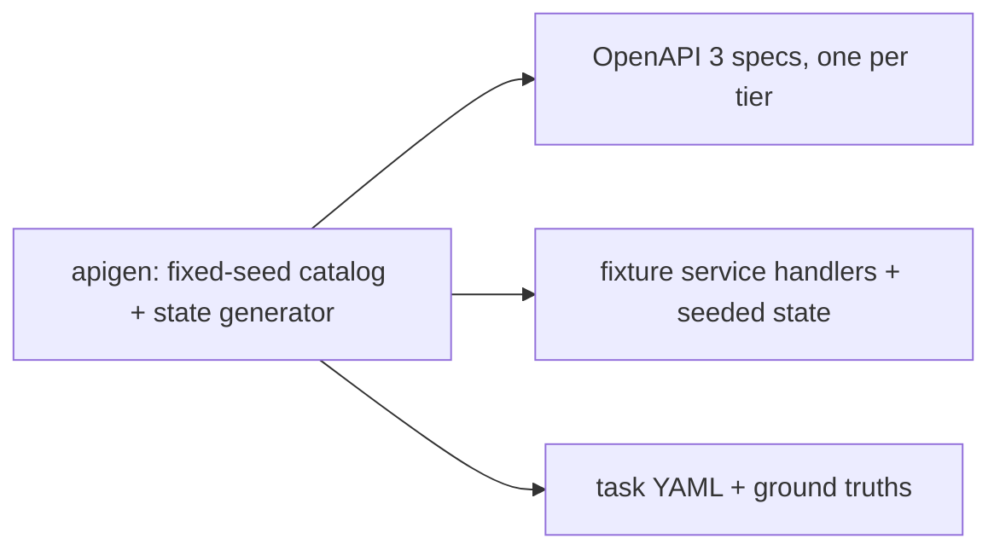

# API-connection architecture study: fixture, generator, and tier design

> **Status: study closed, not planned (2026-07-24).** The design held its
> discriminating variable at an easy setting and saturated by construction;
> the postmortem is recorded on issue #1027 and the pilot data is archived
> under `bench/results/api-study-pilot/`. The fixture and harness this
> protocol produced were reused by the perishable-knowledge study. Kept as
> the pre-registration of record for the archived pilot.


> **Outcome (2026-07-24): harness delivered; study not published.** The
> full k=1 matrix ran (4 arms x 3 tiers x 50 tasks, claude-cli, Sonnet;
> 600 episodes, zero harness failures; results archived under
> `bench/results/api-study-pilot/`). Accuracy saturated at 94 to 100
> percent in every cell: with a single connection, uniformly well-crafted
> operation names and descriptions, and tasks that always require the
> API, endpoint discovery is easy in every arm, so the design cannot
> discriminate architectures on task success. This was determinable from
> the design itself (description quality was deliberately held uniformly
> high, removing the variance the research question needed) and should
> have been caught at review time, before implementation.
>
> What the runs did establish: (a) search-then-invoke is sufficient at
> every catalog size measured, at a fixed ~3.2k-token tool surface, while
> per-endpoint exposure scales linearly to a measured 365,902 tokens of
> tool definitions at 2,503 operations (a ~116x context tax at equal
> accuracy); (b) hybrid ranking holds a consistent ~10-point retrieval
> hit-rate advantage over lexical (100/100/98 vs 93/88/90 across tiers);
> (c) large concrete tool lists erode refusal discipline on
> irrelevance tasks. Caveat on (a): under claude-cli, Claude Code applies
> its own tool search over large MCP toolsets, so the b0 arm measured
> "per-endpoint plus client-side tool search", not naive all-tools-in-
> context; the naive condition was never run.
>
> The open research question this harness cannot answer as designed is
> conditional relevance under realistic conditions: mixed workloads where
> the catalog is usually irrelevant, multiple connections, and messy
> real-world spec and naming quality. A successor study, if pursued, must
> pass a written separation analysis (under exactly what conditions do
> the arms diverge, and does the design contain them) before any fixture
> code is written. The sections below are retained as the harness
> reference; read them with this outcome in mind.

Design doc for the first work item of issue #1027: the fixture HTTP services,
the OpenAPI spec generator, the three catalog-size tiers, and the harness
extensions the study needs. The study is the second benchmark report (report 1:
`docs/reference/benchmark-report.md`, DOI 10.5281/zenodo.21438045) and follows
the same harness philosophy: arms are config profiles, ground truth is
generated from a fixed seed, committed artifacts are drift-checked against
regeneration, and every run manifest pins build, commit, seed, and task-set
hash.

The study compares three API-exposure architectures on identical tasks, specs,
and models:

| Arm | Architecture |
| --- | --- |
| `b0` | One MCP tool per endpoint (market-default baseline) |
| `b1-lex` | `api_*` search-then-invoke, lexical ranking (no embedding index) |
| `b1-hyb` | `api_*` search-then-invoke, hybrid ranking (embedding index present) |
| `b2` | Code mode: agent-written code reads specs from disk and issues HTTP calls |

The pattern under test is not novel (Stainless, Speakeasy Gram, AWS AgentCore
Gateway, Anthropic Tool Search, Cloudflare code mode all ship variants); the
contribution is the first open, reproducible measurement of the axis, the
catalog-size scaling curve, and the ranking-mode ablation. Vendor numbers are
cited as unreplicated claims the study independently tests. Results that go
against the shipped design are reported with the same prominence as results
that favor it.

## 1. What is reused from the report-1 harness

| Piece | Reuse |
| --- | --- |
| `bench/internal/gen` pattern | New generator package follows the same shape: pure deterministic `Generate()`, emitter methods, drift tests (`TestGenerateDeterministic`, committed-artifact match) |
| `bench/internal/task` | Task schema, loader, canonical task-set hash. Extended with two grading kinds (section 6) |
| `bench/internal/llm` | Provider-pluggable adapter; Anthropic adapter exists, a second-provider adapter is a work item |
| `bench/internal/agent` + `mcpc` | The MCP episode loop for arms `b0` and `b1-*` |
| `bench/internal/auditapi` | Audit read-back for tool-call accounting and retrieval hit-rate extraction |
| Identity-key pool | Per-attempt API keys (report-1 pattern) so per-session state never leaks across attempts |
| `bench/internal/stats` | Bootstrap CIs, pass@1 with n repetitions |
| `bench/report` toolchain | Notebook-recomputed numbers and figures, pandoc render, same factual-integrity rule |

## 2. Fixture catalog model

One deterministic catalog definition is the single source of truth from which
three artifacts are emitted, so behavior, specs, and ground truth cannot
drift apart:



### 2.1 Domain

A commerce back office, continuous with report 1's world: the gold surface is
a customers/orders API over the same kind of seeded state the existing
generator produces (customers with region/tier/created_at, orders with
status/amount-in-cents/dates). Distractor families are additional plausible
business systems: billing, invoicing, inventory, shipping, procurement,
marketing, support, HR, analytics, notifications, webhooks, audit-log, and
similar. Every family is generated from the same seed with realistic resource
names, field schemas, and descriptions.

### 2.2 Gold vs distractor operations

- **Gold operations** (10): the operations tasks actually require, over the
  customers/orders world: list/get/aggregate/update customers, a customer's
  orders, list/get/aggregate/create/cancel orders. Identical (same
  operationId, path, schema, description text) in every tier.
- **Distractor operations**: pad the catalog to tier size. All distractors are
  live (section 3): they respond coherently when called, because a 404 from a
  distractor would leak "wrong endpoint" signal that a real deployment does
  not give.
- **Near-miss distractors**: the generator deliberately seeds semantic
  neighbors of gold operations (for `orders`: `purchase-orders` in
  procurement, `order-templates`, `archived-orders`, a deprecated
  `/v1/orders` beside the gold `/v2/orders`). Distractor density and
  proximity are what retrieval must overcome; uniform random padding would
  understate the difficulty.

Spec description quality is a known confound (arXiv:2509.11626 measures up to
25% invocation-accuracy loss from poor descriptions). All operations, gold and
distractor, get the same description template style (one-sentence summary,
tags, parameter descriptions), generated by the same emitter. Description
quality is held constant and documented, not varied.

### 2.3 Catalog tiers

| Tier | Ops | Composition |
| --- | --- | --- |
| `t0` | 53 | Gold (10) + deprecated near-miss + 6 near-miss distractor resources |
| `t1` | 501 | t0 + 64 more distractor resources across all families |
| `t2` | 2,503 | t0 + 350 distractor resources (the full vocabulary) |

Each distractor resource contributes the same seven operations (list,
create, get, update, delete, search, aggregate).

Tiers are nested (`t0 ⊂ t1 ⊂ t2`): gold operations are byte-identical across
tiers and lower-tier distractors persist in higher tiers, so the only variable
along the scaling axis is distractor volume. One spec per tier, one connection
per arm run (spec count is held constant so it never confounds catalog size).
Specs are emitted as OpenAPI 3 JSON (the format `pkg/toolkits/apigateway`
ingests via kin-openapi) and committed under `bench/specs/`.

## 3. Fixture HTTP service

One Go binary (`bench/apisvc`) serves every operation in the full `t2`
catalog. It is in-memory, deterministic from the seed, and dependency-free
(no Docker services needed beyond what arms already require).

- **Reads**: lookups by id, filtered list queries with parameters
  (region/tier/status/date-range), pagination (cursor + page-size), and
  simple aggregate endpoints. Backed by state generated from the fixed seed.
- **Writes**: create/update/cancel mutations that modify in-memory state.
  Grading inspects post-run state (section 6).
- **Distractor handlers**: generated generically from the catalog definition;
  each returns coherent seeded data for its resource family.
- **Harness control plane**, excluded from all specs, on paths under
  `/_bench/`:
  - `POST /_bench/reset` restores seed state (called between attempts so one
    attempt's mutations never leak into the next) and clears the access log.
  - `GET /_bench/state/{resource}` dumps state for mutation grading.
  - `GET /_bench/requests` returns the access log (method, path, status,
    resolved operationId) for the failure-taxonomy classifier.
- **Auth**: static API key (`X-API-Key`), matching the apigateway
  connection's `api_key` auth mode. Per-user OAuth is out of scope (#374).

The service is stateless across restarts by design: state is a pure function
of the seed until mutated, and reset re-derives it.

## 4. Arms in detail

All arms share: the same fixture service, the same spec fixtures, the same
task set, the same models, the same repetition count. In `b0` and `b1-*` the
platform serves MCP over HTTP exactly as in report 1 (auth, audit,
identity-key pool). The search-first workflow gate is disabled in all arms
(`workflow.require_search: false`): `b0` has no `search` tool at all, and
within `b1-*` the discovery step under test is `api_list_endpoints` itself,
so the gate would either block `b0` or inject an extra required call into
`b1-*`. Only the toolkit under test is enabled per arm; no Trino, DataHub,
S3, memory, or knowledge toolkits are present in any arm.

### 4.1 `b0`: one tool per endpoint

A small Go MCP server (`bench/epmcp`) loads a tier spec at startup and
registers one MCP tool per operation (name = operationId, input schema derived
from the operation's parameters + request body, description from the
operation summary), proxying each call to the fixture service. The platform's
MCP gateway toolkit (`pkg/toolkits/gateway`) fronts it, so the agent-side
plumbing (endpoint, auth, audit accounting) is identical to `b1-*`. This is
the Azure APIM / Kong / FastMCP-style baseline built from the identical spec
fixtures.

Expected and accepted failure mode: at `t2` (~2,500 tools), the tools/list
payload alone approaches or exceeds model context limits (~150 tokens per
tool definition puts the toolset near 375k tokens). If a model cannot start an
episode because the toolset does not fit its context, that is recorded as an
architecture outcome (`context_overflow`, success 0, cost of the failed
attempt recorded), not excluded. Models with 1M-token contexts can run `t2`
and are reported alongside.

### 4.2 `b1-lex` and `b1-hyb`: search-then-invoke

The shipped platform design: apigateway toolkit with one `api` connection
pointing at the fixture service, spec registered through the admin catalog
API during `bench-api-up`.

- `b1-lex`: no embedding provider configured. An omitted `ranking` resolves
  to lexical, and an explicit `ranking: semantic|hybrid` falls back to
  lexical with a note (`pkg/toolkits/apigateway/ranking.go`), so the arm
  cannot silently escape its condition.
- `b1-hyb`: embedding provider configured (Ollama + nomic-embed-text, the
  report-1 a3 pattern). An omitted `ranking` resolves to hybrid. Run
  readiness includes waiting for the embed-job queue to drain (the t2 spec
  is ~2,500 operations; embed throughput on CPU Ollama is a known knob,
  see #479) and asserting the persisted-embeddings count equals the
  operation count before the first episode.

The agent prompt scaffold does not name a ranking mode; the arm difference is
config only.

### 4.3 `b2`: code mode

The agent receives no MCP tools for the API. Its episode workspace contains
the tier's spec file(s) on disk, the fixture service base URL, and the API
key in an environment variable; the agent writes and executes code to read
the spec and issue HTTP calls (the Anthropic code-execution / Cloudflare
pattern).

Primary substrate: the #958 claude-cli harness (`bench/internal/claudecli`),
which already runs `claude -p` headless episodes with stream-json token
accounting. Code mode configures NO MCP server; the per-attempt workspace
carries the tier spec (`spec.json`), the system prompt carries the fixture
base URL and API key, and the allowed tools are code execution plus
workspace file tools (Bash, Read, Write, Edit, Glob, Grep). Web tools are
disallowed for measurement hygiene, but there is no network sandbox;
validity does not depend on one, because every ground truth is a function
of the seeded fixture state, which exists nowhere but the fixture service,
and the fixture access log records all API traffic for the failure
taxonomy. The claudecli package already stamps run mode into manifests so
a claude-cli run is never silently compared against a raw Messages API
run.

When the second provider is added (section 8), `b2` gains a provider-neutral
code-execution loop (a single `run_code` tool via the raw provider API,
executed in the same sandbox) so the cross-provider comparison is symmetric.
Until then `b2` is Anthropic-only by construction.

## 5. Task suites

~50 tasks, all generated with ground truths from the seeded state, all
applicable to every arm and tier (gold operations exist in every tier). Task
counts are targets; final counts land with the generator.

| Suite | ~Count | Shape | Grading |
| --- | --- | --- | --- |
| `p1` lookup | 12 | Single-endpoint reads ("what is customer C-1042's tier?") | numeric / entity |
| `p2` parameterized | 12 | Filtered/paginated queries requiring correct parameter construction ("how many shipped orders over $500 in Q2 2025?") | numeric |
| `p3` mutation | 10 | State-changing calls ("cancel order O-2210", "update customer region") | state (post-run inspection) |
| `p4` chain | 8 | Multi-endpoint chains where one response feeds the next request (NESTFUL-hard) | numeric / entity / state |
| `p5` irrelevance | 8 | No registered endpoint applies ("post a message to the #ops Slack channel") | refusal |

Pagination tasks are seeded so the correct answer requires consuming more
than one page (a first-page-only answer is wrong, not approximately right).
Irrelevance tasks target the BFCL irrelevance-detection failure mode: the
correct behavior is to state that no available endpoint can do it, and
grading fails any attempt that invokes a wrong endpoint as if it applied.

## 6. Grading extensions

Two new grading kinds join `numeric` / `entity` / `exec_sql` in
`bench/internal/task`:

- `state`: the grader calls `GET /_bench/state/...` after the episode and
  compares against the expected post-state, computed by the generator
  applying the ground-truth mutation to seed state. Pass requires the
  expected mutation and no unexpected writes (the state dump is compared on
  the touched resource family). This is the MCPMark / MCP-Universe
  programmatic standard; no judge involved.
- `refusal`: pass iff (a) the final answer states the capability is
  unavailable (LLM-judged against the report-1 judge calibration pattern)
  and (b) the transcript contains no invoke of a distractor endpoint
  presented as fulfilling the task. (b) is deterministic from audit rows.

Between every attempt the runner calls `/_bench/reset` and rotates the
identity key (report-1 pattern), so state and per-session platform effects
are attempt-isolated.

## 7. Metrics and instrumentation

Every results table reports, per arm x tier x model, with bootstrap CIs over
n repetitions: task success, tokens in/out (plus cache-read tokens and
time-to-first-useful-call context load), dollar cost per task, wall latency,
turns, and tool calls. Token-only accounting is the vendor pattern this
report corrects; success, cost, and latency always appear together.

Arm-specific instrumentation:

- **Retrieval hit rate (`b1-*`, RQ3)**: for each episode, from the episode
  transcript's `api_list_endpoints` calls (arguments and returned
  operations; the platform's audit events carry tool name and outcome but
  not payloads, so the transcript is the payload source): whether the gold
  operationId appeared in any result set (hit@k at the limit used), and
  its best rank. Reported per tier and ranking mode. Task YAML carries the
  gold operationId(s) to make this computable (`gold_operations` field).
- **Failure taxonomy (RQ4)**: each failed episode is classified as exactly
  one of `search_miss` (gold op never surfaced in any list call, `b1-*`),
  `wrong_endpoint` (invoked a non-gold operation as the answer source),
  `schema_misread` (right endpoint, malformed request shape),
  `parameter_error` (well-formed but wrong parameter values; 4xx or wrong
  filter), `transport_error` (protocol/HTTP/harness failures), or
  `answer_error` (correct calls, wrong final synthesis). Classification is
  deterministic-first from the structured transcript plus audit rows and
  fixture-service access logs; only episodes the rules cannot place go to
  the LLM classifier, and every judged label is recorded as judged (report-1
  judge/calibration pattern).

## 8. Models, repetition, run matrix

- The published report requires two models from different providers (issue
  requirement: single-model results will not be taken seriously). The
  build-out, pre-checks, and pilots are Anthropic-only; the second
  OpenAI-compatible adapter in `bench/internal/llm` is a deferred work item
  that must land before the publication runs. Model choice is pinned in run
  manifests, not in this doc.
- pass@1 with n=3 repetitions per condition and bootstrap CIs (report-1
  treatment); never single-shot.
- Full matrix: 50 tasks x 4 arms x 3 tiers x 2 models x 3 reps = 3,600
  episodes, minus `b0`/`t2` short-circuits where the toolset cannot fit a
  model's context (recorded, not run to waste). `b0` at `t1`/`t2` dominates
  token cost (the per-turn toolset is the cost); prompt caching makes the
  repeated toolset largely cache-read after the first turn of each episode.
  A pilot (1 model, `t0` only, n=1) precedes any full run and produces the
  cost projection for the full matrix before it is committed to.

## 9. Repository layout and drift checks

```
bench/
  apigen/                 # generator main (like seedgen)
  internal/apigen/        # catalog model, seeded state, emitters, ground truths
  apisvc/                 # fixture HTTP service main
  epmcp/                  # per-endpoint MCP server main (b0)
  specs/                  # committed OpenAPI specs: t0.json, t1.json, t2.json
  tasks-api/              # committed task YAML (p1-*.yaml ... p5-*.yaml)
  config/platform.bench.b0.yaml
  config/platform.bench.b1-lex.yaml
  config/platform.bench.b1-hyb.yaml
  docs/api-connection-study-design.md   # this doc
```

Drift checks mirror `bench/internal/gen`: determinism
(`Generate()` twice, deep-equal), committed-artifact match (specs, tasks
regenerate byte-identical to what is committed), invariants (gold operations
byte-identical across tiers, tier nesting holds, every task's
`gold_operations` exist in every tier's spec, near-miss distractors present,
mutation ground truths reachable from seed state). Makefile targets follow
the existing family: `bench-api-gen`, `bench-api-up BENCH_ARM=b1-hyb
BENCH_TIER=t1`, `bench-api-run`, kept out of `make verify` like all run
targets; module checks (`bench-test`, `bench-lint`) cover the new packages
automatically.

`b2` needs no platform config; its profile is a harness config (workspace
template + sandbox definition) committed alongside the arm configs.

## 10. Pre-checks before implementation (dependency-first)

1. **Gateway toolkit at scale**: DONE. Initial check found the gateway's
   upstream discovery read a single tools/list page (the SDK server pages
   at 1000 tools), silently truncating a 2,500-tool upstream to 1,000.
   Fixed to follow pagination cursors (`pkg/toolkits/gateway/client.go`,
   regression test `pagination_test.go`); re-verified live at 2,500 tools.
   The bench MCP client had the same single-page read; fixed alongside
   (`bench/internal/mcpc`).
2. **Admin spec upload at scale**: DONE (parse path). Synthetic specs
   through `catalog.ParseSpec` (the shared parse used by the admin upload
   handler and the toolkit): 502 ops = 0.43 MiB / 64ms; 1,820 ops =
   1.54 MiB / 205ms; ~2.2 MiB / ~280ms extrapolated at 2,500 ops. Well
   under the 10 MiB upload cap (`catalogSpecMaxUploadBytes`) with
   negligible parse cost. The end-to-end admin upload of the real t2 spec
   is re-confirmed when `bench-api-up` lands.
3. **Embed throughput**: time the t2 embed-job drain on the a3 Ollama
   pattern; size `embed_timeout`/`batch_size` accordingly (#479 knobs).
4. **Second-provider adapter**: confirm the target provider's API supports
   the required shapes (tools with JSON-schema inputs, usage accounting
   including cached tokens) before building the adapter.
5. **Toolset token measurement**: measure actual tokens per registered tool
   definition at each tier (the ~150/tool figure above is an estimate to be
   replaced by measurement in the report).

## 11. Out of scope (from #1027)

Auth/OAuth to upstream APIs (static keys only), MCP-vs-non-MCP protocol
comparisons, and cross-vendor gateway comparisons. The study varies
architecture within one harness.
