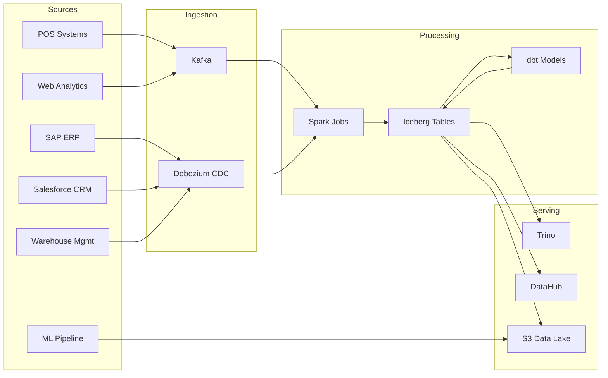

# Data Pipeline Architecture

## Overview

ACME's data platform ingests from 6 source systems, processes through a multi-layer warehouse, and serves analytics through Trino and the semantic layer.

## Pipeline Flow

## Key Schemas

| Schema | Tables | Refresh | Owner |
|--------|--------|---------|-------|
| `retail` | daily_sales, store_transactions, price_adjustments | Hourly | Data Engineering |
| `inventory` | inventory_levels, supply_chain_orders, current_stock (view) | 15 min | Data Engineering |
| `analytics` | regional_performance, customer_segments | Daily (4am) | Analytics Team |
| `finance` | revenue_summary, cost_centers, margin_analysis | Daily (6am) | Finance Team |

## SLAs

- **POS → Iceberg**: < 15 minutes (CDC via Debezium)
- **ERP → Iceberg**: < 1 hour (batch CDC)
- **dbt models**: Complete by 5:00 AM ET
- **DataHub metadata sync**: < 30 minutes after schema change

## Data Quality Rules

1. `daily_sales.revenue` must be non-negative
2. `inventory_levels.current_stock` must be ≥ 0
3. `store_transactions` must have matching `daily_sales` aggregate within 0.1%
4. No orphan records in `customer_segments` (FK to `regional_performance`)
