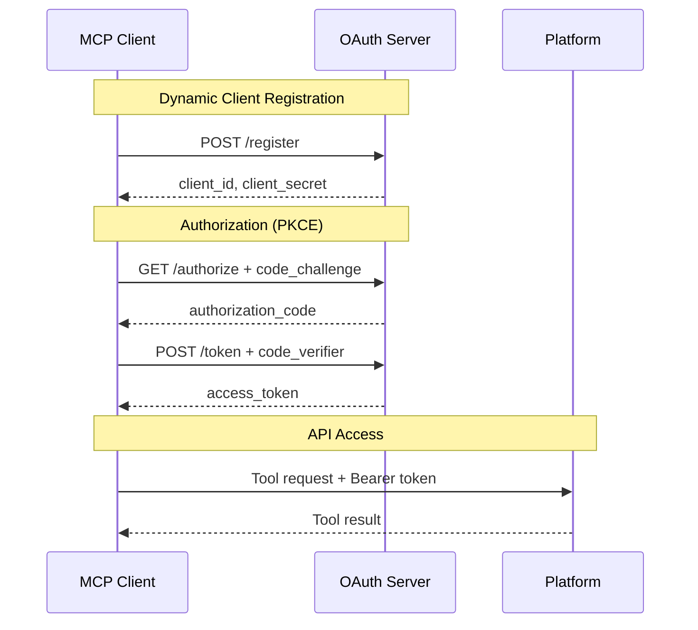

# OAuth 2.1 Server

!!! danger "Consider Alternatives First"
    **You probably don't need this.** The built-in OAuth server adds complexity and attack surface. For most deployments, use:

    - **OIDC** with your existing identity provider (Keycloak, Auth0, Okta)
    - **API keys** for service accounts and automation

    These approaches are simpler, more secure, and easier to audit.

mcp-data-platform includes a built-in OAuth 2.1 authorization server. This exists for edge cases where no other authentication option is viable.

## When to Use

Use the built-in OAuth server **only** when:

- You have no existing identity provider
- You cannot use API keys
- You understand the security implications

## When NOT to Use

**Do not use** the built-in OAuth server when:

- You have an existing OIDC provider (use that instead)
- API keys meet your requirements (simpler and more auditable)
- You're deploying to production without security review
- You want Dynamic Client Registration (see warning below)

!!! warning "Avoid Dynamic Client Registration"
    DCR allows unknown clients to register themselves. This is an anti-pattern for security-sensitive systems. If you enable DCR, any client can obtain credentials. For MCP servers with access to sensitive data infrastructure, this is rarely appropriate.

    Instead: pre-register clients, use API keys, or authenticate via your identity provider.

## How It Works



## Configuration

Enable the OAuth server:

```yaml
oauth:
  enabled: true
  dcr:
    enabled: true
    allowed_redirect_patterns:
      - "http://localhost:*"
      - "https://*.example.com/callback"

database:
  dsn: ${DATABASE_URL}
```

| Field | Required | Description |
|-------|----------|-------------|
| `enabled` | Yes | Enable the OAuth server |
| `dcr.enabled` | No | Enable Dynamic Client Registration |
| `dcr.allowed_redirect_patterns` | No | Allowed redirect URI patterns |

The OAuth server requires a PostgreSQL database for storing client registrations and tokens.

## Database Setup

Run the migrations to create required tables:

```sql
-- OAuth clients table
CREATE TABLE oauth_clients (
    client_id VARCHAR(255) PRIMARY KEY,
    client_secret_hash VARCHAR(255) NOT NULL,
    client_name VARCHAR(255),
    redirect_uris TEXT[],
    grant_types TEXT[],
    created_at TIMESTAMP DEFAULT CURRENT_TIMESTAMP
);

-- Authorization codes table
CREATE TABLE oauth_codes (
    code VARCHAR(255) PRIMARY KEY,
    client_id VARCHAR(255) NOT NULL,
    redirect_uri TEXT NOT NULL,
    code_challenge VARCHAR(255),
    code_challenge_method VARCHAR(10),
    expires_at TIMESTAMP NOT NULL,
    created_at TIMESTAMP DEFAULT CURRENT_TIMESTAMP
);

-- Access tokens table
CREATE TABLE oauth_tokens (
    token_hash VARCHAR(255) PRIMARY KEY,
    client_id VARCHAR(255) NOT NULL,
    expires_at TIMESTAMP NOT NULL,
    created_at TIMESTAMP DEFAULT CURRENT_TIMESTAMP
);
```

## Endpoints

When enabled, the OAuth server exposes:

| Endpoint | Method | Description |
|----------|--------|-------------|
| `/.well-known/oauth-authorization-server` | GET | Server metadata |
| `/register` | POST | Dynamic Client Registration |
| `/authorize` | GET | Authorization endpoint |
| `/token` | POST | Token endpoint |

## Dynamic Client Registration

!!! danger "Security Risk"
    **DCR is disabled by default and should remain disabled for most deployments.**

    DCR allows any client to register and obtain credentials. For MCP servers connected to your data infrastructure, this means any malicious actor who can reach your server can obtain access credentials.

    If you must use DCR:

    - Restrict network access to the registration endpoint
    - Use strict redirect URI validation
    - Implement additional authorization checks
    - Monitor and audit all registrations
    - Consider: would API keys be simpler and safer?

If DCR is enabled (not recommended), clients can register:

```bash
curl -X POST http://localhost:8080/register \
  -H "Content-Type: application/json" \
  -d '{
    "client_name": "my-mcp-client",
    "redirect_uris": ["http://localhost:3000/callback"],
    "grant_types": ["authorization_code"],
    "token_endpoint_auth_method": "client_secret_post"
  }'
```

Response:
```json
{
  "client_id": "generated-client-id",
  "client_secret": "generated-client-secret",
  "client_name": "my-mcp-client",
  "redirect_uris": ["http://localhost:3000/callback"]
}
```

## PKCE Authorization Flow

1. **Generate code verifier and challenge:**
```javascript
const codeVerifier = generateRandomString(64);
const codeChallenge = base64url(sha256(codeVerifier));
```

2. **Request authorization:**
```
GET /authorize?
  response_type=code&
  client_id=your-client-id&
  redirect_uri=http://localhost:3000/callback&
  code_challenge=your-code-challenge&
  code_challenge_method=S256&
  state=random-state
```

3. **Exchange code for token:**
```bash
curl -X POST http://localhost:8080/token \
  -d "grant_type=authorization_code" \
  -d "client_id=your-client-id" \
  -d "client_secret=your-client-secret" \
  -d "code=authorization-code" \
  -d "redirect_uri=http://localhost:3000/callback" \
  -d "code_verifier=your-code-verifier"
```

Response:
```json
{
  "access_token": "generated-access-token",
  "token_type": "Bearer",
  "expires_in": 3600
}
```

## Redirect URI Validation

Configure allowed redirect URI patterns:

```yaml
oauth:
  dcr:
    allowed_redirect_patterns:
      - "http://localhost:*"           # Any localhost port
      - "http://127.0.0.1:*"          # IPv4 localhost
      - "https://*.example.com/*"      # Any subdomain
      - "myapp://callback"             # Custom scheme
```

Patterns support:
- `*` matches any characters
- Exact string matching for literal URIs

## Token Validation

Tokens issued by the OAuth server are validated automatically when making tool requests. The platform checks:

- Token exists and hasn't been revoked
- Token hasn't expired
- Client is still registered

## Security Considerations

**PKCE is required:**
All authorization requests must include `code_challenge` and `code_challenge_method=S256`.

**HTTPS in production:**
Always use HTTPS for the OAuth endpoints in production:
```yaml
server:
  tls:
    enabled: true
    cert_file: /path/to/cert.pem
    key_file: /path/to/key.pem
```

**Token expiration:**
Tokens expire after 1 hour by default. Clients should handle token refresh or re-authorization.

**Client secrets:**
Client secrets are stored as bcrypt hashes. Original secrets are only returned during registration.

## Limitations

The built-in OAuth server is designed for MCP client authentication. It does not support:

- Refresh tokens (clients must re-authorize)
- User authentication (it's machine-to-machine only)
- Scopes (all tokens have the same permissions)
- Token revocation endpoint

For more advanced OAuth requirements, use an external identity provider with OIDC.

## Troubleshooting

**"Invalid redirect_uri":**
- Check the URI matches an allowed pattern exactly
- Verify port numbers and paths match

**"Invalid code_verifier":**
- Ensure code_verifier matches the original code_challenge
- Verify SHA256 hashing and base64url encoding

**Database connection errors:**
- Verify `database.dsn` is correct
- Check PostgreSQL is accessible
- Ensure migrations have been run

## Next Steps

- [OIDC Authentication](oidc.md) - External identity provider
- [Personas](../personas/overview.md) - Access control
