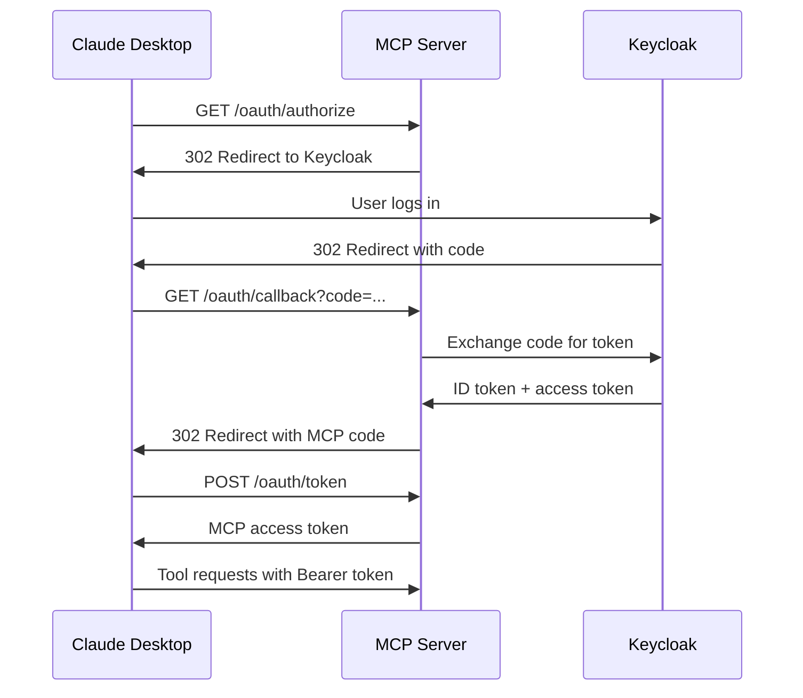

# OAuth 2.1 Server

mcp-data-platform includes a built-in OAuth 2.1 authorization server that enables Claude Desktop and other MCP clients to authenticate via your existing identity provider (e.g., Keycloak).

## Use Cases

The built-in OAuth server supports two primary scenarios:

| Scenario | Description |
|----------|-------------|
| **Claude Desktop + IdP** | Claude Desktop authenticates users via Keycloak/Auth0/Okta |
| **Pre-registered Clients** | Known clients with pre-configured credentials |

## How It Works

The OAuth server acts as a bridge between MCP clients (like Claude Desktop) and your upstream identity provider:



## Configuration

### Basic Configuration (Pre-registered Clients)

For development or simple deployments with known clients:

```yaml
server:
  transport: sse
  address: ":8080"

oauth:
  enabled: true
  issuer: "http://localhost:8080"

  # Pre-registered clients (no DCR needed)
  clients:
    - id: "claude-desktop"
      secret: "${CLAUDE_CLIENT_SECRET}"
      redirect_uris:
        - "http://localhost"
        - "http://127.0.0.1"
```

### Full Configuration (with Keycloak)

For production deployments with Keycloak as the identity provider:

```yaml
server:
  transport: sse
  address: ":8080"
  tls:
    enabled: true
    cert_file: /path/to/cert.pem
    key_file: /path/to/key.pem

oauth:
  enabled: true
  issuer: "https://mcp.example.com"

  # Pre-registered client for Claude Desktop
  clients:
    - id: "claude-desktop"
      secret: "${CLAUDE_CLIENT_SECRET}"
      redirect_uris:
        - "http://localhost"
        - "http://127.0.0.1"

  # Dynamic Client Registration (optional)
  dcr:
    enabled: false  # Disabled by default for security
    allowed_redirect_patterns:
      - "^http://localhost.*"
      - "^http://127.0.0.1.*"

  # Keycloak as upstream IdP
  upstream:
    issuer: "https://keycloak.example.com/realms/mcp-demo"
    client_id: "mcp-data-platform"
    client_secret: "${KEYCLOAK_CLIENT_SECRET}"
    redirect_uri: "https://mcp.example.com/oauth/callback"
```

### Configuration Reference

| Field | Required | Description |
|-------|----------|-------------|
| `oauth.enabled` | Yes | Enable the OAuth server |
| `oauth.issuer` | Yes | The OAuth issuer URL (your MCP server's public URL) |
| `oauth.clients` | No | Pre-registered OAuth clients |
| `oauth.clients[].id` | Yes | Client ID |
| `oauth.clients[].secret` | Yes | Client secret (use environment variable) |
| `oauth.clients[].redirect_uris` | Yes | Allowed redirect URIs |
| `oauth.dcr.enabled` | No | Enable Dynamic Client Registration |
| `oauth.dcr.allowed_redirect_patterns` | No | Regex patterns for allowed redirect URIs |
| `oauth.upstream.issuer` | No | Upstream IdP issuer URL |
| `oauth.upstream.client_id` | No | MCP server's client ID in the upstream IdP |
| `oauth.upstream.client_secret` | No | MCP server's client secret |
| `oauth.upstream.redirect_uri` | No | Callback URL for upstream IdP |

## Endpoints

When enabled, the OAuth server exposes:

| Endpoint | Method | Description |
|----------|--------|-------------|
| `/.well-known/oauth-authorization-server` | GET | Server metadata |
| `/oauth/authorize` | GET | Authorization endpoint (redirects to upstream IdP) |
| `/oauth/callback` | GET | Callback from upstream IdP |
| `/oauth/token` | POST | Token endpoint |
| `/oauth/register` | POST | Dynamic Client Registration (if enabled) |

## Claude Desktop Setup

### 1. Configure Keycloak

Create a client in Keycloak for the MCP server:

1. Go to your Keycloak admin console
2. Create a new client:
   - **Client ID**: `mcp-data-platform`
   - **Client authentication**: ON
   - **Valid redirect URIs**: `https://mcp.example.com/oauth/callback`
3. Note the client secret from the Credentials tab
4. Create test users as needed

### 2. Configure MCP Server

```yaml
oauth:
  enabled: true
  issuer: "https://mcp.example.com"
  clients:
    - id: "claude-desktop"
      secret: "your-client-secret"
      redirect_uris:
        - "http://localhost"
        - "http://127.0.0.1"
  upstream:
    issuer: "https://keycloak.example.com/realms/your-realm"
    client_id: "mcp-data-platform"
    client_secret: "${KEYCLOAK_CLIENT_SECRET}"
    redirect_uri: "https://mcp.example.com/oauth/callback"
```

### 3. Configure Claude Desktop

In Claude Desktop, add your MCP server:

1. Open Settings > MCP Servers
2. Add a new server:
   - **Name**: My Data Platform
   - **URL**: `https://mcp.example.com`
   - **Client ID**: `claude-desktop`
   - **Client Secret**: (the secret you configured)

When you connect, Claude Desktop will:
1. Open your browser to the MCP server's `/oauth/authorize` endpoint
2. Redirect you to Keycloak to log in
3. After login, redirect back to the MCP server
4. Complete the OAuth flow and connect

## Storage

The OAuth server uses **in-memory storage** by default, which is suitable for:

- Development and testing
- Single-instance deployments
- Stateless deployments where tokens can be re-issued

For production multi-instance deployments, PostgreSQL storage is available:

```yaml
database:
  dsn: "${DATABASE_URL}"
```

## PKCE Support

PKCE (Proof Key for Code Exchange) is **required** for all authorization requests:

- Clients must provide `code_challenge` and `code_challenge_method=S256`
- The server validates the `code_verifier` during token exchange
- This prevents authorization code interception attacks

## Dynamic Client Registration

!!! warning "Security Consideration"
    DCR allows unknown clients to register. For production deployments with sensitive data, prefer pre-registered clients.

If DCR is enabled, clients can register:

```bash
curl -X POST https://mcp.example.com/oauth/register \
  -H "Content-Type: application/json" \
  -d '{
    "client_name": "my-mcp-client",
    "redirect_uris": ["http://localhost:8080/callback"]
  }'
```

Response:
```json
{
  "client_id": "generated-client-id",
  "client_secret": "generated-client-secret",
  "client_name": "my-mcp-client",
  "redirect_uris": ["http://localhost:8080/callback"]
}
```

## Security Features

| Feature | Description |
|---------|-------------|
| **PKCE Required** | All clients must use PKCE with S256 |
| **Bcrypt Secrets** | Client secrets stored as bcrypt hashes |
| **State Validation** | CSRF protection via state parameter |
| **Token Expiration** | Access tokens expire after 1 hour |
| **Refresh Token Rotation** | New refresh token issued on each use |

## Troubleshooting

**"Invalid redirect_uri":**
- Ensure the redirect URI exactly matches a configured pattern
- Check for trailing slashes or port mismatches

**"upstream IdP not configured":**
- Add the `oauth.upstream` configuration block
- Verify the upstream issuer URL is correct

**"authorization state not found":**
- The OAuth flow may have timed out (states expire after 10 minutes)
- Restart the authorization flow

**"token_exchange_failed":**
- Check Keycloak client secret is correct
- Verify the callback URL matches Keycloak's valid redirect URIs
- Check network connectivity to Keycloak

## Verifying Setup

Check the OAuth metadata endpoint:

```bash
curl https://mcp.example.com/.well-known/oauth-authorization-server
```

Expected response:
```json
{
  "issuer": "https://mcp.example.com",
  "authorization_endpoint": "https://mcp.example.com/oauth/authorize",
  "token_endpoint": "https://mcp.example.com/oauth/token",
  "registration_endpoint": "https://mcp.example.com/oauth/register",
  "response_types_supported": ["code"],
  "grant_types_supported": ["authorization_code", "refresh_token"],
  "code_challenge_methods_supported": ["S256", "plain"],
  "token_endpoint_auth_methods_supported": ["client_secret_basic", "client_secret_post"]
}
```

## Next Steps

- [OIDC Authentication](oidc.md) - Direct OIDC without the OAuth server
- [API Keys](api-keys.md) - Service account authentication
- [Personas](../personas/overview.md) - Role-based tool filtering
