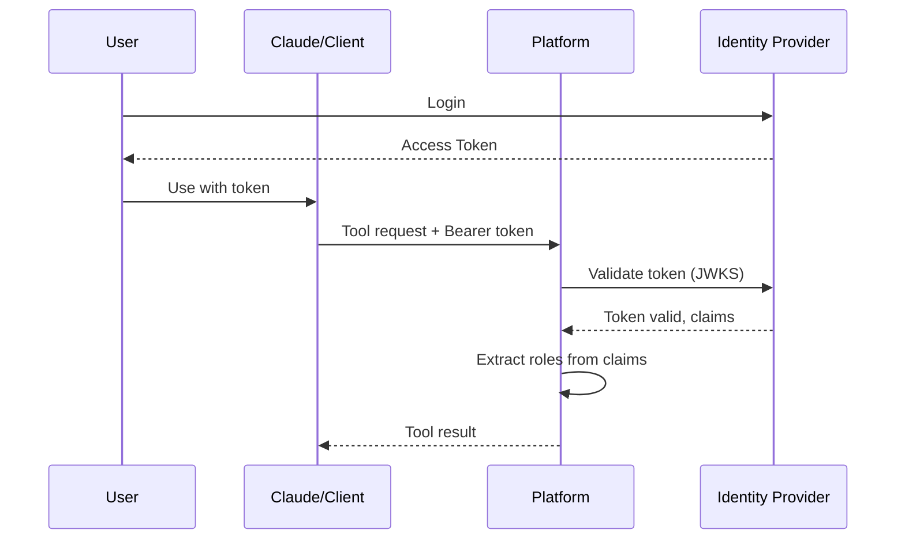

# OIDC Authentication

OIDC (OpenID Connect) authentication allows users to authenticate using tokens from your identity provider. This integrates with Keycloak, Auth0, Okta, Azure AD, and any OIDC-compliant provider.

## How It Works



The platform validates tokens using the identity provider's JWKS (JSON Web Key Set) endpoint, discovered automatically from the issuer URL.

## Configuration

```yaml
auth:
  oidc:
    enabled: true
    issuer: "https://auth.example.com/realms/platform"
    client_id: "mcp-data-platform"
    audience: "mcp-data-platform"
    role_claim_path: "realm_access.roles"
    role_prefix: "dp_"
```

| Field | Required | Description |
|-------|----------|-------------|
| `enabled` | Yes | Enable OIDC authentication |
| `issuer` | Yes | OIDC issuer URL (used for discovery) |
| `client_id` | Yes | Expected client ID in tokens |
| `audience` | No | Expected audience claim (defaults to client_id) |
| `role_claim_path` | No | JSON path to roles in token claims |
| `role_prefix` | No | Prefix to filter/strip from role names |

## Provider-Specific Setup

### Keycloak

1. Create a client in your realm:
   - Client ID: `mcp-data-platform`
   - Access Type: `confidential` or `public` (depending on your flow)
   - Valid Redirect URIs: Your application URLs

2. Configure role mapping:
   - Create realm roles: `dp_analyst`, `dp_admin`, etc.
   - Assign roles to users

3. Platform configuration:
```yaml
auth:
  oidc:
    enabled: true
    issuer: "https://keycloak.example.com/realms/your-realm"
    client_id: "mcp-data-platform"
    role_claim_path: "realm_access.roles"
    role_prefix: "dp_"
```

### Auth0

1. Create an API in Auth0:
   - Name: `mcp-data-platform`
   - Identifier: `https://mcp-data-platform.example.com`

2. Create a Regular Web Application or Machine-to-Machine app

3. Add roles via Auth0 Authorization:
   - Create permissions: `analyst`, `admin`
   - Assign to users/apps

4. Platform configuration:
```yaml
auth:
  oidc:
    enabled: true
    issuer: "https://your-tenant.auth0.com/"
    client_id: "your-client-id"
    audience: "https://mcp-data-platform.example.com"
    role_claim_path: "https://your-domain/roles"
```

Note: Auth0 requires a custom claim for roles. Add a Rule or Action to include roles in the token.

### Okta

1. Create an application in Okta:
   - Application type: Web or API
   - Grant type: Authorization Code or Client Credentials

2. Create groups for roles: `mcp-analyst`, `mcp-admin`

3. Add a Groups claim to your authorization server:
   - Name: `groups`
   - Filter: Matches regex `mcp-.*`

4. Platform configuration:
```yaml
auth:
  oidc:
    enabled: true
    issuer: "https://your-org.okta.com/oauth2/default"
    client_id: "your-client-id"
    audience: "api://default"
    role_claim_path: "groups"
    role_prefix: "mcp-"
```

### Azure AD

1. Register an application in Azure AD

2. Create App Roles:
   - `analyst`, `admin`
   - Assign to users/groups

3. Platform configuration:
```yaml
auth:
  oidc:
    enabled: true
    issuer: "https://login.microsoftonline.com/your-tenant-id/v2.0"
    client_id: "your-application-id"
    audience: "your-application-id"
    role_claim_path: "roles"
```

## Role Claim Extraction

The `role_claim_path` uses dot notation to navigate the token's claims:

Token claims:
```json
{
  "sub": "user123",
  "realm_access": {
    "roles": ["dp_analyst", "dp_viewer", "other_role"]
  }
}
```

With `role_claim_path: "realm_access.roles"` and `role_prefix: "dp_"`:
- Extracts: `["dp_analyst", "dp_viewer", "other_role"]`
- Filters to: `["dp_analyst", "dp_viewer"]` (only dp_ prefixed)
- Strips prefix: `["analyst", "viewer"]`

These roles are then used for persona mapping.

## Token Validation

The platform validates:

1. **Signature** - Token signed by identity provider's key
2. **Issuer** - Matches configured issuer
3. **Audience** - Contains expected audience (if configured)
4. **Expiration** - Token not expired
5. **Client ID** - Authorized party matches (for access tokens)

Invalid tokens return a 401 Unauthorized response.

## Claims Extraction

Standard claims extracted from valid tokens:

| Claim | User Context Field |
|-------|-------------------|
| `sub` | Subject |
| `name` or `preferred_username` | Name |
| `email` | Email |
| Custom role claim | Roles |

## Testing OIDC

Test token validation:

```bash
# Get a token from your identity provider
TOKEN=$(curl -s -X POST "https://auth.example.com/token" \
  -d "grant_type=client_credentials" \
  -d "client_id=test-client" \
  -d "client_secret=secret" | jq -r '.access_token')

# Test with the platform (if using HTTP transport)
curl -H "Authorization: Bearer $TOKEN" \
  http://localhost:8080/sse
```

## Troubleshooting

**Token rejected with "invalid issuer":**
- Check the issuer URL exactly matches your identity provider
- Include trailing slash if required by your provider

**Roles not extracted:**
- Verify `role_claim_path` matches your token structure
- Check token claims with jwt.io or similar decoder
- Ensure roles are included in the token (some providers require configuration)

**Token validation fails:**
- Verify the identity provider is accessible from the platform
- Check clock synchronization (tokens are time-sensitive)
- Ensure the JWKS endpoint is reachable

## Next Steps

- [API Keys](api-keys.md) - Alternative authentication method
- [Personas](../personas/overview.md) - Map roles to permissions
- [Role Mapping](../personas/role-mapping.md) - Advanced role configuration
