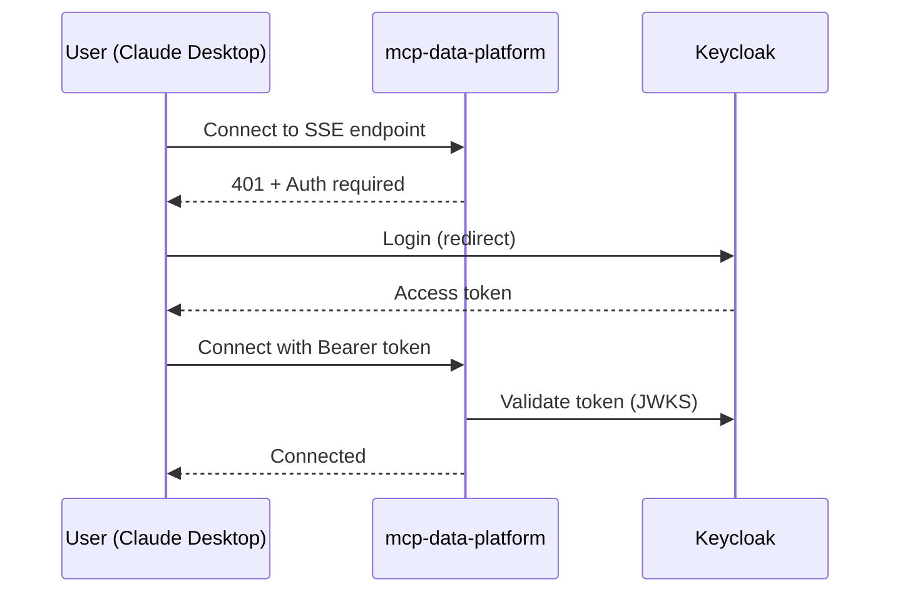

# Authentication Overview

Whether you need MCP-level authentication depends on your transport:

| Transport | Authentication | Why |
|-----------|---------------|-----|
| **stdio** | Not needed | Local execution with your own credentials |
| **SSE** | Required | Shared server needs to identify users |

## stdio Transport (Local)

When running mcp-data-platform locally via stdio (Claude Desktop, Claude Code), **no MCP authentication is required**. The server runs on your machine using credentials you configured:

```yaml
toolkits:
  trino:
    primary:
      user: ${TRINO_USER}        # Your credentials
      password: ${TRINO_PASSWORD}
  datahub:
    primary:
      token: ${DATAHUB_TOKEN}    # Your token
```

You're authenticated implicitly—it's your machine, your config, your credentials.

## SSE Transport (Remote/Shared)

When deploying mcp-data-platform as a shared remote service, authentication identifies who is making requests. This enables:

- **Audit trails** - Log which user ran which query
- **Persona mapping** - Apply role-based tool filtering
- **Access control** - Restrict sensitive operations by user

| Method | Use Case |
|--------|----------|
| **OIDC** | Human users via Keycloak, Auth0, Okta |
| **API Keys** | Service accounts, automation |

## SSE Authentication Flow

When a user connects to the SSE endpoint:



## Recommended SSE Configuration

For a shared remote deployment with Keycloak:

```yaml
server:
  transport: sse
  address: ":8443"
  tls:
    enabled: true
    cert_file: /path/to/cert.pem
    key_file: /path/to/key.pem

auth:
  oidc:
    enabled: true
    issuer: "https://keycloak.example.com/realms/your-realm"
    client_id: "mcp-data-platform"
    audience: "mcp-data-platform"
    role_claim_path: "realm_access.roles"
    role_prefix: "dp_"

  api_keys:
    enabled: true
    keys:
      - key: ${API_KEY_ETL}
        name: "etl-service"
        roles: ["service"]
```

This configuration:

- Human users authenticate via Keycloak
- Service accounts use API keys
- Roles from Keycloak tokens map to personas

## User Context

For SSE deployments, authenticated users have a context:

```go
type UserContext struct {
    Subject   string   // Unique user identifier (from OIDC sub claim)
    Name      string   // Display name
    Email     string   // Email address
    Roles     []string // Roles from OIDC token
    AuthType  string   // "oidc" or "apikey"
}
```

This enables:

- **Persona mapping** - User's roles determine which tools they can access
- **Audit logging** - Track who ran what query and when

## Audit Integration

For SSE deployments, enable audit logging:

```yaml
audit:
  enabled: true
  log_tool_calls: true
```

Logged events include:

- User identifier (from OIDC or API key name)
- Tool called
- Timestamp
- Request/response summary

## Next Steps

- [OIDC Authentication](oidc.md) - Configure Keycloak or other providers
- [API Keys](api-keys.md) - Service account authentication
- [Personas](../personas/overview.md) - Role-based tool filtering
