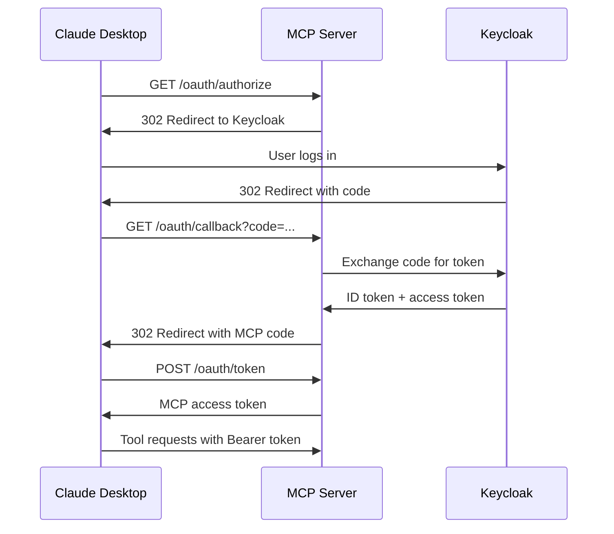
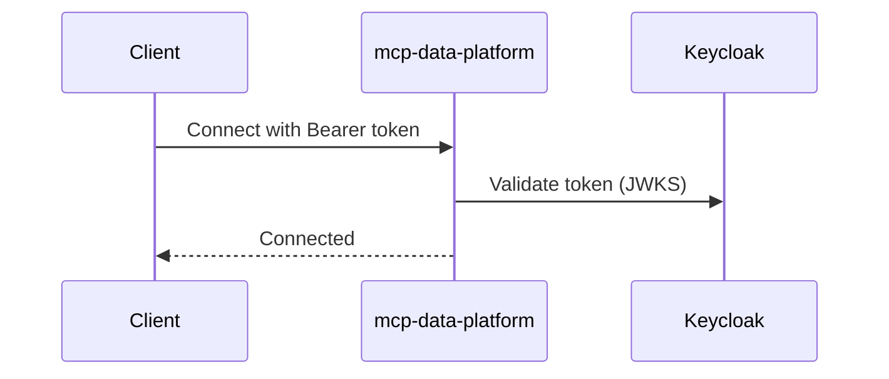

# Authentication Overview

mcp-data-platform implements a **fail-closed** security model where missing or invalid credentials result in denied access, never bypassed checks. For the security architecture rationale, see [MCP Defense: A Case Study in AI Security](https://imti.co/mcp-defense/).

## Transport Security Requirements

| Transport | Authentication | TLS | Why |
|-----------|---------------|-----|-----|
| **stdio** | Not needed | N/A | Local execution with your own credentials |
| **HTTP** | **Required** | Strongly recommended | Shared server needs to identify users |

!!! warning "HTTP Transport Security"
    When using HTTP transport, authentication is **required by default**. Anonymous access must be explicitly enabled and is not recommended for production deployments.

## stdio Transport (Local)

When running mcp-data-platform locally via stdio (Claude Desktop, Claude Code), **no MCP authentication is required**. The server runs on your machine using credentials you configured:

```yaml
toolkits:
  trino:
    primary:
      user: ${TRINO_USER}        # Your credentials
      password: ${TRINO_PASSWORD}
  datahub:
    primary:
      token: ${DATAHUB_TOKEN}    # Your token
```

You're authenticated implicitly. It's your machine, your config, your credentials.

## HTTP Transport (Remote/Shared)

When deploying mcp-data-platform as a shared remote service, authentication identifies who is making requests. This enables:

- **Audit trails** - Log which user ran which query
- **Persona mapping** - Apply role-based tool filtering
- **Access control** - Restrict sensitive operations by user

| Method | Use Case |
|--------|----------|
| **OIDC** | Human users via Keycloak, Auth0, Okta |
| **API Keys** | Service accounts, automation |

## Security Model

mcp-data-platform follows a **fail-closed** security model:

### Authentication Requirements

| Requirement | Behavior |
|-------------|----------|
| Missing token | HTTP 401 Unauthorized |
| Invalid token | Authentication error |
| Expired token | Authentication error |
| Missing `sub` claim | Token rejected |
| Missing `exp` claim | Token rejected |

### Authorization Defaults

| Scenario | Behavior |
|----------|----------|
| No persona resolved | Access denied |
| Default persona | Denies all tools (explicit assignment required) |
| Nil persona in filter | Returns empty tool list |

### Token Validation

JWT tokens are validated with the following checks:

1. **Signature verification** - Token signature verified against JWKS
2. **Required claims** - `sub` (subject) and `exp` (expiration) are mandatory
3. **Time validation** - `exp`, `nbf`, and `iat` claims validated with configurable clock skew
4. **Issuer verification** - Token issuer must match configuration
5. **Audience verification** - Token audience must match (when configured)

```yaml
auth:
  oidc:
    enabled: true
    issuer: "https://auth.example.com/realms/platform"
    client_id: "mcp-data-platform"
    audience: "mcp-data-platform"
    clock_skew_seconds: 30      # Default: 30 seconds
    max_token_age: 24h          # Optional: reject tokens older than this
```

## HTTP Authentication Flow

mcp-data-platform supports two authentication flows for HTTP transport:

### OAuth 2.1 Flow (Claude Desktop + Keycloak)

For Claude Desktop connecting to a remote MCP server with Keycloak authentication:



This flow enables Claude Desktop to authenticate users via your existing identity provider without requiring users to manually manage tokens.

**Configuration:**
```yaml
oauth:
  enabled: true
  issuer: "https://mcp.example.com"
  clients:
    - id: "claude-desktop"
      secret: "${CLAUDE_CLIENT_SECRET}"
      redirect_uris:
        - "http://localhost"
        - "http://127.0.0.1"
  upstream:
    issuer: "https://keycloak.example.com/realms/your-realm"
    client_id: "mcp-data-platform"
    client_secret: "${KEYCLOAK_CLIENT_SECRET}"
    redirect_uri: "https://mcp.example.com/oauth/callback"
```

See [OAuth 2.1 Server](oauth-server.md) for complete setup instructions.

### Direct Bearer Token Flow

For clients that already have a valid token (e.g., service accounts, API integrations):



## Recommended HTTP Configuration

For a shared remote deployment with Keycloak:

```yaml
server:
  transport: http
  address: ":8443"
  tls:
    enabled: true
    cert_file: /path/to/cert.pem
    key_file: /path/to/key.pem

auth:
  allow_anonymous: false  # Default: require authentication
  oidc:
    enabled: true
    issuer: "https://keycloak.example.com/realms/your-realm"
    client_id: "mcp-data-platform"
    audience: "mcp-data-platform"
    role_claim_path: "realm_access.roles"
    role_prefix: "dp_"
    clock_skew_seconds: 30
    max_token_age: 24h

  api_keys:
    enabled: true
    keys:
      - key: ${API_KEY_ETL}
        name: "etl-service"
        roles: ["service"]

personas:
  definitions:
    analyst:
      display_name: "Data Analyst"
      roles: ["analyst"]
      tools:
        allow: ["trino_query", "trino_explain", "datahub_*"]
        deny: ["*_delete_*"]
  default_persona: analyst  # Required: users need explicit persona
```

This configuration:

- **TLS enabled** - Credentials encrypted in transit
- **Anonymous access disabled** - All requests require authentication
- **Human users** - Authenticate via Keycloak OIDC
- **Service accounts** - Use API keys
- **Role-based access** - Keycloak roles map to personas
- **Explicit personas** - Users must have assigned persona with tool access

## User Context

For HTTP deployments, authenticated users have a context:

```go
type UserContext struct {
    Subject   string   // Unique user identifier (from OIDC sub claim)
    Name      string   // Display name
    Email     string   // Email address
    Roles     []string // Roles from OIDC token
    AuthType  string   // "oidc" or "apikey"
}
```

This enables:

- **Persona mapping** - User's roles determine which tools they can access
- **Audit logging** - Track who ran what query and when

## Audit Integration

For HTTP deployments, enable audit logging:

```yaml
audit:
  enabled: true
  log_tool_calls: true
```

Logged events include:

- User identifier (from OIDC or API key name)
- Tool called
- Timestamp
- Request/response summary

## Next Steps

- [OIDC Authentication](oidc.md) - Configure Keycloak or other providers
- [API Keys](api-keys.md) - Service account authentication
- [Personas](../personas/overview.md) - Role-based tool filtering
