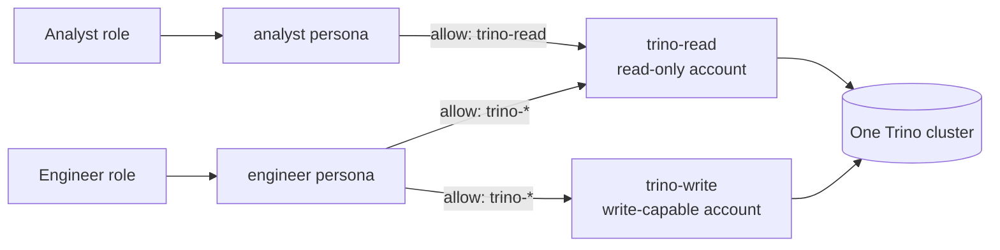

# Authorization: the connection is the boundary

The unit of access in mcp-data-platform is the **connection**, not the end user. An operator configures one connection per credential and permission level, and grants each persona the subset of connections it may reach. A caller's identity selects a persona; the persona selects connections; the connection carries the credential that talks to the downstream system.

This is a design choice, and this page states what it buys, what it costs, and where its edges are.

---

## The shape

A connection is a named, operator-authored binding to one downstream system under one credential: a Trino cluster as one service account, a DataHub instance with one token, an S3 account, an upstream MCP server, an HTTP API. Nothing stops several connections from pointing at the *same* system under *different* credentials, and that is the intended shape rather than a workaround.

Both connections front the same cluster. They differ in the Trino account they authenticate as, and therefore in what that account is permitted to do. The persona decides which of the two a caller reaches, so the permission level a caller gets is the permission level of the credential the operator bound to the connection they were granted.

The same split is how the HTTP API gateway separates read from write against a single upstream API, with `api_routes` narrowing further by method and path (`pkg/persona/filter.go`, `IsAPIRouteAllowed`).

## Why the connection and not the end user

Three reasons.

**The downstream systems are heterogeneous.** The platform federates Trino, DataHub, S3, arbitrary upstream MCP servers, and arbitrary REST APIs. Trino has session users and can be fronted by a system that enforces row policies; DataHub has its own actor model; a third-party MCP server and a vendor REST API typically have neither, and offer no token-exchange endpoint to impersonate a caller through. An identity model that only works for one of five backends is not an authorization model, it is a special case. The connection is the one construct every backend has: a credential and an endpoint.

**A credential the operator wrote is auditable ahead of time.** An operator can read a connection's service account in the downstream system, see exactly what it can reach, and reason about the blast radius before anyone calls a tool. Per-user passthrough moves that reasoning into whatever the identity provider asserted at request time, spread across every user.

**Permission levels are usually coarse in practice.** The distinctions organizations actually draw for AI agents (read the warehouse, read and write the sandbox, read the customer API, write the customer API) fit a handful of connections. Modeling them as connections keeps the grant explicit and greppable.

## What the boundary enforces

Deny-by-default on both axes, checked on the same call:

- **Connections are deny-by-default.** A persona reaches a connection only when a `connections.allow` glob matches its name. An omitted `connections` block or an empty `allow` grants **no** connections. Deny patterns win over allow (`pkg/persona/filter.go`, `IsConnectionAllowed`). A caller whose roles match no persona is denied everything by the built-in deny-all persona the role mapper returns (`pkg/persona/mapper.go`), and a nil persona is refused at both checks.
- **Both checks run on every tool call.** `Authorizer.IsAuthorized` refuses the call unless the tool pattern *and* the connection both pass (`pkg/persona/filter.go`).
- **Discovery is bound by the same predicate.** `search`, `fetch`, `list_connections`, and the portal search consult one shared scope that delegates to `IsConnectionAllowed` rather than reimplementing the glob rules, so a caller cannot find an entity behind a connection it was not granted (`internal/platform/connscope`); argument completion applies the same predicate directly. `search` and `list_connections` report a `withheld` count and a notice naming the persona rather than silently shortening their results. The scope is deliberately permissive in one direction: a catalog dataset whose URN maps to no configured connection is unattributable and stays visible (`pkg/knowledge/connscope.go`), and a deployment with no persona registry has no scope to apply, so discovery is unfiltered there.
- **API routes narrow within a connection.** For `kind=api` connections, `api_routes` constrains `(connection, method, path)`. When no rule matches the connection, the route check is a no-op and the connection-level grant is the sole gate.
- **The credential is the enforcement, and the toolkit adds what it can.** The S3 toolkit's `read_only` flag is per connection and withholds the mutating tools outright (`pkg/toolkits/s3/toolkit.go`). Trino's `read_only` installs a query interceptor that rejects write SQL (`pkg/toolkits/trino/readonly.go`), but it is toolkit-wide: several Trino instances are folded into one multi-connection toolkit whose options come from the default instance, so `read_only` set on a non-default Trino instance does not take effect for that connection alone (#1269). For a per-connection read/write split on one Trino cluster, the downstream service account is what enforces it.

Tools that belong to no connection (`platform_info`, `search`, and the other platform-level tools) carry an empty connection name, so the connection check admits them and the tool patterns are the gate. One caveat: the middleware takes the connection from a `connection` argument when the toolkit did not resolve one (`pkg/middleware/mcp.go`), so a caller that sends `connection` to a platform-level tool has it recorded and checked like any other.

## What the boundary does not enforce

A boundary is only useful when its far side is stated, so here is the far side.

**Every caller granted a connection acts as that connection's credential downstream.** The platform performs no per-user token exchange, no impersonation, and no session-user propagation; nothing in the tree swaps a caller's identity for a downstream one. (It does run outbound OAuth *per connection*, obtaining and refreshing that connection's own credential against upstream MCP servers and APIs (`pkg/connoauth/exchange.go`); the identity that flow yields belongs to the connection, not to the caller.) Two analysts granted `trino-read` are indistinguishable to Trino.

**Row-level policies and column masking that key off the end user do not follow a caller through the platform.** If a warehouse masks a column for one person and not another, and both reach it through one connection, both see whatever that connection's service account sees. Getting per-person masking means giving those people different connections, which means a downstream account per distinct policy outcome. That is workable when the distinctions are few and grows unpleasant when they are many.

**Per-user attribution comes from the audit trail, not from distinct downstream identities.** With audit enabled, each tool call writes a row carrying `user_id`, `user_email`, `persona`, `tool_name`, timing, the connection when the call targets one, and the call arguments subject to `redact_keys` (`pkg/audit/logger.go` for the schema, `pkg/middleware/mcp_audit.go` for the redaction and the write). The downstream system, looking only at its own logs, sees the connection's service account, so this row is where "who ran this" lives.

That makes the audit trail load-bearing, and it is not unconditional. Audit requires a database: a deployment with no `database.dsn`, or one that sets `audit.enabled: false`, gets a no-op logger and no rows at all (`pkg/platform/platform.go`), `log_tool_calls: false` keeps audit on but drops per-call rows, and `log_parameters: false` keeps the row without the arguments. Async delivery is also best-effort and drops under a sustained store outage (see [Delivery semantics](../server/audit.md#delivery-semantics)). A deployment that leans on connection-scoping for authorization should not also be running without audit.

## More connections, not more roles

The lever for tightening access is usually a new connection, not a new role. A role divides *people*; a connection divides *reach*. Adding a role to split two groups that both end up on the same connection changes nothing about what either group can do downstream.

Reach for another connection when:

- A group needs a different permission level in the same system (read versus write, one schema versus all of them). Bind the narrower downstream account to a second connection and grant it separately.
- A group needs a different blast radius. A connection is the unit a compromised credential is bounded by, so an agent-facing surface and an operator-facing one are better as two credentials than one.
- An API needs a subset of its endpoints exposed. Two connections to the same API, or one connection plus `api_routes`, both work; two connections are clearer when the credentials also differ.

Reach for another role when the same reach should carry different *tools*, different agent instructions, or different portal visibility.

## Compared with a warehouse-native MCP server

A server that lives inside one warehouse inherits that warehouse's per-user authorization: row policies, column masks, and grants apply to the calling person because the calling person is the session user. That is a genuine advantage inside that warehouse, and it is the right choice for a single-warehouse deployment that needs per-person data policy.

It does not extend past the warehouse. mcp-data-platform's premise is a caller reaching a warehouse, a catalog, object storage, third-party MCP servers, and REST APIs through one authenticated, audited, persona-governed endpoint, and the connection is the boundary that spans all of them uniformly. The trade is explicit: uniform enforcement and pre-auditable credentials across heterogeneous backends, in exchange for per-person downstream policy that has to be expressed as connections rather than inherited.

## Related

- [Personas Overview](../personas/overview.md) covers the configuration: patterns, deny-by-default semantics, and what discovery shows.
- [Threat Model](../security/threat-model.md) states the same boundary from the attacker's side.
- [Multi-Provider Configuration](../server/multi-provider.md) covers configuring several instances of one service.
