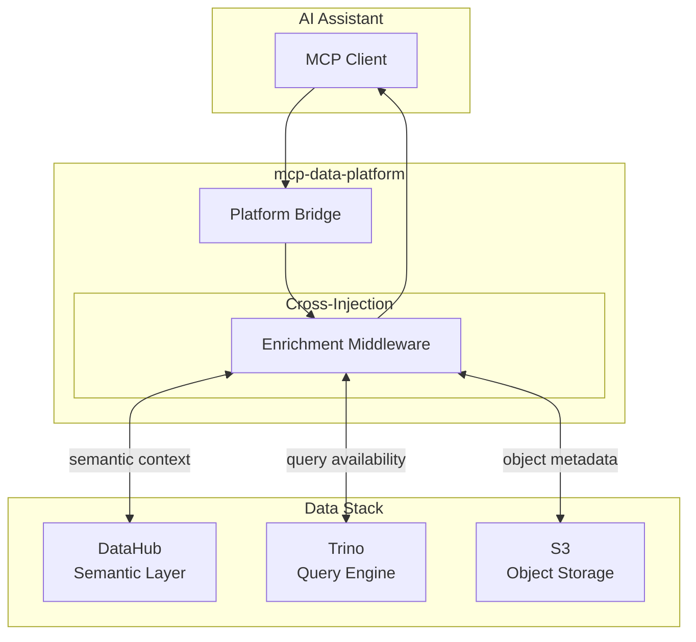

# The Data Stack: DataHub + Trino + S3

Modern data platforms need three things:

1. **Meaning** - What does the data represent?
2. **Access** - How do I query it?
3. **Storage** - Where does it live?

mcp-data-platform uses DataHub for meaning, Trino for access, and S3 for storage. Cross-injection wires them together so responses from one include context from the others.

---

## DataHub: The Semantic Layer

### What is DataHub?

[DataHub](https://datahubproject.io/) is an open source data catalog and metadata platform from LinkedIn. It stores business context: descriptions, owners, tags, glossary terms, lineage, and quality scores.

DataHub stores the business context that turns raw schemas into something people can understand.

### Why DataHub for Semantic Context?

**Problem it solves**: Data exists everywhere, but understanding what it means requires tribal knowledge.

- Column `cid` in one system is `customer_id` in another
- That deprecated table still gets queried because nobody knows it's deprecated
- PII columns aren't labeled, so compliance is a nightmare
- New team members spend weeks learning what data exists and what it means

**Why DataHub specifically**:

| Capability | Benefit |
|------------|---------|
| Active open source community | 10k+ GitHub stars, regular releases |
| Rich GraphQL and REST APIs | Programmatic access for automation |
| 50+ integrations | Trino, Snowflake, dbt, Airflow, Spark, and more |
| Real-time metadata ingestion | Changes propagate immediately |
| Full-text search | Find datasets by any metadata |
| Lineage tracking | Table and column level provenance |
| Data quality integration | Scores and assertions from external tools |

**For AI assistants**: Without DataHub, an AI sees columns and types. With DataHub, it sees what the data means, who owns it, and whether it's reliable.

---

## Trino: Universal SQL Access

### What is Trino?

[Trino](https://trino.io/) (formerly PrestoSQL, from Facebook) is a distributed SQL query engine. It runs SQL queries against data where it lives, without moving it first. It uses massively parallel processing for analytical workloads.

### Why Trino for Query Execution?

**Problem it solves**: Data is scattered across dozens of systems. Each has its own query language, connection method, and quirks.

**Trino connects to everything**:

- **Relational databases**: PostgreSQL, MySQL, Oracle, SQL Server
- **Data warehouses**: Snowflake, BigQuery, Redshift
- **NoSQL**: Elasticsearch, MongoDB, Cassandra, Redis
- **Data lakes**: S3, HDFS, Delta Lake, Iceberg, Hudi
- **And more**: Kafka, Google Sheets, Prometheus

**One SQL dialect, every data source**:

```sql
-- Query across PostgreSQL, Elasticsearch, and S3 in one statement
SELECT
    p.customer_name,
    e.search_score,
    s.purchase_history
FROM postgresql.sales.customers p
JOIN elasticsearch.logs.searches e ON p.id = e.customer_id
JOIN hive.datalake.purchases s ON p.id = s.customer_id
```

**Why Trino specifically**:

| Capability | Benefit |
|------------|---------|
| Battle-tested at scale | Meta, Netflix, Uber, LinkedIn |
| Active community | Enterprise support via Starburst |
| Optimized for OLAP | Analytical queries, not OLTP |
| Cost-based optimizer | Efficient query plans |
| Standard ANSI SQL | No proprietary syntax |
| Federated queries | No data movement required |

**For AI assistants**: Trino gives AI one tool to query everything. The AI doesn't need to know whether data is in PostgreSQL, Elasticsearch, or a data lake. It's all SQL.

---

## S3: The Universal Data Lake

### What is S3?

Amazon S3 (or any S3-compatible service like MinIO) is object storage. It stores files, images, JSON, Parquet, CSV, logs, and ML models. Most data lakes are built on S3 or something compatible with its API.

### Why S3 for Data Platform Access?

**Problem it solves**: Not all data is structured. Not all data is in databases. Data platforms must handle:

- **Structured data**: Tables, rows, columns (covered by Trino)
- **Semi-structured data**: JSON, XML, Avro, Parquet files
- **Unstructured data**: PDFs, images, documents, logs

**S3 as the data lake foundation**:

| Capability | Benefit |
|------------|---------|
| Infinite scale | Petabytes at low cost |
| Any file format | Parquet, ORC, JSON, CSV, images |
| Direct querying | Trino reads S3 via Hive, Iceberg, Delta |
| Object versioning | Track changes over time |
| S3-compatible | AWS, MinIO, Ceph, DigitalOcean Spaces |

**For AI assistants**: S3 tools let AI find files, confirm they exist, read contents, and understand what's in the data lake. Combined with DataHub, the AI knows the business context of those files.

---

## How They Work Together

### What each component lacks

| Component | Answers | Limitation Alone |
|-----------|---------|------------------|
| **DataHub** | "What does this mean?" | Can't query the data |
| **Trino** | "What's in this table?" | Doesn't know business context |
| **S3** | "What files exist?" | Just storage, no meaning |

### Cross-injection fills the gaps

**Trino + DataHub Cross-Injection**:

- Query a table → Get schema + owners + tags + deprecation + quality
- No extra calls. One request. Complete context.

**DataHub + Trino Cross-Injection**:

- Search DataHub → See which datasets are queryable
- Get sample SQL for any discovered dataset
- Know the row count and freshness

**S3 + DataHub Cross-Injection**:

- List objects → Get matching DataHub metadata
- Know who owns those files and what they represent

### Use Case: Complete Data Discovery

```
User: "Find customer data I can analyze"

Without mcp-data-platform:
1. Search DataHub → find datasets
2. For each dataset, check if it's queryable
3. For each queryable one, find the Trino connection
4. Check S3 for raw data files
5. Cross-reference ownership and quality
→ Multiple tools, multiple calls, context assembly required

With mcp-data-platform:
1. Search DataHub → get everything in one response:
   - Matching datasets
   - Which are queryable (with sample SQL)
   - Quality scores and ownership
   - S3 locations for raw data
→ One call. Complete picture.
```

### Built for analytics

This stack is designed for **OLAP** (Online Analytical Processing):

- **S3**: Stores petabytes of historical data at low cost
- **Trino**: Runs analytical queries across that data
- **DataHub**: Adds business context to query results

Common use cases:

- Data discovery and exploration
- Business intelligence and reporting
- Data mining and pattern analysis
- ML feature engineering
- Compliance and data governance

---

## When to Use Each Component

| Scenario | Primary Component | Supporting Context |
|----------|-------------------|-------------------|
| "What customer tables exist?" | DataHub search | Trino availability |
| "Query last month's orders" | Trino query | DataHub enrichment |
| "Find raw clickstream files" | S3 list | DataHub metadata |
| "Who owns this dataset?" | DataHub | - |
| "Is this data reliable?" | DataHub quality | Trino row count |
| "Join data across systems" | Trino federation | DataHub context |

---

## Architecture: How They Connect



The platform acts as a bridge, intercepting requests and responses to inject context from complementary services. Your AI assistant sees a unified view without knowing the complexity underneath.

---

## Next Steps

<div class="grid cards" markdown>

-   :material-swap-horizontal: **See Cross-Injection in Action**

    ---

    Detailed examples of how Trino and DataHub enrich each other's responses.

    [:octicons-arrow-right-24: Cross-injection overview](../cross-injection/overview.md)

-   :material-server: **Deploy the Server**

    ---

    Configure the platform with your DataHub, Trino, and S3 instances.

    [:octicons-arrow-right-24: Server guide](../server/overview.md)

</div>
