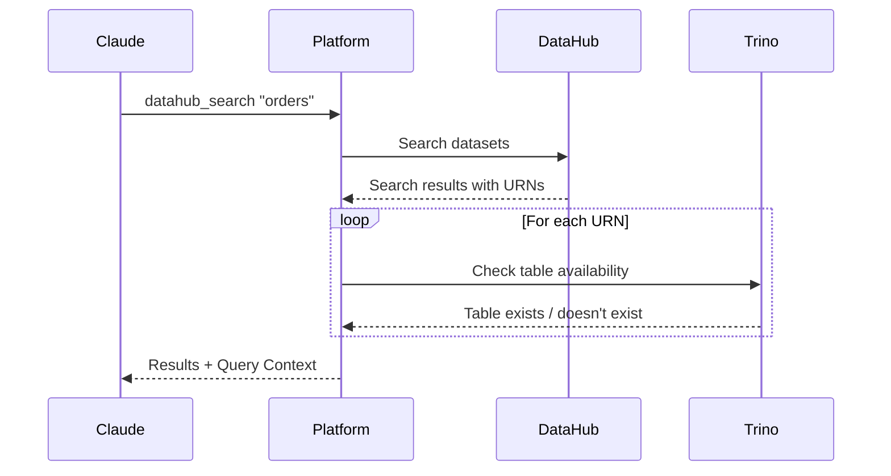

# DataHub to Trino Enrichment

When `datahub_query_enrichment` is enabled, DataHub search results and entity details include information about whether each dataset can be queried via Trino.

## What Gets Enriched

| Tool | Enrichment |
|------|------------|
| `datahub_search` | Each result shows query availability |
| `datahub_get_entity` | Entity includes Trino table mapping |
| `datahub_get_schema` | Schema includes queryable status |

## Enriched Data

For each dataset found, the platform checks:

- **Queryable** - Whether this dataset maps to a Trino table
- **Connection** - Which Trino connection to use
- **Table Identifier** - Catalog, schema, and table name
- **Sample Query** - Ready-to-use SQL to query this data

## Example: Search Results

**Request:**
```
Find datasets related to customer orders
```

**Tool call:** `datahub_search` with query `customer orders`

**Response without enrichment:**
```json
{
  "results": [
    {
      "urn": "urn:li:dataset:(urn:li:dataPlatform:trino,hive.sales.orders,PROD)",
      "name": "orders",
      "description": "Customer orders",
      "platform": "trino"
    },
    {
      "urn": "urn:li:dataset:(urn:li:dataPlatform:s3,data-lake/orders,PROD)",
      "name": "orders",
      "description": "Raw order events",
      "platform": "s3"
    }
  ]
}
```

**Response with enrichment:**
```json
{
  "results": [
    {
      "urn": "urn:li:dataset:(urn:li:dataPlatform:trino,hive.sales.orders,PROD)",
      "name": "orders",
      "description": "Customer orders",
      "platform": "trino"
    },
    {
      "urn": "urn:li:dataset:(urn:li:dataPlatform:s3,data-lake/orders,PROD)",
      "name": "orders",
      "description": "Raw order events",
      "platform": "s3"
    }
  ],
  "query_context": {
    "urn:li:dataset:(urn:li:dataPlatform:trino,hive.sales.orders,PROD)": {
      "queryable": true,
      "connection": "production",
      "table_identifier": {
        "catalog": "hive",
        "schema": "sales",
        "table": "orders"
      },
      "sample_query": "SELECT * FROM hive.sales.orders LIMIT 10",
      "row_count": 1500000
    },
    "urn:li:dataset:(urn:li:dataPlatform:s3,data-lake/orders,PROD)": {
      "queryable": false,
      "reason": "S3 dataset not mapped to Trino external table"
    }
  }
}
```

## How It Works



## Table Resolution

The platform attempts to map DataHub URNs to Trino tables:

| DataHub Platform | Resolution Strategy |
|------------------|---------------------|
| `trino` | Direct mapping from URN |
| `hive` | Maps to Trino Hive connector |
| `iceberg` | Maps to Trino Iceberg connector |
| `delta` | Maps to Trino Delta connector |
| `s3` | Checks for external table mapping |

For non-Trino platforms, the platform checks if an external table exists in Trino that points to the same data.

## Configuration

Enable DataHub query enrichment:

```yaml
injection:
  datahub_query_enrichment: true

query:
  provider: trino
  instance: production    # Which Trino instance for availability checks
```

## Sample Query Generation

When a dataset is queryable, the enrichment includes a sample query:

```sql
SELECT * FROM hive.sales.orders LIMIT 10
```

This query is safe to execute directly with `trino_query`.

## Row Count Estimates

When available, the enrichment includes row count from Trino statistics:

```json
{
  "queryable": true,
  "row_count": 1500000,
  "row_count_note": "Approximate, from table statistics"
}
```

This helps you understand data volume before querying.

## Handling Non-Queryable Datasets

If a dataset cannot be queried via Trino, the enrichment explains why:

```json
{
  "queryable": false,
  "reason": "Dataset is on Snowflake platform, not accessible via Trino"
}
```

Common reasons:

- Platform not connected to Trino
- External table not configured
- Access permissions insufficient
- Table has been dropped

## Performance

Each search result triggers a Trino metadata lookup. The platform:

- Batches URN lookups when possible
- Uses Trino's `SHOW TABLES` and `DESCRIBE` which are fast
- Caches results based on semantic cache settings

For large search results (20+ items), expect ~200-500ms additional latency.

## Practical Use

The query context enables workflows like:

1. **Search** for relevant datasets in DataHub
2. **See** which ones are immediately queryable
3. **Use** the sample query to start exploring

Without leaving the conversation:

```
User: Find customer-related datasets

Claude: [Uses datahub_search, sees query_context]
I found 5 datasets. 3 are directly queryable:
- hive.sales.customers (1.2M rows)
- hive.sales.orders (5M rows)
- hive.marketing.segments (50K rows)

Would you like me to query any of these?
```

## Troubleshooting

**Datasets showing as not queryable when they should be:**

1. Verify the Trino table exists with the expected name
2. Check that the query provider is configured correctly
3. Ensure the Trino user has permission to see the table

**Missing row counts:**

- Row counts require Trino table statistics
- Run `ANALYZE table_name` in Trino to collect statistics

## Next Steps

- [S3 Enrichment](s3.md) - Storage context enrichment
- [Trino → DataHub](trino-datahub.md) - The reverse direction
