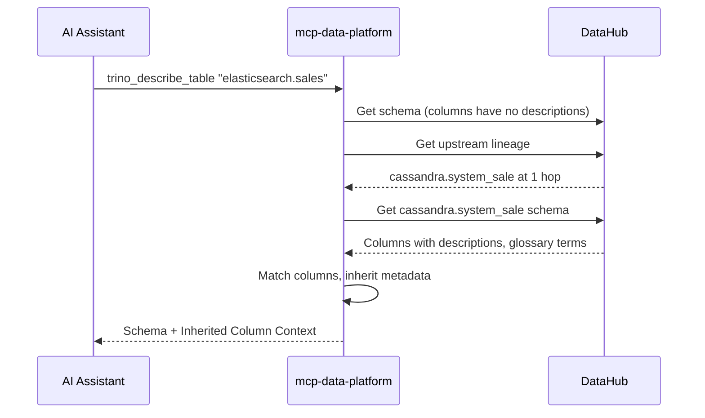

# Lineage-Aware Column Inheritance

Downstream datasets often lack documentation even when their upstream sources are well-documented. The platform automatically inherits column metadata from upstream tables via DataHub lineage.

## The Problem

Consider an Elasticsearch index `jakes-sale-2025` that stores sales data from Cassandra. The Cassandra table `system_sale` has detailed documentation:

- Column descriptions explaining business meaning
- Glossary terms linking to business definitions
- Tags indicating PII or sensitivity

But the Elasticsearch index has none of this. The data flows through a pipeline, landing in Elasticsearch with nested JSON paths like `rxtxmsg.payload.initial_net`. Without lineage inheritance, users must manually trace back to Cassandra to understand what these fields mean.

## The Solution

When you describe a table with undocumented columns:

1. Platform fetches the schema from DataHub
2. Identifies columns missing descriptions, glossary terms, or tags
3. Queries DataHub for upstream lineage
4. Fetches schemas from upstream datasets
5. Matches columns and inherits metadata
6. Returns enriched response with provenance tracking



## Configuration

```yaml
semantic:
  provider: datahub
  instance: primary

  lineage:
    enabled: true
    max_hops: 2
    inherit:
      - glossary_terms
      - descriptions
      - tags
    conflict_resolution: nearest
    prefer_column_lineage: true

    column_transforms:
      - strip_prefix: "rxtxmsg.payload."
      - strip_prefix: "rxtxmsg.header."

    aliases:
      - source: "cassandra.prod_fuse.system_sale"
        targets:
          - "elasticsearch.default.jakes-sale-*"
```

### Configuration Options

| Option | Type | Default | Description |
|--------|------|---------|-------------|
| `enabled` | bool | `false` | Enable lineage-aware inheritance |
| `max_hops` | int | `2` | Maximum upstream traversal depth (1-5) |
| `inherit` | list | `[glossary_terms, descriptions]` | Metadata types to inherit |
| `conflict_resolution` | string | `nearest` | How to resolve conflicts from multiple upstreams |
| `prefer_column_lineage` | bool | `true` | Use column-level lineage when available |
| `column_transforms` | list | `[]` | Path normalization rules |
| `aliases` | list | `[]` | Explicit source-target mappings |
| `cache_ttl` | duration | `10m` | Cache TTL for lineage graphs |
| `timeout` | duration | `5s` | Timeout for inheritance operation |

### Conflict Resolution

When multiple upstream datasets define metadata for the same column:

| Strategy | Behavior |
|----------|----------|
| `nearest` | Closest upstream (fewest hops) wins |
| `all` | Merge metadata from all upstreams |
| `skip` | Don't inherit when conflicts exist |

## Column Matching

### Match Methods

| Method | When Used | Example |
|--------|-----------|---------|
| `column_lineage` | DataHub has column-level lineage edges | Precise ETL tracking |
| `name_exact` | Column names match exactly | `user_id` → `user_id` |
| `name_transformed` | Names match after transforms | `rxtxmsg.payload.amount` → `amount` |
| `alias` | Explicit alias configuration | Bypass lineage lookup |

### Column Transforms

For nested JSON paths, configure prefix/suffix stripping:

```yaml
column_transforms:
  # Elasticsearch nested payloads
  - strip_prefix: "rxtxmsg.payload."

  # Header fields
  - strip_prefix: "rxtxmsg.header."

  # Versioned columns
  - strip_suffix: "_v2"
```

With `strip_prefix: "rxtxmsg.payload."`:

- Target: `rxtxmsg.payload.initial_net`
- Transforms to: `initial_net`
- Matches upstream: `initial_net`

### Aliases

When lineage isn't tracked in DataHub, use explicit aliases:

```yaml
aliases:
  - source: "cassandra.prod_fuse.system_sale"
    targets:
      - "elasticsearch.default.jakes-sale-*"
      - "elasticsearch.default.pos-sale-*"
    column_mapping:
      "rxtxmsg.payload.initial_net": "initial_net"
      "rxtxmsg.payload.loyalty_customer_id": "loyalty_customer_id"
```

Aliases:

- Support glob patterns in `targets`
- Bypass lineage lookup entirely
- Allow explicit column name mappings

## Response Format

When lineage inheritance is active:

```json
{
  "columns": [
    {"name": "rxtxmsg.payload.initial_net", "type": "DOUBLE"},
    {"name": "rxtxmsg.payload.initial_total", "type": "DOUBLE"}
  ],
  "semantic_context": {
    "description": "Elasticsearch index for sales data",
    "urn": "urn:li:dataset:(urn:li:dataPlatform:trino,elasticsearch.default.jakes-sale-2025,PROD)"
  },
  "column_context": {
    "rxtxmsg.payload.initial_net": {
      "description": "Net sale amount before adjustments",
      "glossary_terms": [
        {"urn": "urn:li:glossaryTerm:NetSaleAmount", "name": "Net Sale Amount"}
      ],
      "tags": ["financial"],
      "is_pii": false,
      "is_sensitive": false,
      "inherited_from": {
        "source_dataset": "urn:li:dataset:(urn:li:dataPlatform:cassandra,prod_fuse.system_sale,PROD)",
        "source_column": "initial_net",
        "hops": 1,
        "match_method": "name_transformed"
      }
    },
    "rxtxmsg.payload.initial_total": {
      "description": "Total sale amount including tax",
      "glossary_terms": [
        {"urn": "urn:li:glossaryTerm:TotalSaleAmount", "name": "Total Sale Amount"}
      ],
      "inherited_from": {
        "source_dataset": "urn:li:dataset:(urn:li:dataPlatform:cassandra,prod_fuse.system_sale,PROD)",
        "source_column": "initial_total",
        "hops": 1,
        "match_method": "name_transformed"
      }
    }
  },
  "inheritance_sources": [
    "urn:li:dataset:(urn:li:dataPlatform:cassandra,prod_fuse.system_sale,PROD)"
  ]
}
```

### Provenance Fields

| Field | Description |
|-------|-------------|
| `source_dataset` | URN of the upstream dataset |
| `source_column` | Column name in the upstream dataset |
| `hops` | Distance from target (1 = direct upstream) |
| `match_method` | How the column was matched |

### Inheritance Sources

The `inheritance_sources` array lists all upstream datasets that contributed metadata. Useful for:

- Auditing where documentation came from
- Understanding data lineage at a glance
- Debugging inheritance behavior

## Use Cases

### Elasticsearch Indexes

JSON documents from Cassandra have nested paths:

```yaml
column_transforms:
  - strip_prefix: "rxtxmsg.payload."
  - strip_prefix: "rxtxmsg.header."
```

### Kafka Topics

Event streams derived from source tables. When column-level lineage is available in DataHub, precise mapping happens automatically.

### Data Lakes

Parquet files derived from operational databases:

```yaml
aliases:
  - source: "postgres.analytics.user_events"
    targets:
      - "s3.datalake.user-events-*"
```

### Multi-Hop Lineage

Data flows through multiple transformations:

```
postgres.users → kafka.user-events → elasticsearch.user-search
```

With `max_hops: 2`, metadata can flow from `postgres.users` to `elasticsearch.user-search` even though there's an intermediate dataset.
