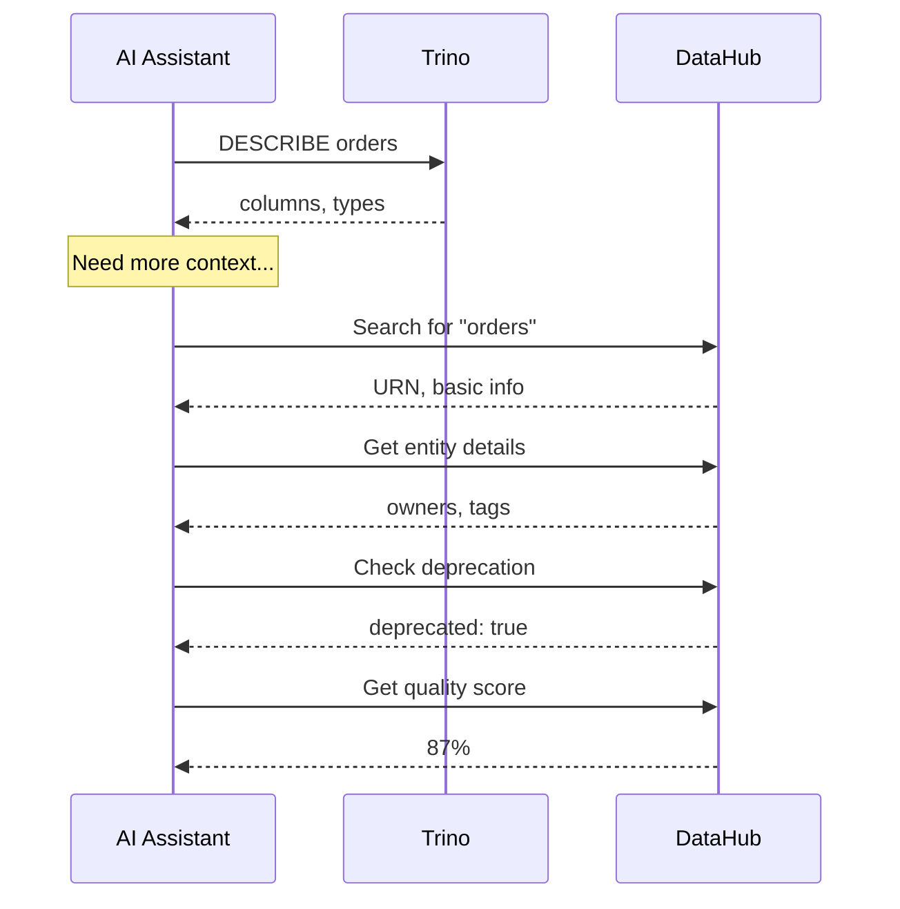
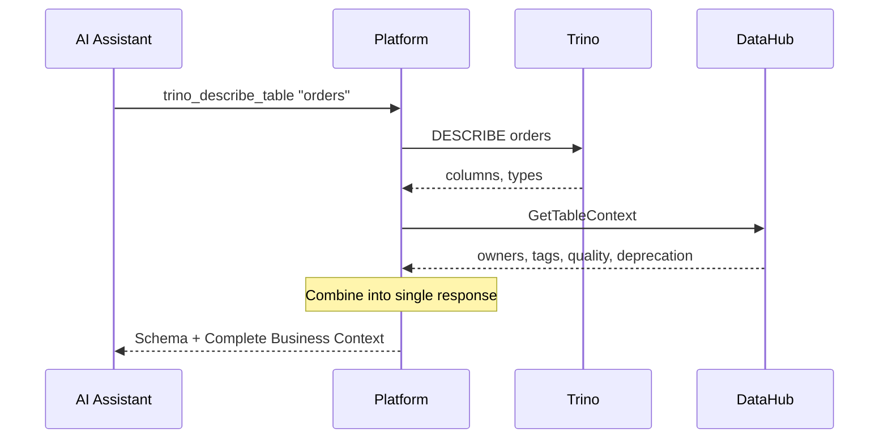
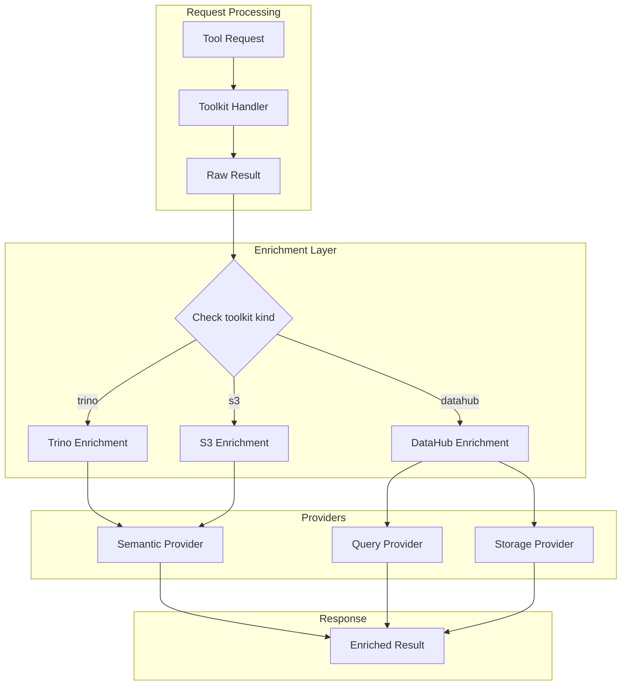
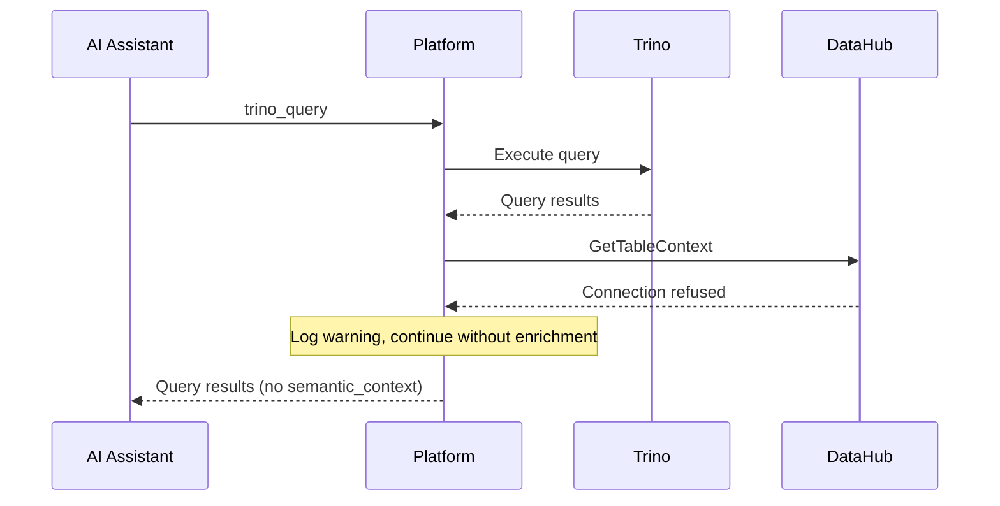

# Cross-Injection

Cross-injection is the key differentiator of mcp-data-platform. It automatically enriches tool responses with context from other services—without additional calls from the AI assistant.

---

## The Problem It Solves

Without cross-injection, understanding a single table requires multiple round-trips:



**Five API calls** to understand one table. Each call adds latency and requires the AI to remember to ask.

---

## With Cross-Injection

The same workflow becomes a single call:



**One call.** Complete context. Warnings front and center.

---

## How It Works

The enrichment middleware intercepts tool responses and adds relevant context:



### Enrichment Flow by Toolkit

| Toolkit | Provider Used | Context Added |
|---------|---------------|---------------|
| **Trino** | Semantic (DataHub) | Owners, tags, quality, deprecation, glossary terms |
| **DataHub** | Query (Trino) + Storage (S3) | Query availability, sample SQL, storage availability |
| **S3** | Semantic (DataHub) | Matching dataset metadata from DataHub |

---

## What Gets Injected

### Semantic Context (Trino → DataHub)

When you query or describe a Trino table, the response includes:

```json
{
  "columns": [
    {"name": "order_id", "type": "BIGINT"},
    {"name": "customer_id", "type": "BIGINT"},
    {"name": "total_amount", "type": "DECIMAL(10,2)"},
    {"name": "created_at", "type": "TIMESTAMP"}
  ],
  "semantic_context": {
    "urn": "urn:li:dataset:(urn:li:dataPlatform:trino,hive.sales.orders,PROD)",
    "description": "Customer orders with line items and payment information",
    "owners": [
      {
        "name": "Data Platform Team",
        "type": "group",
        "email": "data-platform@example.com"
      },
      {
        "name": "Jane Smith",
        "type": "user",
        "email": "jane.smith@example.com"
      }
    ],
    "tags": ["pii", "financial", "tier-1"],
    "domain": {
      "name": "Sales",
      "urn": "urn:li:domain:sales"
    },
    "glossary_terms": [
      {
        "name": "Order",
        "urn": "urn:li:glossaryTerm:order"
      }
    ],
    "quality_score": 0.92,
    "deprecation": null,
    "columns": {
      "order_id": {
        "description": "Unique order identifier",
        "tags": [],
        "glossary_term": null
      },
      "customer_id": {
        "description": "Reference to customer record",
        "tags": ["pii"],
        "glossary_term": "customer-id"
      },
      "total_amount": {
        "description": "Order total including tax",
        "tags": ["financial"],
        "glossary_term": "order-total"
      }
    },
    "custom_properties": {
      "data_retention_days": "365",
      "pii_classification": "internal"
    }
  }
}
```

### Deprecation Warning

If a table is deprecated, it appears prominently:

```json
{
  "semantic_context": {
    "description": "Legacy customer orders - DO NOT USE",
    "deprecation": {
      "deprecated": true,
      "decommission_time": "2024-06-01T00:00:00Z",
      "note": "Migrated to orders_v2 with improved schema",
      "replacement": {
        "urn": "urn:li:dataset:(urn:li:dataPlatform:trino,hive.sales.orders_v2,PROD)",
        "name": "orders_v2"
      }
    },
    "quality_score": 0.45
  }
}
```

### Query Context (DataHub → Trino)

When you search DataHub, the response shows which datasets can be queried:

```json
{
  "results": [
    {
      "urn": "urn:li:dataset:(urn:li:dataPlatform:trino,hive.sales.orders,PROD)",
      "name": "orders",
      "platform": "trino",
      "description": "Customer orders"
    }
  ],
  "query_context": {
    "urn:li:dataset:(urn:li:dataPlatform:trino,hive.sales.orders,PROD)": {
      "queryable": true,
      "connection": "production",
      "table_identifier": {
        "catalog": "hive",
        "schema": "sales",
        "table": "orders"
      },
      "sample_query": "SELECT * FROM hive.sales.orders LIMIT 10",
      "row_count": 1500000,
      "last_modified": "2024-01-15T10:30:00Z"
    }
  }
}
```

### Non-Queryable Datasets

Not all DataHub datasets have query capability:

```json
{
  "query_context": {
    "urn:li:dataset:(urn:li:dataPlatform:snowflake,prod.analytics.customers,PROD)": {
      "queryable": false,
      "reason": "No Trino connection configured for Snowflake"
    }
  }
}
```

### Storage Context (DataHub → S3)

When searching for S3 datasets, show storage availability:

```json
{
  "results": [
    {
      "urn": "urn:li:dataset:(urn:li:dataPlatform:s3,data-lake-prod/sales/orders/,PROD)",
      "name": "orders",
      "platform": "s3"
    }
  ],
  "storage_context": {
    "urn:li:dataset:(urn:li:dataPlatform:s3,data-lake-prod/sales/orders/,PROD)": {
      "available": true,
      "connection": "data_lake",
      "bucket": "data-lake-prod",
      "prefix": "sales/orders/",
      "format": "parquet",
      "size_bytes": 1073741824,
      "last_modified": "2024-01-15T06:00:00Z",
      "partition_keys": ["year", "month"]
    }
  }
}
```

### S3 → DataHub Context

When listing S3 objects, show matching DataHub metadata:

```json
{
  "objects": [
    {
      "key": "sales/orders/year=2024/month=01/data.parquet",
      "size": 1048576,
      "last_modified": "2024-01-15T06:00:00Z"
    }
  ],
  "semantic_context": {
    "s3://data-lake-prod/sales/orders/": {
      "urn": "urn:li:dataset:(urn:li:dataPlatform:s3,data-lake-prod/sales/orders/,PROD)",
      "description": "Customer orders in Parquet format",
      "owners": [
        {"name": "Data Engineering", "type": "group"}
      ],
      "tags": ["pii", "partitioned"],
      "quality_score": 0.95
    }
  }
}
```

---

## Configuration

Enable cross-injection in your configuration:

```yaml
# Enable/disable specific enrichment paths
injection:
  trino_semantic_enrichment: true   # Trino results get DataHub context
  datahub_query_enrichment: true    # DataHub results show Trino availability
  datahub_storage_enrichment: true  # DataHub results show S3 availability
  s3_semantic_enrichment: true      # S3 results get DataHub context

# Configure the semantic provider (for Trino/S3 enrichment)
semantic:
  provider: datahub
  instance: primary  # Must match a configured DataHub toolkit

  # Caching improves enrichment performance
  cache:
    enabled: true
    ttl: 5m
    max_entries: 10000

# Configure the query provider (for DataHub enrichment)
query:
  provider: trino
  instance: primary  # Must match a configured Trino toolkit

# Configure the storage provider (for DataHub enrichment)
storage:
  provider: s3
  instance: data_lake  # Must match a configured S3 toolkit
```

### Minimal Configuration

If you only have DataHub:

```yaml
injection:
  trino_semantic_enrichment: false
  datahub_query_enrichment: false
  s3_semantic_enrichment: false

# Only DataHub toolkit, no cross-injection
toolkits:
  datahub:
    primary:
      url: https://datahub.example.com
      token: ${DATAHUB_TOKEN}
```

### Full Cross-Injection

Complete configuration with all services:

```yaml
injection:
  trino_semantic_enrichment: true
  datahub_query_enrichment: true
  datahub_storage_enrichment: true
  s3_semantic_enrichment: true

semantic:
  provider: datahub
  instance: primary
  cache:
    enabled: true
    ttl: 5m

query:
  provider: trino
  instance: production

storage:
  provider: s3
  instance: data_lake

toolkits:
  datahub:
    primary:
      url: https://datahub.example.com
      token: ${DATAHUB_TOKEN}

  trino:
    production:
      host: trino.example.com
      port: 443
      ssl: true
      catalog: hive

  s3:
    data_lake:
      region: us-east-1
      access_key_id: ${AWS_ACCESS_KEY_ID}
      secret_access_key: ${AWS_SECRET_ACCESS_KEY}
```

---

## Failure Handling

Enrichment is designed to fail gracefully:

### DataHub Unavailable



The query succeeds—you just don't get the enrichment.

### Entity Not Found

If a table exists in Trino but not in DataHub:

```json
{
  "columns": [...],
  "semantic_context": null,
  "_enrichment_note": "Entity not found in DataHub"
}
```

### Partial Enrichment

Some fields may be missing if not configured in DataHub:

```json
{
  "semantic_context": {
    "description": "Orders table",
    "owners": [],
    "tags": [],
    "quality_score": null,
    "deprecation": null
  }
}
```

---

## Performance Considerations

### Latency Impact

Enrichment adds 50-200ms per request depending on:

- DataHub API response time
- Network latency
- Cache hit rate

### Caching Strategy

```yaml
semantic:
  cache:
    enabled: true
    ttl: 5m           # How long to cache entries
    max_entries: 10000 # Maximum cache size
```

**Recommended settings by use case:**

| Use Case | TTL | Max Entries |
|----------|-----|-------------|
| Development | 1m | 1000 |
| Production | 5m | 10000 |
| High-traffic | 15m | 50000 |
| Real-time requirements | 30s | 5000 |

### Cache Invalidation

The cache is time-based. For immediate updates:

1. Reduce TTL
2. Restart the server (clears cache)
3. Use the API to clear specific entries (if implemented)

---

## Advanced Patterns

### Multi-Cluster Enrichment

When you have multiple Trino clusters:

```yaml
toolkits:
  trino:
    production:
      host: trino-prod.example.com
    analytics:
      host: trino-analytics.example.com

query:
  provider: trino
  # Map DataHub URNs to specific clusters
  mappings:
    "urn:li:dataset:(urn:li:dataPlatform:trino,hive.*,PROD)": production
    "urn:li:dataset:(urn:li:dataPlatform:trino,analytics.*,PROD)": analytics
```

### Custom Enrichment Fields

Extend enrichment with custom DataHub properties:

```yaml
semantic:
  custom_properties:
    - data_owner_team
    - pii_classification
    - retention_policy
```

These appear in the response:

```json
{
  "semantic_context": {
    "custom_properties": {
      "data_owner_team": "platform",
      "pii_classification": "internal",
      "retention_policy": "365d"
    }
  }
}
```

---

## Debugging Enrichment

### Enable Debug Logging

```bash
export LOG_LEVEL=debug
mcp-data-platform --config platform.yaml
```

Look for:

```
DEBUG enrichment: fetching semantic context table=orders
DEBUG enrichment: cache miss key=trino:hive.sales.orders
DEBUG enrichment: DataHub response status=200 duration=145ms
DEBUG enrichment: added semantic_context to result
```

### Check Provider Connectivity

```bash
# Test DataHub
curl -H "Authorization: Bearer $DATAHUB_TOKEN" \
  "https://datahub.example.com/openapi/v2/entity/dataset"

# Test Trino
curl "https://trino.example.com:443/v1/info"
```

### Verify URN Matching

DataHub URNs must be constructed correctly:

```
urn:li:dataset:(urn:li:dataPlatform:trino,<catalog>.<schema>.<table>,PROD)
```

Verify your table exists in DataHub:

```bash
curl -H "Authorization: Bearer $DATAHUB_TOKEN" \
  "https://datahub.example.com/openapi/v2/search?query=your_table&entity=dataset"
```

---

## Next Steps

- [Trino → DataHub Enrichment](trino-datahub.md) - Deep dive into Trino enrichment
- [DataHub → Trino Enrichment](datahub-trino.md) - Deep dive into DataHub enrichment
- [S3 Enrichment](s3.md) - S3-specific patterns
- [Examples Gallery](../examples/index.md) - Real-world configurations
