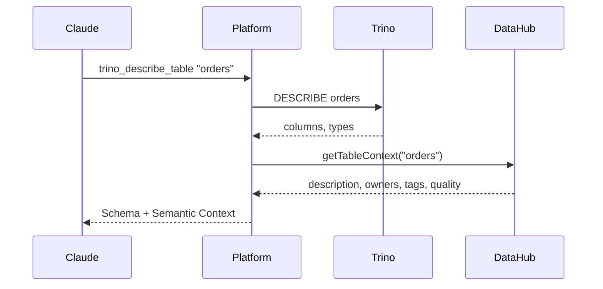

# Cross-Injection

When you query a Trino table, you get DataHub context in the response. When you search DataHub, you see which datasets are queryable. No extra calls.

## The Problem It Solves

Without cross-injection:

1. Query a table
2. Search DataHub for that table
3. Get entity details for owners and tags
4. Check deprecation status
5. Look up quality score

Five calls to understand one table. With cross-injection, step 1 gives you everything.

## How It Works



The enrichment middleware intercepts tool responses and adds relevant context before returning to the client.

## What Gets Injected

| When you use | You also get |
|--------------|--------------|
| Trino | DataHub metadata (owners, tags, quality, deprecation) |
| DataHub search | Which datasets are queryable in Trino |
| S3 | DataHub metadata for matching datasets |

## Configuration

```yaml
injection:
  trino_semantic_enrichment: true   # Trino results get DataHub context
  datahub_query_enrichment: true    # DataHub results show Trino availability
  s3_semantic_enrichment: true      # S3 results get DataHub context

semantic:
  provider: datahub
  instance: primary

query:
  provider: trino
  instance: primary
```

## Enrichment Details

### Semantic Context (added to Trino/S3 results)

```json
{
  "semantic_context": {
    "description": "Customer orders with line items and payment info",
    "owners": [
      {"name": "Data Team", "type": "group"}
    ],
    "tags": ["pii", "financial"],
    "domain": {"name": "Sales", "urn": "urn:li:domain:sales"},
    "quality_score": 0.92,
    "deprecation": {
      "deprecated": true,
      "note": "Use orders_v2 instead",
      "replacement": "urn:li:dataset:orders_v2"
    }
  }
}
```

### Query Context (added to DataHub results)

```json
{
  "query_context": {
    "urn:li:dataset:orders": {
      "queryable": true,
      "connection": "production",
      "table_identifier": {
        "catalog": "hive",
        "schema": "sales",
        "table": "orders"
      },
      "sample_query": "SELECT * FROM hive.sales.orders LIMIT 10"
    }
  }
}
```

### Storage Context (added to DataHub results)

```json
{
  "storage_context": {
    "urn:li:dataset:s3_orders": {
      "available": true,
      "connection": "data_lake",
      "bucket": "data-lake-prod",
      "prefix": "sales/orders/",
      "format": "parquet"
    }
  }
}
```

## Failures Don't Break Queries

If DataHub is down or a lookup fails, you get the original result without enrichment. No errors, no blocked queries.

## Performance

Enrichment adds 50-200ms per request. Cache it:

```yaml
semantic:
  cache:
    enabled: true
    ttl: 5m
```

## Next Steps

- [Trino → DataHub](trino-datahub.md)
- [DataHub → Trino](datahub-trino.md)
- [S3 Enrichment](s3.md)
