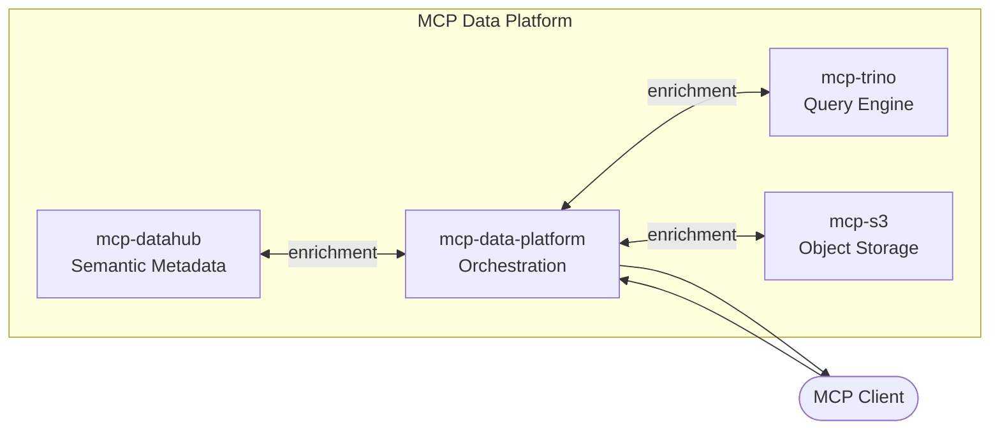

---
hide:
  - navigation
  - title
---

# MCP Data Platform Ecosystem

mcp-data-platform is the orchestration layer for a broader suite of open-source MCP servers designed to work together as a composable data platform. Each component can run standalone or be combined through mcp-data-platform for unified access with cross-injection, authentication, and personas.

---

## [mcp-datahub](https://github.com/txn2/mcp-datahub/)

An MCP server for [DataHub](https://datahubproject.io/), the metadata catalog. mcp-datahub gives AI assistants access to dataset search, schema exploration, lineage graphs, glossary terms, domains, tags, and ownership information. In the platform, DataHub serves as the semantic layer: every query result is enriched with business context from DataHub before being returned to the AI assistant. When running standalone, mcp-datahub provides full catalog access without requiring Trino or S3.

[:octicons-arrow-right-24: mcp-datahub documentation](https://mcp-datahub.txn2.com/)

---

## [mcp-s3](https://github.com/txn2/mcp-s3/)

An MCP server for [Amazon S3](https://aws.amazon.com/s3/), providing AI assistants with direct access to object storage. mcp-s3 lets assistants list buckets, browse prefixes, read objects, and generate presigned URLs for temporary access. When paired with mcp-datahub and mcp-trino through the platform, it provides the raw file access layer: assistants can discover datasets through the catalog, query structured data through Trino, and retrieve or inspect the underlying files in S3. It supports multi-server configurations for accessing storage across accounts and regions.

[:octicons-arrow-right-24: mcp-s3 documentation](https://mcp-s3.txn2.com/)

---

## [mcp-trino](https://github.com/txn2/mcp-trino/)

An MCP server for [Trino](https://trino.io/), the distributed SQL query engine. mcp-trino enables AI assistants to run read-only SQL queries across any data source that Trino connects to, including data lakes, warehouses, and relational databases. Assistants can list catalogs and schemas, describe tables, explain query plans, and execute analytical queries with configurable timeouts and row limits. Combined with mcp-datahub for discovery and mcp-s3 for raw file access, mcp-trino completes the platform by providing the structured query interface that turns raw data into answers.

[:octicons-arrow-right-24: mcp-trino documentation](https://mcp-trino.txn2.com/)

---

## How They Fit Together

Each component is an independent MCP server with its own documentation, releases, and test suite. mcp-data-platform composes them into a single connection point with cross-injection (Trino results include DataHub metadata, DataHub searches show query availability), authentication, personas, audit logging, and knowledge capture.
