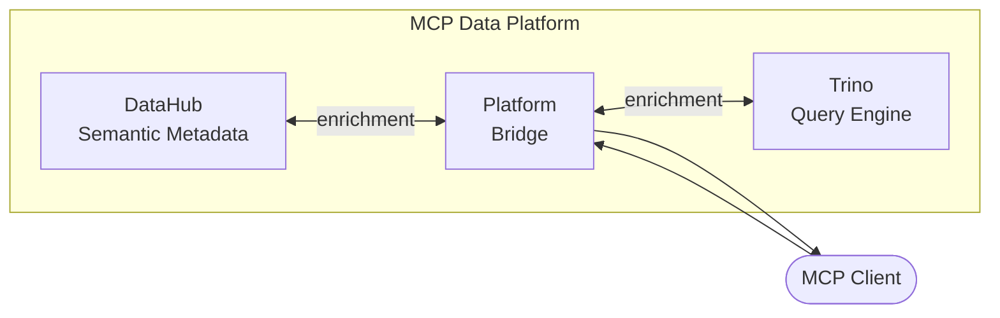

# mcp-data-platform

A semantic data platform MCP server that composes multiple data tools with **bidirectional cross-injection** - tool responses automatically include critical context from other services.

## Quick Start

### Installation

```bash
go install github.com/txn2/mcp-data-platform/cmd/mcp-data-platform@latest
```

### Claude Code CLI

```bash
claude mcp add mcp-data-platform -- mcp-data-platform
```

### Claude Desktop

Add to your `claude_desktop_config.json`:

```json
{
  "mcpServers": {
    "mcp-data-platform": {
      "command": "mcp-data-platform",
      "args": ["--config", "/path/to/platform.yaml"]
    }
  }
}
```

## Features

- **Semantic-First Data Access**: All data queries include business context from DataHub
- **Bidirectional Cross-Injection**: Trino results enriched with DataHub metadata, and vice versa
- **OAuth 2.1 Authentication**: OIDC, API keys, PKCE, Dynamic Client Registration
- **Role-Based Personas**: Tool filtering with wildcard patterns (allow/deny rules)
- **Comprehensive Audit Logging**: PostgreSQL-backed audit trail
- **Middleware Architecture**: Extensible request/response processing

## Architecture



## Next Steps

- [Installation Guide](getting-started/installation.md)
- [Configuration](getting-started/configuration.md)
- [Tools Reference](reference/tools.md)
