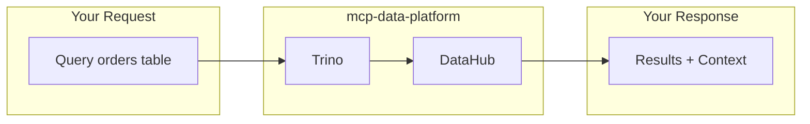

# mcp-data-platform

An MCP server for data exploration and analysis. Not an API wrapper—a platform for building AI-assisted data workflows with your semantic layer at the center.

**The only requirement is [DataHub](https://datahubproject.io/).** Trino and S3 are optional but recommended.

<div class="grid cards" markdown>

-   :material-semantic-web: **Semantic-First**

    ---

    DataHub is the foundation. Query a table, get its business context automatically—owners, tags, quality scores, deprecation warnings. No separate lookups.

-   :material-swap-horizontal: **Cross-Injection**

    ---

    Trino results include DataHub metadata. DataHub searches show which datasets are queryable. Context flows between services automatically.

-   :material-code-braces: **Built for Customization**

    ---

    Add custom toolkits, providers, and middleware. The Go library exposes everything. Build the data platform your organization needs.

-   :material-account-group: **Personas**

    ---

    Define who can use which tools. Analysts get read access. Admins get everything. Map from your identity provider's roles.

</div>

---

## Quick Start

=== "Local (stdio)"

    Run locally with your own credentials:

    ```bash
    # Install
    go install github.com/txn2/mcp-data-platform/cmd/mcp-data-platform@latest

    # Add to Claude Code
    claude mcp add mcp-data-platform -- mcp-data-platform --config platform.yaml
    ```

    No MCP authentication needed—uses your configured DataHub/Trino/S3 credentials.

=== "Remote (SSE)"

    Deploy as a shared service with Keycloak authentication:

    ```bash
    mcp-data-platform --config platform.yaml --transport sse --address :8443
    ```

    Users connect via Claude Desktop and authenticate through your identity provider.

=== "Docker"

    ```bash
    docker run -v /path/to/platform.yaml:/etc/mcp/platform.yaml \
      ghcr.io/txn2/mcp-data-platform:latest \
      --config /etc/mcp/platform.yaml
    ```

---

## Choose Your Path

<div class="grid cards" markdown>

-   :material-server: **Deploy the Server**

    ---

    Configure via YAML. Connect DataHub, add Trino and S3 if you have them. Works out of the box.

    [:octicons-arrow-right-24: Server Guide](server/overview.md)

-   :material-code-braces: **Build Your Own**

    ---

    Import the Go library. Add custom tools, swap providers, write middleware. Make it yours.

    [:octicons-arrow-right-24: Library Guide](library/overview.md)

</div>

---

## Why DataHub?

[DataHub](https://datahubproject.io/) knows what your data means. Table descriptions, who owns what, data quality, whether something's deprecated. Without it, AI just sees column names and types.

With DataHub as the semantic layer:

- Query a table → get told it's deprecated before you waste time
- Search for "customer data" → find the right tables across all your systems
- Ask about lineage → understand where data comes from



[:octicons-arrow-right-24: Cross-injection details](cross-injection/overview.md)

---

## What's Included

| Toolkit | Tools | Required |
|---------|-------|----------|
| **DataHub** | 11 tools | Yes |
| **Trino** | 7 tools | No |
| **S3** | 6-9 tools | No |

DataHub is the foundation. Add Trino for SQL queries, S3 for object storage. Use what you have.

[:octicons-arrow-right-24: Tools reference](reference/tools-api.md)

---

## Runs With

- Claude Desktop (add the SSE endpoint)
- Claude Code (stdio or SSE)
- Any MCP client

---

## Built On

| Project | What it does |
|---------|--------------|
| [mcp-trino](https://github.com/txn2/mcp-trino) | Trino queries |
| [mcp-datahub](https://github.com/txn2/mcp-datahub) | DataHub metadata |
| [mcp-s3](https://github.com/txn2/mcp-s3) | S3 storage |

These work standalone. This platform wires them together with cross-injection, auth, and personas.
