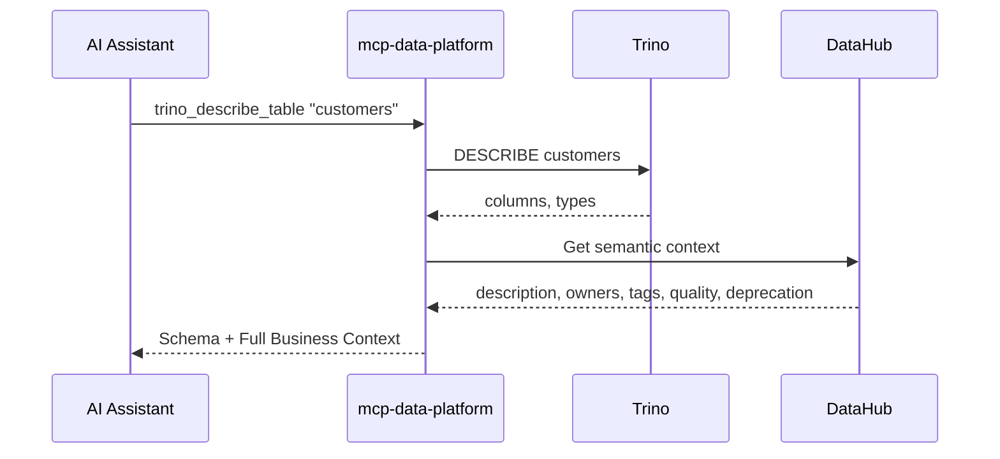

# mcp-data-platform

**AI tools can query your data. But they don't understand what it means.**

mcp-data-platform bridges that gap. Connect AI assistants to your data infrastructure with automatic business context from your semantic layer. Query a table and get its meaning, owners, quality scores, and deprecation warnings in the same response.

**The only requirement is [DataHub](https://datahubproject.io/).** Trino and S3 are optional but recommended.

<div class="grid cards" markdown>

-   :material-semantic-web: **Semantic-First**

    ---

    DataHub is the foundation. Query a table, get its business context automatically—owners, tags, quality scores, deprecation warnings. No separate lookups needed.

-   :material-swap-horizontal: **Cross-Injection**

    ---

    Trino results include DataHub metadata. DataHub searches show which datasets are queryable. Context flows between services automatically.

-   :material-shield-check: **Enterprise Security**

    ---

    Fail-closed authentication, TLS enforcement, prompt injection protection, and read-only mode. Built for production environments.

-   :material-account-group: **Personas**

    ---

    Define who can use which tools. Analysts get read access. Admins get everything. Map from your identity provider's roles.

</div>

---

## The Problem We Solve

When AI assistants query your data, they work blind. They see column names and types, but they don't know what the data *means*.

**Consider this scenario**: An AI assistant is helping a new analyst understand customer data. Without semantic context:

1. "What tables have customer information?" → Returns table names
2. "Describe the customers table" → Returns columns and types
3. "Is this data up to date?" → Requires separate DataHub query
4. "Who should I contact about issues?" → Requires another DataHub query
5. "Are there data quality concerns?" → Yet another query
6. "Wait, is this table deprecated?" → Finally discovers the table was deprecated months ago

**With mcp-data-platform**, the first response includes everything:

```
Table: customers (DEPRECATED - use customers_v2)
─────────────────────────────────────────────────
Owners: Data Platform Team
Domain: Customer Analytics
Tags: pii, gdpr-relevant
Quality Score: 67% (degraded)
Last Updated: 2 weeks ago

Columns:
  customer_id    BIGINT      Unique customer identifier
  email          VARCHAR     Contact email (PII - handle per GDPR policy)
  created_at     TIMESTAMP   Account creation timestamp
  segment        VARCHAR     Marketing segment (see glossary: customer-segment)
```

One call. Complete context. Warnings front and center.

---

## See It In Action

### Before: Raw Trino Response

```json
{
  "columns": [
    {"name": "customer_id", "type": "BIGINT"},
    {"name": "email", "type": "VARCHAR"},
    {"name": "segment", "type": "VARCHAR"}
  ]
}
```

Just structure. No meaning. No warnings. No ownership.

### After: Enriched Response with mcp-data-platform

```json
{
  "columns": [
    {"name": "customer_id", "type": "BIGINT"},
    {"name": "email", "type": "VARCHAR"},
    {"name": "segment", "type": "VARCHAR"}
  ],
  "semantic_context": {
    "description": "Core customer records with PII data",
    "deprecation": {
      "deprecated": true,
      "note": "Use customers_v2 for GDPR compliance",
      "replacement": "urn:li:dataset:customers_v2"
    },
    "owners": [
      {"name": "Data Platform Team", "type": "group", "email": "data-platform@example.com"}
    ],
    "tags": ["pii", "gdpr-relevant"],
    "domain": {"name": "Customer Analytics", "urn": "urn:li:domain:customer"},
    "quality_score": 0.67,
    "columns": {
      "customer_id": {"description": "Unique customer identifier", "tags": []},
      "email": {"description": "Contact email", "tags": ["pii"], "glossary_term": "customer-email"},
      "segment": {"description": "Marketing segment", "glossary_term": "customer-segment"}
    }
  }
}
```

The AI assistant now knows:

- This table is **deprecated** with a clear migration path
- It contains **PII** requiring special handling
- **Who to contact** when something is wrong
- The **data quality has degraded** (67%)
- What each column **actually means**

---

## How It Works



The enrichment middleware intercepts tool responses and adds semantic context before returning to the client. This **cross-injection** works in both directions:

| When you use | You also get |
|--------------|--------------|
| **Trino** | DataHub metadata (owners, tags, quality, deprecation) |
| **DataHub search** | Which datasets are queryable in Trino |
| **S3** | DataHub metadata for matching datasets |

[:octicons-arrow-right-24: Cross-injection details](cross-injection/overview.md)

---

## Quick Start

=== "Local (stdio)"

    Run locally with your own credentials:

    ```bash
    # Install
    go install github.com/txn2/mcp-data-platform/cmd/mcp-data-platform@latest

    # Add to Claude Code
    claude mcp add mcp-data-platform -- mcp-data-platform --config platform.yaml
    ```

    No MCP authentication needed—uses your configured DataHub/Trino/S3 credentials.

=== "Remote (SSE)"

    Deploy as a shared service with Keycloak authentication:

    ```bash
    mcp-data-platform --config platform.yaml --transport sse --address :8443
    ```

    Users connect via Claude Desktop and authenticate through your identity provider.

=== "Docker"

    ```bash
    docker run -v /path/to/platform.yaml:/etc/mcp/platform.yaml \
      ghcr.io/txn2/mcp-data-platform:latest \
      --config /etc/mcp/platform.yaml
    ```

---

## Choose Your Path

<div class="grid cards" markdown>

-   :material-server: **Deploy the Server**

    ---

    Configure via YAML. Connect DataHub, add Trino and S3 if you have them. Works out of the box.

    [:octicons-arrow-right-24: Server Guide](server/overview.md)

-   :material-code-braces: **Build Your Own**

    ---

    Import the Go library. Add custom tools, swap providers, write middleware. Make it yours.

    [:octicons-arrow-right-24: Library Guide](library/overview.md)

</div>

---

## What's Included

| Toolkit | Tools | Purpose |
|---------|-------|---------|
| **DataHub** | 11 tools | Search, metadata, lineage, glossary, domains |
| **Trino** | 7 tools | SQL queries, schema exploration, catalogs |
| **S3** | 6-9 tools | Bucket/object operations, presigned URLs |

DataHub is the foundation—your semantic layer. Add Trino for SQL queries, S3 for object storage. Use what you have.

[:octicons-arrow-right-24: Tools reference](reference/tools-api.md)

---

## Use Cases

### Enterprise Data Governance

- **Audit Trails**: Every query logged with user identity
- **PII Protection**: Tag-based warnings for sensitive data
- **Access Control**: Persona system enforces who can query what
- **Deprecation Enforcement**: Warnings surface before using stale data

### Data Democratization

- **Self-Service**: Business users explore data with context
- **Cross-Team Discovery**: Find datasets across systems
- **Onboarding**: New team members understand data immediately

### AI/ML Workflows

- **Autonomous Exploration**: AI agents discover datasets without guidance
- **Feature Discovery**: Find ML features with quality scores
- **Quality Gates**: Avoid problematic datasets automatically

[:octicons-arrow-right-24: Examples and patterns](examples/index.md)

---

## Security

Built with a **fail-closed** security model. Missing credentials deny access—never bypass.

| Feature | Description |
|---------|-------------|
| **Fail-Closed Authentication** | Invalid credentials = denied (never bypass) |
| **Required JWT Claims** | Tokens must include `sub` and `exp` |
| **TLS for SSE** | Configurable TLS with plaintext warnings |
| **Prompt Injection Protection** | Metadata sanitization |
| **Read-Only Mode** | Enforced at query level |
| **Default-Deny Personas** | No implicit tool access |

[:octicons-arrow-right-24: Security documentation](auth/overview.md)

---

## Runs With

- Claude Desktop (add the SSE endpoint)
- Claude Code (stdio or SSE)
- Any MCP client

---

## Built On

| Project | What it does |
|---------|--------------|
| [mcp-trino](https://github.com/txn2/mcp-trino) | Trino queries |
| [mcp-datahub](https://github.com/txn2/mcp-datahub) | DataHub metadata |
| [mcp-s3](https://github.com/txn2/mcp-s3) | S3 storage |

These work standalone. This platform wires them together with cross-injection, auth, and personas.
