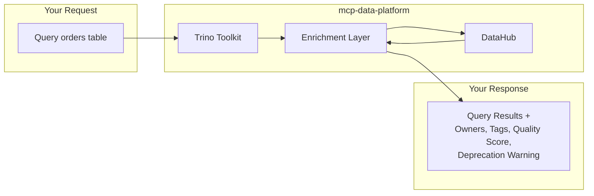

# mcp-data-platform

A semantic data platform MCP server that composes Trino, DataHub, and S3 toolkits with **bidirectional cross-injection**. Query a database table and automatically receive business context. Search your data catalog and learn which datasets are queryable.

<div class="grid cards" markdown>

-   :material-semantic-web: **Semantic-First Access**

    ---

    Every data operation includes business context from your semantic layer. Table descriptions, ownership, data quality scores, and deprecation warnings surface automatically.

-   :material-swap-horizontal: **Bidirectional Cross-Injection**

    ---

    Trino results include DataHub metadata. DataHub search results show query availability. S3 objects link to their semantic context. No manual lookups required.

-   :material-shield-lock: **Enterprise Authentication**

    ---

    OIDC with any provider (Keycloak, Auth0, Okta) and API keys for service accounts. Simple, direct authentication without unnecessary token complexity.

-   :material-account-group: **Role-Based Personas**

    ---

    Define analyst, admin, or custom personas with wildcard tool filtering. Map OIDC roles to personas automatically. Control what each user can access.

</div>

---

## Quick Start

=== "Claude Code"

    ```bash
    # Install
    go install github.com/txn2/mcp-data-platform/cmd/mcp-data-platform@latest

    # Add to Claude Code
    claude mcp add mcp-data-platform -- mcp-data-platform --config platform.yaml
    ```

=== "Claude Desktop"

    Add to `claude_desktop_config.json`:

    ```json
    {
      "mcpServers": {
        "mcp-data-platform": {
          "command": "mcp-data-platform",
          "args": ["--config", "/path/to/platform.yaml"]
        }
      }
    }
    ```

=== "Docker"

    ```bash
    docker run -v /path/to/platform.yaml:/etc/mcp/platform.yaml \
      ghcr.io/txn2/mcp-data-platform:latest \
      --config /etc/mcp/platform.yaml
    ```

---

## Choose Your Path

<div class="grid cards" markdown>

-   :material-server: **Use the MCP Server**

    ---

    Deploy the pre-built server to connect Claude to your data infrastructure. Configure toolkits, authentication, and personas via YAML.

    [:octicons-arrow-right-24: Server Guide](server/overview.md)

-   :material-code-braces: **Build Custom MCP**

    ---

    Use the Go library to build your own MCP server with custom toolkits, middleware, and providers. Full control over the platform behavior.

    [:octicons-arrow-right-24: Library Guide](library/overview.md)

</div>

---

## How Cross-Injection Works



When you query a Trino table, the platform automatically:

1. Executes your query against Trino
2. Looks up the table in DataHub
3. Appends semantic context to your results

The same happens in reverse: search DataHub for datasets, and results include whether each table is queryable via Trino.

[:octicons-arrow-right-24: Learn more about cross-injection](cross-injection/overview.md)

---

## Available Tools

| Toolkit | Tools | Description |
|---------|-------|-------------|
| **Trino** | 7 tools | Query execution, schema exploration, table metadata |
| **DataHub** | 11 tools | Search, entity details, lineage, glossary, data products |
| **S3** | 6-9 tools | Object storage operations (read-only or full access) |

[:octicons-arrow-right-24: Complete tools reference](reference/tools-api.md)

---

## Works With

- [Claude Desktop](https://claude.ai/download) - Anthropic's desktop application
- [Claude Code](https://docs.anthropic.com/en/docs/claude-code) - CLI for software development
- Any MCP-compatible client using stdio or SSE transport

---

## Part of the txn2 MCP Ecosystem

mcp-data-platform composes these standalone MCP servers:

| Project | Purpose |
|---------|---------|
| [mcp-trino](https://github.com/txn2/mcp-trino) | Trino query engine access |
| [mcp-datahub](https://github.com/txn2/mcp-datahub) | DataHub metadata catalog |
| [mcp-s3](https://github.com/txn2/mcp-s3) | S3-compatible object storage |

Each can be used independently, but mcp-data-platform adds cross-injection, authentication, personas, and audit logging.
