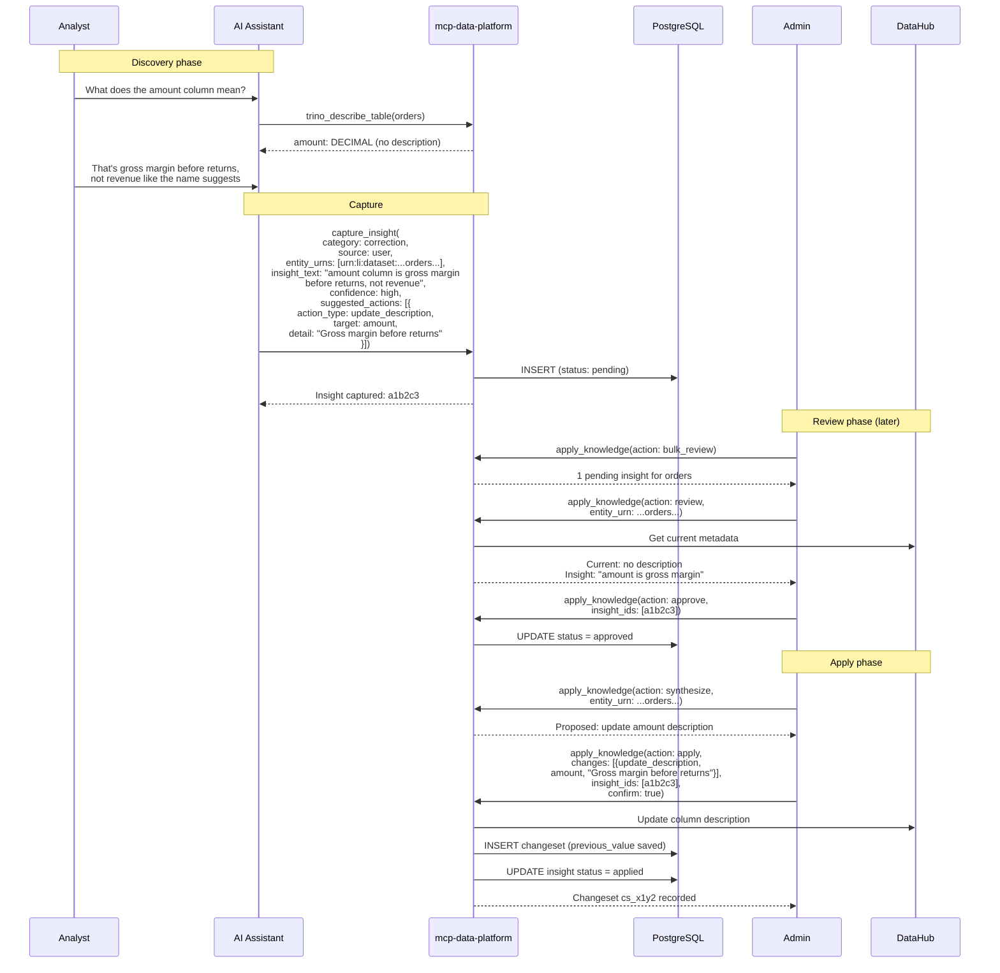

# Governance Workflow

Knowledge capture turns catalog metadata into something that evolves with use. Instead of metadata being a static artifact maintained by a central team, it improves continuously as domain experts share what they know during their normal work. This is active metadata management: the catalog gets better every time someone uses it.

This page covers the admin-side workflow for reviewing captured insights and writing approved changes back to DataHub.

## The Review Process

All captured insights start with status `pending`. Admins review them through the `apply_knowledge` tool or the [Admin REST API](admin-api.md).

### Bulk Review

Get an overview of all pending insights:

```json
{"action": "bulk_review"}
```

Response:

```json
{
  "total_pending": 7,
  "by_entity": [
    {
      "entity_urn": "urn:li:dataset:(urn:li:dataPlatform:trino,hive.sales.orders,PROD)",
      "count": 3,
      "categories": ["correction", "business_context"],
      "latest_at": "2025-01-15T14:30:00Z"
    },
    {
      "entity_urn": "urn:li:dataset:(urn:li:dataPlatform:trino,hive.finance.revenue,PROD)",
      "count": 4,
      "categories": ["data_quality", "usage_guidance", "enhancement"],
      "latest_at": "2025-01-15T16:45:00Z"
    }
  ],
  "by_category": {
    "correction": 2,
    "business_context": 1,
    "data_quality": 2,
    "usage_guidance": 1,
    "enhancement": 1
  },
  "by_confidence": {
    "high": 3,
    "medium": 4
  }
}
```

### Review by Entity

Drill into a specific entity to see its pending insights alongside current DataHub metadata:

```json
{
  "action": "review",
  "entity_urn": "urn:li:dataset:(urn:li:dataPlatform:trino,hive.sales.orders,PROD)"
}
```

Response includes:

- Current DataHub metadata (description, tags, glossary terms, owners)
- All insights for this entity with their categories, text, confidence, and suggested actions

This side-by-side view helps admins assess whether an insight adds value compared to what's already in the catalog.

### Approve or Reject

Transition insight statuses with optional review notes:

```json
{
  "action": "approve",
  "insight_ids": ["a1b2c3d4e5f6", "f6e5d4c3b2a1"],
  "review_notes": "Verified with data engineering team"
}
```

```json
{
  "action": "reject",
  "insight_ids": ["deadbeef1234"],
  "review_notes": "Already documented in the column description"
}
```

Response:

```json
{
  "action": "approve",
  "updated": 2,
  "total": 2
}
```

If any IDs are invalid or the status transition is not allowed, those are reported in an `errors` array without blocking the valid ones.

## Synthesizing Changes

Once insights are approved, the `synthesize` action gathers them and builds structured change proposals:

```json
{
  "action": "synthesize",
  "entity_urn": "urn:li:dataset:(urn:li:dataPlatform:trino,hive.sales.orders,PROD)"
}
```

Response:

```json
{
  "entity_urn": "urn:li:dataset:(urn:li:dataPlatform:trino,hive.sales.orders,PROD)",
  "current_metadata": {
    "description": "Order records",
    "tags": ["financial"],
    "glossary_terms": [],
    "owners": ["Data Platform Team"]
  },
  "approved_insights": [
    {
      "id": "a1b2c3d4e5f6",
      "category": "correction",
      "insight_text": "The amount column represents gross margin before returns, not revenue.",
      "suggested_actions": [
        {"action_type": "update_description", "target": "entity", "detail": "Order records with gross margin amounts (before returns)"}
      ]
    }
  ],
  "proposed_changes": [
    {
      "change_type": "update_description",
      "target": "entity",
      "current_value": "Order records",
      "suggested_value": "Order records with gross margin amounts (before returns)",
      "source_insight_ids": ["a1b2c3d4e5f6"]
    }
  ]
}
```

The synthesis output shows current values alongside proposed changes, so admins can see exactly what will change. The `source_insight_ids` field traces each change back to the insight that proposed it.

## Applying Changes

The `apply` action writes changes to DataHub and records a changeset. This is the data catalog write-back step.

```json
{
  "action": "apply",
  "entity_urn": "urn:li:dataset:(urn:li:dataPlatform:trino,hive.sales.orders,PROD)",
  "changes": [
    {
      "change_type": "update_description",
      "target": "entity",
      "detail": "Order records with gross margin amounts (before returns)"
    },
    {
      "change_type": "add_tag",
      "target": "entity",
      "detail": "gross-margin"
    }
  ],
  "insight_ids": ["a1b2c3d4e5f6"],
  "confirm": true
}
```

When `require_confirmation` is enabled in configuration and `confirm` is not `true`, the tool returns a confirmation prompt instead of applying:

```json
{
  "confirmation_required": true,
  "entity_urn": "urn:li:dataset:(urn:li:dataPlatform:trino,hive.sales.orders,PROD)",
  "changes_count": 2,
  "message": "Set confirm: true to apply these changes."
}
```

### Supported Change Types

| Change Type | Description | Target Field | Detail Field |
|-------------|-------------|-------------|--------------|
| `update_description` | Update entity or column description | `column:<fieldPath>` for columns, empty for dataset-level | New description text |
| `add_tag` | Add a tag to the entity | (ignored) | Tag name or URN (e.g., `pii` or `urn:li:tag:pii`) |
| `remove_tag` | Remove a tag from the entity | (ignored) | Tag name or URN to remove |
| `add_glossary_term` | Associate a glossary term | (ignored) | Glossary term name or URN |
| `flag_quality_issue` | Add fixed `QualityIssue` tag to the entity | (ignored) | Issue description (stored as context in the knowledge store) |
| `add_documentation` | Add a documentation link | URL of the documentation | Link description |

Tag names and glossary term names are automatically normalized to full DataHub URNs (e.g., `pii` becomes `urn:li:tag:pii`).

### Apply Response

```json
{
  "changeset_id": "cs_x1y2z3a4b5c6",
  "entity_urn": "urn:li:dataset:(urn:li:dataPlatform:trino,hive.sales.orders,PROD)",
  "changes_applied": 2,
  "insights_marked_applied": 1,
  "message": "Changes applied to DataHub. Changeset cs_x1y2z3a4b5c6 recorded for rollback."
}
```

Source insights move to `applied` status with a reference to the changeset.

## Changeset Tracking

Every `apply` action creates a changeset record in the `knowledge_changesets` table:

| Field | Description |
|-------|-------------|
| `id` | Unique changeset identifier |
| `target_urn` | The DataHub entity that was modified |
| `change_type` | Summary of change types applied (or `multiple`) |
| `previous_value` | Entity metadata before changes (description, tags, glossary terms, owners) |
| `new_value` | Changes that were applied |
| `source_insight_ids` | Insights that produced this changeset |
| `applied_by` | User who applied the changes |
| `rolled_back` | Whether this changeset has been reverted |
| `rolled_back_by` | Who reverted the changes |
| `rolled_back_at` | When the changes were reverted |

The `previous_value` field captures the entity's metadata at the time of application, which is used for rollback.

## Rollback

Changesets can be rolled back through the [Admin REST API](admin-api.md):

```bash
curl -X POST \
  https://mcp.example.com/api/v1/admin/knowledge/changesets/cs_x1y2z3a4b5c6/rollback \
  -H "Authorization: Bearer $ADMIN_TOKEN"
```

Rollback restores the `previous_value` metadata to the DataHub entity. The changeset is marked as rolled back with the user and timestamp.

**Limitations:**

- Rollback restores the metadata snapshot from the time of application. If the entity's metadata was modified by other means after the apply, the rollback overwrites those changes too.
- A changeset can only be rolled back once.

## Complete Workflow Example

An analyst discovers that the `amount` column in the orders table represents gross margin, not revenue. Here's how that knowledge flows through the system:



The next time anyone queries this table, the enriched response includes the corrected description.

## Next Steps

- [Admin API](admin-api.md) -- REST endpoints for managing insights and changesets
- [Knowledge Overview](overview.md) -- feature overview, categories, configuration
- [Audit Logging](../server/audit.md) -- all knowledge tool calls are audit logged
