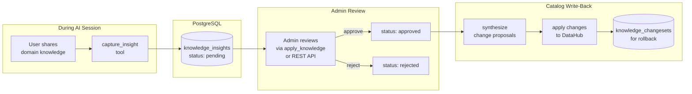
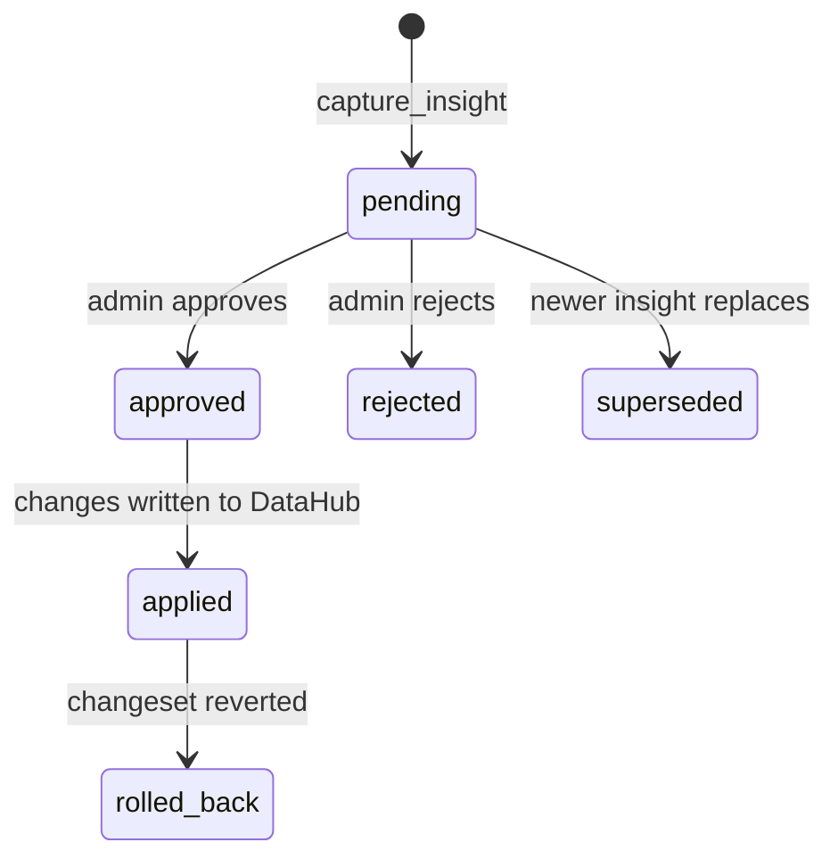
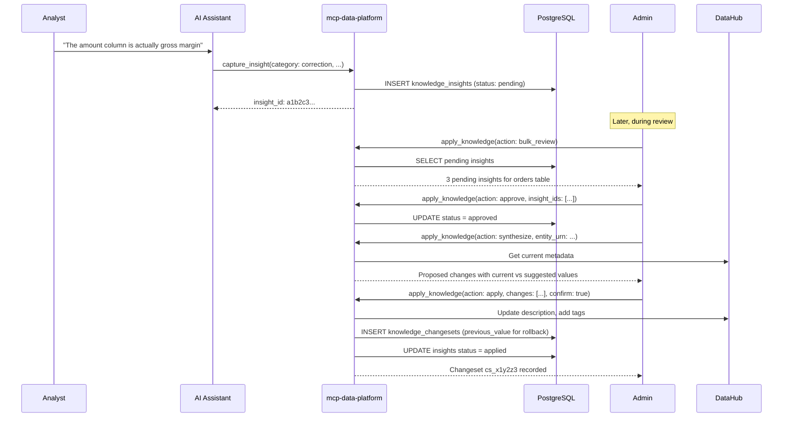

# Knowledge Capture

## The Problem

Every organization has tribal knowledge about its data: what columns actually mean, which tables are reliable, when timestamps shifted time zones, how business metrics are calculated. This knowledge lives in the heads of experienced team members and surfaces in conversations, but it rarely makes it back into the data catalog.

AI-assisted data exploration makes this worse. Users share corrections, business context, and quality observations during sessions. The AI assistant uses that context for the current conversation, and then it's gone. The next session starts from scratch.

Knowledge capture fixes this. When a user shares domain knowledge during a session, the platform records it, routes it through a governance workflow, and writes approved changes back to DataHub.

## How It Works

The system has three components: two MCP tools and an Admin REST API.



- **`capture_insight`** records domain knowledge during sessions. Available to all personas when enabled. Creates insights with status `pending`.
- **`apply_knowledge`** is an admin-only tool for reviewing, approving, synthesizing, and applying insights to DataHub.
- **[Admin REST API](admin-api.md)** provides HTTP endpoints for managing insights and changesets outside the MCP protocol.

## Insight Categories

Insights have six categories:

| Category | Description | Example |
|----------|-------------|---------|
| `correction` | Fixes wrong metadata in the catalog | "The `amount` column is gross margin, not revenue" |
| `business_context` | Explains what data means in business terms | "MRR counts active subscriptions only, not trials" |
| `data_quality` | Reports quality issues or known limitations | "Timestamps before March 2024 are UTC; after that, America/Chicago" |
| `usage_guidance` | Tips for querying or interpreting data correctly | "Always filter `status='active'` to avoid soft-delete duplicates" |
| `relationship` | Connections between datasets not captured in lineage | "The `customer_id` in orders joins to the legacy CRM export" |
| `enhancement` | Suggested improvements to documentation or metadata | "Tag `sales_daily` with its 6 AM CT refresh schedule" |

## Insight Lifecycle

Insights have these statuses:



| Status | Description |
|--------|-------------|
| `pending` | Newly captured, awaiting admin review |
| `approved` | Reviewed and approved, ready for synthesis and application |
| `rejected` | Reviewed and rejected by admin |
| `applied` | Changes have been written to DataHub |
| `superseded` | Replaced by a newer insight for the same entity |
| `rolled_back` | Applied changes were reverted via changeset rollback |

## Governance Workflow

Capture to catalog update:



This is a human-in-the-loop metadata curation workflow. Insights captured by any user go through admin review before modifying the catalog. Every change is tracked with a changeset that records previous values for rollback.

## Configuration

```yaml
knowledge:
  enabled: true
  apply:
    enabled: true
    datahub_connection: primary
    require_confirmation: true
```

| Field | Type | Default | Description |
|-------|------|---------|-------------|
| `knowledge.enabled` | bool | `false` | Enable the knowledge capture toolkit and `capture_insight` tool |
| `knowledge.apply.enabled` | bool | `false` | Enable the `apply_knowledge` tool for admin review and catalog write-back |
| `knowledge.apply.datahub_connection` | string | - | DataHub instance name for write-back operations |
| `knowledge.apply.require_confirmation` | bool | `false` | When true, the `apply` action requires `confirm: true` in the request |

!!! note "Prerequisites"
    Knowledge capture requires `database.dsn` to be configured for PostgreSQL storage. The `apply_knowledge` tool requires the admin persona.

## Persona Integration

Control who can capture and apply knowledge through persona tool filtering:

```yaml
personas:
  definitions:
    analyst:
      display_name: "Data Analyst"
      roles: ["analyst"]
      tools:
        allow:
          - "trino_*"
          - "datahub_*"
          - "capture_insight"       # Can capture knowledge
        deny:
          - "apply_knowledge"       # Cannot apply changes

    admin:
      display_name: "Administrator"
      roles: ["admin"]
      tools:
        allow: ["*"]               # Full access including apply_knowledge

    etl_service:
      display_name: "ETL Service"
      roles: ["service"]
      tools:
        allow:
          - "trino_*"
        deny:
          - "capture_insight"       # Automated processes should not capture
          - "apply_knowledge"
```

## Insight Sources

Insights track where the knowledge came from via the `source` field:

| Source | Description | Example |
|--------|-------------|---------|
| `user` | Knowledge shared by the user during conversation (default) | User says "The amount column is gross margin, not revenue" |
| `agent_discovery` | Knowledge the AI agent figured out independently | Agent samples data and discovers a column contains ISO country codes |
| `enrichment_gap` | Metadata gap flagged for admin attention | Table has no description and the agent cannot determine its purpose from the data |

The source field is optional when calling `capture_insight`. When omitted, it defaults to `user`.

## AI Agent Guidance

The toolkit registers an MCP prompt called `knowledge_capture_guidance` that tells AI assistants when to capture insights. The prompt covers:

**When to capture (user-provided):**

- User corrects a column description, table purpose, or data interpretation
- User explains what data means in business terms not captured in metadata
- User reports data quality issues or known limitations
- User shares tips on how to query or interpret data correctly
- User explains connections between datasets not captured in lineage
- User suggests improvements to existing documentation or metadata

**When to capture (agent-discovered):**

- Agent discovers what a column means by sampling actual data (set `source: "agent_discovery"`)
- Agent finds join relationships not documented in lineage metadata
- Agent identifies data quality patterns (nulls, outliers, encoding issues)
- Agent resolves ambiguous column names by examining values
- Agent encounters metadata that is missing or clearly wrong and cannot resolve it from the data (set `source: "enrichment_gap"`)

**When to ask the user instead:**

- Enrichment is insufficient and the agent cannot resolve it from the data alone
- Multiple interpretations are equally plausible
- The insight would have high impact (e.g., PII classification, deprecation status)

**When not to capture:**

- Transient questions or debugging ("why is my query slow?")
- Personal preferences ("I prefer using CTEs")
- Information already present in the catalog metadata
- Vague or unverifiable claims without specific context
- Trivially obvious gaps without adding what the data actually means
- Speculative interpretations without evidence from querying
- The same gap repeatedly within a session

The prompt is available via `prompts/list` and `prompts/get` in the MCP protocol.

## Next Steps

- [Governance Workflow](governance.md) -- review process, synthesis, applying changes, changeset tracking, and rollback
- [Admin API](admin-api.md) -- REST endpoints for managing insights and changesets
- [Audit Logging](../server/audit.md) -- all knowledge tool calls are audit logged
- [Personas](../personas/overview.md) -- control access to knowledge tools via personas
