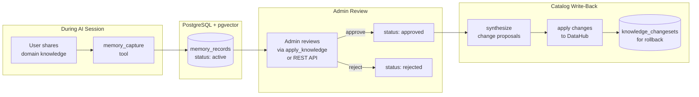
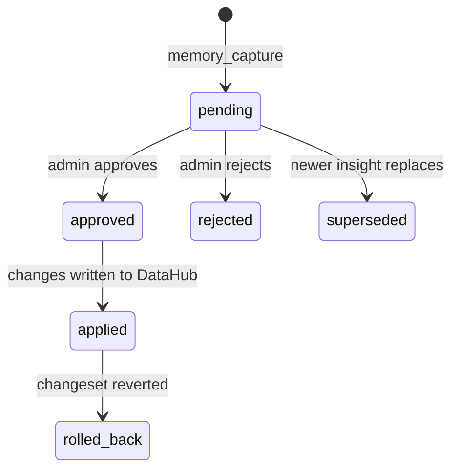
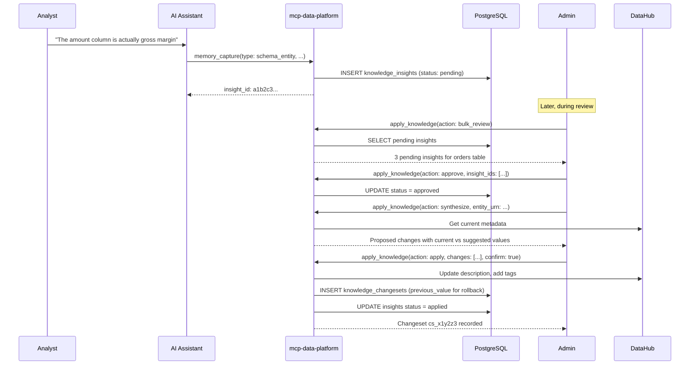

# Knowledge Capture

!!! tip "Memory Layer"
    Knowledge capture lives in the [Memory Layer](../memory/overview.md) and is performed by the `memory_capture` tool (memory toolkit). It therefore requires the memory layer to be enabled: memory defaults on when a database is configured, and setting `memory.enabled: false` disables capture. Insights captured via `memory_capture` are stored in `memory_records` (the unified memory table) and can be recalled, enriched, and promoted to durable DataHub knowledge via `apply_knowledge`.

## The Problem

Every organization has tribal knowledge about its data: what columns actually mean, which tables are reliable, when timestamps shifted time zones, how business metrics are calculated. This knowledge lives in the heads of experienced team members and surfaces in conversations, but it rarely makes it back into the data catalog.

AI-assisted data exploration makes this worse. Users share corrections, business context, and quality observations during sessions. The AI assistant uses that context for the current conversation, and then it's gone. The next session starts from scratch.

Knowledge capture fixes this. When a user shares domain knowledge during a session, the platform records it, routes it through a governance workflow, and writes approved changes back to DataHub.

## How It Works

The system has three components: two MCP tools and an Admin REST API.


```mermaid
flowchart LR
    subgraph "During AI Session"
        A[User shares<br/>domain knowledge] --> B[memory_capture<br/>tool]
    end

    subgraph "PostgreSQL + pgvector"
        B --> C[(memory_records<br/>status: active)]
    end

    subgraph "Admin Review"
        C --> D[Admin reviews<br/>via apply_knowledge<br/>or REST API]
        D -->|approve| E[status: approved]
        D -->|reject| F[status: rejected]
    end

    subgraph "Catalog Write-Back"
        E --> G[synthesize<br/>change proposals]
        G --> H[apply changes<br/>to DataHub]
        H --> I[(knowledge_changesets<br/>for rollback)]
    end
```

- **`search`** is the universal, topology-free discovery entry point: one query fans across the technical catalog, the caller's memory, captured insights, the caller's feedback, saved assets, uploaded reference material (managed resources, indexed over their file contents), prompts, API endpoints, and connections, returning a balanced, grouped-by-source, per-user-scoped result set with a coverage summary. See [search](../server/tools.md#search).
- **`memory_capture`** (memory toolkit) records domain knowledge during sessions. Available to all personas when enabled. Reviewed sink-classes (`business_knowledge`, `schema_entity`, `operational_rule`) create insights with status `pending`. (To read knowledge back, use `search`.)
- **`apply_knowledge`** is an admin-only tool for reviewing, approving, synthesizing, and applying insights to DataHub.
- **[Admin REST API](admin-api.md)** provides HTTP endpoints for managing insights and changesets outside the MCP protocol.

## Reflexive Capture (automatic corrections)

Most capture depends on someone deciding to record knowledge. Reflexive capture removes the operator from that loop for the highest-signal case: a query error that the same session later fixes.

When a `trino_query` or `trino_execute` call fails with a data-model misunderstanding (an unknown column, unknown table, ambiguous reference, type mismatch, or a `GROUP BY` mistake) and a later **related** query on the **same connection** succeeds in the **same session**, the platform mints one "misconception + fix" correction memory automatically. No tool call is made by the agent, and the tool response is never blocked (the capture runs asynchronously).

- **Attribution.** The record carries `source: automation` and `category: correction`, so it is distinguishable from user- and agent-authored knowledge in reads and audits. `source: automation` is the audit trail for platform-minted knowledge.
- **Review, not live.** The correction is a reviewed sink-class (`schema_entity`), so it enters review as a `pending` insight rather than mutating catalog state. A human promotes it via `apply_knowledge` exactly like any other insight.
- **Persona-gated.** Reflexive capture is a memory write, so a persona denied the `memory_capture` tool never has records minted on its behalf.
- **Conservative pairing.** Only errors matching a small allowlist of misconception signatures are captured; infra, policy, timeout, and permission errors are treated as noise and ignored. The success is paired only when it runs on the same connection and is a near-variant of the failing query (measured by shared identifiers), so an unrelated query on the same table is not mistaken for a fix, and an identical statement that merely succeeds on retry is ignored.
- **Entity-keyed.** When the fixed query references fully-qualified tables, the correction is linked to those DataHub dataset URNs (resolved against the successful query's connection).

Reflexive capture is enabled by default whenever the memory subsystem is available. Disable it with `knowledge.reflexive_capture.enabled: false`. It is part of the reflexive knowledge-activation work ([#635](https://github.com/txn2/mcp-data-platform/issues/635)).

## Insight Categories

Insights have six categories:

| Category | Description | Example |
|----------|-------------|---------|
| `correction` | Fixes wrong metadata in the catalog | "The `amount` column is gross margin, not revenue" |
| `business_context` | Explains what data means in business terms | "MRR counts active subscriptions only, not trials" |
| `data_quality` | Reports quality issues or known limitations | "Timestamps before March 2024 are UTC; after that, America/Chicago" |
| `usage_guidance` | Tips for querying or interpreting data correctly | "Always filter `status='active'` to avoid soft-delete duplicates" |
| `relationship` | Connections between datasets not captured in lineage | "The `customer_id` in orders joins to the legacy CRM export" |
| `enhancement` | Suggested improvements to documentation or metadata | "Tag `sales_daily` with its 6 AM CT refresh schedule" |

## Insight Lifecycle

Insights have these statuses:


```mermaid
stateDiagram-v2
    [*] --> pending: memory_capture
    pending --> approved: admin approves
    pending --> rejected: admin rejects
    pending --> superseded: newer insight replaces
    approved --> applied: changes written to DataHub
    applied --> rolled_back: changeset reverted
```

| Status | Description |
|--------|-------------|
| `pending` | Newly captured, awaiting admin review |
| `approved` | Reviewed and approved, ready for synthesis and application |
| `rejected` | Reviewed and rejected by admin |
| `applied` | Changes have been written to the canonical sink (the DataHub catalog, or a knowledge page). Also the point at which the insight becomes organization-wide: see Visibility below |
| `superseded` | Replaced by a newer insight for the same entity |
| `rolled_back` | Applied changes were reverted via changeset rollback |

## Visibility

Applying an insight is what turns one person's capture into knowledge the organization holds, so `applied` is also the visibility boundary:

| Status | Who can find it with `search` and read it with `fetch` |
|--------|--------------------------------------------------------|
| `pending`, `approved` | Only the capturer. A capture under review is not yet something the organization asserts |
| `applied` | Every identified caller, attributed to the capturer through the hit's `captured_by` |
| `rejected`, `superseded`, `rolled_back` | Only the capturer, and only by asking for that status explicitly: retracted knowledge is dropped from ordinary discovery |

Two properties follow from this:

- No insight is public. Reaching applied insights requires an identified caller, so an anonymous visitor to a shared portal link never sees them.
- Discovery does not depend on the sink. Before this boundary existed, an applied fact reached other people only if it happened to land on a knowledge page, or if a tool result named the dataset it hung off; a fact applied to the DataHub catalog on a table the agent was not already looking at had no search-time route to anyone but its capturer.

### Delivered insights say when they are checkable

An insight is a claim, and a delivered claim removes the consumer's reason to check it. When the platform can query the subject of a claim for itself, it says so: an insight whose linked catalog entity resolves to an available table is delivered with a `verifiable` block naming that table and the connection it lives on.

```json
{
  "source": "insights",
  "ref": "i-9f2c",
  "text": "The orders table holds 1,140 rows for FY25.",
  "reference": "mcp:insight:i-9f2c",
  "entity_urns": ["urn:li:dataset:(urn:li:dataPlatform:trino,iceberg.retail.orders,PROD)"],
  "verifiable": {
    "urn": "urn:li:dataset:(urn:li:dataPlatform:trino,iceberg.retail.orders,PROD)",
    "query_table": "iceberg.retail.orders",
    "connection": "primary"
  }
}
```

The block appears on every surface that delivers an insight: `search` insight hits, the record `fetch` returns for `mcp:insight:<id>`, and the insight entries of the `memory_context` enrichment block pushed onto tool results. It says the claim's subject is one query away, not that the claim was checked — a claim linked to several entities names the first one that resolves.

It is additive and absent whenever nothing resolves: an insight linked to no entity, an entity the query provider cannot see, and a deployment with no query provider all deliver exactly the payload they always did. A plain memory record never carries it — a note is not a claim about the warehouse. Turn it off with `knowledge.verifiable_insights: false`.

The block is also topology, so it honors the persona connection boundary: an insight about a dataset on a connection your persona may not reach is still delivered (a colleague's conclusion about a warehouse you cannot query is exactly what shared knowledge is for), but with no `verifiable` block, and the platform never probes that connection on your behalf. Resolution asks only where an entity is queryable, never how many rows it holds, so the marker costs a catalog lookup rather than a `COUNT(*)` even where `enrichment.estimate_row_counts` is on; answers are remembered briefly, and a lookup that timed out or came back negative is retried much sooner than a positive one is refreshed.

### How much of a page is searchable

All of it, at any size. A knowledge page's content (title, body, and tags) is embedded as a set of chunks rather than a single vector, each chunk sized to the embedding provider's per-text input budget (`memory.embedding.ollama.max_input_bytes`, default 6,000 bytes) and split on the page's own markdown section boundaries where it has them. Search ranks those chunks and scores each page by its best-matching one, so results stay page-granular while a fact buried at the end of a long runbook ranks its page exactly as a fact in the opening paragraph would. The same set of chunks backs the create-time near-duplicate gate, so a large page is compared in full rather than by its opening.

This is why the split suggestion (`knowledge.pages.oversize_bytes`) is a nudge and not a limit: splitting a sprawling page into focused, cross-linked pages is good for the reader and for progressive revelation, but leaving it whole costs no semantic reach.

## Governance Workflow

Capture to catalog update:


```mermaid
sequenceDiagram
    participant Analyst
    participant AI as AI Assistant
    participant MCP as mcp-data-platform
    participant PG as PostgreSQL
    participant Admin
    participant DH as DataHub

    Analyst->>AI: "The amount column is actually gross margin"
    AI->>MCP: memory_capture(type: schema_entity, ...)
    MCP->>PG: INSERT knowledge_insights (status: pending)
    MCP-->>AI: insight_id: a1b2c3...

    Note over Admin: Later, during review
    Admin->>MCP: apply_knowledge(action: bulk_review)
    MCP->>PG: SELECT pending insights
    MCP-->>Admin: 3 pending insights for orders table

    Admin->>MCP: apply_knowledge(action: approve, insight_ids: [...])
    MCP->>PG: UPDATE status = approved

    Admin->>MCP: apply_knowledge(action: synthesize, entity_urn: ...)
    MCP->>DH: Get current metadata
    MCP-->>Admin: Proposed changes with current vs suggested values

    Admin->>MCP: apply_knowledge(action: apply, changes: [...], confirm: true)
    MCP->>DH: Update description, add tags
    MCP->>PG: INSERT knowledge_changesets (previous_value for rollback)
    MCP->>PG: UPDATE insights status = applied
    MCP-->>Admin: Changeset cs_x1y2z3 recorded
```

This is a human-in-the-loop metadata curation workflow. Insights captured by any user go through admin review before modifying the catalog. Every change is tracked with a changeset that records previous values for rollback.

## Configuration

```yaml
knowledge:
  enabled: true
  apply:
    enabled: true
    datahub_connection: primary
    require_confirmation: true
```

| Field | Type | Default | Description |
|-------|------|---------|-------------|
| `knowledge.enabled` | bool | `false` | Enable the knowledge review and write-back toolkit (`apply_knowledge`). Knowledge capture lives in the memory toolkit (`memory_capture`) and is enabled with the memory layer, not this flag |
| `knowledge.apply.enabled` | bool | `false` | Enable the `apply_knowledge` tool for admin review and catalog write-back |
| `knowledge.apply.datahub_connection` | string | - | DataHub instance name for write-back operations |
| `knowledge.apply.require_confirmation` | bool | `false` | When true, the `apply` action requires `confirm: true` in the request |
| `knowledge.verifiable_insights` | bool | `true` | Deliver a `verifiable` block on an insight whose linked entity resolves to a queryable table, on every delivery surface. Inert without a query provider; set `false` to deliver insights with no marker |

!!! note "Prerequisites"
    Knowledge capture requires `database.dsn` to be configured for PostgreSQL storage. Because capture now lives in the memory toolkit (`memory_capture`), it also requires the memory layer enabled. Memory defaults on when a database is configured; setting `memory.enabled: false` disables capture. The `apply_knowledge` tool requires the admin persona.

## Persona Integration

Control who can capture and apply knowledge through persona tool filtering:

```yaml
personas:
  analyst:
    display_name: "Data Analyst"
    roles: ["analyst"]
    tools:
      allow: ["*"]                # includes search, fetch, memory_capture
      deny:
        - "apply_knowledge"       # Cannot apply changes
    connections:
      allow: ["*"]

  admin:
    display_name: "Administrator"
    roles: ["admin"]
    tools:
      allow: ["*"]                # Full access including apply_knowledge
    connections:
      allow: ["*"]

  etl_service:
    display_name: "ETL Service"
    roles: ["service"]
    tools:
      allow:
        - "platform_info"
        - "search"                # required: the search-first gate refuses
        - "fetch"                 #   trino_query until search has been called
        - "trino_*"
      deny:
        - "memory_capture"        # Automated processes should not capture
        - "apply_knowledge"
    connections:
      allow: ["*"]
```

## Insight Sources

Insights track where the knowledge came from via the `source` field:

| Source | Description | Example |
|--------|-------------|---------|
| `user` | Knowledge shared by the user during conversation (default) | User says "The amount column is gross margin, not revenue" |
| `agent_discovery` | Knowledge the AI agent figured out independently | Agent samples data and discovers a column contains ISO country codes |
| `enrichment_gap` | Metadata gap flagged for admin attention | Table has no description and the agent cannot determine its purpose from the data |

The source field is optional when calling `memory_capture`. When omitted, it defaults to `user`.

## Feedback Bridge

Human feedback threads (left from the portal UI on an asset, collection, prompt, or knowledge page) connect to the knowledge loop, so an agent can resolve a thread by capturing the insight it represents and the chain stays visible end to end: **thread → insight → changeset → `target_urn`**.

**Resolving a thread into an insight.** `memory_capture` accepts an optional `thread_ids` array. When supplied, each named thread has its `insight_id` set, an `insight_linked` event appended to its timeline, and its status moved to `resolved`. Linking is **authorized with the same owns-or-edit check as `manage_feedback resolve`**: a thread the caller could not resolve (one on a target they neither own nor can edit) is refused and reported as unlinked, so `memory_capture` is not a back door around the access model. The call is best-effort (a link failure never fails the capture) and the result reports the outcome so the agent can detect a mistyped, unauthorized, or already-resolved thread:

| Field | Meaning |
|-------|---------|
| `linked_thread_count` | how many of the supplied `thread_ids` were linked |
| `unlinked_thread_ids` | the `thread_ids` that matched no open thread (omitted when all linked) |

Both fields are omitted entirely when `thread_ids` is not supplied, so a capture without threads is unchanged.

**Working threads from the agent.** The dedicated `manage_feedback` tool gives agents a discoverable home for feedback: `list` (with no target = all pending feedback across the assets and collections the caller owns or can edit AND the general channel, unresolved, excluding their own threads, plus any awaiting their validation; with a target = threads on that one asset/collection/prompt, filterable by status, `requires_resolution`, `validation_state`), `get`, `reply`, `resolve`, `request_validation`, and `respond_validation`. These are scoped to the assets and collections the caller **owns or can edit** (admins see all; standalone/general threads are readable by any authenticated caller and moderated by the thread author or an admin). Calling `list` with no target is the "review and act on any pending feedback" entry point.

**Reading the chain.** `GET /api/v1/portal/threads/{id}/chain` returns the resolved chain for a thread: its `insight_id` and the changesets that insight produced (each with `target_urn`, `change_type`, and rollback state). The portal feedback panel renders this as a "Knowledge chain" section on a resolved thread.

## Validation & Sign-off

The loop closes with SME validation and worklists so nothing is dropped.

**Validation response.** After `request_validation` routes a request to the feedback author, that author confirms or disputes it: `manage_feedback action=respond_validation` (with `validation_result` = `validated`|`disputed` and an optional `validation_reason`), or `POST /api/v1/portal/threads/{id}/validation` from the portal. Both record a `validation_result` event and set `validation_state`; **disputing re-opens the thread** so it returns to the practitioner worklist. Only the feedback author (or an admin) may respond.

**Worklists / inbox.** Two self-scoped views:

- `GET /api/v1/portal/worklist/practitioner`: open, resolution-required threads across every asset and collection the caller owns or can edit.
- `GET /api/v1/portal/worklist/sme` — threads awaiting the caller's validation (validation requests routed back to them).

**Sign-off aggregation.** `GET /api/v1/portal/assets/{id}/signoff` and `.../collections/{id}/signoff` return `signed_off` (N: distinct users who left an approval event on the asset's threads) of `stakeholders` (M: the owner plus active share grantees). The portal renders this as "signed off by N of M".

## AI Agent Guidance

The toolkit registers an MCP prompt called `knowledge_capture_guidance` that tells AI assistants when to capture insights. The prompt covers:

**When to capture (user-provided):**

- User corrects a column description, table purpose, or data interpretation
- User explains what data means in business terms not captured in metadata
- User reports data quality issues or known limitations
- User shares tips on how to query or interpret data correctly
- User explains connections between datasets not captured in lineage
- User suggests improvements to existing documentation or metadata

**When to capture (agent-discovered):**

- Agent discovers what a column means by sampling actual data (set `source: "agent_discovery"`)
- Agent finds join relationships not documented in lineage metadata
- Agent identifies data quality patterns (nulls, outliers, encoding issues)
- Agent resolves ambiguous column names by examining values
- Agent encounters metadata that is missing or clearly wrong and cannot resolve it from the data (set `source: "enrichment_gap"`)

**When to ask the user instead:**

- Enrichment is insufficient and the agent cannot resolve it from the data alone
- Multiple interpretations are equally plausible
- The insight would have high impact (e.g., PII classification, deprecation status)

**When not to capture:**

- Transient questions or debugging ("why is my query slow?")
- Personal preferences ("I prefer using CTEs")
- Information already present in the catalog metadata
- Vague or unverifiable claims without specific context
- Trivially obvious gaps without adding what the data actually means
- Speculative interpretations without evidence from querying
- The same gap repeatedly within a session

The prompt is available via `prompts/list` and `prompts/get` in the MCP protocol.

## Next Steps

- [Governance Workflow](governance.md) -- review process, synthesis, applying changes, changeset tracking, and rollback
- [Admin API](admin-api.md) -- REST endpoints for managing insights and changesets
- [Audit Logging](../server/audit.md) -- all knowledge tool calls are audit logged
- [Personas](../personas/overview.md) -- control access to knowledge tools via personas
