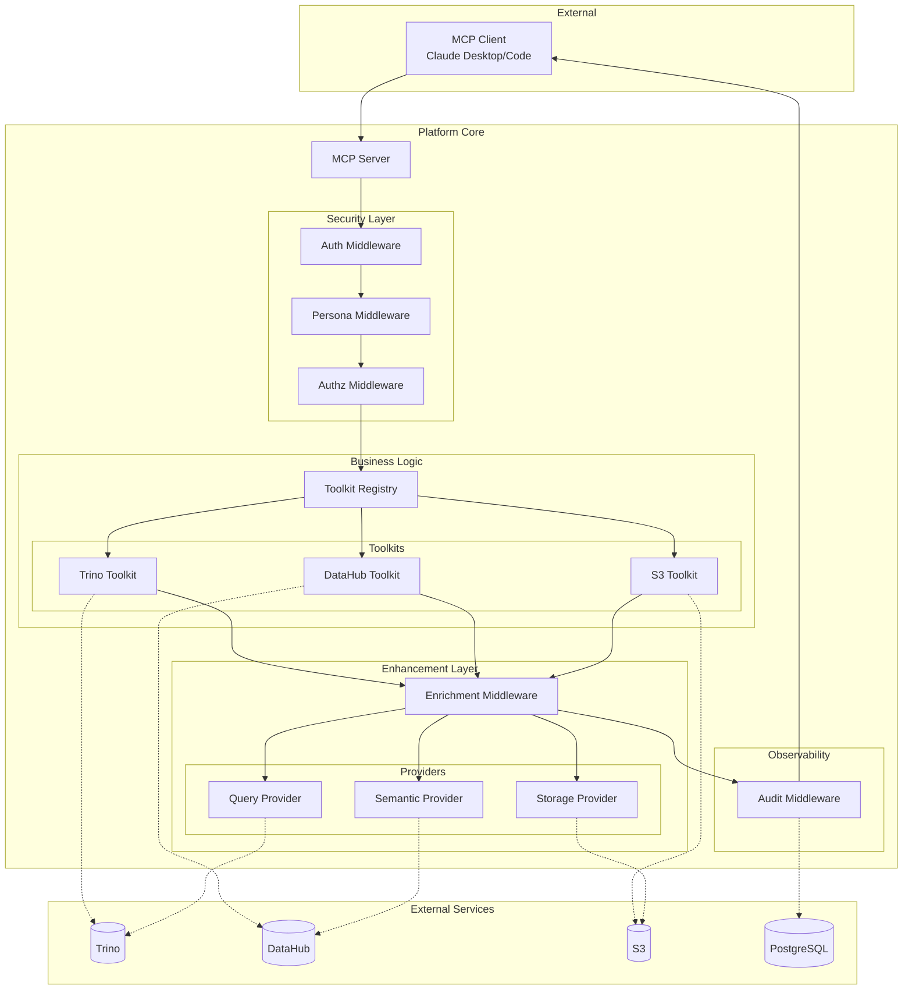
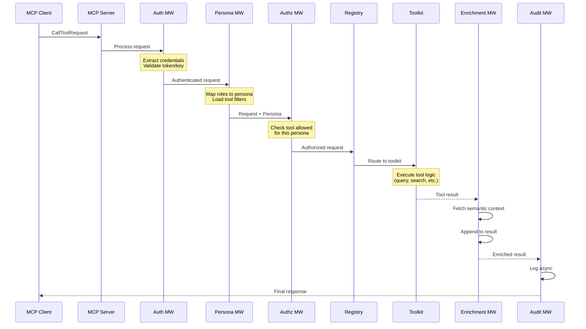
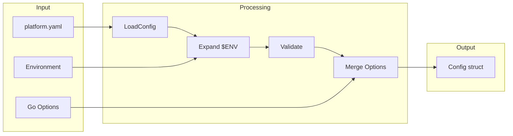
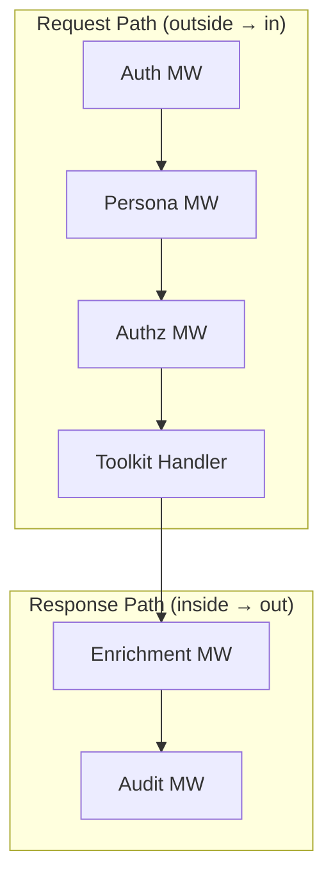
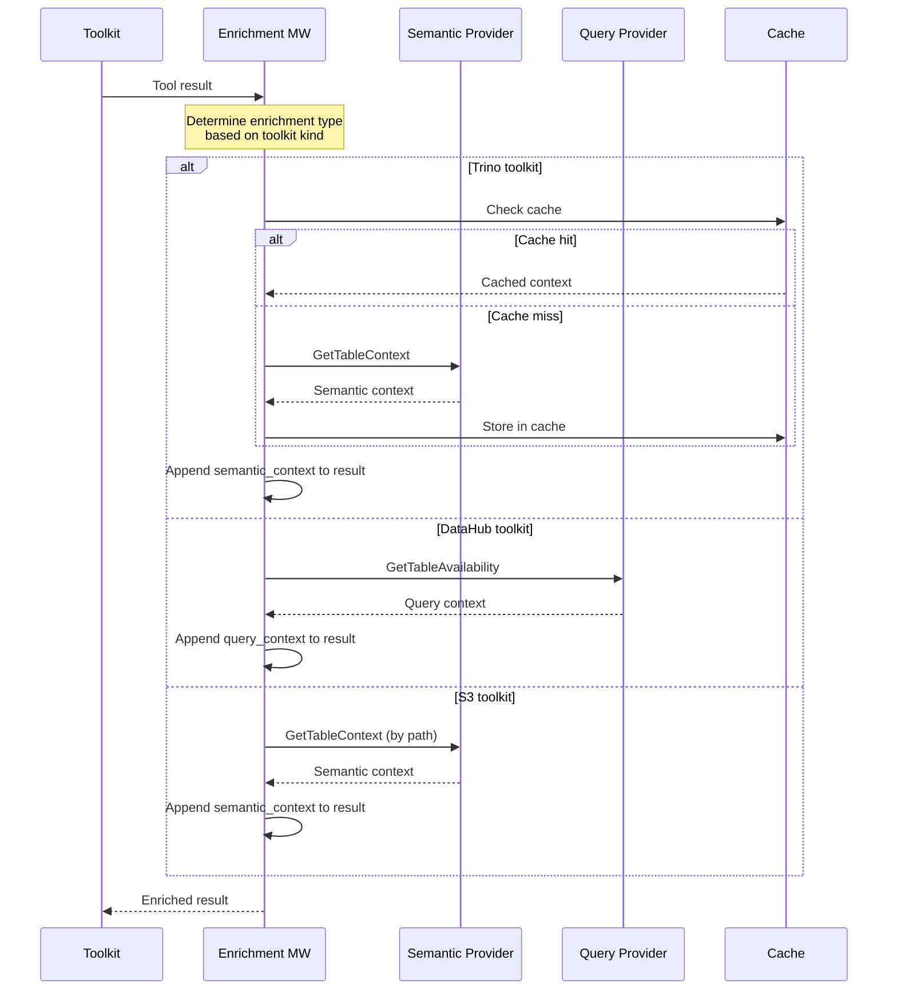

# Library Architecture

This document explains the internal architecture of mcp-data-platform for developers building custom MCP servers or extending the platform.

---

## Design Principles

Before diving into components, understand the design decisions:

1. **Composition over inheritance**: Components are composed via interfaces, not class hierarchies
2. **Fail-closed security**: Every security check defaults to deny
3. **Provider abstraction**: External services accessed through provider interfaces
4. **Middleware chain**: Cross-cutting concerns handled as composable middleware
5. **Toolkit encapsulation**: Each data source wrapped in a toolkit with consistent interface

---

## System Overview



---

## Request Flow

A tool call flows through multiple stages. Understanding this flow is essential for debugging and extension.



### Stage Details

| Stage | Responsibility | Failure Behavior |
|-------|----------------|------------------|
| **Auth** | Validate credentials | 401 Unauthorized |
| **Persona** | Map user to persona | Use default persona |
| **Authz** | Check tool permission | 403 Forbidden |
| **Registry** | Route to toolkit | 404 Tool not found |
| **Toolkit** | Execute operation | Toolkit-specific error |
| **Enrichment** | Add semantic context | Return unenriched result |
| **Audit** | Log the request | Log error, continue |

---

## Core Components

### Platform

The `Platform` struct is the main orchestrator and entry point:

```go
type Platform struct {
    mcpServer        *mcp.Server
    config           *Config
    toolkitRegistry  *registry.Registry
    authenticator    middleware.Authenticator
    authorizer       middleware.Authorizer
    auditLogger      middleware.AuditLogger
    semanticProvider semantic.Provider
    queryProvider    query.Provider
    storageProvider  storage.Provider
    closers          []io.Closer
}
```

**Key responsibilities:**

1. Load and validate configuration
2. Initialize providers and toolkits
3. Register MCP protocol-level middleware
4. Register tools with the MCP server
5. Manage lifecycle (startup, shutdown)

**Creating a platform:**

```go
// From configuration file
cfg, err := platform.LoadConfig("platform.yaml")
if err != nil {
    log.Fatal(err)
}
p, err := platform.New(platform.WithConfig(cfg))

// Or programmatically with options
p, err := platform.New(
    platform.WithServerName("my-platform"),
    platform.WithTrinoToolkit("primary", trinoCfg),
    platform.WithDataHubToolkit("primary", datahubCfg),
    platform.WithSemanticProvider("datahub", "primary"),
    platform.WithInjection(platform.InjectionConfig{
        TrinoSemanticEnrichment: true,
    }),
)
```

### Configuration Flow



Configuration sources are merged in order:

1. YAML file provides base configuration
2. Environment variables expand `${VAR}` syntax
3. Programmatic options override specific values

---

## Middleware Chain

The middleware chain implements the decorator pattern for request processing:

```go
type Chain struct {
    middlewares []Middleware
}

type Middleware func(next Handler) Handler
type Handler func(ctx context.Context, req mcp.CallToolRequest) (*mcp.CallToolResult, error)
```

### Building the Chain

```go
chain := middleware.NewChain()

// Add in order (first added = outermost)
chain.Use(AuthMiddleware(authConfig))
chain.Use(PersonaMiddleware(personaRegistry))
chain.Use(AuthzMiddleware())
// ... toolkit handler is innermost ...
chain.Use(EnrichmentMiddleware(semanticProvider))
chain.Use(AuditMiddleware(auditLogger))
```

### Execution Order



Middleware wraps handlers like layers of an onion:

```go
func AuthMiddleware(cfg AuthConfig) Middleware {
    return func(next Handler) Handler {
        return func(ctx context.Context, req mcp.CallToolRequest) (*mcp.CallToolResult, error) {
            // Pre-processing: validate credentials
            userCtx, err := validateCredentials(ctx, cfg)
            if err != nil {
                return nil, &PlatformError{Code: ErrCodeAuth, Cause: err}
            }

            // Add user context and continue
            ctx = auth.WithUserContext(ctx, userCtx)
            return next(ctx, req)
        }
    }
}

func EnrichmentMiddleware(provider semantic.Provider) Middleware {
    return func(next Handler) Handler {
        return func(ctx context.Context, req mcp.CallToolRequest) (*mcp.CallToolResult, error) {
            // Execute inner handler first
            result, err := next(ctx, req)
            if err != nil {
                return nil, err
            }

            // Post-processing: enrich result
            enriched := enrichResult(ctx, provider, result)
            return enriched, nil
        }
    }
}
```

### Platform Context

Context flows through the middleware chain carrying request state:

```go
type PlatformContext struct {
    // Identity
    UserContext  *auth.UserContext
    Persona      *persona.Persona

    // Request metadata
    RequestID    string
    ToolkitKind  string
    ToolkitName  string
    ToolName     string

    // Timing
    StartTime    time.Time
}
```

Access context in handlers:

```go
func myHandler(ctx context.Context, req mcp.CallToolRequest) (*mcp.CallToolResult, error) {
    pctx := middleware.GetPlatformContext(ctx)

    log.Printf("User %s (persona: %s) called %s",
        pctx.UserContext.Subject,
        pctx.Persona.Name,
        pctx.ToolName)

    // ...
}
```

---

## Provider Interfaces

Providers abstract access to external services. Implementing these interfaces lets you swap backends.

### Semantic Provider

Provides business metadata for data assets:

```go
type Provider interface {
    // Identification
    Name() string

    // Table context
    GetTableContext(ctx context.Context, table TableIdentifier) (*TableContext, error)
    GetColumnContext(ctx context.Context, column ColumnIdentifier) (*ColumnContext, error)
    GetColumnsContext(ctx context.Context, table TableIdentifier) (map[string]*ColumnContext, error)

    // Lineage
    GetLineage(ctx context.Context, table TableIdentifier, direction LineageDirection, maxDepth int) (*LineageInfo, error)

    // Search
    SearchTables(ctx context.Context, filter SearchFilter) ([]TableSearchResult, error)

    // Glossary
    GetGlossaryTerm(ctx context.Context, urn string) (*GlossaryTerm, error)

    // Lifecycle
    Close() error
}
```

**TableContext** contains everything the platform knows about a table:

```go
type TableContext struct {
    URN           string
    Description   string
    Owners        []Owner
    Tags          []string
    Domain        *Domain
    GlossaryTerms []GlossaryTermRef
    QualityScore  float64
    Deprecation   *Deprecation
    CustomProps   map[string]string
}
```

### Query Provider

Provides query execution capabilities:

```go
type Provider interface {
    // Identification
    Name() string

    // Table resolution (URN → query identifier)
    ResolveTable(ctx context.Context, urn string) (*TableIdentifier, error)

    // Availability checking
    GetTableAvailability(ctx context.Context, urn string) (*TableAvailability, error)

    // Query examples
    GetQueryExamples(ctx context.Context, urn string) ([]QueryExample, error)

    // Batch availability for search results
    GetExecutionContext(ctx context.Context, urns []string) (*ExecutionContext, error)

    // Schema information
    GetTableSchema(ctx context.Context, table TableIdentifier) (*TableSchema, error)

    // Lifecycle
    Close() error
}
```

### Storage Provider

Provides object storage access:

```go
type Provider interface {
    // Identification
    Name() string

    // Availability checking
    GetDatasetAvailability(ctx context.Context, urn string) (*DatasetAvailability, error)

    // Object information
    GetObjectInfo(ctx context.Context, bucket, key string) (*ObjectInfo, error)

    // Lifecycle
    Close() error
}
```

### Implementing a Custom Provider

Example: Custom semantic provider wrapping a different metadata store:

```go
package custom

import (
    "context"
    "github.com/txn2/mcp-data-platform/pkg/semantic"
)

type CustomProvider struct {
    client *customclient.Client
    cache  *cache.Cache
}

func New(cfg Config) (*CustomProvider, error) {
    client, err := customclient.New(cfg.URL, cfg.Token)
    if err != nil {
        return nil, err
    }
    return &CustomProvider{
        client: client,
        cache:  cache.New(cfg.CacheTTL),
    }, nil
}

func (p *CustomProvider) Name() string {
    return "custom"
}

func (p *CustomProvider) GetTableContext(ctx context.Context, table semantic.TableIdentifier) (*semantic.TableContext, error) {
    // Check cache first
    key := table.String()
    if cached, ok := p.cache.Get(key); ok {
        return cached.(*semantic.TableContext), nil
    }

    // Fetch from backend
    metadata, err := p.client.GetTableMetadata(ctx, table.Catalog, table.Schema, table.Table)
    if err != nil {
        return nil, err
    }

    // Convert to standard format
    result := &semantic.TableContext{
        URN:          metadata.URN,
        Description:  metadata.Description,
        Owners:       convertOwners(metadata.Owners),
        Tags:         metadata.Tags,
        QualityScore: metadata.Quality,
    }

    // Cache the result
    p.cache.Set(key, result)
    return result, nil
}

// Implement other interface methods...

func (p *CustomProvider) Close() error {
    return p.client.Close()
}
```

---

## Toolkit Interface

Toolkits encapsulate access to specific data services:

```go
type Toolkit interface {
    // Identification
    Kind() string    // "trino", "datahub", "s3", or custom
    Name() string    // Instance name (e.g., "primary", "analytics")

    // Tool registration
    RegisterTools(s *mcp.Server)
    Tools() []string  // List of tool names

    // Provider injection (for enrichment)
    SetSemanticProvider(provider semantic.Provider)
    SetQueryProvider(provider query.Provider)

    // Lifecycle
    Close() error
}
```

### Toolkit Registry

The registry manages toolkit lifecycle and routing:

```go
type Registry struct {
    toolkits map[string]Toolkit  // name → toolkit
    byKind   map[string][]Toolkit // kind → toolkits
    mu       sync.RWMutex
}

// Register adds a toolkit
func (r *Registry) Register(toolkit Toolkit) error {
    r.mu.Lock()
    defer r.mu.Unlock()

    name := toolkit.Name()
    if _, exists := r.toolkits[name]; exists {
        return fmt.Errorf("toolkit %s already registered", name)
    }

    r.toolkits[name] = toolkit
    r.byKind[toolkit.Kind()] = append(r.byKind[toolkit.Kind()], toolkit)
    return nil
}

// Get returns a toolkit by name
func (r *Registry) Get(name string) (Toolkit, bool) {
    r.mu.RLock()
    defer r.mu.RUnlock()
    tk, ok := r.toolkits[name]
    return tk, ok
}
```

### Creating a Custom Toolkit

```go
package mytoolkit

import (
    "context"
    "github.com/modelcontextprotocol/go-sdk/mcp"
    "github.com/txn2/mcp-data-platform/pkg/semantic"
    "github.com/txn2/mcp-data-platform/pkg/query"
)

type Toolkit struct {
    name     string
    config   Config
    client   *myclient.Client

    semanticProvider semantic.Provider
    queryProvider    query.Provider
}

func New(name string, cfg Config) (*Toolkit, error) {
    client, err := myclient.New(cfg)
    if err != nil {
        return nil, err
    }
    return &Toolkit{
        name:   name,
        config: cfg,
        client: client,
    }, nil
}

func (t *Toolkit) Kind() string { return "mytoolkit" }
func (t *Toolkit) Name() string { return t.name }

func (t *Toolkit) Tools() []string {
    return []string{"mytoolkit_operation", "mytoolkit_query"}
}

func (t *Toolkit) RegisterTools(s *mcp.Server) {
    s.AddTool(mcp.Tool{
        Name:        "mytoolkit_operation",
        Description: "Perform a custom operation",
        InputSchema: mcp.ToolInputSchema{
            Type: "object",
            Properties: map[string]any{
                "input": map[string]any{
                    "type":        "string",
                    "description": "Operation input",
                },
            },
            Required: []string{"input"},
        },
    }, t.handleOperation)

    s.AddTool(mcp.Tool{
        Name:        "mytoolkit_query",
        Description: "Query the custom backend",
        InputSchema: mcp.ToolInputSchema{
            Type: "object",
            Properties: map[string]any{
                "query": map[string]any{
                    "type":        "string",
                    "description": "Query string",
                },
                "limit": map[string]any{
                    "type":        "number",
                    "description": "Maximum results",
                },
            },
            Required: []string{"query"},
        },
    }, t.handleQuery)
}

func (t *Toolkit) handleOperation(ctx context.Context, req mcp.CallToolRequest) (*mcp.CallToolResult, error) {
    input := req.Params.Arguments["input"].(string)

    result, err := t.client.DoOperation(ctx, input)
    if err != nil {
        return mcp.NewToolResultError(err.Error()), nil
    }

    return mcp.NewToolResultText(result), nil
}

func (t *Toolkit) SetSemanticProvider(p semantic.Provider) { t.semanticProvider = p }
func (t *Toolkit) SetQueryProvider(p query.Provider)       { t.queryProvider = p }
func (t *Toolkit) Close() error                            { return t.client.Close() }
```

---

## Enrichment Architecture

The enrichment middleware adds semantic context to tool responses:



### Enrichment Decision Logic

```go
func (m *EnrichmentMiddleware) enrich(ctx context.Context, pctx *PlatformContext, result *mcp.CallToolResult) *mcp.CallToolResult {
    switch pctx.ToolkitKind {
    case "trino":
        if m.config.TrinoSemanticEnrichment {
            return m.enrichTrinoResult(ctx, result)
        }
    case "datahub":
        if m.config.DataHubQueryEnrichment {
            return m.enrichDataHubResult(ctx, result)
        }
    case "s3":
        if m.config.S3SemanticEnrichment {
            return m.enrichS3Result(ctx, result)
        }
    }
    return result
}
```

### Graceful Degradation

Enrichment failures don't break the request:

```go
func (m *EnrichmentMiddleware) enrichTrinoResult(ctx context.Context, result *mcp.CallToolResult) *mcp.CallToolResult {
    tableID, err := extractTableIdentifier(result)
    if err != nil {
        // Can't determine table, return unenriched
        return result
    }

    semantic, err := m.semanticProvider.GetTableContext(ctx, tableID)
    if err != nil {
        // Log warning but continue
        log.Warnf("enrichment failed for %s: %v", tableID, err)
        return result
    }

    // Append semantic context to result
    return appendSemanticContext(result, semantic)
}
```

---

## Error Handling

The platform uses structured errors for consistent handling:

```go
type PlatformError struct {
    Code    string            // Machine-readable code
    Message string            // Human-readable message
    Cause   error             // Underlying error
    Details map[string]any    // Additional context
}

func (e *PlatformError) Error() string {
    if e.Cause != nil {
        return fmt.Sprintf("%s: %s: %v", e.Code, e.Message, e.Cause)
    }
    return fmt.Sprintf("%s: %s", e.Code, e.Message)
}

// Error codes
const (
    ErrCodeAuth       = "AUTH_ERROR"
    ErrCodeAuthz      = "AUTHZ_ERROR"
    ErrCodeToolkit    = "TOOLKIT_ERROR"
    ErrCodeProvider   = "PROVIDER_ERROR"
    ErrCodeConfig     = "CONFIG_ERROR"
    ErrCodeTimeout    = "TIMEOUT_ERROR"
    ErrCodeRateLimit  = "RATE_LIMIT_ERROR"
)
```

### Error Wrapping Pattern

```go
func (m *AuthMiddleware) validate(ctx context.Context) (*auth.UserContext, error) {
    token, err := extractToken(ctx)
    if err != nil {
        return nil, &PlatformError{
            Code:    ErrCodeAuth,
            Message: "missing credentials",
            Cause:   err,
        }
    }

    claims, err := m.validator.Validate(token)
    if err != nil {
        return nil, &PlatformError{
            Code:    ErrCodeAuth,
            Message: "invalid token",
            Cause:   err,
            Details: map[string]any{
                "token_prefix": token[:10] + "...",
            },
        }
    }

    return &auth.UserContext{
        Subject: claims.Subject,
        Roles:   claims.Roles,
    }, nil
}
```

---

## Thread Safety

The platform is designed for concurrent use:

| Component | Thread Safety |
|-----------|---------------|
| Platform | Safe after construction |
| Registry | Safe (uses RWMutex) |
| Middleware chain | Immutable after construction |
| Toolkits | Must be thread-safe |
| Providers | Must be thread-safe |
| PlatformContext | Per-request (no sharing) |

### Connection Pooling

Providers should pool connections:

```go
type TrinoProvider struct {
    pool *sql.DB  // Built-in connection pool
}

func New(cfg Config) (*TrinoProvider, error) {
    pool, err := sql.Open("trino", cfg.DSN)
    if err != nil {
        return nil, err
    }

    // Configure pool
    pool.SetMaxOpenConns(cfg.MaxOpenConns)
    pool.SetMaxIdleConns(cfg.MaxIdleConns)
    pool.SetConnMaxLifetime(cfg.ConnMaxLifetime)

    return &TrinoProvider{pool: pool}, nil
}
```

---

## Resource Management

Resources are cleaned up in reverse order of creation:

```go
func (p *Platform) Close() error {
    var errs []error

    // Close toolkits first (they use providers)
    for _, tk := range p.toolkits.All() {
        if err := tk.Close(); err != nil {
            errs = append(errs, fmt.Errorf("toolkit %s: %w", tk.Name(), err))
        }
    }

    // Close providers
    if p.providers.semantic != nil {
        if err := p.providers.semantic.Close(); err != nil {
            errs = append(errs, fmt.Errorf("semantic provider: %w", err))
        }
    }
    if p.providers.query != nil {
        if err := p.providers.query.Close(); err != nil {
            errs = append(errs, fmt.Errorf("query provider: %w", err))
        }
    }
    if p.providers.storage != nil {
        if err := p.providers.storage.Close(); err != nil {
            errs = append(errs, fmt.Errorf("storage provider: %w", err))
        }
    }

    // Close audit logger
    if p.audit != nil {
        if err := p.audit.Close(); err != nil {
            errs = append(errs, fmt.Errorf("audit logger: %w", err))
        }
    }

    // Close any additional closers
    for _, c := range p.closer {
        if err := c.Close(); err != nil {
            errs = append(errs, err)
        }
    }

    return errors.Join(errs...)
}
```

---

## Next Steps

- [Extensibility Guide](extensibility.md) - Add custom components
- [Providers Reference](../reference/providers.md) - Provider interface details
- [Middleware Reference](../reference/middleware.md) - Built-in middleware
- [Examples Gallery](../examples/index.md) - Real-world configurations
