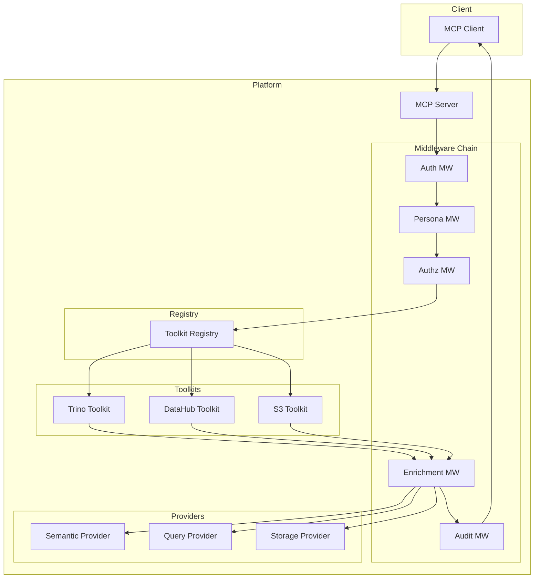
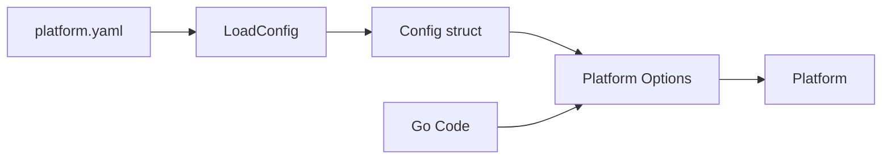
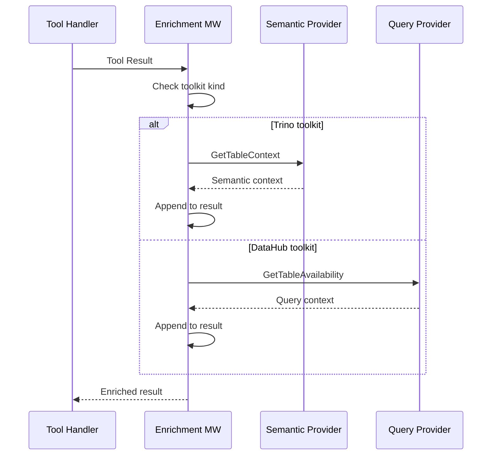

# Library Architecture

This document describes the internal architecture of mcp-data-platform for developers building custom MCP servers.

## System Overview



## Request Flow

1. **MCP Server** receives tool call request
2. **Auth Middleware** validates credentials
3. **Persona Middleware** maps user to persona
4. **Authz Middleware** checks tool permissions
5. **Toolkit Registry** routes to appropriate toolkit
6. **Toolkit** executes the tool
7. **Enrichment Middleware** adds cross-service context
8. **Audit Middleware** logs the request
9. **Response** returned to client

## Core Components

### Platform

The `Platform` struct is the main orchestrator:

```go
type Platform struct {
    server     *mcp.Server
    config     *Config
    toolkits   *registry.Registry
    middleware *middleware.Chain
    providers  struct {
        semantic semantic.Provider
        query    query.Provider
        storage  storage.Provider
    }
}
```

Key methods:

```go
// New creates a platform with options
func New(opts ...Option) (*Platform, error)

// Run starts the MCP server
func (p *Platform) Run() error

// Close releases resources
func (p *Platform) Close() error
```

### Toolkit Registry

The registry manages toolkit lifecycle:

```go
type Registry struct {
    toolkits map[string]Toolkit
    byKind   map[string][]Toolkit
}

type Toolkit interface {
    Kind() string
    Name() string
    RegisterTools(s *mcp.Server)
    Tools() []string
    SetSemanticProvider(provider semantic.Provider)
    SetQueryProvider(provider query.Provider)
    SetMiddleware(chain *middleware.Chain)
    Close() error
}
```

### Middleware Chain

Request processing pipeline:

```go
type Chain struct {
    middlewares []Middleware
}

type Middleware func(next Handler) Handler
type Handler func(ctx context.Context, req mcp.CallToolRequest) (*mcp.CallToolResult, error)

func (c *Chain) Execute(ctx context.Context, req mcp.CallToolRequest) (*mcp.CallToolResult, error) {
    // Build handler chain
    handler := c.finalHandler
    for i := len(c.middlewares) - 1; i >= 0; i-- {
        handler = c.middlewares[i](handler)
    }
    return handler(ctx, req)
}
```

### Platform Context

Context passed through the middleware chain:

```go
type PlatformContext struct {
    UserContext  *auth.UserContext
    Persona      *persona.Persona
    ToolkitKind  string
    ToolkitName  string
    ToolName     string
    RequestID    string
    StartTime    time.Time
}
```

## Provider Interfaces

### Semantic Provider

```go
type Provider interface {
    Name() string

    // Table context
    GetTableContext(ctx context.Context, table TableIdentifier) (*TableContext, error)
    GetColumnContext(ctx context.Context, column ColumnIdentifier) (*ColumnContext, error)
    GetColumnsContext(ctx context.Context, table TableIdentifier) (map[string]*ColumnContext, error)

    // Lineage
    GetLineage(ctx context.Context, table TableIdentifier, direction LineageDirection, maxDepth int) (*LineageInfo, error)

    // Search
    SearchTables(ctx context.Context, filter SearchFilter) ([]TableSearchResult, error)

    // Glossary
    GetGlossaryTerm(ctx context.Context, urn string) (*GlossaryTerm, error)

    Close() error
}
```

### Query Provider

```go
type Provider interface {
    Name() string

    // Table resolution
    ResolveTable(ctx context.Context, urn string) (*TableIdentifier, error)

    // Availability
    GetTableAvailability(ctx context.Context, urn string) (*TableAvailability, error)

    // Examples
    GetQueryExamples(ctx context.Context, urn string) ([]QueryExample, error)

    // Execution context
    GetExecutionContext(ctx context.Context, urns []string) (*ExecutionContext, error)

    // Schema
    GetTableSchema(ctx context.Context, table TableIdentifier) (*TableSchema, error)

    Close() error
}
```

### Storage Provider

```go
type Provider interface {
    Name() string

    // Dataset availability
    GetDatasetAvailability(ctx context.Context, urn string) (*DatasetAvailability, error)

    // Object info
    GetObjectInfo(ctx context.Context, bucket, key string) (*ObjectInfo, error)

    Close() error
}
```

## Toolkit Adapters

Each toolkit wraps an underlying MCP toolkit:

```go
// Trino toolkit adapter
type Toolkit struct {
    name         string
    config       Config
    client       *trinoclient.Client
    trinoToolkit *trinotools.Toolkit

    semanticProvider semantic.Provider
    queryProvider    query.Provider
    middlewareChain  *middleware.Chain
}

func (t *Toolkit) RegisterTools(s *mcp.Server) {
    t.trinoToolkit.RegisterAll(s)
}

func (t *Toolkit) Tools() []string {
    return []string{
        "trino_query",
        "trino_explain",
        "trino_list_catalogs",
        // ...
    }
}
```

## Configuration Flow



Configuration can come from YAML or programmatic options:

```go
// From YAML
cfg, _ := platform.LoadConfig("platform.yaml")
p, _ := platform.New(platform.WithConfig(cfg))

// From code
p, _ := platform.New(
    platform.WithTrinoToolkit("primary", trinoCfg),
    platform.WithSemanticProvider("datahub", "primary"),
)
```

## Enrichment Architecture



## Error Handling

The platform uses structured errors:

```go
type PlatformError struct {
    Code    string
    Message string
    Cause   error
    Details map[string]any
}

// Error codes
const (
    ErrCodeAuth       = "AUTH_ERROR"
    ErrCodeAuthz      = "AUTHZ_ERROR"
    ErrCodeToolkit    = "TOOLKIT_ERROR"
    ErrCodeProvider   = "PROVIDER_ERROR"
    ErrCodeConfig     = "CONFIG_ERROR"
)
```

Middleware should wrap errors with context:

```go
func AuthMiddleware() Middleware {
    return func(next Handler) Handler {
        return func(ctx context.Context, req mcp.CallToolRequest) (*mcp.CallToolResult, error) {
            if err := validateAuth(ctx); err != nil {
                return nil, &PlatformError{
                    Code:    ErrCodeAuth,
                    Message: "authentication failed",
                    Cause:   err,
                }
            }
            return next(ctx, req)
        }
    }
}
```

## Thread Safety

The platform is designed for concurrent use:

- Toolkits are thread-safe
- Providers must be thread-safe
- Middleware chain is immutable after construction
- Platform context is per-request

## Resource Management

Resources are cleaned up in reverse order of creation:

```go
func (p *Platform) Close() error {
    var errs []error

    // Close toolkits
    for _, tk := range p.toolkits.All() {
        if err := tk.Close(); err != nil {
            errs = append(errs, err)
        }
    }

    // Close providers
    if p.providers.semantic != nil {
        if err := p.providers.semantic.Close(); err != nil {
            errs = append(errs, err)
        }
    }
    // ...

    return errors.Join(errs...)
}
```

## Next Steps

- [Extensibility](extensibility.md) - Add custom components
- [Providers Reference](../reference/providers.md) - Provider details
- [Middleware Reference](../reference/middleware.md) - Middleware details
