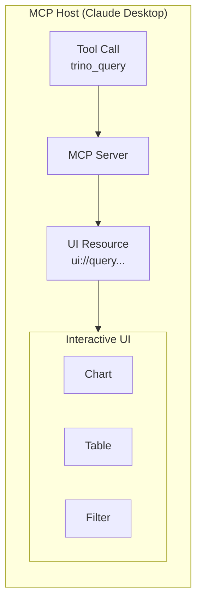

# MCP Apps Guide

MCP Apps provide interactive UI components that enhance tool results. Instead of raw JSON, users see sortable tables, charts, and filters.

## Overview



## Included App: query-results

The `query-results` app enhances `trino_query` responses with:

- **Sortable table** - Click column headers to sort
- **Search/filter** - Filter rows across all columns
- **Charts** - Bar, line, pie, doughnut visualizations
- **Number formatting** - Thousands separators, null handling
- **Dark mode** - Respects system preference
- **Stats bar** - Query time, row count, query ID

### Expected Data Format

The app expects JSON with this structure:

```json
{
  "columns": [
    {"name": "id", "type": "integer"},
    {"name": "product", "type": "varchar"},
    {"name": "revenue", "type": "double"}
  ],
  "rows": [
    {"id": 1, "product": "Widget A", "revenue": 15000.50},
    {"id": 2, "product": "Widget B", "revenue": 23000.75}
  ],
  "stats": {
    "row_count": 2,
    "duration_ms": 127,
    "query_id": "20260131_abc123"
  }
}
```

This format is automatically produced by the `trino_query` tool.

## Using Custom Apps

Mount your own apps directory and provide a config file:

```bash
docker run -p 8080:8080 \
  -v $(pwd)/my-apps:/etc/mcp-apps \
  -v $(pwd)/config.yaml:/config.yaml \
  ghcr.io/txn2/mcp-data-platform \
  --config /config.yaml
```

Your `config.yaml`:

```yaml
server:
  transport: sse
  address: ":8080"

mcpapps:
  enabled: true
  apps:
    my_app:
      enabled: true
      assets_path: "/etc/mcp-apps/my-app"
      tools:
        - trino_query
      csp:
        resource_domains:
          - "https://cdn.jsdelivr.net"
```

### Kubernetes

Use ConfigMaps to deploy apps:

```yaml
apiVersion: v1
kind: ConfigMap
metadata:
  name: mcp-app-custom
data:
  index.html: |
    <!DOCTYPE html>
    <html>
    <!-- Your app HTML -->
    </html>
```

Mount in your deployment:

```yaml
volumeMounts:
  - name: custom-app
    mountPath: /etc/mcp-apps/my-app
volumes:
  - name: custom-app
    configMap:
      name: mcp-app-custom
```

See `configs/examples/kubernetes/` for complete examples.

## Developing Apps

### Prerequisites

- Docker (only dependency needed)

### 1. Start Development Environment

```bash
git clone https://github.com/txn2/mcp-data-platform
cd mcp-data-platform

docker compose -f docker-compose.dev.yml up
```

### 2. Open Test Harness

Open http://localhost:8000/test-harness.html

The test harness provides:
- **Left panel**: Editable JSON test data
- **Right panel**: Live app preview
- **Send Test Data**: Sends data to the app
- **Reload App**: Reloads after editing source files

### 3. Edit and Test

1. Edit `./apps/query-results/index.html`
2. Click **Reload App**
3. Click **Send Test Data**
4. Iterate

Changes are served immediately - no restart needed.

### MCP Protocol Testing

To test with real Trino queries:

1. Open http://localhost:6274 (MCP Inspector)
2. Connect to: `http://mcp-server:3001/sse`
3. Run `trino_query`:
   ```json
   {"sql": "SELECT 1 as id, 'Test' as name, 100.50 as value"}
   ```

## Creating Custom Apps

### App Structure

```
my-app/
├── index.html    # Entry point (required)
├── styles.css    # Optional
├── app.js        # Optional
└── assets/       # Optional
```

### MCP Apps Protocol

Apps communicate via `postMessage`:

```javascript
// Initialize on load
window.parent.postMessage({
  jsonrpc: '2.0',
  id: 1,
  method: 'ui/initialize',
  params: {
    protocolVersion: '2025-01-09',
    appInfo: { name: 'My App', version: '1.0.0' }
  }
}, '*');

// Listen for tool results
window.addEventListener('message', (event) => {
  if (event.data?.method === 'ui/notifications/tool-result') {
    const data = JSON.parse(event.data.params.content[0].text);
    // Render your UI
  }
});
```

### Minimal Example

```html
<!DOCTYPE html>
<html>
<head><title>My App</title></head>
<body>
  <div id="results"></div>
  <script>
    window.addEventListener('message', (event) => {
      if (event.data?.method === 'ui/notifications/tool-result') {
        const data = JSON.parse(event.data.params.content[0].text);
        document.getElementById('results').innerHTML =
          `<pre>${JSON.stringify(data, null, 2)}</pre>`;
      }
    });

    window.parent.postMessage({
      jsonrpc: '2.0',
      id: 1,
      method: 'ui/initialize',
      params: { protocolVersion: '2025-01-09' }
    }, '*');
  </script>
</body>
</html>
```

## Configuration Reference

```yaml
mcpapps:
  enabled: true
  apps:
    app_name:
      enabled: true
      assets_path: "/absolute/path/to/app"  # Required
      entry_point: "index.html"              # Default: index.html
      resource_uri: "ui://app_name"          # Default: ui://<app_name>
      tools:                                 # Required: tools this app enhances
        - trino_query
      csp:
        resource_domains:                    # Allowed CDN origins
          - "https://cdn.jsdelivr.net"
        connect_domains:                     # Allowed fetch/XHR endpoints
          - "https://api.example.com"
      config:                                # Injected as JSON into HTML
        maxRows: 1000
```

### Config Injection

The `config` object is injected as:

```html
<script id="app-config" type="application/json">{"maxRows":1000}</script>
```

Access in JavaScript:

```javascript
const config = JSON.parse(document.getElementById('app-config').textContent);
```

## Security

### Content Security Policy

Apps declare required CSP domains in config. The server enforces these restrictions.

### Path Traversal Protection

Asset requests are validated to stay within `assets_path`. Requests like `../../../etc/passwd` are rejected.

### Sandboxing

Apps run in sandboxed iframes controlled by the MCP host.

## Troubleshooting

| Problem | Solution |
|---------|----------|
| App not loading | Check `assets_path` is absolute and exists |
| Changes not appearing | Click Reload App, or hard refresh (Cmd+Shift+R) |
| CSP errors in console | Add required domains to `csp.resource_domains` |
| Tool not enhanced | Verify tool name matches exactly (e.g., `trino_query`) |
