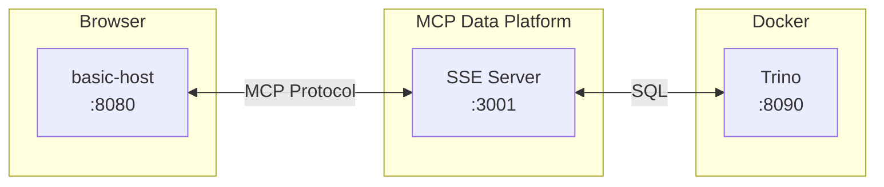

# MCP Apps Development Guide

Local development environment for building and debugging MCP Apps.

## Prerequisites

- Go 1.21+
- Docker
- Node.js 18+

## Architecture



| Component | Port | Purpose |
|-----------|------|---------|
| basic-host | 8080 | MCP Apps test harness |
| mcp-data-platform | 3001 | MCP server (SSE) |
| Trino | 8090 | Query engine |

## Quick Start

Run all commands from the project root.

### Step 1: Start Trino

```bash
docker run -d --name trino-dev -p 8090:8080 trinodb/trino
```

Verify it's ready:
```bash
curl -s http://localhost:8090/v1/info | jq .starting
# Returns: false (when ready)
```

### Step 2: Start MCP Data Platform

```bash
go run ./cmd/mcp-data-platform/. --config configs/dev-mcpapps.yaml
```

You should see:
```
WARNING: SSE transport without TLS - credentials may be transmitted in plaintext
Starting SSE server on :3001
```

### Step 3: Start the MCP Apps Test Host

One-time setup (from project root):
```bash
git clone https://github.com/modelcontextprotocol/ext-apps.git
cd ext-apps && npm install
cd ..
```

Start basic-host (from project root):
```bash
cd ext-apps/examples/basic-host
SERVERS='["http://localhost:3001"]' npm start
```

### Step 4: Test

1. Open http://localhost:8080
2. In the basic-host interface, call the `trino_query` tool with this JSON:

```json
{"sql": "SELECT 1 as id, 'Product A' as name, 15000.50 as revenue UNION ALL SELECT 2, 'Product B', 23000.75 UNION ALL SELECT 3, 'Product C', 8500.25"}
```

You should see an interactive table with chart visualization.

## Development Workflow

### Editing MCP App HTML

Source files:
```
pkg/mcpapps/queryresults/assets/index.html
```

After editing, restart the MCP server (Ctrl+C, then `go run` again) and hard refresh the browser (Cmd+Shift+R).

### Debugging

1. Open DevTools (F12)
2. Console tab shows `[MCP-APP]` prefixed logs
3. Network tab shows MCP protocol messages

### Common Issues

**Port already in use**

```bash
lsof -ti:3001 | xargs kill -9  # MCP server
lsof -ti:8080 | xargs kill -9  # basic-host
docker stop trino-dev          # Trino
```

**"No results to display"**

1. Check browser console for errors
2. Verify Trino is running: `curl http://localhost:8090/v1/info`
3. Check MCP server terminal for errors

## Test Queries

All queries use Trino's memory catalog (no database setup needed).

**Simple data:**
```json
{"sql": "SELECT 1 as id, 'Product A' as name, 15000.50 as revenue UNION ALL SELECT 2, 'Product B', 23000.75 UNION ALL SELECT 3, 'Product C', 8500.25"}
```

**More rows:**
```json
{"sql": "SELECT n as id, 'Item ' || CAST(n AS VARCHAR) as name, ROUND(RANDOM() * 10000, 2) as value FROM UNNEST(SEQUENCE(1, 20)) AS t(n)"}
```

**Date series:**
```json
{"sql": "SELECT DATE '2024-01-01' + INTERVAL '1' DAY * n as date, ROUND(RANDOM() * 1000, 2) as sales FROM UNNEST(SEQUENCE(0, 29)) AS t(n)"}
```

## File Structure

```
pkg/mcpapps/
├── types.go              # AppDefinition, UIMetadata
├── registry.go           # App registry
├── middleware.go         # Injects _meta.ui into tools/list
├── resource.go           # Serves embedded HTML
└── queryresults/
    ├── app.go            # App definition
    └── assets/
        └── index.html    # Interactive table + charts
```

## MCP Apps Protocol

- **App initiates**: Send `ui/initialize`, don't wait for host
- **Communication**: `window.parent.postMessage()`
- **Tool results**: Delivered via `ui/context_update`
- **MIME type**: `text/html;profile=mcp-app`

## Cleanup

```bash
pkill -f mcp-data-platform  # Stop MCP server
# Ctrl+C in basic-host terminal
docker stop trino-dev && docker rm trino-dev
```
