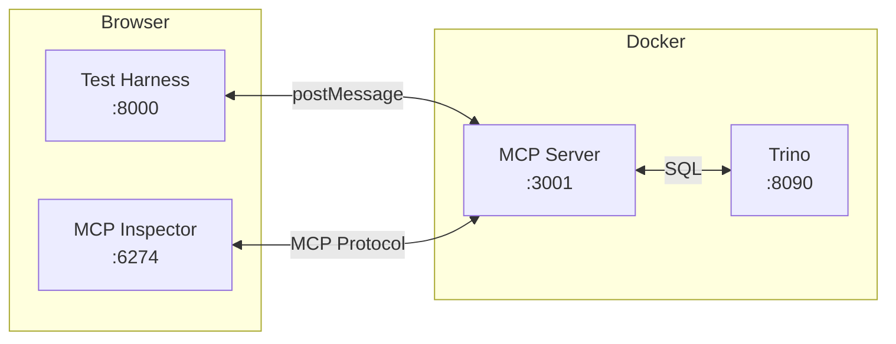

# MCP Apps Development

Create and test MCP Apps using the included development environment.

## Prerequisites

- Docker (only dependency needed)

## Quick Start

```bash
git clone https://github.com/txn2/mcp-data-platform
cd mcp-data-platform

docker compose -f docker-compose.dev.yml up
```

This starts:

| Component | URL | Purpose |
|-----------|-----|---------|
| Test Harness | http://localhost:8000 | App development and testing |
| MCP Server | http://localhost:3001 | MCP protocol (SSE) |
| MCP Inspector | http://localhost:6274 | Protocol debugging |
| Trino | http://localhost:8090 | Query engine |

## Development Workflow

### 1. Open Test Harness

Open http://localhost:8000/test-harness.html

The test harness provides:

- **Left panel**: Editable JSON test data
- **Right panel**: Live app preview
- **Send Test Data**: Sends data to the app
- **Reload App**: Reloads after editing source files

### 2. Edit and Test

1. Edit `./apps/platform-info/index.html` (or `./apps/query-results/index.html` for that app)
2. Click **Reload App** in the test harness
3. Click **Send Test Data**
4. See changes immediately

Changes are served instantly — no restart needed. The dev config (`configs/mcpapps-dev.yaml`) uses `assets_path` to point at the local source directory, overriding the embedded HTML so edits are reflected without rebuilding the binary.

### 3. Test with Real Queries

To test with actual Trino queries:

1. Open http://localhost:6274 (MCP Inspector)
2. Connect to: `http://mcp-server:3001/sse`
3. Run `trino_query`:
   ```json
   {"sql": "SELECT 1 as id, 'Test' as name, 100.50 as value"}
   ```

## Creating New Apps

### App Structure

```
my-app/
├── index.html    # Entry point (required)
├── styles.css    # Optional
├── app.js        # Optional
└── assets/       # Optional
```

### MCP Apps Protocol

Apps communicate with the host via `postMessage`:

```javascript
// Initialize on load
window.parent.postMessage({
  jsonrpc: '2.0',
  id: 1,
  method: 'ui/initialize',
  params: {
    protocolVersion: '2025-01-09',
    appInfo: { name: 'My App', version: '1.0.0' }
  }
}, '*');

// Listen for tool results
window.addEventListener('message', (event) => {
  if (event.data?.method === 'ui/notifications/tool-result') {
    const data = JSON.parse(event.data.params.content[0].text);
    // Render your UI
  }
});
```

### Minimal Example

```html
<!DOCTYPE html>
<html>
<head><title>My App</title></head>
<body>
  <div id="results"></div>
  <script>
    window.addEventListener('message', (event) => {
      if (event.data?.method === 'ui/notifications/tool-result') {
        const data = JSON.parse(event.data.params.content[0].text);
        document.getElementById('results').innerHTML =
          `<pre>${JSON.stringify(data, null, 2)}</pre>`;
      }
    });

    window.parent.postMessage({
      jsonrpc: '2.0',
      id: 1,
      method: 'ui/initialize',
      params: { protocolVersion: '2025-01-09' }
    }, '*');
  </script>
</body>
</html>
```

### Add to Development Environment

1. Create your app directory under `apps/`:
   ```
   apps/
   ├── platform-info/
   ├── query-results/
   └── my-new-app/
       └── index.html
   ```

2. Add configuration to `configs/mcpapps-dev.yaml`:
   ```yaml
   mcpapps:
     apps:
       my_new_app:
         enabled: true
         assets_path: "/apps/my-new-app"
         tools:
           - some_tool
   ```

3. Restart the dev environment:
   ```bash
   docker compose -f docker-compose.dev.yml up
   ```

## Test Queries

All queries use Trino's memory catalog (no database setup needed).

**Simple data:**
```json
{"sql": "SELECT 1 as id, 'Product A' as name, 15000.50 as revenue UNION ALL SELECT 2, 'Product B', 23000.75 UNION ALL SELECT 3, 'Product C', 8500.25"}
```

**More rows:**
```json
{"sql": "SELECT n as id, 'Item ' || CAST(n AS VARCHAR) as name, ROUND(RANDOM() * 10000, 2) as value FROM UNNEST(SEQUENCE(1, 20)) AS t(n)"}
```

**Date series:**
```json
{"sql": "SELECT DATE '2024-01-01' + INTERVAL '1' DAY * n as date, ROUND(RANDOM() * 1000, 2) as sales FROM UNNEST(SEQUENCE(0, 29)) AS t(n)"}
```

## Architecture



## Debugging

1. Open browser DevTools (F12)
2. Console tab shows `[MCP-APP]` prefixed logs
3. Network tab shows MCP protocol messages

## Troubleshooting

| Problem | Solution |
|---------|----------|
| Changes not appearing | Click Reload App, or hard refresh (Cmd+Shift+R) |
| "No results to display" | Check browser console for errors |
| Trino not responding | Wait for startup: `curl http://localhost:8090/v1/info` |
| Port already in use | `docker compose -f docker-compose.dev.yml down` |

## Cleanup

```bash
docker compose -f docker-compose.dev.yml down
```
