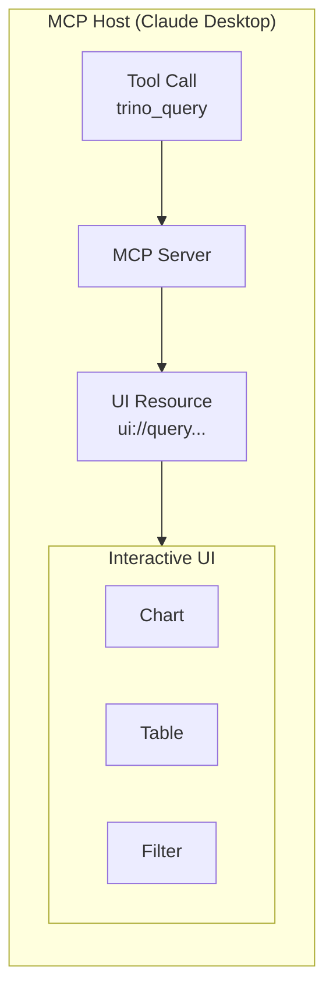

# MCP Apps

MCP Apps provide interactive UI components that enhance tool results. Instead of raw JSON responses, users see sortable tables, charts, and filters rendered in the MCP host.

## How It Works



1. User calls a tool (e.g., `trino_query`)
2. MCP server returns results with a UI resource reference
3. Host fetches the HTML app and renders it in an iframe
4. App receives tool results via `postMessage` and displays interactive UI

## Platform vs Apps

**MCP Data Platform provides:**

- MCP Apps infrastructure (resource serving, CSP, config injection)
- Protocol handling between host and apps
- Security controls (path traversal protection, sandboxing)

**You provide (for custom apps):**

- The actual HTML/JS/CSS apps
- Configuration mapping tools to apps

## Built-in App: platform-info

The platform ships with `platform-info` embedded in the binary. It registers automatically with zero configuration — no volume mounts, no `assets_path`, no `enabled: true` required.

`platform-info` renders an interactive panel for the `platform_info` tool showing:

- Platform name, version, and description
- Connected toolkits with icons
- Feature flags (enabled / disabled)
- Active personas

### Branding

Operators can inject custom branding via config without touching any HTML:

```yaml
mcpapps:
  apps:
    platform-info:
      config:
        brand_name: "ACME Data Platform"
        brand_url: "https://data.acme.com"
        logo_svg: "<svg ...>"
```

All branding fields are optional. When unset the app falls back to the server name and a default data-graph logo.

## Example App: query-results

The repository includes a community example app at `apps/query-results/` that demonstrates sortable tables, charts, search/filter, and dark mode for `trino_query` output. It is not built into the binary — operators deploy it as a custom app by mounting the assets directory. See [Configuration](configuration.md) for details.

## Next Steps

- [Configuration](configuration.md) - Enable MCP Apps and configure your apps
- [Development](development.md) - Create and test your own apps
