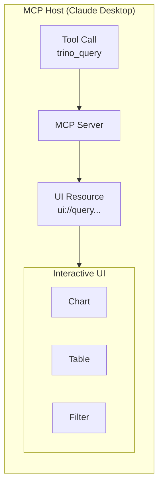

# MCP Apps

MCP Apps provide interactive UI components that enhance tool results. Instead of raw JSON responses, users see sortable tables, charts, and filters rendered in the MCP host.

## How It Works



1. User calls a tool (e.g., `trino_query`)
2. MCP server returns results with a UI resource reference
3. Host fetches the HTML app and renders it in an iframe
4. App receives tool results via `postMessage` and displays interactive UI

## Platform vs Apps

**MCP Data Platform provides:**

- MCP Apps infrastructure (resource serving, CSP, config injection)
- Protocol handling between host and apps
- Security controls (path traversal protection, sandboxing)

**You provide:**

- The actual HTML/JS/CSS apps
- Configuration mapping tools to apps

The platform does not include any apps by default. You must configure and mount your own apps, or use the examples from the repository.

## Example App: query-results

The repository includes an example app at `apps/query-results/` that demonstrates:

- Sortable table with column headers
- Search/filter across all columns
- Chart visualizations (bar, line, pie, doughnut)
- Number formatting with thousands separators
- Dark mode support (respects system preference)
- Stats bar showing query time, row count, query ID

This example is designed for `trino_query` and `trino_execute` tool output. You can use it as-is, customize it, or write your own apps from scratch.

### Expected Data Format

The query-results example expects JSON with this structure:

```json
{
  "columns": [
    {"name": "id", "type": "integer"},
    {"name": "product", "type": "varchar"},
    {"name": "revenue", "type": "double"}
  ],
  "rows": [
    {"id": 1, "product": "Widget A", "revenue": 15000.50},
    {"id": 2, "product": "Widget B", "revenue": 23000.75}
  ],
  "stats": {
    "row_count": 2,
    "duration_ms": 127,
    "query_id": "20260131_abc123"
  }
}
```

This format is automatically produced by the `trino_query` tool.

## Next Steps

- [Configuration](configuration.md) - Enable MCP Apps and configure your apps
- [Development](development.md) - Create and test your own apps
