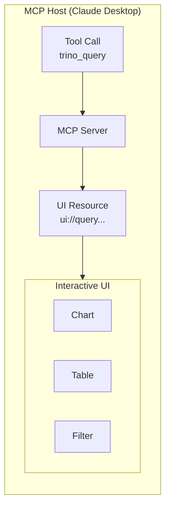

# MCP Apps

MCP Apps provide interactive UI components that enhance tool results. Instead of raw JSON responses, users see sortable tables, charts, and filters rendered in the MCP host.

## How It Works


```mermaid
flowchart LR
    subgraph Host["MCP Host (Claude Desktop)"]
        TC[Tool Call<br/>trino_query] --> Server[MCP Server]
        Server --> Resource[UI Resource<br/>ui://query...]
        Resource --> iframe
        subgraph iframe[Interactive UI]
            Chart
            Table
            Filter
        end
    end
```

1. User calls a tool (e.g., `trino_query`)
2. MCP server returns results with a UI resource reference
3. Host fetches the HTML app and renders it in an iframe
4. App receives tool results via `postMessage` and displays interactive UI

## Apps Calling Tools

An app can call tools itself, not just render the result that opened it. Those calls travel the same MCP transport as the agent's and meet the same gates, so when the session handle requirement is on, an app must call `platform_info` first and thread the `session_id` it returns on every subsequent call. Skipping the handshake produces a `SESSION_REQUIRED` refusal on the app's first data call.

`platform_info` itself is never gated, since it is the tool that mints the handle. See [Development](development.md#calling-tools-from-an-app) for the handshake, the expired-handle recovery path, and the response-correlation hazard on hosts that deliver results as notifications.

## Platform vs Apps

**MCP Data Platform provides:**

- MCP Apps infrastructure (resource serving, CSP, config injection)
- Protocol handling between host and apps
- Security controls (path traversal protection, sandboxing)

**You provide (for custom apps):**

- The actual HTML/JS/CSS apps
- Configuration mapping tools to apps

## Built-in App: platform-info

The platform ships with `platform-info` embedded in the binary. It registers automatically with zero configuration — no volume mounts, no `assets_path`, no `enabled: true` required.

`platform-info` renders an interactive panel for the `platform_info` tool showing:

- Platform name, version, and description
- Connected toolkits with icons
- Feature flags (enabled / disabled)
- Active personas

### Branding

Operators can inject custom branding via config without touching any HTML:

```yaml
mcpapps:
  apps:
    platform-info:
      config:
        brand_name: "ACME Data Platform"
        brand_url: "https://data.acme.com"
        logo_svg: "<svg ...>"
```

All branding fields are optional. When unset the app falls back to the server name and a default data-graph logo.

## Built-in App: prompt-browser

The platform also ships with `prompt-browser` embedded in the binary, bound to the `manage_prompt` tool. In an MCP Apps-capable host, a prompt discovery call renders an interactive prompt library browser:

- Search-as-you-type over the ranked prompt query, with My Prompts / Library buckets, collection and tag filters, and usage-based sorting
- Cards showing display name, description, version, approval provenance, and run count
- A detail view with full prompt content, provenance, and a form generated from the prompt's argument specs
- Run resolves the prompt through the `manage_prompt` `use` command with the filled arguments; when the host supports conversation insertion (`ui/message`), the rendered prompt is placed directly into the chat, otherwise the app offers the rendered content for copy

The app is presentation only: the same `manage_prompt` calls return complete structured JSON in clients that do not render apps, so nothing is lost outside app-capable hosts. It follows the same organization model as the portal library (collections, buckets, usage) with no app-local state.

Like `platform-info`, an operator `mcpapps.apps.prompt-browser` entry can override the injected config or replace the embedded HTML entirely via `assets_path`.

## Example App: query-results

The repository includes a community example app at `apps/query-results/` that demonstrates sortable tables, charts, search/filter, and dark mode for `trino_query` output. It is not built into the binary — operators deploy it as a custom app by mounting the assets directory. See [Configuration](configuration.md) for details.

## Next Steps

- [Configuration](configuration.md) - Enable MCP Apps and configure your apps
- [Development](development.md) - Create and test your own apps
