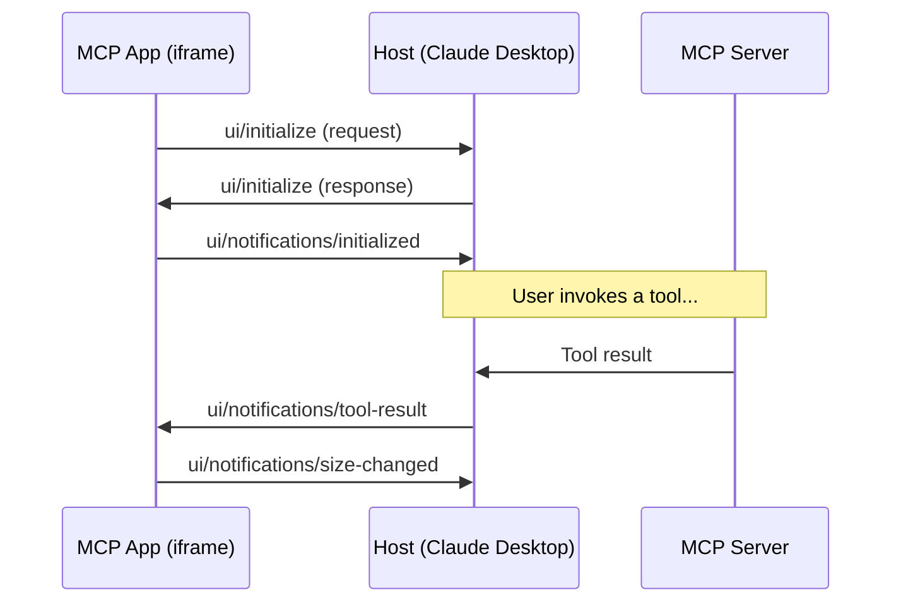

# MCP Apps Tutorial: Building Platform Info

This tutorial walks through creating an MCP App from scratch. You'll build a `platform-info` app that displays platform metadata returned by the `platform_info` tool.

**What you'll learn:**

- MCP Apps protocol and message flow
- How tool results are structured
- Using the test harness for development
- Styling with mock data
- Connecting to real MCP tools

## Prerequisites

- Docker installed
- Basic HTML/CSS/JavaScript knowledge
- A text editor

## Understanding the MCP Apps Protocol

Before writing code, let's understand how MCP Apps communicate with their host (Claude Desktop, MCP Inspector, or the test harness).

### Message Flow



### Key Concepts

| Concept | Description |
|---------|-------------|
| **Host** | The application embedding your MCP App (Claude Desktop, test harness) |
| **postMessage** | Browser API for cross-origin iframe communication |
| **JSON-RPC 2.0** | Message format used by all MCP Apps protocol messages |

### Protocol Messages

#### 1. `ui/initialize` (Request)

Your app sends this on load to establish the connection:

```javascript
window.parent.postMessage({
    jsonrpc: '2.0',
    id: 1,                              // Unique request ID
    method: 'ui/initialize',
    params: {
        protocolVersion: '2025-01-09',  // Required protocol version
        appInfo: {
            name: 'My App',             // Display name
            version: '1.0.0'
        },
        appCapabilities: {
            availableDisplayModes: ['inline', 'fullscreen', 'pip']
        }
    }
}, '*');
```

**Display Modes:**

| Mode | Description |
|------|-------------|
| `inline` | Rendered within the chat flow (default) |
| `fullscreen` | Takes over the entire viewport |
| `pip` | Picture-in-picture floating window |

#### 2. `ui/initialize` (Response)

The host responds with its capabilities:

```javascript
{
    jsonrpc: '2.0',
    id: 1,                              // Matches your request ID
    result: {
        protocolVersion: '2025-01-09',
        hostInfo: { name: 'Claude Desktop', version: '1.0.0' },
        hostCapabilities: { ... }
    }
}
```

#### 3. `ui/notifications/initialized`

After receiving the response, confirm initialization is complete:

```javascript
window.parent.postMessage({
    jsonrpc: '2.0',
    method: 'ui/notifications/initialized',
    params: {}
}, '*');
```

#### 4. `ui/notifications/tool-result`

The host sends tool results to your app:

```javascript
{
    jsonrpc: '2.0',
    method: 'ui/notifications/tool-result',
    params: {
        toolName: 'platform_info',
        content: [
            {
                type: 'text',
                text: '{"name":"mcp-data-platform","version":"1.0.0",...}'
            }
        ]
    }
}
```

**Important:** The actual tool output is JSON-encoded inside `params.content[0].text`. You must parse it:

```javascript
const toolOutput = JSON.parse(params.content[0].text);
```

#### 5. `ui/notifications/size-changed`

Tell the host your preferred dimensions after rendering:

```javascript
window.parent.postMessage({
    jsonrpc: '2.0',
    method: 'ui/notifications/size-changed',
    params: {
        width: document.body.scrollWidth,
        height: document.body.scrollHeight
    }
}, '*');
```

## Understanding Tool Results

Each MCP tool returns data in a specific structure. To build an app, you need to know what that structure looks like.

### Finding Tool Output Structure

**Option 1: Check the Tools API documentation**

See [Tools API Reference](../reference/tools-api.md) for all tool specifications.

**Option 2: Use MCP Inspector**

1. Start the dev environment: `docker compose -f docker-compose.dev.yml up`
2. Open http://localhost:6274
3. Connect to `http://mcp-server:3001/sse`
4. Call the tool and examine the response

**Option 3: Check the source code**

Tool implementations are in `pkg/tools/` or the respective toolkit packages.

### Platform Info Tool Output

The `platform_info` tool returns:

```json
{
  "name": "mcp-data-platform",
  "version": "1.0.0",
  "description": "Semantic data platform MCP server with bidirectional cross-injection",
  "toolkits": ["trino", "datahub", "s3"],
  "features": {
    "semantic_enrichment": true,
    "query_enrichment": true,
    "storage_enrichment": true,
    "audit_logging": true
  }
}
```

## Step 1: Create the App Directory

```bash
mkdir -p apps/platform-info
```

## Step 2: Create the HTML Skeleton

Create `apps/platform-info/index.html`:

```html
<!DOCTYPE html>
<html lang="en">
<head>
    <meta charset="UTF-8">
    <meta name="viewport" content="width=device-width, initial-scale=1.0">
    <title>Platform Info</title>
    <style>
        /* Styles go here */
    </style>
</head>
<body>
    <div class="container">
        <div id="loading" class="loading">Loading platform info...</div>
        <div id="content" class="hidden">
            <!-- Content goes here -->
        </div>
    </div>
    <script>
        // MCP Apps protocol implementation goes here
    </script>
</body>
</html>
```

## Step 3: Implement the Protocol Handler

Add this script section. We'll break down each part:

### 3.1: Core Communication Functions

```javascript
// Track request IDs for JSON-RPC
let requestId = 1;

// Send messages to the host (Claude Desktop, test harness, etc.)
function sendToHost(message) {
    window.parent.postMessage(message, '*');
}
```

**Why `window.parent`?** Your app runs in an iframe. `window.parent` references the host window.

**Why `'*'` for origin?** MCP Apps must work across different hosts (Claude Desktop, web clients), so we use wildcard origin. The protocol itself handles security.

### 3.2: Message Handler

```javascript
function handleMessage(msg) {
    try {
        if (!msg || typeof msg !== 'object') return;

        // Handle initialization response (has 'id' and 'result')
        if (msg.id && msg.result !== undefined) {
            if (msg.id === 1) {
                // Our init request was acknowledged, confirm we're ready
                sendToHost({
                    jsonrpc: '2.0',
                    method: 'ui/notifications/initialized',
                    params: {}
                });
            }
            return;
        }

        // Handle tool results (has 'method' of 'ui/notifications/tool-result')
        if (msg.method === 'ui/notifications/tool-result' && msg.params) {
            handleToolResult(msg.params);
        }
    } catch (e) {
        console.error('[MCP-APP] Message handling error:', e);
    }
}

// Register the message listener
window.addEventListener('message', (event) => {
    if (event.data) handleMessage(event.data);
});
```

**Message Types:**

| Condition | Message Type |
|-----------|--------------|
| Has `id` + `result` | Response to a request we sent |
| Has `method` = `ui/notifications/tool-result` | Tool result from the host |

### 3.3: Send Initialization Request

```javascript
// Send immediately on script load
sendToHost({
    jsonrpc: '2.0',
    id: requestId++,
    method: 'ui/initialize',
    params: {
        protocolVersion: '2025-01-09',
        appInfo: { name: 'Platform Info', version: '1.0.0' },
        appCapabilities: {
            availableDisplayModes: ['inline', 'pip']
        }
    }
});
```

### 3.4: Handle Tool Results

```javascript
function handleToolResult(result) {
    try {
        // Tool output is JSON inside content[0].text
        const text = result.content?.[0]?.text;
        if (!text) {
            showError('No data received');
            return;
        }

        // Parse the actual tool output
        const data = JSON.parse(text);

        // Now render it
        displayPlatformInfo(data);
    } catch (e) {
        console.error('[MCP-APP] Error parsing tool result:', e);
        showError('Failed to parse platform info');
    }
}
```

**The nested structure:**

```
result
  └── content (array)
        └── [0]
              └── text (string) ← JSON-encoded tool output
                    └── (parse this) → actual data object
```

## Step 4: Add Styling with Dark Mode

MCP Apps should support both light and dark mode. Use CSS custom properties with `prefers-color-scheme`:

```css
:root {
    --bg-color: #ffffff;
    --text-color: #1a1a1a;
    --text-muted: #6b7280;
    --border-color: #e5e7eb;
    --header-bg: #f9fafb;
    --accent-color: #3b82f6;
    --success-color: #10b981;
    --badge-bg: #eff6ff;
    --badge-text: #1e40af;
}

@media (prefers-color-scheme: dark) {
    :root {
        --bg-color: #111827;
        --text-color: #f9fafb;
        --text-muted: #9ca3af;
        --border-color: #374151;
        --header-bg: #1f2937;
        --accent-color: #60a5fa;
        --success-color: #34d399;
        --badge-bg: #1e3a5f;
        --badge-text: #93c5fd;
    }
}

body {
    background: var(--bg-color);
    color: var(--text-color);
}
```

## Step 5: Build the UI Components

### 5.1: HTML Structure

```html
<div class="container">
    <div id="loading" class="loading">Loading platform info...</div>

    <div id="content" class="platform-card hidden">
        <!-- Header: Name, Version, Description -->
        <div class="platform-header">
            <div class="platform-title">
                <span id="platform-name" class="platform-name">—</span>
                <span id="platform-version" class="platform-version">—</span>
            </div>
            <div id="platform-description" class="platform-description">—</div>
        </div>

        <!-- Toolkits Section -->
        <div class="section">
            <div class="section-title">Toolkits</div>
            <div id="toolkits" class="badge-list"></div>
        </div>

        <!-- Features Section -->
        <div class="section">
            <div class="section-title">Features</div>
            <div id="features" class="feature-list"></div>
        </div>
    </div>
</div>
```

### 5.2: Render Function

```javascript
function displayPlatformInfo(data) {
    // Hide loading, show content
    document.getElementById('loading').classList.add('hidden');

    // Populate header
    document.getElementById('platform-name').textContent = data.name || 'Unknown';
    document.getElementById('platform-version').textContent =
        data.version ? `v${data.version}` : '—';
    document.getElementById('platform-description').textContent =
        data.description || '';

    // Render toolkits as badges
    const toolkitsEl = document.getElementById('toolkits');
    if (data.toolkits && Array.isArray(data.toolkits)) {
        toolkitsEl.innerHTML = data.toolkits
            .map(tk => `<span class="badge">${escapeHtml(tk)}</span>`)
            .join('');
    }

    // Render features with checkmarks
    const featuresEl = document.getElementById('features');
    if (data.features && typeof data.features === 'object') {
        featuresEl.innerHTML = Object.entries(data.features)
            .map(([name, enabled]) => {
                const icon = enabled ? '&#10003;' : '&#10005;';
                const cls = enabled ? 'feature-enabled' : 'feature-disabled';
                return `
                    <div class="feature-item ${cls}">
                        <span class="feature-icon">${icon}</span>
                        <span class="feature-name">${formatName(name)}</span>
                    </div>
                `;
            })
            .join('');
    }

    document.getElementById('content').classList.remove('hidden');

    // Tell the host our size
    notifySizeChanged();
}

function formatName(name) {
    return name
        .replace(/_/g, ' ')
        .replace(/\b\w/g, c => c.toUpperCase());
}

function escapeHtml(str) {
    const div = document.createElement('div');
    div.textContent = str;
    return div.innerHTML;
}

function notifySizeChanged() {
    sendToHost({
        jsonrpc: '2.0',
        method: 'ui/notifications/size-changed',
        params: {
            width: document.body.scrollWidth,
            height: document.body.scrollHeight
        }
    });
}
```

## Step 6: Test with the Test Harness

### 6.1: Start the Development Environment

```bash
docker compose -f docker-compose.dev.yml up
```

### 6.2: Open the Test Harness

Open http://localhost:8000/test-harness.html

### 6.3: Select Your App

Choose `platform-info` from the dropdown.

### 6.4: Enter Test Data

Replace the default JSON with your tool's output format:

```json
{
  "name": "mcp-data-platform",
  "version": "1.0.0",
  "description": "Semantic data platform MCP server with bidirectional cross-injection",
  "toolkits": ["trino", "datahub", "s3"],
  "features": {
    "semantic_enrichment": true,
    "query_enrichment": true,
    "storage_enrichment": true,
    "audit_logging": true
  }
}
```

### 6.5: Send and Iterate

1. Click **Send Test Data**
2. See your app render the data
3. Edit your HTML/CSS
4. Click **Reload App**
5. Click **Send Test Data** again
6. Repeat until satisfied

### Testing Edge Cases

Test with variations to ensure robustness:

**Minimal data:**
```json
{
  "name": "minimal-platform",
  "version": "0.1.0"
}
```

**No toolkits:**
```json
{
  "name": "empty-platform",
  "version": "1.0.0",
  "toolkits": [],
  "features": {}
}
```

**Many toolkits:**
```json
{
  "name": "full-platform",
  "version": "2.0.0",
  "toolkits": ["trino", "datahub", "s3", "kafka", "redis", "postgres"],
  "features": {
    "semantic_enrichment": true,
    "query_enrichment": false,
    "storage_enrichment": true,
    "audit_logging": false,
    "rate_limiting": true
  }
}
```

## Step 7: Add Configuration

Add your app to `configs/mcpapps-container.yaml`:

```yaml
mcpapps:
  enabled: true
  apps:
    platform_info:
      enabled: true
      assets_path: "${MCP_APPS_PATH}/platform-info"
      entry_point: "index.html"
      tools:
        - platform_info
```

**Configuration Fields:**

| Field | Description |
|-------|-------------|
| `enabled` | Whether this app is active |
| `assets_path` | Directory containing your app files |
| `entry_point` | Main HTML file (default: `index.html`) |
| `tools` | List of tools that trigger this app |
| `csp` | Content Security Policy settings (for external resources) |
| `config` | App-specific configuration passed via `<script id="app-config">` |

## Step 8: Test with Real MCP Server

### 8.1: Open MCP Inspector

Open http://localhost:6274

### 8.2: Connect to MCP Server

Enter connection URL: `http://mcp-server:3001/sse`

### 8.3: Call the Tool

1. Navigate to **Tools**
2. Find `platform_info`
3. Click **Execute**
4. Verify your app renders the real response

## Debugging Tips

### Console Logging

Add `[MCP-APP]` prefix to your logs for easy filtering:

```javascript
console.log('[MCP-APP] Received data:', data);
```

### Browser DevTools

1. Right-click on your app in the test harness
2. Select **Inspect** (opens iframe's DevTools)
3. Check Console for errors
4. Check Network for failed requests

### Common Issues

| Problem | Cause | Solution |
|---------|-------|----------|
| "Loading..." forever | Init message not sent | Check `sendToHost` is called on load |
| No data displayed | JSON parse error | Log `result.content[0].text` before parsing |
| Styles broken in dark mode | Missing CSS variables | Check `@media (prefers-color-scheme: dark)` |
| App not in dropdown | Not in test harness | Update `test-harness.html` |

## Complete Source Code

See the complete implementation at `apps/platform-info/index.html`.

## Next Steps

- Add interactivity (click handlers, expandable sections)
- Add animations for smoother UX
- Support additional display modes
- Handle streaming results for long-running tools
