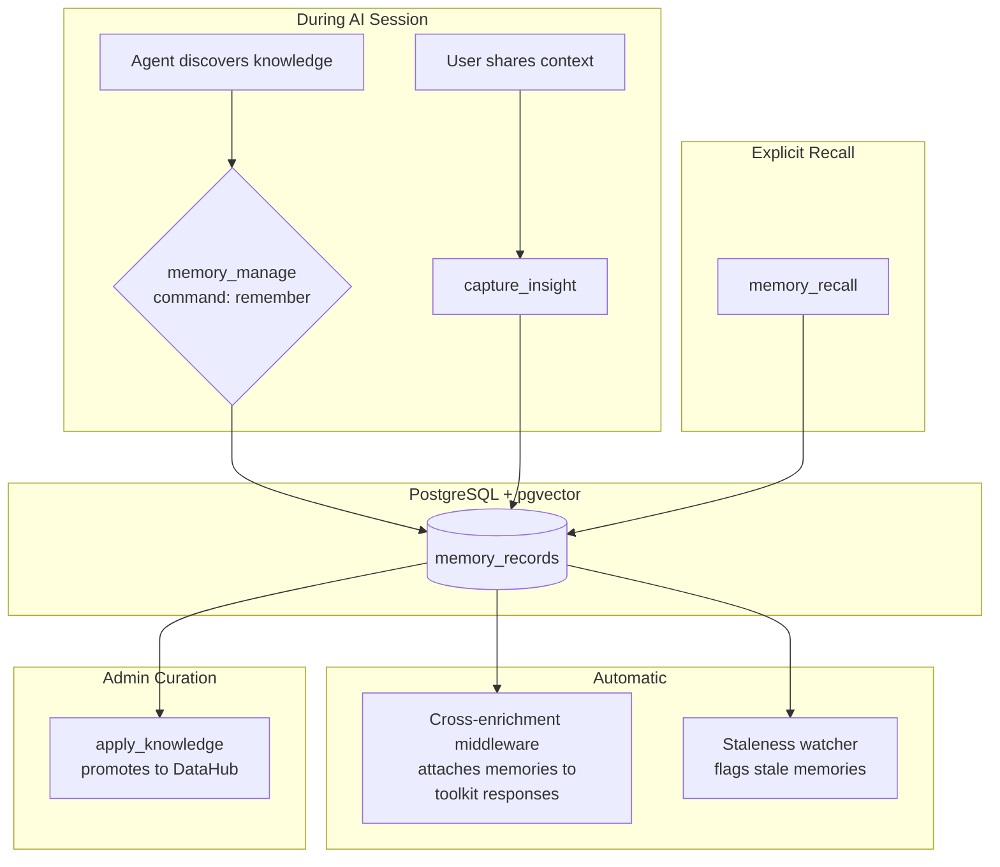

# Memory Layer

## The Problem

Stateless LLMs treat each session as a clean slate. Without memory, agents repeat mistakes humans already corrected, re-attach context at token cost, and cannot maintain continuity over multi-step workflows. The existing knowledge capture tools record institutional knowledge, but lack per-analyst personalization, temporal reasoning, and automatic surfacing of relevant context.

## How It Works

The memory layer stores everything agents accumulate across sessions in a single `memory_records` table backed by PostgreSQL with pgvector for semantic search. Memories are scoped by two axes: **user** (who created it) and **persona** (who can see it).

### Memory Types

Memories are classified by LOCOMO dimension for structured retrieval:

| Dimension | Purpose | Examples |
|-----------|---------|----------|
| `knowledge` | Factual/institutional | "We have two distinct selling seasons", "Test stores 9001-9099 are training environments" |
| `event` | Temporal/episodic | "On March 15 the analyst ran a Q1 sales rollup filtering out test stores" |
| `entity` | Entity attributes | "The customer_id column contains PII", "This table was migrated from Oracle in 2024" |
| `relationship` | Links between entities | "acme_legacy_sales is deprecated in favor of elasticsearch.sales" |
| `preference` | User preferences | "This analyst prefers SQL over natural language queries" |

### Scoping

| Axis | Field | Purpose |
|------|-------|---------|
| **User** | `created_by` (email) | Ownership. Users can only update/forget their own memories unless admin. |
| **Persona** | `persona` | Visibility. Memories created under a persona are visible to that persona. Admin sees all. |

## Tools

### memory_manage

CRUD operations for memory records. Opt-in per persona (requires `memory_*` in `tools.allow`).

| Command | Purpose |
|---------|---------|
| `remember` | Create a new memory with optional embedding |
| `update` | Revise content, category, tags on an existing record |
| `forget` | Soft-delete (archive) a memory |
| `list` | Query memories with filters, persona-scoped by default |
| `review_stale` | List memories flagged as stale by the lineage watcher |

### memory_recall

Multi-strategy retrieval for when cross-enrichment is not enough.

| Strategy | Method | LOCOMO Dimension |
|----------|--------|-----------------|
| `entity` | Direct URN lookup | Single-hop recall |
| `semantic` | Vector similarity via pgvector | Open-domain recall |
| `graph` | DataHub lineage traversal + entity lookup | Multi-hop reasoning |
| `auto` (default) | Runs entity + semantic + graph in parallel, deduplicates | All dimensions |

### capture_insight (existing, refactored)

Now writes to `memory_records` instead of the legacy `knowledge_insights` table. Creates memory records with insight-specific metadata (suggested_actions, related_columns). Generates embeddings via Ollama when available.

### apply_knowledge (existing, refactored)

Reads from `memory_records` via an adapter. Promotes curated memories into durable DataHub knowledge (context documents, glossary terms, tags, structured properties).

## Cross-Enrichment

The existing bidirectional enrichment middleware automatically attaches relevant memories to toolkit responses. When a Trino query, DataHub lookup, or S3 operation returns results containing DataHub URNs, the middleware recalls memories linked to those entities and appends them as a `memory_context` content block.

No explicit `memory_recall` call is needed for this — it happens transparently on every enriched tool response.

## Staleness Detection

A background watcher periodically checks active memories against DataHub entity state. When a referenced entity is deprecated or its schema changes, the memory is flagged as `stale` with a reason. Stale memories are excluded from default recall and surfaced via `memory_manage(command='review_stale')` for admin curation.

## Correction Chains

When a memory is updated or superseded, the correction chain is tracked in `metadata.superseded_by`. This supports temporal reasoning: "X was said, then corrected to Y" has a clean signal path through the memory graph.

## Relationship to Knowledge Capture

Memory is the universal store. An insight (captured via `capture_insight`) is a subtype of memory — a memory that may carry proposed catalog changes. But knowledge is broader than catalog mutations. Domain context like "we have two selling seasons" is institutional knowledge that does not map to a DataHub tag or description update. The `apply_knowledge` tool is where differentiation happens: it reviews memories and promotes the appropriate ones into durable DataHub entities.
