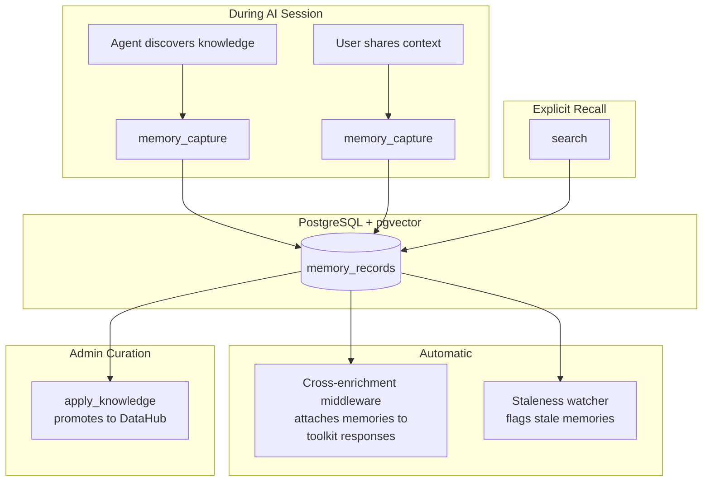

# Memory Layer

## The Problem

Stateless LLMs treat each session as a clean slate. Without memory, agents repeat mistakes humans already corrected, re-attach context at token cost, and cannot maintain continuity over multi-step workflows. The existing knowledge capture tools record institutional knowledge, but lack per-analyst personalization, temporal reasoning, and automatic surfacing of relevant context.

## How It Works

The memory layer stores everything agents accumulate across sessions in a single `memory_records` table backed by PostgreSQL with pgvector for semantic search. Memories are scoped by two axes: **user** (who created it) and **persona** (who can see it).



### Memory Types

Memories are classified by LOCOMO dimension for structured retrieval:

| Dimension | Purpose | Examples |
|-----------|---------|----------|
| `knowledge` | Factual/institutional | "We have two distinct selling seasons", "Test stores 9001-9099 are training environments" |
| `event` | Temporal/episodic | "On March 15 the analyst ran a Q1 sales rollup filtering out test stores" |
| `entity` | Entity attributes | "The customer_id column contains PII", "This table was migrated from Oracle in 2024" |
| `relationship` | Links between entities | "acme_legacy_sales is deprecated in favor of elasticsearch.sales" |
| `preference` | User preferences | "This analyst prefers SQL over natural language queries" |

### Scoping

| Axis | Field | Purpose |
|------|-------|---------|
| **User** | `created_by` (email) | Ownership. Users can only update/forget their own memories unless admin. |
| **Persona** | `persona` | Visibility. Memories created under a persona are visible to that persona. Admin sees all. |

## Tools

### memory_capture

The one way to create a memory record. Routed by `type` (sink-class): `personal_preference` and `episodic_event` are live for the capturer immediately; `business_knowledge`, `schema_entity`, and `operational_rule` are recorded as pending insights reviewed via `apply_knowledge`.

### memory_manage

Lifecycle operations for existing memory records. Opt-in per persona (requires `memory_*` in `tools.allow`).

| Command | Purpose |
|---------|---------|
| `update` | Revise content, category, tags on an existing record |
| `forget` | Soft-delete (archive) a memory |
| `list` | Query memories with filters, persona-scoped by default |
| `review_stale` | List memories flagged as stale by the lineage watcher |

### Recall (via search)

Reading memory back is served by the universal `search` tool, which federates memory alongside insights, the catalog, prompts, assets, API endpoints, and connections. Within the memory source it draws on several retrieval methods:

| Method | How | LOCOMO Dimension |
|--------|-----|-----------------|
| Entity lookup | Direct URN match | Single-hop recall |
| Semantic | Hybrid vector + lexical ranking via pgvector, with automatic lexical-only fallback when the embedder is unavailable | Open-domain recall |
| Lexical | Postgres full-text keyword match (no embedding call) | Exact-term recall |
| Graph | DataHub lineage traversal + entity lookup | Multi-hop reasoning |

#### Hybrid ranking

The `semantic` strategy fuses two signals per record: the embedding cosine similarity and a lexical full-text match flag, blended as `0.6 * semantic + 0.4 * lexical`. This mirrors the api-gateway ranking precedent and materially improves recall on identifier-heavy content (entity URNs, column names, error codes) where pure vector search underweights an exact token. The vector arm is backed by an `hnsw` ANN index on `memory_records.embedding`; the lexical arm by a GIN index on `to_tsvector('english', content)`.

#### Graceful degradation

When no embedding provider is configured (or it is down), `semantic` recall no longer errors. It falls back to lexical-only matching and labels the response so the degradation is not silent:

```json
{
  "strategy": "semantic",
  "ranking": "lexical",
  "degraded": true,
  "note": "embedding provider unavailable; results are lexical-only (exact-term matches), not semantic",
  "memories": [ ... ]
}
```

Lexical search also surfaces rows whose embedding is `NULL` (saved during an outage) that vector search would skip entirely. Every recall response carries a `ranking` field (`hybrid`, `lexical`, `entity`, or `graph`).

## Embedding Backfill

Memory is a consumer of the shared index-jobs framework (`source_kind = memory`), the same backfill queue the api-catalog and tools corpora use. The synchronous embed on write is preserved (a just-saved memory stays immediately recallable), and a periodic reconciler converges the gaps it cannot cover off the request path:

- A memory saved while the embedder was down (`embedding IS NULL`) is re-embedded automatically once the provider returns, with no manual re-save.
- A provider model swap re-embeds rows stamped with the previous model (`embedding_model` differs from the current model).
- The `memory` kind appears on the admin Indexing dashboard with a real indexed/expected coverage ratio.

The write path stamps `embedding_model` and `embedding_text_hash` (SHA-256 of the content) alongside each vector, so a healthy row is never flagged as a gap and the worker's text-hash dedup skips re-embedding unchanged content.

### memory_capture (knowledge sink-classes)

Writes memory records to `memory_records` with insight-specific metadata (suggested_actions, related_columns). Generates embeddings via Ollama when available.

Ownership is keyed on the user's **email** (`created_by`), the same key `memory_manage` uses and the one the portal scopes by, so a person's insights and memories share an owner and both appear under their **My Knowledge** view. Insights captured before this was unified were keyed on the OIDC subject; the `000056_knowledge_owner_email_backfill` migration rewrites those rows to the email last seen for that subject in `audit_logs` (stashing the original in `metadata.legacy_created_by` so it is reversible). Rows with no audit mapping are left unchanged.

### apply_knowledge (existing, refactored)

Reads from `memory_records` via an adapter. Promotes curated memories into durable DataHub knowledge (context documents, glossary terms, tags, structured properties).

## Cross-Enrichment

The existing bidirectional enrichment middleware automatically attaches relevant memories to toolkit responses. When a Trino query, DataHub lookup, or S3 operation returns results containing DataHub URNs, the middleware recalls memories linked to those entities and appends them as a `memory_context` content block.

No explicit recall call is needed for this; it happens transparently on every enriched tool response.

## Staleness Detection

A background watcher periodically checks active memories against DataHub entity state. When a referenced entity is deprecated or its schema changes, the memory is flagged as `stale` with a reason. Stale memories are excluded from default recall and surfaced via `memory_manage(command='review_stale')` for admin curation.

## Correction Chains

When a memory is updated or superseded, the correction chain is tracked in `metadata.superseded_by`. This supports temporal reasoning: "X was said, then corrected to Y" has a clean signal path through the memory graph.

## Relationship to Knowledge Capture

Memory is the universal store. An insight (captured via `memory_capture` with a reviewed sink-class) is a subtype of memory: one that may carry proposed catalog changes. But knowledge is broader than catalog mutations. Domain context like "we have two selling seasons" is institutional knowledge that does not map to a DataHub tag or description update. The `apply_knowledge` tool is where differentiation happens: it reviews memories and promotes the appropriate ones into durable DataHub entities.

Because knowledge capture now lives in the memory toolkit (`memory_capture`), it requires the memory layer to be enabled. Memory defaults on when a database is configured; setting `memory.enabled: false` disables capture entirely.
