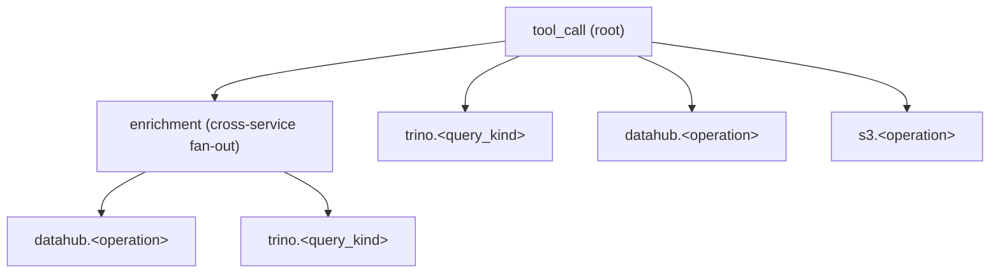

# Observability

The platform exposes Prometheus metrics built on the OpenTelemetry metrics SDK
with a Prometheus exporter. Metrics are off by default; enable them by setting
`OTEL_METRICS_ENABLED=true`. The `/metrics` endpoint binds to a dedicated
listener, separate from the MCP/HTTP transport, on `OTEL_METRICS_ADDR` (default
`:9090`).

Deployment manifests for scraping and for the starter recording/alert rules
live in [`deployments/observability/`](https://github.com/txn2/mcp-data-platform/tree/main/deployments/observability).

## Enabling

| Env var | Default | Meaning |
|---------|---------|---------|
| `OTEL_METRICS_ENABLED` | `false` | Enable the recorder and the `/metrics` listener. |
| `OTEL_METRICS_ADDR` | `:9090` | Bind address for the `/metrics` HTTP listener. |

When disabled, every recording path is a no-op and the platform behaves exactly
as before.

## Exposed metrics

All names below are the **exposed** Prometheus names (the exporter appends
`_total` to counters and `_seconds` to duration histograms). Histograms also
expose `_bucket`, `_sum`, and `_count` series. Label cardinality is deliberately
bounded; raw URLs, query strings, request/response bodies, user UUIDs, and
session IDs are never used as labels (they belong on traces and in audit logs).

### MCP tool calls

| Metric | Type | Labels |
|--------|------|--------|
| `mcp_tool_calls_total` | counter | `tool`, `toolkit_kind`, `persona`, `status_category` |
| `mcp_tool_call_duration_seconds` | histogram | `tool`, `toolkit_kind`, `persona`, `status_category` |
| `mcp_inflight_tool_calls` | gauge | (none) |

### API gateway (apigateway toolkit)

| Metric | Type | Labels |
|--------|------|--------|
| `apigateway_outbound_total` | counter | `connection`, `http_status_class`, `status_category` |
| `apigateway_outbound_duration_seconds` | histogram | `connection`, `http_status_class`, `status_category` |
| `apigateway_inbound_requests_total` | counter | `connection`, `operation_id`, `method`, `status_class`, `identity` |
| `apigateway_inbound_duration_seconds` | histogram | `connection`, `operation_id`, `method`, `status_class` |

`identity` is recorded only on the inbound request counter, never on the
duration histogram, to keep the bucket series from multiplying by identity.

### Trino (query provider)

Recorded for the Trino queries and catalog/metadata calls the query provider
makes (cross-injection enrichment). User-facing `trino_query` tool calls are
also counted by `mcp_tool_calls_total{toolkit_kind="trino"}`.

| Metric | Type | Labels |
|--------|------|--------|
| `trino_queries_total` | counter | `status`, `query_kind` |
| `trino_query_duration_seconds` | histogram | `query_kind` |

`query_kind` is the SQL verb (`select`, `show`, `insert`, ...) for SQL queries,
or the metadata operation (`list_catalogs`, `list_schemas`, `list_tables`,
`describe_table`) for catalog calls; unknown SQL maps to `other`.

> A `trino_bytes_scanned_total` metric was considered but is not implemented:
> the mcp-trino client (v1.3.0) does not expose a bytes-scanned figure in its
> query stats, so there is no honest source for it.

### DataHub (semantic provider)

| Metric | Type | Labels |
|--------|------|--------|
| `datahub_requests_total` | counter | `operation`, `status` |
| `datahub_request_duration_seconds` | histogram | `operation` |

`operation` is one of `get_entity`, `get_schema`, `get_schemas`, `get_lineage`,
`get_column_lineage`, `get_glossary_term`, `get_queries`.

### S3 (S3 toolkit)

| Metric | Type | Labels |
|--------|------|--------|
| `s3_operations_total` | counter | `operation`, `status` |
| `s3_operation_duration_seconds` | histogram | `operation` |

`operation` is the S3 tool name (`list_buckets`, `list_objects`, `get_object`,
`get_object_metadata`, `presign_url`, ...).

### OAuth

| Metric | Type | Labels |
|--------|------|--------|
| `oauth_token_issuance_total` | counter | `grant_type`, `status` |
| `oauth_token_refresh_total` | counter | `status` |
| `oauth_token_refresh_duration_seconds` | histogram | (none) |

### Database connection pools

Reported at scrape time from each managed `*sql.DB`'s `Stats()`. The platform
shares one pool, registered under `pool="platform"`.

| Metric | Type | Labels |
|--------|------|--------|
| `db_pool_open_connections` | gauge | `pool` |
| `db_pool_in_use` | gauge | `pool` |
| `db_pool_idle` | gauge | `pool` |
| `db_pool_wait_count_total` | counter | `pool` |
| `db_pool_wait_duration_seconds_total` | counter | `pool` |

## Status labels

The `status` / `status_category` labels are a closed set so a status code or
error message can never inflate cardinality: `ok`, `auth_err`, `authz_err`,
`validation_err`, `upstream_err`, `internal_err`. Toolkit/provider metrics use
`ok` for success and `upstream_err` for a failed external call.

## Recording and alert rules

Starter rules ship in `deployments/observability/`. Recording-rule names follow
the `level:metric:operations` convention, e.g. `mcp:tool_call_duration:p95_5m`
and `apigateway:inbound_error_rate:5m`. See that directory's README for how to
load them and confirm scraping with `up{job="mcp-data-platform"}`.

## Distributed tracing

Tracing is the second half of the observability story: where metrics answer
"how is the system performing" in aggregate, traces answer "why was *this* call
slow" by capturing one MCP request as a single span tree. The platform exports
OpenTelemetry traces over OTLP/gRPC to a collector (Tempo, Jaeger, or any
OTLP-compatible backend).

Tracing is **off by default** and independent of metrics — unlike the
always-available `/metrics` scrape endpoint, traces need a collector to receive
them, so enabling without one would be pointless. When off, every span call site
is a single span-context check (the tracing middleware benchmarks at ~0.3 ns/op
disabled; ~1.8 µs/op when sampling a span — negligible against millisecond-scale
tool calls).

### Enabling

| Env var | Default | Meaning |
|---------|---------|---------|
| `OTEL_TRACES_ENABLED` | `false` | Enable the tracer and install the global OTel `TracerProvider`. |
| `OTEL_EXPORTER_OTLP_ENDPOINT` | `localhost:4317` | OTLP/gRPC collector address (`host:port`). |
| `OTEL_EXPORTER_OTLP_INSECURE` | `true` | Disable transport TLS (the common in-cluster topology). Set `false` for a TLS remote collector. |
| `OTEL_TRACES_SAMPLER_ARG` | `0.1` | Head-based sampling ratio in `[0,1]` applied to root spans. |
| `OTEL_SERVICE_NAME` | `mcp-data-platform` | `service.name` resource attribute on every span. |

The OTLP exporter connects lazily: an unreachable or unconfigured collector
never blocks or fails startup; spans are batched and dropped if undeliverable.

### Span tree

Each tool call produces one trace:



- **Root span** is opened by the tracing middleware, inner to auth so it carries
  the request's identity. Its name is the fixed, low-cardinality `tool_call`
  (the specific tool is on the `mcp.tool` attribute, not the span name, so all
  tool calls share one queryable name). It holds the bounded attributes that
  mirror the metric labels (`mcp.tool`,
  `mcp.toolkit_kind`, `mcp.persona`, `status_category`) **plus** the
  high-cardinality fields that are deliberately kept off Prometheus labels —
  `mcp.user_id`, `mcp.user_email`, `mcp.session_id`, `mcp.request_id`,
  `mcp.connection`, `mcp.transport`, `mcp.source`, and the enrichment summary.
  This is the whole point of spans: per-request detail a label set cannot carry.
- **Child spans** nest under the root via context propagation: the cross-service
  `enrichment` fan-out, and one span per upstream call to Trino
  (`trino.<query_kind>`), DataHub (`datahub.<operation>`), and S3
  (`s3.<operation>`). The Trino/DataHub/S3 spans are emitted by the same
  decorators that record the toolkit metrics, installed when **either** metrics
  or tracing is enabled.

Span status is `Error` for any non-`ok` `status_category`, with the error
recorded as a span event, so error traces stand out in Tempo/Jaeger.

> Not every external call has its own child span yet. The apigateway toolkit's
> outbound HTTP calls are captured by the root `tool_call` span (an
> `api_invoke_endpoint` call is itself a tool call) but do not yet emit a
> dedicated outbound span like Trino/DataHub/S3 do — that is a follow-up. The
> inbound OAuth 2.1 server and the asynchronous audit write run outside a tool
> call's request context entirely and so are not part of the tool-call trace;
> their latency is covered by the metrics in the tables above.

### Sampling

Head-based sampling is in-app via `OTEL_TRACES_SAMPLER_ARG` (a `ParentBased`
ratio sampler — a sampled caller's whole trace is always kept). **Tail-based**
sampling — keeping 100% of error and slow traces — belongs in the collector, not
the application, so it can be tuned without redeploying. An example collector
pipeline and OTLP export config ship in
[`deployments/observability/`](https://github.com/txn2/mcp-data-platform/tree/main/deployments/observability).

### Example queries

In Tempo (TraceQL), find slow Trino-backed tool calls:

```
{ name = "tool_call" && .mcp.toolkit_kind = "trino" && duration > 2s }
```

In Jaeger, filter by service `mcp-data-platform`, operation `tool_call`, and tag
`status_category=upstream_err` to see failed calls with their full child-span
breakdown.
