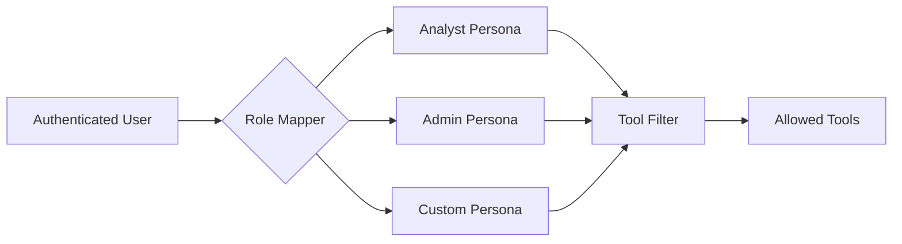

# Personas Overview

Personas provide role-based access control for MCP tools. Each persona defines which tools a user can access and can include custom prompts and hints for the AI assistant.

## What Is a Persona?

A persona is a named configuration that includes:

- **Display Name** - Human-readable identifier
- **Roles** - Which authenticated roles map to this persona
- **Tool Rules** - Allow and deny patterns for tool access
- **Prompts** - Custom instructions for the AI
- **Hints** - Tool-specific guidance

## How Personas Work



1. User authenticates (OIDC or API key)
2. Roles are extracted from credentials
3. Role mapper finds the matching persona
4. Tool filter applies allow/deny rules
5. Only permitted tools are available

## Configuration

Define personas in your configuration:

```yaml
personas:
  definitions:
    analyst:
      display_name: "Data Analyst"
      description: "Read-only access to query and explore data"
      roles: ["analyst", "data_user"]
      tools:
        allow:
          - "trino_*"
          - "datahub_*"
        deny:
          - "*_delete_*"
      prompts:
        system_prefix: "You are helping a data analyst explore data."

    admin:
      display_name: "Administrator"
      description: "Full access to all tools"
      roles: ["admin", "platform_admin"]
      tools:
        allow: ["*"]
        deny: []

    viewer:
      display_name: "Viewer"
      description: "Read-only access, no queries"
      roles: ["viewer", "guest"]
      tools:
        allow:
          - "datahub_search"
          - "datahub_get_*"
          - "s3_list_*"
          - "s3_get_object_metadata"
        deny:
          - "trino_query"
          - "s3_get_object"

  default_persona: viewer
```

## Default Persona

The `default_persona` is used when:

- Authentication is disabled
- User has no roles that match any persona
- An anonymous request is made

```yaml
personas:
  default_persona: viewer    # Fall back to viewer for unknown users
```

## Built-in Personas

The platform includes two built-in personas that can be overridden:

**Default Persona:**
```yaml
default:
  display_name: "Default User"
  roles: []
  tools:
    allow: ["*"]
    deny: []
```

**Admin Persona:**
```yaml
admin:
  display_name: "Administrator"
  roles: ["admin"]
  tools:
    allow: ["*"]
    deny: []
  priority: 100
```

## Persona Priority

When a user has roles matching multiple personas, priority determines which one is used:

```yaml
personas:
  definitions:
    analyst:
      roles: ["analyst"]
      priority: 10

    senior_analyst:
      roles: ["analyst", "senior"]
      priority: 20    # Higher priority wins

    admin:
      roles: ["admin"]
      priority: 100   # Admin always wins if user has admin role
```

A user with roles `["analyst", "senior"]` gets the `senior_analyst` persona (higher priority).

## Prompt Customization

Personas can include custom prompts:

```yaml
analyst:
  prompts:
    system_prefix: |
      You are helping a data analyst. Focus on:
      - Data exploration and analysis
      - SQL best practices
      - Statistical insights

    system_suffix: |
      Always explain query results in business terms.

    instructions: |
      When writing SQL:
      - Use meaningful aliases
      - Add comments for complex logic
      - Limit results to avoid overwhelming output
```

## Tool Hints

Provide tool-specific guidance for the AI:

```yaml
analyst:
  hints:
    trino_query: "Prefer aggregations and sampling for large tables"
    datahub_search: "Search for datasets by business domain first"
    s3_list_objects: "Use prefix filtering to narrow results"
```

Hints are passed to the AI as additional context when using tools.

## Knowledge Tool Access

The knowledge capture tools follow the same allow/deny patterns. Control who can capture insights and who can apply them:

```yaml
personas:
  definitions:
    analyst:
      display_name: "Data Analyst"
      roles: ["analyst"]
      tools:
        allow:
          - "trino_*"
          - "datahub_*"
          - "capture_insight"       # Can capture knowledge
        deny:
          - "apply_knowledge"       # Cannot apply changes

    admin:
      display_name: "Administrator"
      roles: ["admin"]
      tools:
        allow: ["*"]               # Full access including apply_knowledge

    etl_service:
      display_name: "ETL Service"
      roles: ["service"]
      tools:
        allow:
          - "trino_*"
        deny:
          - "capture_insight"       # Automated processes should not capture
          - "apply_knowledge"
```

See [Knowledge Capture](../knowledge/overview.md) for the full feature documentation.

## Example: Data Mesh Personas

```yaml
personas:
  definitions:
    sales_analyst:
      display_name: "Sales Domain Analyst"
      roles: ["sales_team"]
      tools:
        allow:
          - "trino_*"
          - "datahub_*"
        deny: []
      prompts:
        system_prefix: |
          You are helping a sales analyst.
          Focus on: revenue metrics, customer data, order patterns.
      hints:
        trino_query: "Query the hive.sales schema for sales data"

    marketing_analyst:
      display_name: "Marketing Domain Analyst"
      roles: ["marketing_team"]
      tools:
        allow:
          - "trino_*"
          - "datahub_*"
        deny: []
      prompts:
        system_prefix: |
          You are helping a marketing analyst.
          Focus on: campaign metrics, customer segments, attribution.
      hints:
        trino_query: "Query the hive.marketing schema for marketing data"

  default_persona: viewer
```

## Next Steps

- [Tool Filtering](tool-filtering.md) - Allow/deny pattern syntax
- [Role Mapping](role-mapping.md) - Map OIDC roles to personas
