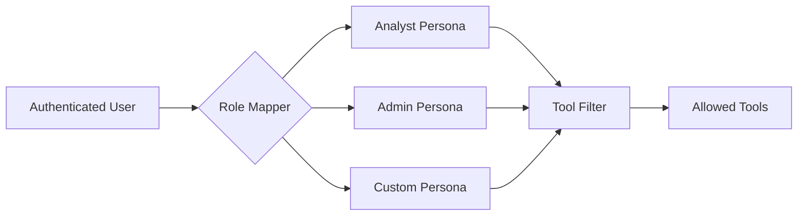

# Personas Overview

Personas provide role-based access control for MCP tools. Each persona defines which tools a user can access and can include custom prompts and hints for the AI assistant.

## What Is a Persona?

A persona is a named configuration that includes:

- **Display Name** - Human-readable identifier
- **Roles** - Which authenticated roles map to this persona
- **Tool Rules** - Allow and deny patterns for tool access
- **Connection Rules** - Allow and deny patterns for which toolkit connections the persona may reach, deny-by-default
- **API Routes** - Per-(connection, method, path) rules narrowing HTTP API gateway connections further
- **Context Overrides** - Per-persona customization of platform description and agent instructions

The connection rules carry the platform's authorization design: access is scoped at the connection rather than at the end user. [Authorization: the connection is the boundary](../concepts/authorization.md) states why, what that enforces, and what it does not.

## How Personas Work


```mermaid
graph LR
    A[Authenticated User] --> B{Role Mapper}
    B --> C[Analyst Persona]
    B --> D[Admin Persona]
    B --> E[Custom Persona]

    C --> F[Tool Filter]
    D --> F
    E --> F

    F --> G[Allowed Tools]
```

1. User authenticates (OIDC or API key)
2. Roles are extracted from credentials
3. Role mapper finds the matching persona
4. Tool filter applies allow/deny rules
5. Only permitted tools are available

## Configuration

Define personas in your configuration:

```yaml
personas:
  analyst:
    display_name: "Data Analyst"
    description: "Read-only access to query and explore data"
    roles: ["analyst", "data_user"]
    tools:
      allow: ["*"]
      deny:
        - "*_delete_*"
    connections:
      allow: ["*"]
    context:
      description_prefix: "You are helping a data analyst explore data."

  admin:
    display_name: "Administrator"
    description: "Full access to all tools"
    roles: ["admin", "platform_admin"]
    tools:
      allow: ["*"]
      deny: []
    connections:
      allow: ["*"]

  viewer:
    display_name: "Viewer"
    description: "Read-only access, no queries"
    roles: ["viewer", "guest"]
    tools:
      allow:
        - "platform_info"
        - "search"
        - "fetch"
        - "datahub_get_*"
        - "s3_list_*"
        - "s3_get_object_metadata"
      deny:
        - "trino_query"
        - "trino_execute"
        - "s3_get_object"
    connections:
      allow: ["*"]
```

Prefer `allow: ["*"]` with a targeted `deny`, as `analyst` does above. An
enumerated allow-list has to name every tool the persona will ever hold, so it
silently loses each tool a later upgrade adds — the persona keeps working, just
with less of the platform than the operator thinks it has. Enumerate only when
the persona is deliberately confined to a short, fixed list, as `viewer` is.

## Some tools are a unit

A few tools produce work that only another tool can consume. Granting one
without the other is a configuration error, not a tightening — the persona can
start something it can never finish:

| Granted | Also required | Because |
|---------|---------------|---------|
| `search` | `fetch` | `search` returns navigational pointers carrying a `reference`; `fetch` is the only tool that dereferences one. Without it the persona discovers that an answer exists and can never read it, and cannot follow a knowledge page's outbound references at all. |
| `memory_capture` | `search` | `search` is the retrieval front door for captured memory. Without it the persona writes knowledge that nobody, including itself, can retrieve. |
| `apply_knowledge` | `search` | The review workflow's documented first step is to discover what is already known before applying it. |

The server evaluates these pairs against the tools it actually registered — at
startup for every persona, and again on each persona write through the admin
API — and logs a warning naming the persona, the missing tool, and the fix:

```text
level=WARN msg="persona grants a capability it cannot complete"
  persona=analyst granted=search missing=fetch
  why="search returns navigational pointers carrying a reference and fetch is the
       only tool that dereferences one, so this persona can discover that an answer
       exists and never read it, ..."
  remedy="add \"fetch\" to persona \"analyst\"'s tools.allow, or remove the
          tools.deny pattern that withholds it"
```

It is a warning, not a gate: a restricted persona may be exactly what you
intended, and startup continues either way. A deployment that never registered
the missing tool is never warned about it.

The warning exists because the failure is otherwise invisible. The agent
instructions the platform hands out name a tool only when the caller can reach
it, so a persona missing `fetch` is simply never told that reading a result in
full is possible. Nothing errors. The only other symptom is an `unauthorized`
audit row, and only if an agent guesses the tool name unprompted.

!!! warning "The search-first gate needs `search`"

    `trino_query` and `trino_execute` are refused until `search` has been called
    in the session (see
    [Search-First Gate Configuration](../server/configuration.md#search-first-gate-configuration)).
    A persona granted query tools but not `search` cannot open that gate and is
    refused permanently. Grant `search` and `fetch` to every persona that
    queries, or turn the gate off with `workflow.require_search: false`.

## No persona means no access

Personas are the access boundary, not a set of preferences applied after the
fact. A caller whose roles match no persona is *unmapped*, and an unmapped
caller reaches nothing:

- MCP tool calls resolve to the built-in deny-all persona and are refused.
- The portal answers `403` with a branded page telling the person which account
  was refused and to ask an administrator for access.
- The managed-resources API refuses the request.

There is no fallback persona. Granting someone access means granting them a role
one of your personas lists — authenticating is not enough. An identity provider
will happily issue a token to every account in the directory; those accounts
have no roles you granted, so they map to no persona and get in nowhere.

!!! warning "`default_persona` was removed"

    Earlier releases accepted `personas.default_persona`, which assigned that
    persona to every caller whose roles matched nothing — including accounts
    with no claims at all. A config that still sets it is refused at startup
    with an error naming the key. Remove it and list the roles you actually
    want to grant on the personas themselves.

### Anonymous and no-auth deployments

A deployment running with `auth.allow_anonymous: true`, or with no
authenticators configured at all, gives its callers the role `anonymous`. Open
access is therefore something a persona opts into by name:

```yaml
auth:
  allow_anonymous: true

personas:
  developer:
    display_name: "Developer"
    roles: ["admin", "anonymous"]   # anonymous callers land here
    tools:
      allow: ["*"]
    connections:
      allow: ["*"]
```

Without a persona listing `anonymous`, an unidentified caller maps to no persona
and reaches nothing — the same rule as everyone else.

## Built-in Personas

The platform includes two built-in personas that can be overridden:

**Default Persona:**
```yaml
personas:
  default:
    display_name: "Default User (No Access)"
    roles: []
    tools:
      allow: []
      deny: ["*"]
    connections: {}   # deny-by-default: no connection is reachable
```

The built-in default persona is **deny-all**, not allow-all: a user who
matches no configured persona gets no tools. This is fail-closed by design —
unmatched users must be explicitly granted access through a persona rather
than falling back to broad permissions. Define explicit personas (with
matching `roles`) for every group of users you want to grant tool access to.

**Admin Persona:**
```yaml
personas:
  admin:
    display_name: "Administrator"
    roles: ["admin"]
    tools:
      allow: ["*"]
      deny: []
    connections:
      allow: ["*"]
    priority: 100
```

The built-in admin persona also grants `connections.allow: ["*"]`. Since
connections are deny-by-default (see below), an admin override that omits
the `connections` block would reach zero connections despite having
`tools.allow: ["*"]`.

## Persona Priority

When a user has roles matching multiple personas, priority determines which one is used:

```yaml
personas:
  analyst:
    roles: ["analyst"]
    priority: 10

  senior_analyst:
    roles: ["analyst", "senior"]
    priority: 20    # Higher priority wins

  admin:
    roles: ["admin"]
    priority: 100   # Admin always wins if user has admin role
```

A user with roles `["analyst", "senior"]` gets the `senior_analyst` persona (higher priority).

## Context Overrides

Personas can include context overrides that customize the platform description and agent instructions returned by the `platform_info` tool:

```yaml
analyst:
  context:
    description_prefix: |
      You are helping a data analyst. Focus on:
      - Data exploration and analysis
      - SQL best practices
      - Statistical insights

    agent_instructions_suffix: |
      When writing SQL:
      - Use meaningful aliases
      - Add comments for complex logic
      - Limit results to avoid overwhelming output
      Always explain query results in business terms.
```

### Override Fields

| Field | Effect |
|-------|--------|
| `description_prefix` | Prepended to the platform description |
| `description_override` | Replaces the platform description entirely |
| `agent_instructions_suffix` | Appended to the platform agent instructions |
| `agent_instructions_override` | Replaces the platform agent instructions entirely |

Override fields (`description_override`, `agent_instructions_override`) take precedence over prefix/suffix fields. If both a prefix and an override are set, only the override is used.

## Connection Access Control

Personas can restrict which toolkit connections a user may access. The boundary applies to both halves of using the platform: a tool call must pass the tool pattern check and the connection check, and the discovery surfaces show only the connections a persona is granted.

```yaml
personas:
  analyst:
    display_name: "Data Analyst"
    roles: ["analyst"]
    tools:
      allow: ["*"]
    connections:
      allow: ["prod-*"]
      deny: ["prod-admin-*"]

  admin:
    display_name: "Administrator"
    roles: ["admin"]
    tools:
      allow: ["*"]
    connections:
      allow: ["*"]   # required: connections are deny-by-default
```

### The connection is the authorization boundary

This is the platform's authorization design, not a filter layered on top of one. A connection is a named binding to one downstream system under one credential, and several connections may front the *same* system under *different* credentials at different permission levels. That is the intended shape: a read-only Trino account and a write-capable one on the same cluster become two connections, and personas are granted one or both. The API gateway uses the same split heavily, with `api_routes` narrowing a connection further by method and path.

What follows from that:

- **The permission level a caller gets is the permission level of the credential bound to the connection they were granted.** Tighten access by adding a connection with a narrower downstream account, not by adding a role that lands on the same connection.
- **The platform does not impersonate the caller downstream.** There is no per-user token exchange and no session-user propagation; everyone granted a connection acts as that connection's credential. Warehouse row policies and column masks that key off the end user therefore do not follow a caller through the platform. Expressing per-person policy means one connection per distinct policy outcome.
- **Per-user attribution comes from the audit trail.** With audit enabled, each tool call records `user_id`, `user_email`, `persona`, and the connection it targeted, so the platform can answer who ran what, as which persona, through which connection, even though the downstream system sees only the service account. Audit needs a database and can be switched off, so a deployment relying on connection-scoping should keep it on.

[Authorization: the connection is the boundary](../concepts/authorization.md) covers the rationale, the trade against per-user identity passthrough, and when to reach for another connection instead of another role.

### How Connection Filtering Works

1. When a tool call arrives, the middleware identifies which toolkit connection the tool belongs to
2. The user's persona connection rules are evaluated: deny patterns are checked first, then allow patterns
3. If the connection is denied (or not allowed), the tool call is rejected

Discovery evaluates the same rules against the same persona, so what a caller can find and what a caller can call cannot disagree.

Connections are **deny-by-default**, mirroring the tool axis: a persona reaches a connection only when a `connections.allow` pattern matches its name. If the `connections` block is omitted or `allow` is empty, the persona is granted **no** connections, so every tool call that targets a connection is denied. Grant each persona exactly the connections it needs (the admin persona typically uses `allow: ["*"]`).

The name a pattern matches is the name a call binds the connection by, which `list_connections` reports as `connection`: the `instances:` key, or the `connection_name` a DataHub or S3 instance sets in its place. See [Connection Names](../server/multi-provider.md#connection-names).

### What Discovery Shows

The same rules narrow what a persona can see, not only what it can call:

- **`search`** omits catalog datasets, connections, and API endpoints that belong to a connection the persona is not granted. A dataset is attributed to a connection through its DataHub platform name; a dataset whose URN maps to no configured connection stays visible, and one reachable through any granted connection stays visible.
- **`fetch`** returns `found: false` for a reference behind a connection the persona is not granted, so a citation cannot read around what search omitted.
- **`list_connections`** enumerates only the granted connections.
- The **portal search** applies the same boundary; it shares one router with the `search` tool.

Nothing is dropped silently. Each surface reports what it removed: `search` adds a `withheld` count per source in its coverage block plus a `withheld_notice` naming the persona and the remedy, `list_connections` returns `withheld` and `notice`, and the portal search UI renders the same message above the results. An agent that reads a shortened result set with no explanation concludes the data does not exist and re-derives it; the count turns that into "present, but not yours to see."

This is a metadata boundary. It hides names, descriptions, and inventory across connections; the data behind them was already gated at `tools/call`.

### Pattern Syntax

Connection patterns use the same wildcard syntax as tool patterns:

- `*` matches any sequence of characters
- `prod-*` matches `prod-trino`, `prod-datahub`, etc.
- `*-readonly` matches `trino-readonly`, `datahub-readonly`, etc.

## API Endpoint Rules

A persona that reaches an `api` connection can call every operation that connection exposes. `api_routes` narrows that to specific HTTP methods and paths, which is how one API is split into read-only and read-write access without two connections and two credentials.

```yaml
personas:
  analyst:
    display_name: "Data Analyst"
    roles: ["analyst"]
    tools:
      allow: ["*"]
    connections:
      allow: ["crm-*"]
    api_routes:
      - connection: "crm-*"
        methods: ["GET", "HEAD"]
      - connection: "crm-*"
        methods: ["DELETE"]
        paths: ["/v1/orders/{id}"]
        action: deny
```

Each entry has four fields:

| Field | Meaning |
|-------|---------|
| `connection` | Glob matched against the connection name. Required. |
| `methods` | HTTP method globs. Omitted or empty matches any method. Written uppercase; the portal uppercases what you type, because inbound methods are uppercased before matching and the comparison is case-sensitive. |
| `paths` | Path globs. Omitted or empty matches any path. |
| `action` | `allow` (the default) or `deny`. |

Evaluation, against one `(connection, method, path)`:

1. Entries whose `connection` glob does not match are skipped.
2. Among the rest, a matching `deny` entry refuses the call.
3. Otherwise a matching `allow` entry is required.
4. **If no entry names the connection at all, the check is a no-op** and the connection-level grant is the sole gate. A persona written before `api_routes` existed behaves exactly as it did.

Step 4 is why `api_routes` is a narrowing and not a second grant: adding a rule for one connection does not close the others.

### Paths are matched in both forms

A path glob is matched against the path the call reaches (`/v1/orders/42`) **and** the catalog path the operation declares (`/v1/orders/{id}`). Naming the declared path is the precise way to govern one operation: `paths: ["/v1/orders/{id}"]` covers every call that operation serves and touches no other operation. A glob such as `/v1/orders/*` is a different rule, and it also matches sibling operations at that depth, `/v1/orders/summary` among them.

Globs use the same wildcard syntax as tool and connection patterns, where `*` does not cross a `/`. A path glob therefore governs one segment: `/v1/orders/*` matches `/v1/orders/42` but not `/v1/orders/42/items`. There is no recursive form — `**` is two stars and stops at a separator exactly as one does — so covering a subtree means one rule per depth, or a rule on the connection with no `paths` at all.

### The rules are the same in the portal

`api_routes` is part of a persona wherever the persona is defined. **Settings > Personas > Permissions > API endpoints** lists the API connections and, under each, the operations its catalog declares, showing the persona's current decision on each one and the rule that produced it. Selecting an operation to allow or deny writes an entry naming that operation's own method and declared path, so a rule written in the portal and one written in YAML are the same rule.

A rule written as a glob is shown as the glob it was typed as and is not rewritten when the persona is saved. Use the rule editor directly for a pattern no indexed operation corresponds to, such as a path prefix on a connection whose spec has not been loaded yet.

**Settings > Personas > Test access** answers a `(connection, method, path)` question against the saved persona and returns the rule that decided it.

### What this does not do

`api_routes` does not make an API connection deny-by-default. A connection no rule names stays fully reachable by any persona granted that connection, which is the connection boundary doing its job. To hide a subset of an API from a persona entirely, either write an `allow` rule for the operations it should reach (which makes everything else on that connection unreachable, per step 3) or bind the narrower access to its own connection.

## Knowledge Tool Access

The knowledge capture tools follow the same allow/deny patterns. Control who can capture insights and who can apply them:

```yaml
personas:
  analyst:
    display_name: "Data Analyst"
    roles: ["analyst"]
    tools:
      allow: ["*"]                # includes search, fetch, memory_capture
      deny:
        - "apply_knowledge"       # Cannot apply changes
    connections:
      allow: ["*"]

  admin:
    display_name: "Administrator"
    roles: ["admin"]
    tools:
      allow: ["*"]                # Full access including apply_knowledge
    connections:
      allow: ["*"]

  etl_service:
    display_name: "ETL Service"
    roles: ["service"]
    tools:
      allow:
        - "platform_info"
        - "search"                # required: the search-first gate refuses
        - "fetch"                 #   trino_query until search has been called
        - "trino_*"
      deny:
        - "memory_capture"        # Automated processes should not capture
        - "apply_knowledge"
    connections:
      allow: ["*"]
```

`etl_service` shows the enumerated form done correctly: it withholds the
knowledge-write tools, which is a narrowing, while keeping `search` and `fetch`,
without which it could not run a query at all.

See [Knowledge Capture](../knowledge/overview.md) for the full feature documentation.

## Example: Data Mesh Personas

```yaml
personas:
  sales_analyst:
    display_name: "Sales Domain Analyst"
    roles: ["sales_team"]
    tools:
      allow: ["*"]
      deny: []
    connections:
      allow: ["*"]
    context:
      description_prefix: |
        You are helping a sales analyst.
        Focus on: revenue metrics, customer data, order patterns.
      agent_instructions_suffix: "Query the hive.sales schema for sales data."

  marketing_analyst:
    display_name: "Marketing Domain Analyst"
    roles: ["marketing_team"]
    tools:
      allow: ["*"]
      deny: []
    connections:
      allow: ["*"]
    context:
      description_prefix: |
        You are helping a marketing analyst.
        Focus on: campaign metrics, customer segments, attribution.
      agent_instructions_suffix: "Query the hive.marketing schema for marketing data."
```

## Next Steps

- [Tool Filtering](tool-filtering.md) - Allow/deny pattern syntax
- [Role Mapping](role-mapping.md) - Map OIDC roles to personas
