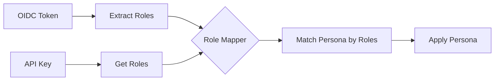

# Role Mapping

Role mapping connects authenticated user roles to personas. When a user authenticates, their roles are extracted from credentials and matched to a persona.

## How Mapping Works



## Basic Role Matching

Personas define which roles they accept:

```yaml
personas:
  definitions:
    analyst:
      roles: ["analyst", "data_user"]

    admin:
      roles: ["admin", "platform_admin"]
```

A user with role `analyst` gets the `analyst` persona.
A user with role `admin` gets the `admin` persona.

## Multiple Role Matching

When a user has multiple roles, the persona with the highest priority wins:

```yaml
personas:
  definitions:
    viewer:
      roles: ["viewer"]
      priority: 1

    analyst:
      roles: ["analyst"]
      priority: 10

    admin:
      roles: ["admin"]
      priority: 100
```

User with roles `["viewer", "analyst"]`:
- Matches both `viewer` and `analyst`
- Gets `analyst` (priority 10 > priority 1)

User with roles `["analyst", "admin"]`:
- Gets `admin` (priority 100 > priority 10)

## OIDC Role Mapping

Map OIDC roles to personas explicitly:

```yaml
personas:
  role_mapping:
    oidc_to_persona:
      "realm_analyst": "analyst"
      "realm_admin": "admin"
      "data_scientist": "analyst"
      "platform_admin": "admin"
```

This maps OIDC roles (from the token) to persona names.

### Role Prefix Handling

When using `role_prefix` in OIDC config, roles are filtered and stripped:

```yaml
auth:
  oidc:
    role_claim_path: "realm_access.roles"
    role_prefix: "dp_"
```

Token roles: `["dp_analyst", "dp_admin", "other_role"]`
Filtered roles: `["analyst", "admin"]`

These filtered roles are then matched to personas.

## User-Specific Mapping

Assign specific users to personas directly:

```yaml
personas:
  role_mapping:
    user_personas:
      "user123@example.com": "admin"
      "service-account-etl": "etl_service"
```

User-specific mappings take precedence over role-based mapping.

## API Key Role Mapping

API keys define roles directly in their configuration:

```yaml
auth:
  api_keys:
    keys:
      - key: ${API_KEY_ANALYST}
        name: "analyst-service"
        roles: ["analyst"]          # These roles map to personas

      - key: ${API_KEY_ADMIN}
        name: "admin-service"
        roles: ["admin"]
```

These roles are matched to personas the same way as OIDC roles.

## Default Persona

When no roles match any persona, the default is used:

```yaml
personas:
  default_persona: viewer
```

This applies to:
- Anonymous users (when auth is disabled)
- Users with no roles
- Users whose roles don't match any persona

## Mapping Priority

The mapping process follows this priority order:

1. **User-specific mapping** - `user_personas` entries
2. **OIDC role mapping** - `oidc_to_persona` entries
3. **Direct role match** - Persona's `roles` list
4. **Default persona** - `default_persona`

## Example: Enterprise Setup

```yaml
auth:
  oidc:
    enabled: true
    issuer: "https://auth.example.com"
    role_claim_path: "groups"
    role_prefix: "mcp-"

personas:
  definitions:
    viewer:
      display_name: "Viewer"
      roles: ["viewer", "guest"]
      priority: 1
      tools:
        allow: ["datahub_search", "datahub_get_*"]

    analyst:
      display_name: "Data Analyst"
      roles: ["analyst", "data-team"]
      priority: 10
      tools:
        allow: ["trino_*", "datahub_*"]
        deny: ["*_delete_*"]

    data_engineer:
      display_name: "Data Engineer"
      roles: ["engineer", "platform-team"]
      priority: 20
      tools:
        allow: ["*"]
        deny: ["*_delete_*"]

    admin:
      display_name: "Administrator"
      roles: ["admin", "ops-team"]
      priority: 100
      tools:
        allow: ["*"]

  role_mapping:
    oidc_to_persona:
      "mcp-readonly": "viewer"
      "mcp-analyst": "analyst"
      "mcp-engineer": "data_engineer"
      "mcp-admin": "admin"

    user_personas:
      "emergency-admin@example.com": "admin"

  default_persona: viewer
```

With this configuration:

| User Roles | Persona |
|------------|---------|
| `["mcp-readonly"]` | viewer |
| `["mcp-analyst"]` | analyst |
| `["mcp-analyst", "mcp-engineer"]` | data_engineer (higher priority) |
| `["mcp-admin"]` | admin |
| `["unknown-role"]` | viewer (default) |
| `emergency-admin@example.com` | admin (user mapping) |

## Debugging Role Mapping

Enable audit logging to see how roles are mapped:

```yaml
audit:
  enabled: true
  log_tool_calls: true
```

The audit log includes:
- Authenticated user identifier
- Extracted roles
- Selected persona
- Tool access decisions

## Common Issues

**User gets wrong persona:**
- Check role extraction from OIDC token
- Verify role prefix configuration
- Review persona priority settings
- Check for user-specific mappings

**User gets default persona unexpectedly:**
- Verify roles are being extracted from token
- Check role names match persona definitions exactly
- Review OIDC `role_claim_path` configuration

**API key user gets wrong persona:**
- Verify roles in API key definition
- Check persona role matching

## Next Steps

- [Tool Filtering](tool-filtering.md) - Configure tool access rules
- [OIDC Configuration](../auth/oidc.md) - Set up role extraction
- [API Keys](../auth/api-keys.md) - Configure API key roles
