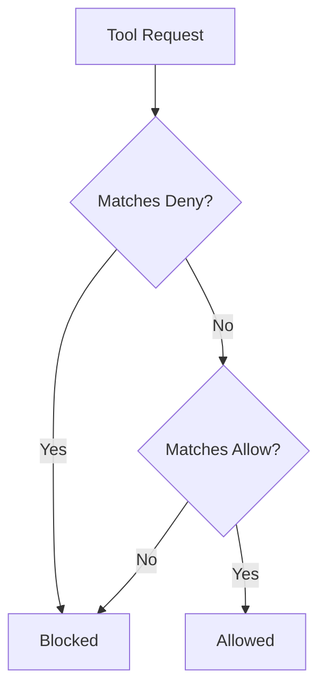
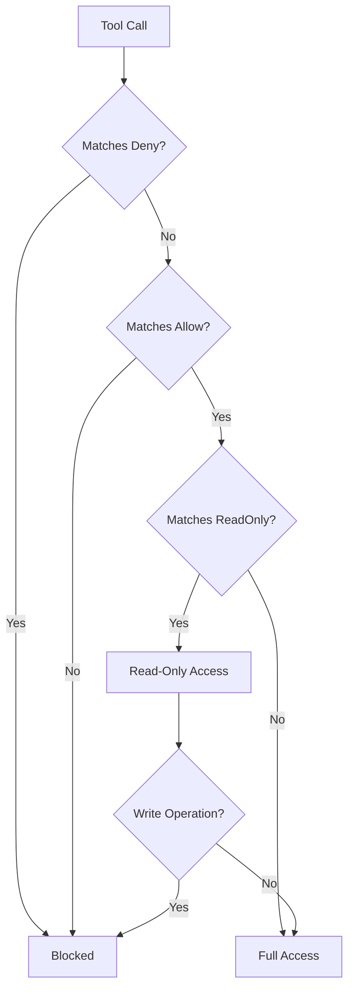

# Tool Filtering

Tool filtering controls which MCP tools are available to each persona. Rules use wildcard patterns to allow or deny tools by name.

!!! note "Two levels of tool filtering"
    **Persona tool filtering** (this page) is a **security boundary**. It controls which tools a user can call via `tools/call` based on their persona. Unauthorized calls are rejected.

    **Global tool visibility** (configured via the top-level `tools:` block) is a **token optimization**. It controls which tools appear in `tools/list` responses to reduce LLM context usage. It does not block `tools/call`. See [Tool Visibility Configuration](../server/configuration.md#tool-visibility-configuration) for details.

## Rule Structure

Each persona has `allow`, `deny`, and optional `read_only` lists:

```yaml
tools:
  allow:
    - "trino_*"           # Allow all trino tools
    - "datahub_search"    # Allow specific tool
  deny:
    - "*_delete_*"        # Deny any tool with delete in name
  read_only:
    - "trino_query"       # Allow tool but restrict to read-only operations
```

## Evaluation Order

1. **Deny rules are checked first** - If a tool matches any deny pattern, it's blocked
2. **Allow rules are checked second** - Tool must match at least one allow pattern
3. **No match = denied** - Tools not matching any allow pattern are blocked



## Wildcard Patterns

| Pattern | Matches |
|---------|---------|
| `*` | Everything |
| `trino_*` | trino_query, trino_explain, trino_list_tables, etc. |
| `*_list_*` | trino_list_catalogs, s3_list_buckets, datahub_list_tags, etc. |
| `datahub_get_*` | datahub_get_entity, datahub_get_schema, etc. |
| `s3_*` | All S3 tools |
| `trino_query` | Exact match only |

Wildcards match zero or more characters.

## Per-Persona Read-Only Enforcement

The `read_only` list restricts specific tools to read-only operations without removing access entirely. This is useful when a persona should be able to query data but not modify it.

When a tool matches a `read_only` pattern:

1. The tool call is allowed (not blocked by deny rules)
2. The platform sets a `ReadOnlyEnforced` flag in the request context
3. Toolkit interceptors check this flag and block write operations (e.g., SQL `INSERT`, `UPDATE`, `DELETE`)

```yaml
viewer:
  tools:
    allow:
      - "trino_*"
      - "datahub_*"
    deny:
      - "*_delete_*"
    read_only:
      - "trino_query"     # SELECT only — INSERT/UPDATE/DELETE blocked
```

This is distinct from **instance-level** `read_only: true` on the toolkit config, which blocks writes for all users. Per-persona read-only lets you have analysts with full write access and viewers with read-only access on the same Trino instance.



## Common Patterns

### Full Access

```yaml
tools:
  allow: ["*"]
  deny: []
```

### Read-Only Access

```yaml
tools:
  allow:
    - "trino_query"
    - "trino_explain"
    - "trino_list_*"
    - "trino_describe_*"
    - "datahub_*"
    - "s3_list_*"
    - "s3_get_*"
  deny:
    - "s3_put_*"
    - "s3_delete_*"
    - "s3_copy_*"
```

### Metadata Only (No Queries)

```yaml
tools:
  allow:
    - "datahub_*"
    - "trino_list_*"
    - "trino_describe_*"
  deny:
    - "trino_query"
    - "trino_explain"
```

### Data Exploration

```yaml
tools:
  allow:
    - "trino_*"
    - "datahub_search"
    - "datahub_get_*"
  deny:
    - "*_delete_*"
```

### S3 Read-Only

```yaml
tools:
  allow:
    - "s3_list_*"
    - "s3_get_object"
    - "s3_get_object_metadata"
    - "s3_presign_url"
  deny:
    - "s3_put_*"
    - "s3_delete_*"
    - "s3_copy_*"
```

## Tool Names Reference

Use these exact names in your patterns:

**Trino Tools:**
- `trino_query`
- `trino_explain`
- `trino_list_catalogs`
- `trino_list_schemas`
- `trino_list_tables`
- `trino_describe_table`
- `trino_list_connections`

**DataHub Tools:**
- `datahub_search`
- `datahub_get_entity`
- `datahub_get_schema`
- `datahub_get_lineage`
- `datahub_get_queries`
- `datahub_get_glossary_term`
- `datahub_list_tags`
- `datahub_list_domains`
- `datahub_list_data_products`
- `datahub_get_data_product`
- `datahub_list_connections`

**S3 Tools:**
- `s3_list_buckets`
- `s3_list_objects`
- `s3_get_object`
- `s3_get_object_metadata`
- `s3_presign_url`
- `s3_list_connections`
- `s3_put_object` (if not read-only)
- `s3_delete_object` (if not read-only)
- `s3_copy_object` (if not read-only)

## Examples

### Analyst Persona

Analysts can query and explore, but not modify:

```yaml
analyst:
  tools:
    allow:
      - "trino_*"
      - "datahub_*"
      - "s3_list_*"
      - "s3_get_*"
    deny:
      - "s3_put_*"
      - "s3_delete_*"
      - "s3_copy_*"
```

### Data Steward Persona

Data stewards can view metadata but not execute queries:

```yaml
data_steward:
  tools:
    allow:
      - "datahub_*"
      - "trino_list_*"
      - "trino_describe_*"
    deny:
      - "trino_query"
      - "trino_explain"
```

### ETL Service Persona

ETL services need full access:

```yaml
etl_service:
  tools:
    allow: ["*"]
    deny: []
```

### Viewer Persona (No Queries)

Viewers can only search and browse metadata:

```yaml
viewer:
  tools:
    allow:
      - "datahub_search"
      - "datahub_get_entity"
      - "datahub_list_*"
      - "trino_list_*"
    deny:
      - "trino_query"
      - "trino_explain"
      - "trino_describe_*"
      - "s3_*"
```

### Read-Only Query Viewer

Viewers can query data but only with SELECT statements:

```yaml
read_only_viewer:
  tools:
    allow:
      - "trino_*"
      - "datahub_search"
      - "datahub_get_*"
    deny:
      - "*_delete_*"
      - "*_put_*"
      - "*_copy_*"
    read_only:
      - "trino_query"    # SELECT only
```

## Deny Takes Precedence

Deny rules always win over allow rules:

```yaml
tools:
  allow:
    - "s3_*"           # Allow all S3 tools
  deny:
    - "s3_delete_*"    # But deny delete operations
```

Result: `s3_list_buckets` ✓, `s3_delete_object` ✗

## Testing Rules

To verify your rules work as expected, check which tools are available for each persona:

1. Authenticate as a user with the persona's roles
2. Ask Claude to list available tools
3. Verify the expected tools are present/absent

Or test programmatically by checking the tool filter logic:

```go
filter := persona.NewToolFilter(persona.ToolRules{
    Allow: []string{"trino_*"},
    Deny:  []string{"trino_query"},
})

filter.Allows("trino_list_tables")  // true
filter.Allows("trino_query")         // false
filter.Allows("datahub_search")      // false
```

## Next Steps

- [Role Mapping](role-mapping.md) - Map roles to personas
- [Authentication](../auth/overview.md) - Configure user authentication
