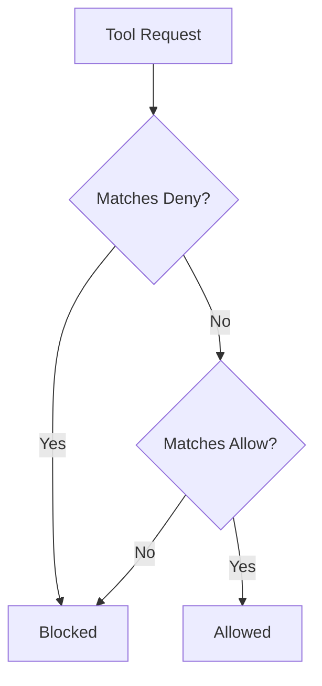

# Tool Filtering

Tool filtering controls which MCP tools are available to each persona. Rules use wildcard patterns to allow or deny tools by name.

!!! note "Two levels of tool filtering"
    **Persona tool filtering** (this page) is a **security boundary**. It controls which tools a user can call via `tools/call` based on their persona. Unauthorized calls are rejected.

    **Global tool visibility** (configured via the top-level `tools:` block) is a **token optimization**. It controls which tools appear in `tools/list` responses to reduce LLM context usage. It does not block `tools/call`. See [Tool Visibility Configuration](../server/configuration.md#tool-visibility-configuration) for details.

## Rule Structure

Each persona has `allow` and `deny` lists:

```yaml
tools:
  allow:
    - "trino_*"           # Allow all trino tools
    - "datahub_search"    # Allow specific tool
  deny:
    - "*_delete_*"        # Deny any tool with delete in name
```

## Evaluation Order

1. **Deny rules are checked first** - If a tool matches any deny pattern, it's blocked
2. **Allow rules are checked second** - Tool must match at least one allow pattern
3. **No match = denied** - Tools not matching any allow pattern are blocked


```mermaid
graph TD
    A[Tool Request] --> B{Matches Deny?}
    B -->|Yes| C[Blocked]
    B -->|No| D{Matches Allow?}
    D -->|Yes| E[Allowed]
    D -->|No| C
```

## Wildcard Patterns

| Pattern | Matches |
|---------|---------|
| `*` | Everything |
| `trino_*` | trino_query, trino_execute, trino_explain, trino_browse, trino_export, etc. |
| `*_list_*` | trino_list_connections, datahub_list_connections (does **not** match `s3_list`, which has nothing after `list`, nor `trino_browse` or `datahub_browse`) |
| `datahub_get_*` | datahub_get_lineage (the one remaining `datahub_get_` tool) |
| `s3_*` | Both S3 tools, `s3_list` and `s3_object` |
| `trino_query` | Exact match only |

Wildcards match zero or more characters.

## Common Patterns

### Full Access

```yaml
tools:
  allow: ["*"]
  deny: []
```

### Read-Only Access

```yaml
tools:
  allow:
    - "trino_query"
    - "trino_explain"
    - "trino_browse"
    - "trino_describe_*"
    - "trino_list_connections"
    - "datahub_*"
    - "s3_list"
    - "s3_object"
  deny:
    - "trino_execute"
```

Whether this persona may write objects is not a tool rule: reading and writing
an object are actions of the one `s3_object` tool, so denying it withholds the
reads too. Point the persona at connections configured `read_only: true`
(under `toolkits.s3`) to make its object access read-only.

### Metadata Only (No Queries)

```yaml
tools:
  allow:
    - "datahub_*"
    - "trino_browse"
    - "trino_describe_*"
    - "trino_list_connections"
  deny:
    - "trino_query"
    - "trino_execute"
    - "trino_explain"
```

### Data Exploration

```yaml
tools:
  allow:
    - "trino_*"
    - "datahub_search"
    - "datahub_get_*"
  deny:
    - "*_delete_*"
```

### S3 Read-Only

```yaml
tools:
  allow:
    - "s3_list"
    - "s3_object"
connections:
  allow:
    - "archive"   # an S3 connection configured read_only: true
```

`s3_object` refuses `put`, `copy` and `delete` on a read-only connection and
names the connection in the refusal; `get`, `metadata` and `presign` still
work. The read-only decision lives on the connection, not in the tool list.

## Tool Names Reference

Use these exact names in your patterns:

**Trino Tools:**
- `trino_query` (read-only)
- `trino_execute` (read-write)
- `trino_explain`
- `trino_browse`
- `trino_describe_table`
- `trino_export` (requires portal; exports query results to asset)
- `trino_list_connections`

**DataHub Tools:**
- `datahub_get_lineage`
- `datahub_browse`
- `datahub_create` (if not read-only)
- `datahub_update` (if not read-only)
- `datahub_delete` (if not read-only)
- `datahub_list_connections`

**S3 Tools:**
- `s3_list` (buckets, or one bucket's objects)
- `s3_object` (`get`, `metadata`, `put`, `copy`, `delete`, `presign`; the writing actions are refused on a `read_only` connection)

Before #1591 these were eight tools, one per noun-verb pair (list buckets, list
objects, get, get metadata, presign, put, copy, delete). The old names are not
aliases: an entry naming one grants or denies nothing. Persona definitions
stored in the database are rewritten by migration `000138`: the two listing
names and the `s3_list_*` glob become `s3_list`; the six object names and the
verb globs `s3_get_*`, `s3_put_*`, `s3_copy_*`, `s3_delete_*`, `s3_presign_*`
become `s3_object`; duplicates collapse to the first position. A deny of a former write tool
becomes a deny of `s3_object`, which withholds the read actions too (the
migration fails closed); move that decision to the connection's `read_only`
flag. Personas defined in YAML are edited by hand along the same mapping.

## Examples

### Analyst Persona

Analysts can query and explore, but not modify:

```yaml
analyst:
  tools:
    allow: ["*"]
    deny:
      - "trino_execute"
      - "datahub_update"
      - "datahub_delete"
```

Prefer `allow: ["*"]` with a targeted `deny` over an enumerated allow-list: an
enumeration has to name every tool the persona will ever hold, so it silently
loses each tool a later upgrade adds. Enumerate only for a persona that is
deliberately confined to a short, fixed list, as `data_steward` and `viewer` are
below — and when you do, keep both halves of every pair (`search` with `fetch`).
See [Some tools are a unit](overview.md#some-tools-are-a-unit).

### Data Steward Persona

Data stewards can view metadata but not execute queries:

```yaml
data_steward:
  tools:
    allow:
      - "platform_info"
      - "search"
      - "fetch"
      - "list_connections"
      - "datahub_*"
      - "trino_browse"
      - "trino_describe_*"
    deny:
      - "trino_query"
      - "trino_execute"
      - "trino_explain"
```

### ETL Service Persona

ETL services need full access:

```yaml
etl_service:
  tools:
    allow: ["*"]
    deny: []
```

### Viewer Persona

Viewers can only search and browse:

```yaml
viewer:
  tools:
    allow:
      - "platform_info"
      - "search"
      - "fetch"
      - "datahub_browse"
      - "trino_browse"
    deny:
      - "trino_query"
      - "trino_execute"
      - "trino_explain"
      - "trino_describe_*"
      - "s3_*"
```

## Gateway Tools

Tools proxied through the gateway toolkit appear in `tools/list` under a connection-namespaced name: `<connection_name>__<remote_tool_name>`. Persona rules match these names with the same wildcard syntax as native tools, so a single persona can grant or deny access to a third-party MCP at any level of granularity:

```yaml
personas:
  marketer:
    roles: ["marketing_team"]
    tools:
      allow:
        - "platform_info"
        - "search"                # Required: the search-first gate refuses
        - "fetch"                 #   trino_query until search has been called
        - "trino_query"           # Native: read warehouse data
        - "datahub_get_*"         # Native: look up metadata
        - "vendor__list_*"        # Gateway: read vendor objects
        - "vendor__send_*"        # Gateway: trigger vendor sends
      deny:
        - "vendor__delete_*"      # Block destructive vendor calls
    connections:
      allow: ["*"]
```

The double-underscore separator (`__`) is a deliberate marker — it makes "gateway tool" visually obvious in audit logs, persona configs, and tool-list responses, and it never collides with the single-underscore separators used by native toolkits (`trino_query`, `datahub_search`, `s3_object`).

### Composite personas

A composite persona combines native and gateway access for a single role. The example above gives the `marketer` role read access to the warehouse plus action access to a third-party MCP wired through the gateway. The same audit log captures every tool call, regardless of whether it landed on Trino, DataHub, S3, or a proxied vendor.

## Deny Takes Precedence

Deny rules always win over allow rules:

```yaml
tools:
  allow:
    - "datahub_*"        # Allow all DataHub tools
  deny:
    - "datahub_delete"   # But deny deletion
```

Result: `datahub_browse` ✓, `datahub_delete` ✗

## Testing Rules

To verify your rules work as expected, check which tools are available for each persona:

1. Authenticate as a user with the persona's roles
2. Ask Claude to list available tools
3. Verify the expected tools are present/absent


The portal answers the same question without a client: **Admin > Tools >
Visibility** previews a given persona's decision for the selected tool before
any rule is changed, and **Admin > Tools > Overview** carries that tool's full
per-persona matrix with the pattern that matched.

Or test programmatically by checking the tool filter logic:

```go
p := &persona.Persona{
    Name: "analyst",
    Tools: persona.ToolRules{
        Allow: []string{"trino_*"},
        Deny:  []string{"trino_query"},
    },
}
filter := persona.NewToolFilter(nil)

filter.IsAllowed(p, "trino_browse")         // true
filter.IsAllowed(p, "trino_describe_table") // true
filter.IsAllowed(p, "trino_query")          // false — deny wins
filter.IsAllowed(p, "search")               // false — no allow pattern matches
```

`WhyAllowed` returns the same decision with the pattern that produced it and
which clause it came from (`allow`, `deny`, or the fail-closed `default`), which
is what the admin Tools page renders.

To check a persona for the tool pairs that must be granted together, pass the
tools the deployment registered:

```go
for _, f := range persona.CheckCoherence(p, registry.AllTools()) {
    log.Printf("%s grants %s without %s: %s", f.Persona, f.Granted, f.Missing, f.Remedy)
}
```

The platform runs this at startup for every persona and on each persona write
through the admin API; see [Some tools are a unit](overview.md#some-tools-are-a-unit).

## Next Steps

- [Role Mapping](role-mapping.md) - Map roles to personas
- [Authentication](../auth/overview.md) - Configure user authentication
