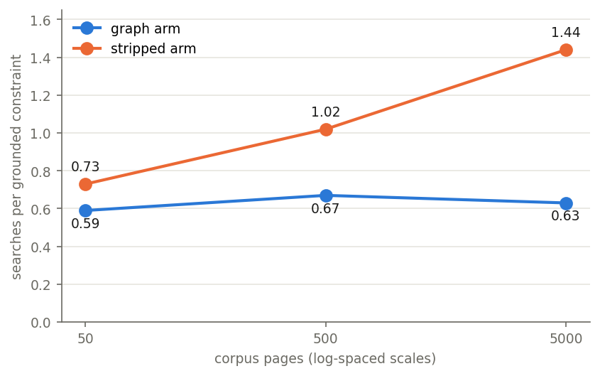
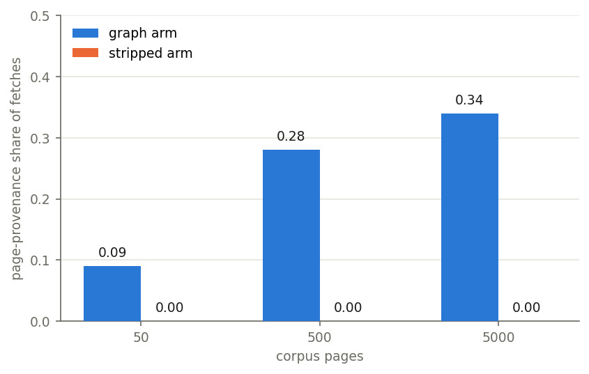
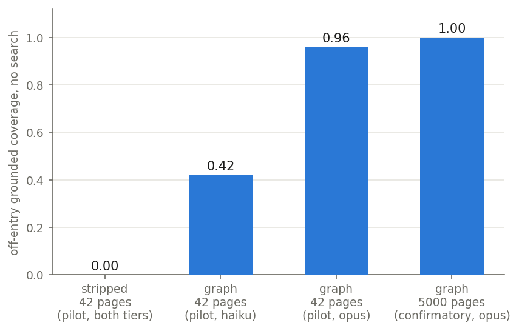

# Do cross-references help LLM agents complete documents? Search cost, robustness, and unreachable content on a wiki-style corpus

*A neutral evaluation report on what hyperlinks between the pages of an
organizational wiki contribute to a tool-using LLM agent, measured on
mcp-data-platform, an open-source MCP (Model Context Protocol) server that
exposes stored knowledge pages to agents through a `search` tool and a
`fetch` tool. The study series calls this the graph-completion study: the
agent's task is to complete operational documents whose required facts are
spread across the page graph. Every statistic below is recomputed from raw run data
committed under `bench/results/graph-completion-confirmatory/` and
`bench/results/graph-completion-probe/` by the script
`bench/reports/graph-completion/graph_tables.py`, and every figure by
`figures.py` beside it (both also run from the notebook
`bench/reports/graph-completion/report.ipynb`), offline, with no network
access and no API key; each claim cites the run directory it comes from.
This is the fourth report in the series; its siblings are the
[knowledge-layer effectiveness report](benchmark-report.md) [1], the
[knowledge-use report](benchmark-report-knowledge-use.md) [2], and the
[knowledge-pollution report](benchmark-report-knowledge-pollution.md) [3].
Issue references (#1241, #1250, #1251, and so on) resolve in the platform
repository's tracker,
[github.com/txn2/mcp-data-platform/issues](https://github.com/txn2/mcp-data-platform/issues),
which is where every pre-registration in the series is posted.*

| | |
| --- | --- |
| **Author** | Craig Johnston (cj@imti.co), Deasil Works, Inc. / txn2 — ORCID [0009-0000-9041-4079](https://orcid.org/0009-0000-9041-4079) |
| **Published** | 2026-08-10 |
| **Report version** | 1.0 |
| **DOI** | [10.5281/zenodo.21881798](https://doi.org/10.5281/zenodo.21881798) (version 1.0) |
| **Subject under test** | Whether explicit, authored cross-references between an organizational wiki's pages deliver something to an LLM agent that retrieval structurally cannot — facts search cannot rank, and a decidable notion of "done" — or something else: a cheaper and more robust route to content a searching-and-reading agent reaches anyway. One agent configuration throughout: an Anthropic Claude model (the `opus` alias) driven by the Claude Code CLI against the platform's MCP tools. |
| **Platform builds** | All 99 confirmatory episodes ran one commit-pinned build: `7e441e30` (the merge of the study design, #1268), with a `-dirty` suffix in every manifest because the run branch's own harness instruments were committed immediately after the runs (see Section 9). Corpora are a pure function of the generator spec (Seed 1250, EdgeDensity 3) and every manifest carries its corpus fingerprint; the reread tool refuses a fingerprint mismatch. No episode ran on a tagged release build. |
| **Pre-registration** | `bench/docs/graph-completion-study-design.md` (issue #1250); the confirmatory matrix ran under issue #1251 with the design's cells, certification horizons, elicitation string, kill conditions, and matrix frozen before any episode. This report is the condition-4 (boundary condition) outcome of that protocol's kill list, with its pre-registered instrument kill applied in writing. |
| **How to cite** | [Section 10](#10-how-to-cite-this-report) |

## Abstract

An LLM agent with two tools — keyword-plus-vector `search` over a wiki's
pages and `fetch` to read a page, including any links it carries — is asked
to write complete operational documents (a change plan, an incident
document, an onboarding document) whose required facts are spread across
many pages. We ask what the links between those pages deliver to that
agent, testing the two things hyperlinks might structurally provide that
retrieval cannot: routes to facts search cannot rank (a constraint whose
connection to the task is institutional rather than topical — this report
calls it semantic discontinuity), and a decidable notion of completeness (a
set of linked pages can be walked to its end; a ranked result list never
certifies coverage). The study is pre-registered, deterministic in its
corpus and grading, and run as a two-arm contrast in the trial sense: one
generated corpus planted twice, once with its authored cross-references as
real, followable links (the graph arm) and once with every link removed and
rewritten as an ordinary sentence carrying the same meaning (the stripped
arm), at 50, 500, and 5000 pages — page meaning held constant, only the
form of each connection, link or sentence, differing. The central result is the study's own pre-registered instrument
kill, and it is a finding about agent behavior, not a defect narrative:
constraints certified unreachable by two independent instruments — for every
task-derived phrasing, at both certified scales, before any episode ran —
were recovered by the stripped arm at 1.00 (500 pages) and 0.93 (5000
pages). The route is visible in every stripped transcript: the agent reads
the authored edge's meaning-preserving prose fallback on an ordinary page,
learns the named institution's vocabulary, and re-queries in that
vocabulary, which ranks the "unreachable" page instantly. The consequence
for any retrieval-benchmark design: "unreachable by search" must hold
against read-derived queries, and meaning-constant authored prose cannot
provide that, because prose that preserves meaning necessarily names what it
points at. What the matrix affirmatively shows is that discovery is not
enumeration — grounded coverage sat at ceiling in every cell, with roughly
eleven fetches grounding every constraint against a 5000-page store — and
that what authored edges buy is cost and robustness, not coverage: searches
per grounded constraint stayed flat for the graph arm across two orders of
magnitude of corpus (0.59/0.67/0.63) while roughly doubling for the stripped
arm (0.73/1.02/1.44), the matrix's only failed episode and only sub-ceiling
cell sit in stripped/5000, and with search removed entirely the graph arm
walked every closure at full depth (1.00 grounded, zero searches) where the
pilot's stripped floors read 0.00. The elicited completeness claim was
uniformly conservative — 0 of 98 surviving episodes claimed completeness —
so whether edges change an agent's knowledge of its own done-ness is
unmeasured here, not null.

## 1. Relation to the pre-registered protocol

This report is the outcome of the stage-3 separation design in
`bench/docs/graph-completion-study-design.md` (issue #1250, epic #1254),
whose confirmatory matrix ran in full under issue #1251: 99 episodes as
pre-registered, no protocol amendment needed or made. The design followed
the register lifecycle — a premise probe first (#1241, archived under
`bench/results/graph-completion-probe/`), then a separation design with the
divergence mechanisms named before the fixture was built
(`bench/docs/graph-completion-study-design.md`, "The divergence mechanisms, named"),
then the frozen matrix. Standing of each part of the record, all declared:

- **The pre-registered instrument kill fired, and its application governs
  this report.** The design pre-states that any stripped-arm discontinuity
  grounding invalidates the certified-scale run pairs for the discontinuity
  DV and that no kill condition is then read as a confirmatory finding
  (`bench/docs/graph-completion-study-design.md`, "Pre-stated kill conditions (confirmatory, #1251)").
  That is what happened, and Section 3 reports it as the headline result
  about agent behavior and benchmark design. No coverage-delivery claim for
  authored edges survives it.
- **The cost and robustness readings stand.** They are computed from the
  same archives, do not depend on the discontinuity construct, and the
  design names cost and provenance as dependent variables in their own right
  (`bench/docs/graph-completion-study-design.md`, "Dependent variables").
- **The probe is the pilot.** Its 72 episodes validated the instruments
  (plant verification, sweep gate, grounded-coverage grading, provenance)
  and supplied the no-search floors this report cites; none of its numbers
  are headline claims, and its 42-page corpus sits under the enumeration
  ceiling its own record names.
- **The power audit's amendment rule did not trigger.** The first certified
  scale's coverage SD read 0.0000 against the 0.30 threshold
  (`graph-confirmatory-driver.log`), so k stayed at 5 per the frozen rule
  (`bench/docs/graph-completion-study-design.md`, "Estimator and power audit").

## 2. Apparatus

The platform under test is mcp-data-platform, an open-source MCP server
that exposes data and curated knowledge to LLM agents as tools — the same
stack the prior three reports used. Here it is configured with only its
knowledge-page surface: wiki-style pages are stored, chunk-embedded, and
reachable through the platform's `search` tool (lexical plus vector over
chunks) and read with `fetch`, whose response includes the page's authored
cross-references when they exist. No warehouse, catalog, or object store is
in the fixture. The agent is one fixed configuration throughout — an
Anthropic Claude model (`opus` alias) driven by the Claude Code CLI, one
fresh platform identity and session per episode (an episode is one agent
attempt at one task).

**Corpus.** A deterministic generated corpus
(`bench/docs/graph-completion-study-design.md`, "Corpus: deterministic generation at controlled scale"):
a fixed 27-page hand-authored core that is byte-identical at every scale,
inside generated operations-wiki filler at total scales of 50, 500, and 5000
pages (Seed 1250, EdgeDensity 3, frozen). Three completion tasks, called
cells — write a change plan, an incident-handling document, a
feed-onboarding document — each with an entry page handed to the agent in
the prompt and a nine-page closure (the set of pages reachable from the
entry page by following authored cross-references) that holds every graded
constraint: a fact the finished document must state, whose source is one
specific page. Each constraint is graded by its signature, a minted literal
(a class code, a unique digit run, a reserved word) that structurally
cannot occur outside its source page; all other prose is digit-free and
reserved-word-free, so a signature in a final document is evidence of
provenance, not coincidence.

**The arm contrast.** The graph arm plants the pages with their authored
cross-references as real, resolvable edges (verified exact by the planter).
The stripped arm plants the same pages with every reference rendered as its
authored prose fallback — the page's meaning is preserved, the reference
table is verified empty. The arms differ only in whether the connection is
an edge or a sentence.

**Semantic discontinuity, certified twice.** Each cell carries two
constraints whose source pages are written in another department's
institutional register (a finance close calendar, a records schedule, an
attendance ledger, a compliance filing calendar, a commitment ledger, a
data-sharing register) and connected to the closure by one authored edge.
Before any episode, each scale was certified two ways
(`bench/docs/graph-completion-study-design.md`, "Twofold discontinuity certification"):
offline, every discontinuity page must rank outside the exclusion horizon
(top-25 at 500 pages, top-100 at 5000) by embedding similarity for every
task phrasing; live, the platform's own `search` swept three phrasings at
limits 5/25/100 per cell must never return a discontinuity page. Both
instruments passed at 500 and 5000; scale 50 is certifiably unsatisfiable by
construction and serves as the within-ceiling control. The certification
consumed one authored candidate before any episode — a duty rota that no
rewrite could separate from the incident task — which is the instrument
doing its job at authoring time. Certification records are archived per
scale under `bench/results/graph-completion-separation/`.

**Matrix.** Graph versus stripped, search on, k=5 per cell, 3 cells, at all
three scales (90 episodes), plus one auxiliary manipulation check —
graph with search disallowed at 5000 pages, k=3 per cell (9 episodes)
(`bench/docs/graph-completion-study-design.md`, "Arms and matrix (frozen for #1251)").
The agent is the fixed configuration stated above (client version `2.1.226
(Claude Code)`), and every prompt carries the completeness elicitation
suffix. The design frames every
outcome by reading budget against corpus size and pre-rejects model-tier
framing; the corpus axis is what moves the ratio.

**Dependent variables.** Off-entry grounded coverage is primary — off-entry
meaning the constraints whose source pages are not the handed entry page,
so discovery is actually required; grounded meaning a constraint counts
only when its signature is in the final document AND a source page was
actually fetched. Coverage without a read is confabulation and is reported
separately (it is zero in every confirmatory cell).
Discontinuity grounded coverage is the same reading restricted to the
certified constraints. The elicited completeness claim is parsed from a
frozen "Open items" section into complete / gaps declared / no statement,
with overclaim defined as a completeness claim while a graded constraint is
absent. Cost is searches, fetches, and searches per grounded constraint;
provenance records, for every fetch, whether its reference was first seen in
a search result, on a fetched page, or nowhere
(`bench/docs/graph-completion-study-design.md`, "Dependent variables").

**The confirmatory matrix, as measured** (episode means; coverage grounded;
`bench/results/graph-completion-confirmatory/`):

| Scale | Arm | Search | n | fail | grounded | SD | disc grounded | searches per ep | fetches per ep | searches per grounded |
| ---: | --- | --- | ---: | ---: | ---: | ---: | ---: | ---: | ---: | ---: |
| 50 | graph | on | 15 | 0 | 1.00 | 0.00 | 1.00 | 5.3 | 15.3 | 0.59 |
| 50 | stripped | on | 15 | 0 | 1.00 | 0.00 | 1.00 | 6.5 | 16.1 | 0.73 |
| 500 | graph | on | 15 | 0 | 1.00 | 0.00 | 1.00 | 6.1 | 12.3 | 0.67 |
| 500 | stripped | on | 15 | 0 | 1.00 | 0.00 | 1.00 | 9.2 | 13.3 | 1.02 |
| 5000 | graph | off | 9 | 0 | 1.00 | 0.00 | 1.00 | 0.0 | 9.0 | 0.00 |
| 5000 | graph | on | 15 | 0 | 1.00 | 0.00 | 1.00 | 5.7 | 10.7 | 0.63 |
| 5000 | stripped | on | 14 | 1 | 0.95 | 0.19 | 0.93 | 12.2 | 11.2 | 1.44 |

At scale 50 the discontinuity DV is not read (within the enumeration
ceiling, by construction); its column there grades the same constraints as
ordinary spread constraints. The one failed episode is a client-side error
recorded and excluded from grading, with its transcript archived
(`gs5000-opus-stripped-search-20260810-143259/`).

## 3. Results: the certified-unreachable constraints were recovered — reading is a search route

The design's discontinuity construct rests on a premise stated in the
protocol: certification at a scale proves "no search route exists," so any
stripped-arm discontinuity grounding is an instrument leak that invalidates
the run pair
(`bench/docs/graph-completion-study-design.md`, "Pre-stated kill conditions (confirmatory, #1251)").
Stripped-arm episodes grounded the discontinuity constraints at **both**
certified scales:

- scale 500, stripped: discontinuity grounded coverage **1.00** — all 15
  episodes, all six certified constraints
  (`gs500-opus-stripped-search-20260810-123033/`);
- scale 5000, stripped: discontinuity grounded coverage **0.93** — 13 of the
  14 surviving episodes
  (`gs5000-opus-stripped-search-20260810-143259/`).

This is not a harness leak. Both certifications passed both instruments
before any episode; the sweep gates recorded zero discontinuity hits and
zero signature leaks at the certified scales (each run archive embeds the
gate reading it ran under); and no signature appears anywhere without its
source page having been fetched. What the certifications proved is
unreachability for **task-derived** queries — the cell prompt and its
authored phrasings, which is exactly what both instruments sample. The
defeating queries are **read-derived**. The stripped arm renders each
authored edge as its meaning-preserving prose fallback ("work on systems
that feed the statutory accounts also observes the company close calendar");
the agent finds an ordinary closure page through task-derived search, reads
that sentence, and then queries the institution in the institution's own
vocabulary — "company close calendar finance change freeze windows"
(gs-change-plan replicate 1 at scale 500, the episode's third search) —
which ranks the certified-unreachable page instantly. Fetch provenance in
the stripped arms is 1.00 search at every scale: the agents ran the
traversal in query space, two hops (read the mention, search its vocabulary)
instead of one (follow the edge).

Per the frozen protocol text, the certified-scale run pairs are invalid for
the discontinuity DV and no kill condition is read as a confirmatory
finding. The scale-50 control behaved exactly as the design predicted (both
arms 1.00, delta 0.00), so the instrument was clean; the construct was
defeatable.

Two consequences, stated as this study's exportable results:

1. **For agent behavior:** search-plus-reading closes vocabulary gaps that
   search alone cannot. An agent that re-queries with vocabulary learned
   from fetched pages performs, in query space, the traversal the graph arm
   performs over edges. This is the classical pseudo-relevance-feedback
   mechanism (Section 13) executed spontaneously by a reading agent, and it
   was strong enough here to defeat a twice-certified unreachability
   construct at both certified scales.
2. **For benchmark design:** a claim that content is "unreachable by
   search" is a claim about a query distribution, and the distribution an
   agent actually samples includes queries derived from everything it has
   read. A meaning-constant stripped arm can never pose semantic
   discontinuity, because prose that preserves the page's meaning must name
   the institution, and naming the institution hands a reading agent the
   vocabulary that closes the embedding gap. Any future unreachability
   certification must hold against read-derived queries — which authored
   prose, by this argument, cannot provide.

## 4. Results: discovery is not enumeration

Off-entry grounded coverage sat at ceiling in every cell of the matrix: 1.00
everywhere except stripped/5000 at 0.95, whose deficit is one episode
(gs-incident replicate 5: 3 of 10 constraints grounded; every other
surviving episode in the cell is at 1.00). The pilot had left open a
reading-budget-versus-corpus-size boundary — at 42 pages, an agent that can
afford to read half the corpus hits ceiling with or without edges — and the
natural expectation was that scale would eventually starve coverage. It did
not, at any tested scale, for this configuration: at 5000 pages an episode
makes roughly eleven fetches (10.7 graph, 11.2 stripped, per episode) —
0.2 percent of the corpus — and still grounds every constraint. Targeted
search plus vocabulary learned from fetched pages collapses a 5000-page
haystack as effectively as a 50-page one. Scale moved the cost (Section 5),
not the coverage.

Two readings guard this claim. The scale-50 arms replicated the pilot's
ceiling collapse exactly (both arms 1.00, delta 0.00), which is the
design's own check that the haystack construction, not the scale axis, is
what moved between scales. And confabulation — a signature in the document
whose source page was never fetched — is zero in all 98 surviving episodes,
so the ceiling is grounded coverage, not fluent guessing (the pilot measured
a 19 percent confabulation rate in its unreachable slots, which is why
grounding is the primary DV).

## 5. Results: authored edges buy search cost, and the gap grows with scale

The only separation anywhere in the matrix is cost. Searches per grounded
constraint, graph versus stripped: 0.59 vs 0.73 at 50 pages, 0.67 vs 1.02 at
500, 0.63 vs 1.44 at 5000. The graph arm is flat across two orders of
magnitude of corpus; the stripped arm roughly doubles. The matrix's only
failed episode and its only sub-ceiling coverage cell also sit in
stripped/5000 — at the largest scale, the queries-instead-of-edges strategy
is not only costlier but is where the lone coverage wobble lives.



Provenance shows the mechanism. The share of graph-arm fetches whose
reference was first seen on a fetched page — an edge actually used — rises
with scale: 0.09 at 50 pages, 0.28 at 500, 0.34 at 5000. The stripped arm is
1.00 search-provenance at every scale, because it has no edges to use.
Agents use the edges when they exist, and increasingly as the haystack
grows; the edges just were not the only route to the content.



Stated as the study's second exportable result: at these scales, for an
agent configuration that searches competently and re-searches with
vocabulary it reads, **authored edges do not change what a completion
document contains; they change what producing it costs** — and the saving
grows with the corpus, because the stripped arm's re-derivation of each
connection through query space is what scale taxes.

## 6. Results: edges are the only route when search is absent

The auxiliary manipulation check removed the `search` tool entirely: graph
arm, 5000 pages, k=3 per cell. All nine episodes walked their closure by
pure edge-following at full depth — 1.00 grounded coverage, 9.0 fetches per
episode (the closure size), zero searches. Voluntary traversal survives a
5000-page store around the closure, which makes the pilot's no-search
readings scale-invariant: at 42 pages the pilot's graph/no-search floors
were 0.96 (opus) and 0.42 (haiku), while its stripped/no-search floors were
0.00 at both reading budgets — with no edges and no search there is no
route at all, and the document simply lacks the content
(`bench/results/graph-completion-probe/`).



This is the robustness half of what edges buy: when search is degraded,
disabled, or simply not competent — the pilot's weaker reading budget
reached 0.29 grounded with edges against 0.10 without, at a third of the
search cost per grounded constraint — the authored graph is the only
discovery structure left, and agents demonstrably walk it unprompted.

## 7. Results: the completeness-claim channel is unmeasured, not null

Every prompt ended with the frozen elicitation: list open items, or write
"None" if nothing is outstanding. Of 98 surviving episodes, 0 claimed
completeness, 91 declared open items, and 7 omitted the section — at
measured 1.00 grounded coverage, in both arms, at every scale. The
overclaim rate is therefore 0.00 everywhere, and it would be wrong to read
that as "edges do not change closure awareness": a channel in which no
episode ever claims completeness cannot separate anything. The elicited
claim is uniformly conservative for this agent configuration, so whether a
walkable closure changes what an agent believes about its own done-ness is
unmeasured at this configuration. The design's closure mechanism — a graph
closure terminates, a ranked list never certifies coverage — remains
plausible and untested; testing it needs an instrument that does not route
through a self-report this configuration never makes.

## 8. Kill conditions, applied

Checked in the design's order
(`bench/docs/graph-completion-study-design.md`, "Pre-stated kill conditions (confirmatory, #1251)"):

| Kill condition | Reading |
| --- | --- |
| Instrument kills (checked before any condition is read) | **Fired.** Stripped-arm discontinuity grounding at both certified scales (1.00 at 500, 0.93 at 5000). The certified-scale run pairs are invalid for the discontinuity DV; no kill condition is read as a confirmatory finding. |
| Kill 1 — discontinuity mechanism (graph disc coverage below 0.25 everywhere) | Read informationally: would not fire. Graph-arm discontinuity coverage is 1.00 at every scale; agents follow the one authored edge to institutional content. |
| Kill 2 — closure mechanism (overclaim and off-entry deltas both under 0.10 everywhere) | Read informationally: numerically present (off-entry deltas +0.00 and +0.05; overclaim 0.00 both arms, both scales) — but the overclaim half is inert (Section 7), so this is a ceiling reading, not a mechanism null. |
| Condition 3 — proceed on a coverage or overclaim advantage | Read informationally: not met. The largest advantage anywhere is +0.07. |
| Condition 4 — anything else | **The recorded outcome**: a boundary condition, numbers to the register row, this report's claims argued from them. |

The completeness-delivery framing for authored edges is retired with the
discontinuity construct — the arms did not differ in what documents
contained at any scale. The framing that survives on evidence is cost
(Section 5) and no-search robustness (Section 6).

## 9. Threats to validity

- **One agent configuration.** One model alias (`opus`), one client
  (claude-cli `2.1.226 (Claude Code)`), one scaffold. The design
  pre-rejects tier framing and moves the reading-budget-to-corpus ratio
  through the corpus axis instead; the pilot's second configuration
  suggests the cost separation widens as the budget tightens (searches per
  grounded constraint 2.30 with edges vs 8.00 without, at 42 pages), but
  nothing at the study scales measures that
  (`bench/docs/graph-completion-study-design.md`, "Threats to validity").
- **The discontinuity DV is invalid, by the study's own kill.** Both
  certification instruments sample task-derived phrasings; the defeating
  queries are read-derived. The construct, not the harness, failed: the
  gates passed, the plants verified, the control replicated. Recorded as an
  instrument-defect row in the series register.
- **Coverage contrasts have no headroom.** With every cell at or near 1.00,
  the off-entry deltas (+0.00, +0.05) are ceiling readings; this report
  claims cost separation, not coverage separation, for exactly that reason.
- **The cost reading is configuration-bound.** Searches per grounded
  constraint is a behavioral quantity of one client and one model
  configuration; the flat-versus-doubling shape is the claim, not the
  absolute values.
- **Generated filler monoculture.** Filler clusters share template
  families; an embedding model could rank them degenerately, making the
  haystack easier or harder than a real wiki. Both certification
  instruments measure the outcome that matters per scale, and the readings
  are archived per scale rather than assumed from one, but the residual
  risk stands.
- **Digit-free filler and memorable mints.** Signature-by-construction
  requires filler prose to spell out quantities, a mild register shift; and
  minted class codes may be easier to carry into a document than prose
  facts, inflating absolute coverage. Both are identical across arms;
  contrasts are unbiased.
- **The elicited claim channel biases against overclaim** — declaring a gap
  costs one line — and in the event it was fully inert (Section 7). Its
  0.00 rates bound nothing about closure awareness.
- **Build provenance.** Every manifest records commit
  `7e441e30…-dirty`: the platform code is the #1268 merge, and the dirty
  suffix is the run branch's own harness instruments, committed immediately
  after the runs — the provenance guard reporting honestly. Corpora are
  spec-generated and fingerprint-verified, so the fixture is exactly
  reproducible regardless.
- **One failed episode.** The stripped/5000 run recorded one client-side
  error: the client's result event carried its error flag with subtype
  "success" (archived as "episode: claude reported success"; the transcript
  ends in a mid-response server error). It is archived with its transcript,
  counted as a failure, and excluded from grading.
- **Paraphrase undercount.** Signature grading is a lower bound on
  coverage, identical in both arms.
- **Reading the archives.** The per-scale `graph-study-gate-*.json` and
  `graph-study-plant-*.json` files at the archive root are the last arm's
  at each scale (the driver overwrites them per arm); every run archive
  embeds the gate reading and plant record it actually ran under, and that
  is what the analyzer, the reread tool, and this report's toolchain
  consume.

## 10. How to cite this report

> Johnston, C. (2026). *Do cross-references help LLM agents complete
> documents? Search cost, robustness, and unreachable content on a
> wiki-style corpus* (version 1.0). mcp-data-platform benchmark report
> series. DOI:
> [10.5281/zenodo.21881798](https://doi.org/10.5281/zenodo.21881798).

**BibTeX.**

```bibtex
@techreport{johnston2026graphcompletion,
  author      = {Johnston, Craig},
  title       = {Do Cross-References Help {LLM} Agents Complete Documents?
                 Search Cost, Robustness, and Unreachable Content on a
                 Wiki-Style Corpus},
  institution = {Deasil Works, Inc. / txn2},
  year        = {2026},
  month       = {8},
  type        = {Benchmark report},
  doi         = {10.5281/zenodo.21881798},
  url         = {https://mcp-data-platform.txn2.com/reference/benchmark-report-graph-completion/}
}
```

The repository-level `CITATION.cff` and `.zenodo.json` continue to carry the
series' first deposit; each report's own DOI lives on its page and in its
Zenodo record.

## 11. Data availability

This study's three run families sit at the top level of `bench/results/`
(recorded as a naming exception in `bench/README.md`, beside the
knowledge-layer study's):

| Run family | Directory under `bench/results/` | Contents |
| --- | --- | --- |
| Premise probe (pilot) | `graph-completion-probe/` | 72 episodes over the 42-page corpus: 2x2 of arm and search condition, two reading budgets, k=3, with design doc, per-arm plant and sweep-gate records, offline analyzer, and driver log |
| Separation validation | `graph-completion-separation/` | No episodes: the per-scale certification record — offline embedding certification, live sweep gate, and plant records at 50/500/5000 — archived before the matrix was proposed |
| Confirmatory matrix | `graph-completion-confirmatory/` | 99 episodes (98 graded, 1 recorded failure) across seven runs, with per-run manifests, embedded gate and plant records, full transcripts, per-scale certification records, the offline analyzer and its archived output, and the study summary with the kill application |

Every run archives its manifest (commit, platform version, model, client
version, disallowed tools, k, generator spec, corpus fingerprint), per-attempt
readings, coverage gradings, final documents, and full transcripts. Every
table above regenerates via
`python3 bench/reports/graph-completion/graph_tables.py` from these
directories, offline, and every figure via `figures.py` beside it (both also
run from `report.ipynb`). The recompute is a build gate, not just a
convenience: `make bench-report-check` (part of `make verify` and of CI's
harness job) re-derives the headline numbers from the archives — including
the instrument kill's presence and the archived analyzer's deliberate
non-zero exit — and fails on any drift from the values this page prints.
`graphstudy -mode reread` re-derives any single run's readings from its raw
transcripts, regenerating the exact corpus from the manifest's spec and
refusing on fingerprint mismatch.

## 12. Synthesis and design consequences

Read with its three siblings, the series has measured what a knowledge layer
delivers [1], when agents use it [2], what an admitted error costs [3], and
now what the structure between pages is for. The answer is narrower and more
durable than the completeness story the study went in with: for a capable,
reading agent, authored edges are an efficiency and resilience feature, not
a reach feature. Search plus reading reaches everything the graph reaches —
at these scales, against this corpus construction — because reading is
itself a search route; what the graph changes is the price of each
connection (flat versus doubling with scale) and what happens when search is
not there to pay it (a full-depth walk versus a 0.00 floor).

For the platform's curation guidance, the evidence supports writing
cross-references for economy and resilience rather than reach: an authored
edge saves the reader a re-derivation through query space that grows with
corpus size, and it is the only route that still works when search is
degraded or absent. The graph view and reference scanning earn their keep on
those grounds without any claim that un-linked content is unreachable — this
study measured the opposite for its strongest attempt at unreachable
content.

For benchmark design, the exportable lesson is the kill: unreachability
certifications sample a query distribution, and an agent that reads before
it re-queries samples a different one. Certifying against task-derived
phrasings — which is what both of this study's instruments did, and what
embedding-rank exclusion arguments generally do — certifies against the
wrong distribution. A future discontinuity instrument must either hold
against read-derived queries (which meaning-constant prose cannot, since
preserving meaning preserves the vocabulary trail) or vary what documents
say across arms and accept grading two different corpora, the confound this
design refused by construction. The register records this as the series'
instrument rule: "unreachable by search" must survive an agent that has
already read the mention.

## 13. Related work

The mechanism behind the instrument kill is classical information retrieval.
The vocabulary problem — that two people name the same thing alike with
probability under 0.20, so any single phrasing samples term space thinly —
is Furnas et al. [4], and query expansion from read documents is
pseudo-relevance feedback, surveyed by Carpineto and Romano [5]; BEIR [6]
documents the lexical gap's persistence in modern retrieval stacks. What
this study adds to that line is the observation that a completion-task agent
performs the PRF loop spontaneously — read a mention, re-query in its
vocabulary — and that the loop is strong enough to defeat a twice-certified
unreachability construct. The agentic-retrieval literature documents the
loop's power on open benchmarks: Self-Ask [7] and IRCoT [8] derive each next
query from what was just read, and Search-o1 [9] triggers retrieval at
self-detected knowledge gaps; none of them, to our reading, state the
benchmark-design consequence this study's kill forces. That consequence has
a parallel lineage in adversarial benchmark construction, where "unsolvable
by the filter" certifications are repeatedly defeated by later systems —
SWAG's filter by BERT, prompting HellaSwag [10]; AFLite formalizing the
relativity of such filters [11] — and this study's version is sharper only
in that the defeating distribution (read-derived queries) was generated by
the evaluated agent inside the evaluated episode.

On what graphs buy: graph-augmented retrieval systems increasingly compete
on cost rather than accuracy — HippoRAG [12] claims parity with iterative
retrieval at an order of magnitude lower cost, LightRAG [13] pitches
graph-indexed retrieval as the cheap alternative to GraphRAG's [14]
community summarization, and GraphRAG-Bench [15] reports that graph
variants frequently fail to beat vanilla retrieval on accuracy. Those
comparisons vary the system over a fixed corpus; this study varies the
corpus's edge explicitness under one system, holds page meaning constant,
and reads cost against a two-orders-of-magnitude scale axis — which is, to
our knowledge, the first controlled graph-versus-prose corpus pair with a
flat-versus-scaling cost result. The traversal side descends from multi-hop
reading comprehension (WikiHop [16], HotpotQA [17]) and link-conditioned
retrieval (Asai et al. [18], which found hyperlink-following beats pure
search exactly where lexical overlap is weak); the completeness side's
negative result — that eliciting "are you done?" cannot measure closure
awareness in an agent that never claims done-ness — is what the
technology-assisted-review literature would predict, having long replaced
searcher self-report with external statistical stopping criteria [19].

## 14. References

1. Johnston, C. (2026). *Does a semantic knowledge layer make an agent
   measurably better? A reproducible benchmark.* mcp-data-platform benchmark
   report series, v2.0. DOI:
   [10.5281/zenodo.21438044](https://doi.org/10.5281/zenodo.21438044). The
   series' harness lineage; its knowledge-page sink is the surface this
   study's corpus is planted through.
2. Johnston, C. (2026). *When do agents use stored knowledge? Derivability,
   capability, and the limits of a knowledge layer* (version 1.0).
   mcp-data-platform benchmark report series. DOI:
   [10.5281/zenodo.21614059](https://doi.org/10.5281/zenodo.21614059).
   Source of the budget-versus-capability framing this study's design
   inherited.
3. Johnston, C. (2026). *Knowledge pollution: Verification displacement,
   capability, and the price of a curation gate* (version 1.0).
   mcp-data-platform benchmark report series. DOI:
   [10.5281/zenodo.21834813](https://doi.org/10.5281/zenodo.21834813).
   Sibling study; its recompute-and-pin toolchain convention is reused here.
4. Furnas, G. W., Landauer, T. K., Gomez, L. M., Dumais, S. T. (1987). The
   vocabulary problem in human-system communication. *Communications of the
   ACM* 30(11).
5. Carpineto, C., Romano, G. (2012). A survey of automatic query expansion
   in information retrieval. *ACM Computing Surveys* 44(1).
6. BEIR: heterogeneous zero-shot retrieval benchmark. arXiv:2104.08663.
7. Self-Ask: measuring and narrowing the compositionality gap.
   arXiv:2210.03350.
8. IRCoT: interleaving retrieval with chain-of-thought reasoning.
   arXiv:2212.10509.
9. Search-o1: agentic search-enhanced large reasoning models.
   arXiv:2501.05366.
10. HellaSwag: can a machine really finish your sentence? arXiv:1905.07830.
11. AFLite: adversarial filters of dataset biases. arXiv:2002.04108.
12. HippoRAG: neurobiologically inspired long-term memory for LLMs.
    arXiv:2405.14831.
13. LightRAG: simple and fast retrieval-augmented generation.
    arXiv:2410.05779.
14. GraphRAG: from local to global, a graph RAG approach to query-focused
    summarization. arXiv:2404.16130.
15. When to use graphs in RAG: a comprehensive analysis for graph
    retrieval-augmented generation. arXiv:2506.05690.
16. WikiHop: constructing datasets for multi-hop reading comprehension
    across documents. arXiv:1710.06481.
17. HotpotQA: a dataset for diverse, explainable multi-hop question
    answering. arXiv:1809.09600.
18. Asai, A., et al. (2020). Learning to retrieve reasoning paths over
    Wikipedia graph for question answering. arXiv:1911.10470.
19. Stopping methods for technology-assisted reviews based on point
    processes. arXiv:2311.08597.
