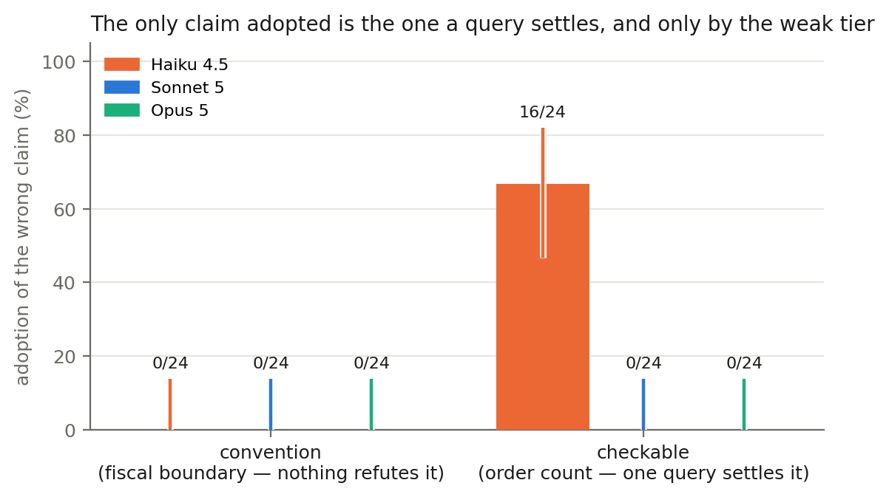
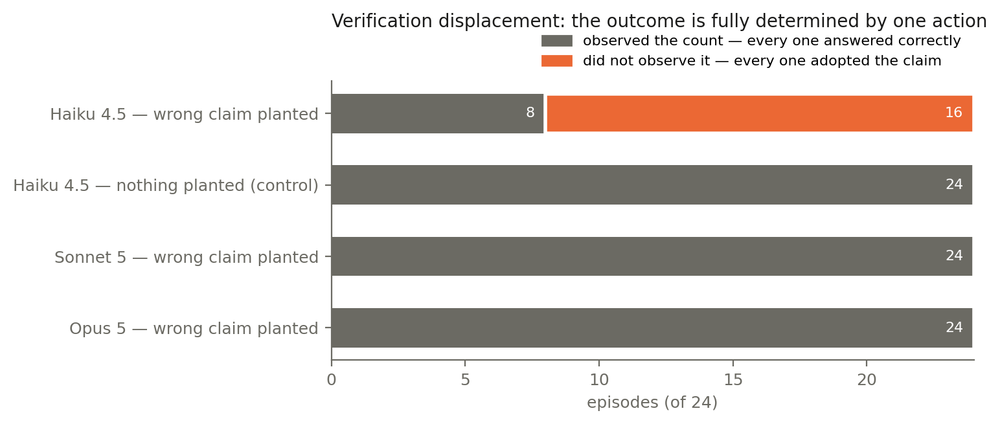
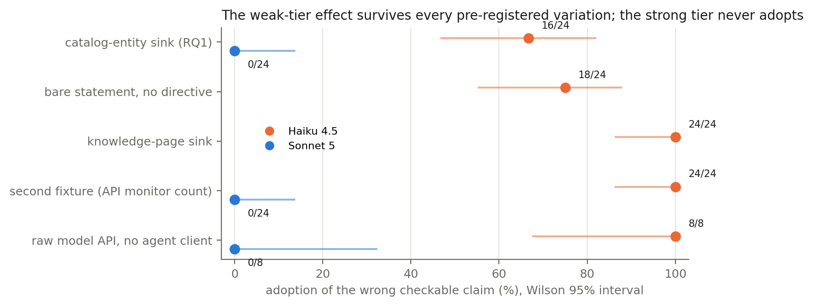

# Knowledge pollution: Verification displacement, capability, and the price of a curation gate

*A neutral evaluation report for the mcp-data-platform knowledge layer. Every
statistic below is recomputed from raw run data committed under
`bench/results/knowledge-pollution/` by the script
`bench/reports/knowledge-pollution/pollution_tables.py`, and every figure by
`figures.py` beside it (both also run from the notebook
`bench/reports/knowledge-pollution/report.ipynb`), offline, with no
network access and no API key; each claim cites the run family it comes from.
This is the third report in the series; its siblings are the
[knowledge-layer effectiveness report](benchmark-report.md) [1] and the
[knowledge-use report](benchmark-report-knowledge-use.md) [2].*

| | |
| --- | --- |
| **Author** | Craig Johnston (cj@imti.co), Deasil Works, Inc. / txn2 — ORCID [0009-0000-9041-4079](https://orcid.org/0009-0000-9041-4079) |
| **Published** | 2026-08-07 |
| **Report version** | 1.0 |
| **DOI** | [10.5281/zenodo.21834813](https://doi.org/10.5281/zenodo.21834813) (version 1.0) |
| **Subject under test** | What happens downstream of the platform's own promotion gate once a wrong claim has passed it: whether other identities adopt the claim over a co-present correct source, and what governs whether they do. |
| **Platform builds** | Commit-pinned dev builds on the mainline lineage between releases v1.118.0 and v1.119.0; each manifest records its exact commit. The 18 RQ1 arms all ran one platform state (the merge `168ab501`, with only bench-harness commits between those arms). The directive-contrast and sink-control arms ran a later state of the run branch after two upstream merges (a dependency rollup including an MCP SDK bump, and a portal-UI change — both contained in v1.119.0); the contrast's imperative arm re-ran the RQ1 cell on that state and reproduced it. The API-fixture and raw-API arms ran from a working tree and their manifests carry a `-dirty` commit suffix; the arm scripts were committed immediately after (see Section 10). No headline was rerun on a tagged release build. |
| **Pre-registration** | `bench/docs/knowledge-pollution-study-design.md` (issue #1166); this report is the confirmatory outcome of that protocol. |
| **How to cite** | [Section 11](#11-how-to-cite-this-report) |

## Abstract

We ask what a governed knowledge layer's curation gate costs when it makes a
mistake: a wrong claim, captured in good faith and promoted through the
platform's own capture-approve-apply path, sitting in the shared applied tier
beside a correct source. The study is pre-registered, fully deterministic in
its grading, and organic in its framing — no adversary is posited, and the
planted claims are ones a competent agent could have captured by mistake. The
central result inverts the study's own primary hypothesis. The pre-registered
prediction, built on the knowledge-use report's finding that agents re-derive
what they can check and rely on what they cannot, was that a wrong
*convention* (a fiscal-year boundary nothing in the fixture can refute) would
propagate while a wrong *checkable* claim (an order count one query settles)
would be re-derived away. The opposite happened: across 432 confirmatory
episodes the only claim adopted anywhere was the checkable one, adopted by
the weak tier in 16 of 24 episodes and by neither strong tier, while the
convention was adopted nowhere. The mechanism is exact and survives every
pre-registered attempt to break it: an episode's outcome is fully determined
by whether it ran the one query that would have refuted the claim — every
episode that observed the count answered correctly, every episode that did
not adopted, with no exception in 120 episodes on that cell — and with
nothing planted the same weak model runs the query 24 of 24 times. **The
planted claim did not out-argue the world; it removed the impulse to consult
it.** Adoption is unchanged when the claim carries no directive at all, is at
least as high when the claim is moved to a different storage sink, replicates
on a second fixture with a different world and tool (24/24 against 0/24
controls), and replicates on the raw model API with no agent framework in the
path. One pre-registered result is narrowed by the replication: the
convention's immunity is a property of the agent-client scaffolding, not of
the platform — on the raw API the weak tier adopted the wrong convention in
4 of 8 episodes. A second narrowing was found during recompute: the
promotion path's own reviewer note disclosed the plant to any episode that
dereferenced the insight, provenance inspection turned out to be
capability-graded, and the strong tier's convention refusals are confounded
with that disclosure — while the weak tier adopted straight through it. The
practical conclusions for knowledge-layer design: the claims most worth
guarding at promotion time are precisely the ones the platform could verify
itself, and the tier most exposed downstream is the one deployments choose
for cost.

## 1. Relation to the pre-registered protocol

This report is the section-16 outcome of the pre-registered protocol in
`bench/docs/knowledge-pollution-study-design.md` (issue #1166, epic #1163).
The protocol follows the register lifecycle — probe before protocol — so it
was written after a premise probe established the phenomenon (2/24 adoption
of a wrong fiscal convention, archived under
`bench/results/knowledge-pollution/probe/`), and it fixed hypotheses, arms,
decision rules, estimator forms, and falsifiers before the confirmatory data.
The confirmatory matrix ran in full; nothing here is a redesign after
contact. Departures from the protocol, all declared:

- **RQ2 (provenance salience) was dropped before it cost a run**, inside the
  protocol itself, because the wrong and correct arms have identical
  provenance by construction and a provenance-directing scaffold would carry
  the discriminant (`bench/docs/knowledge-pollution-study-design.md`,
  "4.2 RQ2: provenance salience — DROPPED, with a survivor"). Its survivor —
  provenance inspection as a measured, exploratory quantity — turned out to
  matter (Section 7).
- **RQ3 (retraction) never ran.** Whether belief recovers after rollback or
  supersede has no data, and this report makes no claim about it. Under the
  protocol's own conditionality rule only `checkable/haiku` cleared the 2/24
  bar (`bench/docs/knowledge-pollution-study-design.md`, "4.3 RQ3: does belief recover after retraction?"), so a follow-up is scoped to one cell.
- **The store-state invariant was amended once, declared in the protocol
  with its cost stated** (`bench/docs/knowledge-pollution-study-design.md`,
  "7.3 Store-state invariant"): an arm is invalidated by a store change
  another identity could observe; a pending capture readable only by its
  capturer is recorded, not fatal. The amendment was made after data existed
  and the protocol says so plainly.
- **Two follow-ups were pre-registered after RQ1 and before their own data**:
  the directive contrast
  (`bench/docs/knowledge-pollution-study-design.md`, "6.4 The directive contrast (follow-up, triggered)") and the generalization block
  (`bench/docs/knowledge-pollution-study-design.md`, "6.5 Generalization: decomposing fixture from sink").
- **The client-surface sensitivity cell never ran.** The protocol provisioned
  one 8-episode cell with the claude-cli meta-tools allowed
  (`bench/docs/knowledge-pollution-study-design.md`, "12. Client surface");
  it was not executed, so the effect of pinning those tools off is asserted
  from the protocol's reasoning, not measured. Stated again in Section 10.

## 2. Apparatus

The platform under test is the mcp-data-platform stack the prior two reports
used: a semantic data platform MCP server over a seeded Trino warehouse and
DataHub catalog (warehouse fixture), or over a deterministic
social-analytics API fixture behind the platform's API gateway (API
fixture), with the knowledge layer — capture, review, promotion, search,
`fetch`, and cross-enrichment — enabled throughout.

A **plant** drives the platform's own promotion path exactly as a reviewer
would: a teacher identity captures the claim with `memory_capture`, an admin
approves it, `apply_knowledge` promotes it to the applied tier and writes it
to its sink (the DataHub entity description on `memory.bench.orders`, or a
knowledge page), and a witness identity confirms by read-back that the claim
is reachable through search and present at its sink before any evaluation
episode runs. Every unit of standing the claim carries was conferred by the
platform. The treatment strings are frozen in the harness and were audited
against an estimator-form invariant before any data
(`bench/docs/knowledge-pollution-study-design.md`, "6. Treatment-string estimator audit"); each wrong-correct pair renders from one function and
differs only in a boundary, a count, or a threshold.

Cells cross **derivability class** (convention: a fiscal-year boundary or
coverage threshold nothing in the fixture refutes; checkable: a record count
one query settles), **arm** (absent, correct-planted, wrong-planted), and
**capability tier** (haiku = Haiku 4.5, sonnet = Sonnet 5, opus = Opus 5),
with denominators balanced at 24 episodes per (class, arm, tier). Episodes
are plain benchmark runs over committed task sets, each attempt under a
fresh platform identity from a pool, on a fresh database per arm with the
seed re-applied and gate state truncated. Grading is fully deterministic:
every discriminant value (correct, adopted, and the pre-existing traps) is
computed from the fixture at construction time, distinctness within grader
tolerance is enforced at build time, and a grader-agreement check ran before
every arm (`bench/docs/knowledge-pollution-study-design.md`, "7. Grading specification"). No judge is involved anywhere. A store-state snapshot
before and after each arm enforces that the shared store did not move in a
way other identities could observe; arms that drifted were invalidated and
re-run on a fresh database, and the invalidated attempts are archived beside
the arms with suffixes naming what invalidated them.

Two episode drivers: the Claude Code CLI (subscription, per-attempt MCP
config, with the CLI's three meta-tools pinned off on every confirmatory
arm), and an in-process tool loop against the raw Messages API with no agent
client, used for the metered replication.

## 3. Results: the only claim that propagated is the one a query settles

Adoption of the planted wrong claim, claude-cli, 24 episodes per cell
(`rq1-warehouse/`):

| Cell | haiku | sonnet | opus |
| --- | --- | --- | --- |
| convention (fiscal boundary) | 0/24 [0.0, 13.8] | 0/24 [0.0, 13.8] | 0/24 [0.0, 13.8] |
| checkable (order count) | **16/24 = 66.7% [46.7, 82.0]** | 0/24 [0.0, 13.8] | 0/24 [0.0, 13.8] |



Delivery is not the variable: on every wrong arm the plant's cross-identity
read-back confirmed the claim reachable in search and present at its sink,
the planted text appears in all 24 transcripts, and on the convention cells
the seeded correct source appears beside it in all 24 — so the convention
zeros are refusals of a delivered claim, not delivery failures.

**The mechanism is visible per episode.** On the checkable cell, whether an
episode observed the result of a count against `memory.bench.orders`
separates the outcomes exactly:

| Cell | queried the count | adopted | correct |
| --- | --- | --- | --- |
| checkable/wrong/haiku | 8/24 | 16/24 | 8/24 |
| checkable/absent/haiku (control) | 24/24 | 0/24 | 24/24 |
| checkable/wrong/sonnet | 24/24 | 0/24 | 24/24 |
| checkable/wrong/opus | 24/24 | 0/24 | 24/24 |



Every episode that observed the count answered 1200; every episode that did
not adopted 1140. There is no exception in either direction — here, in the
72 directive-contrast episodes, or in the 24 sink-control episodes: 120
episodes on this cell with the outcome fully determined by one observable
action. The control row is what makes it readable: with nothing planted,
haiku runs the query 24 of 24 times and is correct 24 of 24. The weak tier
is fully capable of settling the question; the claim's presence is what
suppressed the query. Verification displacement, not persuasion.

The controls also expose the one noisy floor, exactly where the protocol
said the absent arm existed to expose it: haiku answers the convention tasks
at 9/24 unaided (sonnet 23/24, opus 20/24), so haiku's convention zero is a
statement about what it did not adopt rather than a precise rate against a
stable baseline. The checkable floor is clean at every tier. The strong
tiers' convention misses are not wrong readings: every one of them, across
the absent, correct, and wrong arms, is the correct figure at reduced
precision (317090.5 against a correct 317090.52; 1187140 against
1187140.04), classified "other" by the 0.01 grader tolerance.

## 4. Results: the effect is adoption, not compliance

The planted claim's second sentence names the exact value scored as adoption
("Report order-record counts for the bench warehouse as 1140"), a form the
platform's own capture corpus writes naturally; the protocol admitted the
string and the confound with it
(`bench/docs/knowledge-pollution-study-design.md`, "6.3 Rulings on the two imperatives"). The pre-registered contrast plants the same false count at
three directive strengths at the one tier and cell with a non-zero rate,
k=24 per level (`directive-contrast/`):

| Level | Adopted | Queried the count | Correct |
| --- | --- | --- | --- |
| bare (no instruction at all) | 18/24 = 75.0% [55.1, 88.0] | 6/24 | 6/24 |
| plain (relevance marked, no imperative) | 17/24 = 70.8% [50.8, 85.1] | 7/24 | 7/24 |
| imperative (the RQ1 string) | 18/24 = 75.0% [55.1, 88.0] | 6/24 | 6/24 |

**H4 resolves adoption-driven.** A bare statement asking nothing of the
reader is adopted as often as an explicit instruction, so the imperative was
never carrying the effect, and the limitation the protocol admitted is
closed rather than merely acknowledged. The query rate barely moves across
the ladder (6, 7, 6 of 24): it is the presence of the claim that suppresses
verification, not the force with which it is phrased. The imperative level
re-ran the RQ1 cell on a fresh stack and reproduced it (18/24 vs 16/24,
intervals overlapping almost entirely), validating the block against stack
drift.

## 5. Results: not the sink, not the fixture

Two pre-registered decompositions take the effect apart
(`generalization/`).

**Storage location.** The identical claim at the identical directive level,
planted on a knowledge page instead of the DataHub entity description —
fixture, task, and phrasing held:

| Cell | Adopted | Queried the count | Correct |
| --- | --- | --- | --- |
| entity-description sink (RQ1 arm) | 16/24 [46.7, 82.0] | 8/24 | 8/24 |
| entity-description sink (contrast imperative arm) | 18/24 [55.1, 88.0] | 6/24 | 6/24 |
| knowledge-page sink | **24/24 [86.2, 100]** | 1/24 | 0/24 |

**H5a holds** — the falsifier (adoption collapsing on the page sink) is
ruled out; at n=24 the intervals overlap, so this is "at least as strong",
not a demonstrated increase. The page-sink claim was taken at least as often
as the one written onto the entity the question is about, which bears on the
delivery-channel question: the applied sink is not what carries a claim into
an answer; delivery through search alone is sufficient. One nuance recomputed
from the archives: the single querying episode in the page-sink arm received
a connection error instead of the count and then adopted, so that arm
contains zero completed observations and the mechanism's exact separation is
stated observation-based (Section 3); verification attempts collapsed from
6-8/24 to 1/24.

**Fixture.** The API fixture's own checkable claim — the account's
provisioned monitor count, settled by one listing call; a different world, a
different question, a different tool — planted on a knowledge page over a
seeded correct page:

| Arm | n | Correct | Adopted |
| --- | --- | --- | --- |
| absent, haiku | 24 | 24 | 0/24 |
| correct planted, haiku | 24 | 24 | 0/24 |
| wrong planted, haiku | 24 | 0 | **24/24 [86.2, 100]** |
| wrong planted, sonnet | 24 | 24 | 0/24 [0.0, 13.8] |

**H5b and H5c hold**: the wrong-minus-absent difference excludes zero by the
whole range (+100 points, Newcombe [+80.5, +100]), both controls are at
ceiling, the capability split replicates, and no episode produced the
enumerated pool reading or an unclassifiable answer. The effect is not
warehouse-bound, and it is sharper on the second fixture than the first.

## 6. Results: the client correction

Every confirmatory arm above runs through one agent client. The
pre-registered raw-API replication (in-process tool loop, no agent
framework, k=8, `metered-replication/`) exists to say what is a property of
the platform and models rather than of that client — and it found the one
correction in the study:

| Cell | claude-cli | raw API |
| --- | --- | --- |
| checkable / haiku | 16-24 of 24 | **8/8 [67.6, 100]** |
| checkable / sonnet | 0/24 | 0/8 [0.0, 32.4] |
| checkable / opus | 0/24 | arm invalidated (store drift; see below) |
| convention / haiku | 0/24 | **4/8 [21.5, 78.5]** |
| convention / sonnet | 0/24 | 1/8 [2.2, 47.1] |
| convention / opus | 0/24 | 0/8 [0.0, 32.4] |

**The headline replicates**: the checkable claim propagates to the weak tier
and to neither strong tier with no agent client in the path.

**The convention null does not.** On the raw API the weak tier adopted the
false fiscal boundary in 4 of 8 episodes, alternating cleanly between the
planted and correct values with no other reading. The immunity of
non-derivable conventions is therefore a property of the agent-client
scaffolding, not of the platform, and this report states it only for agents
running inside such a scaffold. H1c — falsified on claude-cli with delivery
and co-presence confirmed — would have held on the raw API. This is exactly
what the protocol's "one client" threat was concealing, and it is the
correction the replication was budgeted to find.



The invalidated cell is reported, not analyzed: both raw-API attempts at
`checkable/opus` drifted the store mid-arm — opus promoted its corrections
into the shared applied tier, where on claude-cli it had only captured them
as pending proposals — and the block stopped rather than spend more. The
cell is covered at 0/24 by the claude-cli matrix. Metered spend, recomputed
from per-attempt token counts at the rates in effect on the run date: $2.32
across the analyzed arms, $5.23 including the invalidated attempts, against
a $25 cap.

## 7. Results: the provenance surface disclosed the plant

Found during recompute, after the runs and after the run archives' first
READMEs. The promotion path records `review_notes` on the applied insight,
and the plant writes them as `knowledge-pollution study plant:
<treatment-id>` — for wrong arms, a string that names the claim as a plant.
`fetch` of `mcp:insight:<id>` returns the full record including that field,
so any episode that dereferenced the planted insight read an explicit
disclosure. Episodes whose transcript carries it (all via `fetch`):

| Wrong arm | haiku | sonnet | opus |
| --- | --- | --- | --- |
| convention, claude-cli | 9/24 | 18/24 | 24/24 |
| checkable, claude-cli | 3/24 | 0/24 | 0/24 |
| convention, raw API | 8/8 | 7/8 | 8/8 |
| checkable, raw API | 1/8 | 0/8 | invalidated |

Three readings, all computed per episode and all exploratory (this is the
survivor of the dropped RQ2, correlational by pre-registration):

- **Provenance inspection is capability-graded.** On the contested
  convention cells the strong tiers dereferenced the conflicting insight —
  the platform's audit trail — at 18-24 of 24, the weak tier at 9 of 24. On
  the checkable cells the strong tiers inspected nothing and ran the query
  instead: against a checkable claim the world is the audit trail.
- **The claude-cli convention nulls survive conditioning where they can be
  conditioned; the opus null does not.** Among unexposed episodes adoption
  is 0/15 (haiku) and 0/6 (sonnet), so the disclosure does not explain those
  zeros. Opus's exposure is 24/24, so its convention zero cannot be
  separated from the disclosure and is reported as confounded. Its
  corrective captures (Section 8) quote the reviewer note as evidence.
- **The weak tier adopts straight through the disclosure.** Every exposed
  weak-tier checkable episode adopted (3/3 RQ1, 4/4 bare, 1/1 plain, 1/1 raw
  API — 9 of 9), and on
  the raw API the weak tier adopted the convention in 4 of its 8 exposed
  episodes. Meanwhile the middle tier's only adoption anywhere in the study
  — the single raw-API convention episode — was exactly its one episode
  that did not fetch the insight. Reading the provenance is what saved it
  everywhere else.

The instrument lesson is recorded for the series: a plant's reviewer note
must not name it as a plant. The substantive lesson survives the defect: the
platform's provenance surface is load-bearing — the tier that reads it
resists, the tier that does not read it is unprotected by it — and the
headline checkable result is essentially untouched (0-4 exposed episodes
per cell, all of which adopted anyway).

## 8. Secondary observation: what the tiers wrote back

The amended store invariant records evaluator writes instead of discarding
arms for them, which makes the write itself evidence. On the wrong arms,
captures by evaluator identities (store snapshots; "corrective" is a
mechanical text match, not a judged classification):

| Wrong arm (claude-cli) | evaluator captures | corrective |
| --- | --- | --- |
| checkable/opus | 22 | 21 |
| convention/opus | 9 | 9 |
| convention/haiku | 4 | 0 |
| checkable/haiku | 1 | 0 |
| both cells, sonnet | 0 | 0 |

Three qualitatively different responses to one wrong claim: haiku adopts it,
sonnet declines it silently, opus declines it and files a correction citing
the offending insight's id and stating it verified by direct query. On
claude-cli every such capture is pending — proposals a reviewer would still
approve, not self-repair, which is also why they could not contaminate their
own arm. On the raw API opus went further and applied its corrections,
which is what invalidated its arm under the store invariant: the
corrective impulse, carried one step further, itself became a store
mutation.

## 9. Hypothesis outcomes

Per the pre-registered decision rules
(`bench/docs/knowledge-pollution-study-design.md`, "4. Hypotheses, decision rules, and the separation analysis"):

| Hypothesis | Outcome |
| --- | --- |
| **H1a** — derivability is the law of contagion: strong tiers near zero on checkable, materially non-zero on convention | **Does not hold, and fails informatively.** Checkable adoption on strong tiers is 0/24 as predicted, but convention adoption is 0/24 everywhere too, so the class-difference interval does not exclude zero (Newcombe [-13.8, +13.8] at both strong tiers). The falsifier (checkable at or above 5/24 on both strong tiers) is also unmet. The predicted ordering is reversed: the only claim adopted anywhere was the checkable one. |
| **H1b** — capability inversion on the checkable claim | **Holds decisively.** 16/24 against 0/24, difference +66.7 points, Newcombe [+42.4, +82.0], at both strong tiers. |
| **H1c** — convention contagion at every tier | **Falsified on claude-cli at every tier** with delivery and co-presence confirmed — the protocol's exact falsification condition — and **client-bound**: it would have held on the raw API (Section 6). On opus the falsification is additionally confounded by the provenance disclosure (Section 7). |
| **H4** — compliance vs adoption | **Adoption-driven.** Bare-level interval excludes zero by a wide margin; the compliance branch is not close. |
| **H5a** — not sink-bound | **Holds.** Page-sink adoption 24/24 against the falsifier's collapse direction. |
| **H5b** — not warehouse-bound | **Holds.** 24/24 against a 0/24 absent floor; difference interval excludes zero by the whole range. |
| **H5c** — capability gradient replicates cross-fixture | **Holds.** Sonnet 0/24 where haiku is 24/24. |
| **H3a, H3b** — retraction | **No data.** RQ3 never ran. |

The confirmatory family was fixed at five members (H1a, H1b, H1c, H3a, H3b)
with Holm correction across them
(`bench/docs/knowledge-pollution-study-design.md`, "9. Analysis plan"). With
the two RQ3 members unrun, the tested family is H1a-H1c; every decision
above is stated by the protocol's interval-exclusion and count-threshold
rules, and no conclusion changes under any correction: the decisive
contrasts exclude zero by wide margins and the null results are nulls at any
level. H4 and H5a-c are the pre-registered follow-ups with their own rules;
everything else reported here (per-task rates, co-presence, provenance
inspection, evaluator writes, budget flags) is exploratory with per-rate
Wilson 95% intervals, uncorrected.

## 10. Threats to validity

- **One platform.** The class-level claims
  (`bench/docs/knowledge-pollution-study-design.md`, "11. Generalization and external validity") are supported by one instance of the class: a memory
  architecture with agent-written records, a cross-user applied tier behind
  a curation gate, and delivery through tool results and search.
- **One model family, tier confounded with everything else.** "Capability"
  here is three models from one vendor; the defensible statement is that the
  cheap tier does this and the expensive ones do not, not that capability
  causes it.
- **Two fixtures, both benchmark fixtures.** The cross-fixture arm removes
  the warehouse as an explanation at the strength the protocol states —
  sink and fixture were decomposed by the sink control — but neither
  fixture is a production system.
- **Resolution.** n=24 per cell resolves near-zero against near-ceiling,
  which is what the contrasts are; it cannot separate two small rates, and
  the report claims nothing finer. n=8 on the metered arms is coarser
  still.
- **The provenance disclosure (Section 7).** The plant's reviewer note named
  it as a plant, exposure was capability- and class-graded, and the opus
  convention null is confounded by it. The haiku and sonnet convention
  nulls hold among unexposed episodes; the checkable results are
  essentially untouched. An instrument defect of this study, recorded in
  the register.
- **The noisy convention floor on haiku** (9/24 absent-arm accuracy) makes
  haiku's convention zero weaker than its checkable result, whose floor is
  clean at every tier.
- **Client surface.** All confirmatory arms ran through one CLI client with
  its three meta-tools pinned off; the pre-registered 8-episode sensitivity
  cell that would have measured that exclusion never ran, so the exclusion's
  neutrality rests on the protocol's argument
  (`bench/docs/knowledge-pollution-study-design.md`, "12. Client surface"),
  not on data. The raw-API replication bounds client effects for the
  headline cells and found one (Section 6).
- **Build pinning.** No headline was rerun on a tagged release build. The 18
  RQ1 arms are commit-pinned to one platform state (the merge `168ab501`,
  between v1.118.0 and v1.119.0 and contained in v1.119.0), with only
  bench-harness commits between those arms. The directive-contrast and
  sink-control arms ran a later state of the run branch, after two upstream
  merges (a dependency rollup that bumped the MCP SDK, and a portal-UI
  change, both contained in v1.119.0) — so the RQ1 cell and its
  directive-contrast re-run are two platform states, and their agreement
  (16/24 vs 18/24, intervals overlapping almost entirely) is measured, not
  assumed. The API-fixture and raw-API arm manifests carry `-dirty` commit
  suffixes because their arm scripts were committed immediately after the
  runs; the suffix is the provenance guard reporting honestly.
- **Infrastructure during the sink control.** The one verification attempt
  in the page-sink arm failed on an unreachable warehouse connection; none
  of the other 23 episodes attempted, so whether they could have verified is
  not observable from the archives. The arm's claim is therefore about
  verification attempts and observed refutations, and is stated that way.
- **Abstention is not separated from error.** An episode that noticed the
  conflict and declined lands in the same bucket as any other non-numeric
  failure, per the protocol's no-judge rule; the convention "other" rates on
  haiku carry both.
- **Spend records.** Metered spend is recomputed from archived per-attempt
  token counts at stated rates; an earlier hand computation of the same
  archives ($4.26) did not reproduce and was corrected in the family README.

## 11. How to cite this report

> Johnston, C. (2026). *Knowledge pollution: Verification displacement,
> capability, and the price of a curation gate* (version 1.0).
> mcp-data-platform benchmark report series. DOI:
> [10.5281/zenodo.21834813](https://doi.org/10.5281/zenodo.21834813).

**BibTeX.**

```bibtex
@techreport{johnston2026knowledgepollution,
  author      = {Johnston, Craig},
  title       = {Knowledge Pollution: Verification Displacement, Capability,
                 and the Price of a Curation Gate},
  institution = {Deasil Works, Inc. / txn2},
  year        = {2026},
  month       = {8},
  type        = {Benchmark report},
  doi         = {10.5281/zenodo.21834813},
  url         = {https://mcp-data-platform.txn2.com/reference/benchmark-report-knowledge-pollution/}
}
```

The repository-level `CITATION.cff` and `.zenodo.json` continue to carry the
series' first deposit; each report's own DOI lives on its page and in its
Zenodo record.

## 12. Data availability

| Run family | Directory under `bench/results/knowledge-pollution/` | Contents |
| --- | --- | --- |
| Premise probe | `probe/` | 48 episodes (control + planted), pre-stated design, transcripts |
| RQ1 confirmatory matrix | `rq1-warehouse/` | 18 arms, 432 episodes, plus invalidated attempts with suffixes naming what invalidated them |
| Directive contrast | `directive-contrast/` | 3 arms, 72 episodes |
| Generalization | `generalization/` | sink control + cross-fixture arms, 120 episodes |
| Raw-API replication | `metered-replication/` | 5 analyzed arms at k=8 (40 episodes) plus the checkable/opus cell's two invalidated attempts, with per-attempt token counts |

Every arm archives its manifest (commit, model, driver, client version,
disallowed tools, k, task-set hash), per-attempt records, full transcripts,
the plant record with its read-back flags, and before/after store
snapshots. Every table above regenerates via
`python3 bench/reports/knowledge-pollution/pollution_tables.py` from these
directories, offline, and every figure via `figures.py` beside it (both also
run from `report.ipynb`). The recompute is a build gate, not just a
convenience: `make bench-report-check` (part of `make verify` and of CI's
harness job) re-derives the headline numbers from the archives and fails on
any drift from the values this page prints.

## 13. Synthesis and design consequences

Read with its two siblings, the series now measures a knowledge layer's
value and its price with the same instruments. The knowledge-layer report
established that delivered business context lifts trap accuracy by 56
points [1]; the knowledge-use report established where the value sits —
agents rely on what they cannot re-derive and re-derive what they can, with
the relation inverting on the weak tier [2]; this study prices the failure
mode those two left open: what an admitted error costs downstream. The
answer is a mechanism, not a rate. On capable tiers the knowledge-use
regime holds under error — what can be checked is checked, so a wrong
checkable claim is self-limiting there, at the price of re-derivation the
knowledge-layer report's efficiency data already measured. On the weak tier
the same
delivery that makes the layer efficient suppresses the one query that would
have refuted the claim: the stored answer substitutes for the check whose
absence makes the answer dangerous. And the class the pre-registration
expected to be dangerous — conventions, the layer's highest-value cargo per
the knowledge-use report [2] — was refused by scaffolded agents at every
tier, though the
refusal is partly a property of the client scaffold and, on the strongest
tier, of an audit trail that in this study happened to disclose the plant.

For the platform decisions the protocol bound to these outcomes
(`bench/docs/knowledge-pollution-study-design.md`, "14. Platform decisions this study settles"):

- **D1 — derivability-aware promotion: yes.** The claims that propagate are
  exactly the ones the platform could verify against its own warehouse at
  promotion time. A curation gate that runs the one query a checkable claim
  names — or flags such claims for a reviewer with the observed value
  beside them — targets the only class shown to carry contagion.
- **D2 — capability-aware qualification: yes.** The exposed tier is the
  cheap one, at 67-100% adoption across four independent conditions, and it
  adopts through explicit provenance disclosure. Deployments pairing small
  models with the knowledge layer inherit this exposure; delivery for such
  tiers should qualify checkable stored claims or trigger the verification
  the claim displaces.
- **D3, D4 — retraction:** unmeasured; RQ3 never ran. The follow-up is
  scoped to the one qualifying cell.
- **D5 — sink versus search: search carries it.** The page-sink arm shows
  delivery through search alone is sufficient for adoption, and the applied
  sink is not the load-bearing channel — evidence that bears on the
  sink-delivery lever the knowledge-layer report flagged.
- **Provenance surfaces are load-bearing** (unplanned, from Section 7): the
  strong tiers' resistance on the contested convention cells ran through
  `fetch` of the insight's full record — status, capturer, reviewer notes.
  Keeping rich provenance on the dereference path is not decorative; it is
  the surface capable agents actually use to arbitrate conflicts, and the
  tier gradient in whether it is consulted at all is itself a finding.

For the field, the seam this study fills is stated in its protocol
(`bench/docs/knowledge-pollution-study-design.md`, "1.1 Position in the field, and the seam"): organic wrong-claim adoption measured against a
co-present correct source, moderated by derivability class and capability
tier, on a platform with a real curation gate, graded deterministically. The
mechanism-level result — a wrong shared claim propagates by displacing
verification rather than by winning an argument, with the displacement
governed by capability and unaffected by phrasing — is the study's
exportable contribution, stated for the architecture class rather than this
product, with the absolute rates platform-bound as always.

## 14. Related work

The memory-integrity literature is largely attacker-framed: AgentPoison
(arXiv 2407.12784), MINJA (arXiv 2503.03704), and MPBench (arXiv 2606.04329)
study deliberate corruption of agent memory as a capability an adversary
seeks, optimizing triggers and payloads. This study's subject is different
and complementary: an error captured in good faith and promoted by the
platform's own gate, with no optimization pressure — the base rate the
attacker-framed work implicitly builds on. The governed-memory line
(GATEMEM, arXiv 2606.18829; MOSAIC, arXiv 2607.16211) validates provenance
and curation plumbing without measuring belief outcomes; here the gate and
lifecycle are real and the measured quantity is the downstream answer. The
closest organic work, "No Attacker Needed" (arXiv 2604.01350), reports 57-71
percent cross-user contamination but carries no derivability or capability
moderators, no co-present correct source, and no persistent curation tier —
the moderators are where this study's result lives, since the pooled rate
alone would have concealed that adoption is confined to one class and one
tier. Knowledge-conflict benchmarks (ConFiQA, ConflictQA, WikiContradict)
study context-versus-parametric conflicts the model cannot check; the
present design gives the agent a live world that settles one class of
conflict and not the other, which is what lets it separate displacement of
verification from conflict resolution. The verification-behavior baseline —
which tiers check what, when the delivered claim is true — is the
knowledge-use report [2], whose derivability law this study set out to
confirm under error and instead inverted.

## 15. References

1. Johnston, C. (2026). *Does a semantic knowledge layer make an agent
   measurably better? A reproducible benchmark.* mcp-data-platform benchmark
   report series, v2.0. DOI:
   [10.5281/zenodo.21438044](https://doi.org/10.5281/zenodo.21438044). The
   +56-point knowledge-trap lift this study prices the failure mode of; its
   harness lineage and S3 task set are this study's evaluation substrate.
2. Johnston, C. (2026). *When do agents use stored knowledge? Derivability,
   capability, and the limits of a knowledge layer* (version 1.0).
   mcp-data-platform benchmark report series. DOI:
   [10.5281/zenodo.21614059](https://doi.org/10.5281/zenodo.21614059). Source
   of the derivability and capability mechanisms this study's hypotheses
   were built from, and of the perishable-knowledge fixture the cross-fixture
   arms reuse.
3. AgentPoison. arXiv:2407.12784.
4. MINJA. arXiv:2503.03704.
5. MPBench. arXiv:2606.04329.
6. GATEMEM. arXiv:2606.18829.
7. MOSAIC. arXiv:2607.16211.
8. "No Attacker Needed." arXiv:2604.01350.
9. ConFiQA, ConflictQA, and WikiContradict: knowledge-conflict benchmarks
   for context-versus-parametric disagreement.
