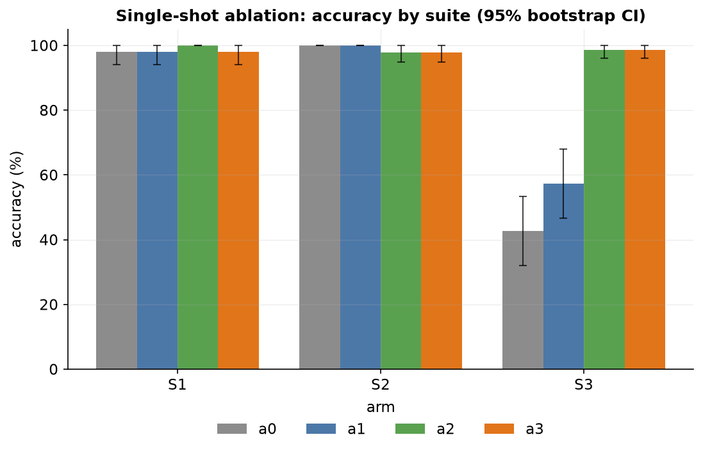
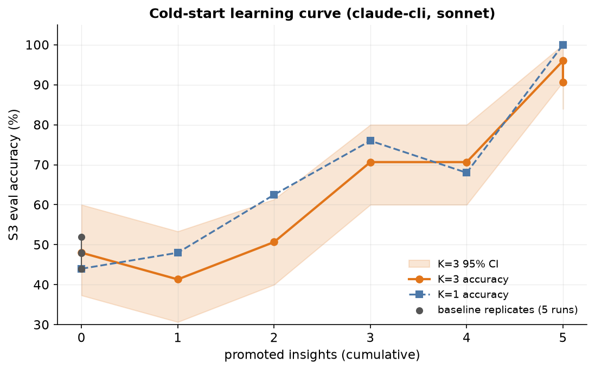
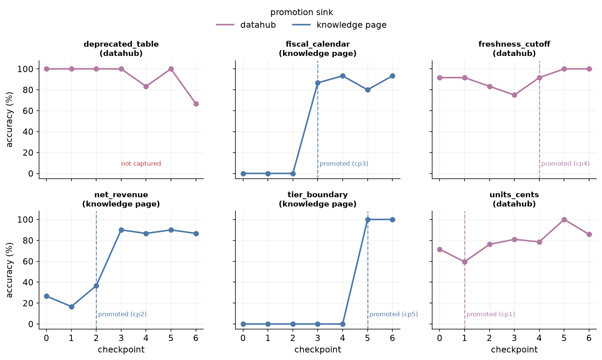
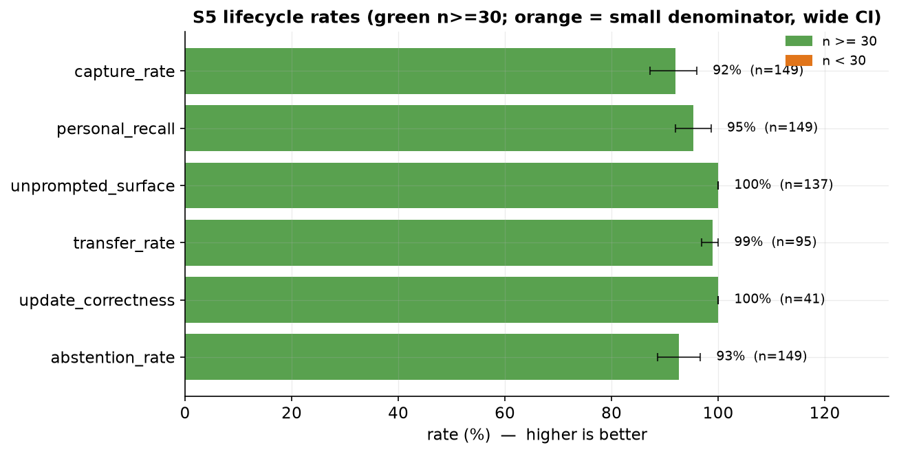

# Does a semantic knowledge layer make an agent measurably better? A reproducible benchmark

*A neutral evaluation report for the mcp-data-platform knowledge layer. Every
statistic below is recomputed from raw run data committed under `bench/results/`
by the notebook `bench/reports/knowledge-layer/report.ipynb`; each claim cites the run directory
it comes from.*

| | |
| --- | --- |
| **Author** | Craig Johnston (cj@imti.co), Deasil Works, Inc. / txn2 — ORCID [0009-0000-9041-4079](https://orcid.org/0009-0000-9041-4079) |
| **Published** | 2026-07-19; version 2.0.1 published 2026-08-01 |
| **Report version** | 2.0.1 |
| **DOI** | [10.5281/zenodo.21438044](https://doi.org/10.5281/zenodo.21438044) (concept DOI, resolves to the latest version). This version: [10.5281/zenodo.21751635](https://doi.org/10.5281/zenodo.21751635). |
| **Subject under test** | The platform's semantic knowledge layer (cross-enrichment, `search`, and the memory / `apply_knowledge` lifecycle), not the whole platform. |
| **Platform builds** | **This report spans two platform generations and the sections are not mutually comparable.** Section 5 (lifecycle) ran on `v1.118.0-4-g445e3abc`; Sections 3 and 4 are pinned to release tag `v1.102.2`, whose application code is byte-identical to the cold-start build. Within that tag the ablation ran on `v1.102.0` platform logic and cold-start on `v1.102.1` (the superseded v1.1 lifecycle run was also `v1.102.0`); the only deltas from the tag are portal-pagination plumbing (#974) and a pprof diagnostic endpoint, neither of which is in the cross-enrichment, `search`, or knowledge-lifecycle path under test (Section 6). Exact build strings, commits, seeds, and task-set hashes are pinned in each run's manifest (Section 9). |
| **How to cite** | [Section 10](#10-how-to-cite-this-report) |

## Abstract

We evaluate whether a semantic knowledge layer, placed between a large language
model and a data warehouse, changes the model's task accuracy on data-analysis
questions, and whether an accumulate-and-reuse knowledge loop lets the same
platform improve over time. Two complementary studies are reported. (1) A
single-shot ablation isolates four platform configurations (raw tools;
enrichment; knowledge and search; full lifecycle) on a fixed, seeded 87-task
suite with three repeats per task. On knowledge-trap questions, which are
answerable plausibly but wrongly without business context, accuracy rises from
42.7% (raw tools) to 98.7% (knowledge layer), a difference of +56.0 points with
a 95% bootstrap confidence interval of +44 to +67. On plain discovery and
numeric questions, where no business context is required, the configurations are
statistically indistinguishable, so the effect is specific to knowledge-gated
tasks and is not a general accuracy uplift. (2) A cold-start study starts from an
empty enrichment layer and teaches six facts one at a time, re-evaluating a
fixed trap suite after each promotion. Accuracy climbs from an empty-layer
baseline of 48.0% to 90.7% after five promotions (headline run, three repeats
per checkpoint), and the empty-layer floor reproduces across five independent
runs (44.0, 44.0, 47.8, 48.0, 52.0 percent). The per-trap-class trajectories
show each taught fact moving at or shortly after its own promotion checkpoint,
which is the mechanistic core of the result. We report every number with a
reproducible confidence interval, enumerate the validity signals and threats,
and ship a notebook that regenerates every figure from the committed data with
no network access and no API key.

## 1. Motivation

A semantic data platform inserts a metadata and knowledge layer between an agent
and a query engine. The platform's central claim is that automatically attaching
business context to tool results, and letting an agent search a curated
knowledge base, makes the agent answer data questions correctly when it would
otherwise answer plausibly but wrongly. That claim is testable. The failure mode
it targets is specific: a monetary column stored in integer cents that the model
reads as dollars; a revenue figure computed gross when the house definition is
net of discounts; a "current" table that is actually a deprecated extract. In
each case the model can produce a confident, well-formed, wrong answer, and no
amount of raw SQL skill fixes it, because the missing input is a fact about the
data, not a fact about SQL.

Two questions follow. First, holding the model and the task set fixed, does
adding the platform's layers change accuracy, and on which kinds of question?
This is a single-shot ablation: same model, same questions, different platform
configuration. Second, does the platform's knowledge loop (capture a fact,
promote it into a durable sink, surface it on later sessions) let the same
platform get better over time from an empty starting state? This is a
longitudinal study, and it is the more demanding claim, because it exercises the
whole loop end to end rather than a pre-seeded snapshot of it.

## 2. Experimental design

### 2.1 Configurations (arms)

The ablation compares four configurations of the same platform. The
configurations differ only by configuration profile, not by code path; the
config surface is the ablation mechanism (`bench/docs/knowledge-layer-protocol.md`, "Arms").

| Arm | Name | What the agent is connected to |
| --- | --- | --- |
| a0 | raw tools | The underlying data tools directly (`trino_*`, `s3_*`); no semantic provider, no search, all cross-enrichment off (`bench/docs/knowledge-layer-protocol.md`, "Arms"). |
| a1 | enrichment | a0 plus semantic cross-enrichment: tool results carry DataHub context automatically, but the agent still has no `search` and no `datahub_*` tools (`bench/docs/knowledge-layer-protocol.md`, "Arms"). |
| a2 | knowledge | a1 plus the `search` tool, the search-first gate, and curated knowledge pages (`bench/docs/knowledge-layer-protocol.md`, "Arms"). |
| a3 | lifecycle | a2 plus the memory and `apply_knowledge` lifecycle (`bench/docs/knowledge-layer-protocol.md`, "Arms"). |

The arms without a discovery tool (a0, a1) disable the search-first gate, which
is not persona-aware (`bench/docs/knowledge-layer-protocol.md`, "Arms").

### 2.2 Task suites

The phase-2 task set is 87 tasks across three suites (`bench/docs/knowledge-layer-protocol.md`, "Seeded ground truth"),
each run three times per arm, for 261 graded attempts per arm.

- **S1, discovery (17 tasks).** "Which table answers X", graded by entity-alias
  match. Some tasks are knowledge-dependent (`bench/docs/knowledge-layer-protocol.md`, "Seeded ground truth").
- **S2, analytical accuracy (45 tasks).** Exact numeric questions at
  BIRD-style tiers (single-table, join, temporal, cross-tab, top-N); four tasks
  emit SQL graded by execution-result comparison. S2 states monetary units
  explicitly, so it measures query formulation, not the units trap
  (`bench/docs/knowledge-layer-protocol.md`, "Seeded ground truth").
- **S3, knowledge traps (25 tasks).** Each task is answerable plausibly but
  wrongly without the knowledge layer, across six seeded trap classes
  (`bench/docs/knowledge-layer-protocol.md`, "Seeded ground truth"):

  | Trap class | The fact the agent must know |
  | --- | --- |
  | `units_cents` | Monetary columns are integer cents; divide by 100 (`bench/docs/knowledge-layer-protocol.md`, "Seeded ground truth"). |
  | `net_revenue` | Revenue is `amount - discount` over completed orders only; the gross and net leaders differ by construction (`bench/docs/knowledge-layer-protocol.md`, "Seeded ground truth"). |
  | `fiscal_calendar` | The fiscal year runs Feb 1 to Jan 31 (`bench/docs/knowledge-layer-protocol.md`, "Seeded ground truth"). |
  | `freshness_cutoff` | The daily index stops at 2025-11-30; post-cutoff questions must use raw orders (`bench/docs/knowledge-layer-protocol.md`, "Seeded ground truth"). |
  | `tier_boundary` | A "key account" is any plus- or enterprise-tier customer (`bench/docs/knowledge-layer-protocol.md`, "Seeded ground truth"). |
  | `deprecated_table` | `legacy_orders` is a partial, deprecated extract (`bench/docs/knowledge-layer-protocol.md`, "Seeded ground truth"). |

### 2.3 Grading

Answers are scored by a deterministic grader that reads only the text after the
last `FINAL ANSWER:` marker, and only its first line, so trailing commentary
cannot flip a grade (`bench/internal/grade/grade.go:6`). Numeric answers match
within an absolute tolerance, preferring decimal-bearing candidates over bare
integers (`grade.go:53`). Entity answers are correct only when a correct alias
appears and no wrong alias does (the wrong-alias veto), matched on word
boundaries so, for example, "East" does not veto "at least"
(`grade.go:74`, `grade.go:103`). SQL-producing tasks are graded by
execution-result comparison in the BIRD convention (Li et al., 2023): two result sets are equal as
multisets of rows compared by sorted cell values, so column aliasing and row or
column ordering do not matter (`bench/internal/grade/execsql.go:76`). The
reference and candidate queries execute through a dedicated admin-credentialed
session, separate from the attempt's own session, so grading does not perturb
the attempt's audit accounting (`bench/docs/knowledge-layer-protocol.md`, "Measurement").

A pinned LLM judge (`claude-sonnet-5`, `bench/judge/rubric.yaml:14`) scores only
the caveat items a deterministic grader cannot: whether an S3 answer carried the
required caveat that makes it trustworthy (`rubric.yaml:3`). The rubric is
versioned and ships with a 30-item human-labeled calibration set
(`bench/judge/calibration.yaml`), and `make bench-calibrate` computes the
judge's human-agreement rate to be published alongside any judged result
(`bench/docs/knowledge-layer-protocol.md`, "Measurement"). The S3 accuracy figures in this report are the
deterministic pass rates; the judge governs the separate caveat-quality axis.

### 2.4 Repeats, pass^k, and confidence intervals

Each task is attempted `k = 3` times from independent identities. Two robustness
views are reported: accuracy over all graded attempts, and pass^k (the reliability
metric introduced by tau-bench, Yao et al., 2024), the fraction of tasks whose all
`k` repeats pass (`bench/internal/report/compare.go:204`). An
errored attempt is never graded, so it can never claim pass^k.

Confidence intervals in this report are a percentile bootstrap over graded
attempts (or, for the lifecycle rates, over protocol-runs) with a fixed
resampling seed, so they are reproducible. The notebook uses 20000 resamples
with a seed of 930 (the dataset seed); the benchmark harness itself uses 5000
resamples with the same seed and its own random source
(`bench/internal/stats/bootstrap.go:19`). Point estimates are exact means and
match the harness exactly; the interval endpoints from the two implementations
agree to within a point or two, as expected from differing resample counts and
random sources. These intervals quantify sampling variance over attempts; they
do not model task-selection variance.

### 2.5 Identity pool

The search-first gate keys discovery on the authenticated user, not the MCP
session (`pkg/searchgate/searchgate.go:1`,
`pkg/middleware/mcp_workflow_gate.go:11`), so every attempt authenticates as its
own pool identity. The committed pool holds 320 keys, sized to the
thirty-protocol lifecycle suite at `k = 5`, its largest single consumer
(`bench/docs/knowledge-layer-protocol.md`, "Measurement"); it held 264 for the
v1.1 runs and was grown for the Section 5 re-run. The lifecycle suite consumes two
identities per attempt (a teacher and a learner) so discovery scope never leaks
between them (`bench/docs/knowledge-layer-protocol.md`, "S5 memory-insight-knowledge lifecycle (#944)").

### 2.6 Two client paths, never mixed

The ablation and lifecycle suites ran on the Anthropic API adapter; the
cold-start study ran on the `claude-cli` adapter, which is subscription-funded.
The two client paths are **not** accuracy-comparable: `claude -p` reinserts its
own system prompt, tool policy, and retries, which shift across client releases
(`bench/docs/knowledge-layer-protocol.md`, "claude-cli adapter (subscription, no API key)"). The harness records
`client_version` and refuses to fold the two into one leaderboard. We follow the
same rule: the ablation and cold-start results are complementary sub-studies,
reported separately, and no cross-path accuracy comparison is drawn.

## 3. Results: single-shot ablation (S1 to S3)

Source: `bench/results/phase2-anthropic-k3/full-a{0,1,2,3}/results.json`.
Model `claude-sonnet-5`, `k = 3`, 261 graded attempts per arm, platform build
`v1.102.0-9-gadfb9d90-dirty`.

### 3.1 Overall

| Arm | Graded | Accuracy (95% CI) | pass^k | Median calls | Median wall (s) |
| --- | ---: | --- | ---: | ---: | ---: |
| a0 | 261 | 83.1% [79-87] | 80.5% | 7 | 14.0 |
| a1 | 261 | 87.4% [83-91] | 86.2% | 7 | 13.9 |
| a2 | 261 | 98.5% [97-100] | 97.7% | 9 | 27.4 |
| a3 | 261 | 98.1% [96-100] | 96.6% | 9 | 27.0 |

The overall accuracy is dominated by S1 and S2, which most arms already answer
correctly, so the aggregate understates the effect. The discriminating suite is
S3.

### 3.2 By suite



| Suite | a0 | a1 | a2 | a3 |
| --- | --- | --- | --- | --- |
| S1 | 98.0% [94-100] | 98.0% [94-100] | 100.0% [100-100] | 98.0% [94-100] |
| S2 | 100.0% [100-100] | 100.0% [100-100] | 97.8% [95-100] | 97.8% [95-100] |
| S3 | 42.7% [32-53] | 57.3% [47-68] | 98.7% [96-100] | 98.7% [96-100] |

On S1 (discovery) and S2 (numeric formulation with units stated), the four arms
are statistically indistinguishable, and the knowledge arms cost a small amount
of extra tool traffic (median 9 calls versus 7, roughly double the wall time)
for the search-first workflow. On S3 (knowledge traps), the knowledge layer
moves accuracy from 42.7% to 98.7%.

### 3.3 The knowledge effect and its confidence interval

The S3 accuracy delta versus the raw-tools baseline, with a bootstrap CI on the
difference:

| Arm | S3 delta vs a0 | 95% CI |
| --- | ---: | --- |
| a1 (enrichment only) | +14.7 pts | [-1 to +31] |
| a2 (knowledge) | +56.0 pts | [+44 to +67] |
| a3 (lifecycle) | +56.0 pts | [+44 to +67] |

Enrichment alone (a1) produces a positive but not statistically resolved shift
(its interval includes zero). Adding search and knowledge pages (a2) produces a
large, unambiguous effect. The lifecycle arm (a3) matches a2 here, which is
expected: on single-session tasks the lifecycle has nothing pre-seeded to
recall, so its value is what the cold-start and S5 studies measure, not what S1
to S3 measure.

### 3.4 Per-trap-class breakdown

| Trap class | a0 | a1 | a2 | a3 | n per arm |
| --- | ---: | ---: | ---: | ---: | ---: |
| deprecated_table | 95.2% | 95.2% | 100.0% | 100.0% | 21 |
| fiscal_calendar | 0.0% | 0.0% | 100.0% | 100.0% | 15 |
| freshness_cutoff | 91.7% | 100.0% | 100.0% | 100.0% | 12 |
| net_revenue | 21.2% | 48.5% | 100.0% | 100.0% | 33 |
| tier_boundary | 0.0% | 0.0% | 93.3% | 100.0% | 15 |
| units_cents | 61.9% | 88.1% | 97.6% | 97.6% | 42 |

The breakdown is instructive about scope. Two classes, `fiscal_calendar` and
`tier_boundary`, sit at 0% without the knowledge layer: the model cannot guess a
fiscal-year boundary or a house tier definition, and no enrichment channel
carries them either (both facts live only on knowledge pages), so only the
search arms recover them. Two classes, `units_cents` and `net_revenue`, are
partially recoverable by enrichment alone (a1 lifts `units_cents` from 61.9% to
88.1% and `net_revenue` from 21.2% to 48.5%), because those facts live in column
and dataset descriptions that enrichment attaches. Two classes,
`deprecated_table` and `freshness_cutoff`, are already near ceiling at a0,
because the model can often infer them from the data itself. The knowledge
layer's contribution is largest exactly where the model has no other route to
the fact.

## 4. Results: cold-start knowledge growth

Source (headline): `bench/results/cold-start-a3-20260717-142008-3064/results.json`.
Adapter `claude-cli`, model `sonnet`, `k = 3`, platform build
`v1.102.1-5-g96169337`. The platform starts from an empty enrichment layer
(entities present, no descriptions, tags, glossary, or knowledge pages). Six
facts are taught one at a time; each captured insight is promoted to a sink (a
DataHub aspect or a knowledge page), and the fixed 25-task S3 suite is re-run by
a fresh, never-taught evaluator identity after each promotion. Checkpoint 0 is
the empty-layer baseline (`bench/docs/knowledge-layer-protocol.md`, "Cold-start knowledge growth (#963)").

### 4.1 The learning curve



The headline `k = 3` run climbs from a baseline of 48.0% to 90.7% after five
promotions (a lift of +42.7 points), with 5 of 6 lessons captured and promoted
and zero harness failures. The `k = 1` run
(`bench/results/cold-start-a3-20260717-085742-89538/results.json`) climbs from
44.0% to 100.0%.

| Promoted insights | K=3 accuracy (95% CI) | K=1 accuracy |
| ---: | --- | --- |
| 0 (baseline) | 48.0% [37-60] | 44.0% |
| 1 | 41.3% [31-53] | 48.0% |
| 2 | 50.7% [40-61] | 62.5% |
| 3 | 70.7% [60-80] | 76.0% |
| 4 | 70.7% [60-80] | 68.0% |
| 5 | 96.0% [91-100] | 100.0% |
| 5 (final checkpoint) | 90.7% [84-96] | 100.0% |

The aggregate curve is deliberately shown as it is, including a dip at the first
checkpoint and a step down at the final checkpoint. The aggregate is noisy
because it averages six trap classes with very different starting points; the dip
at checkpoint 1 reflects run-to-run variance on classes the model already handled
plus the fact that the first lesson (`units_cents`, a DataHub-sink fact) targets
a class that was already partly correct at baseline. The signal is not in the
aggregate; it is in the per-class trajectories (Section 4.3).

### 4.2 The empty-layer floor is reproducible

Checkpoint-0 accuracy across all five cold-start runs that recorded a baseline:

| Run | Baseline |
| --- | ---: |
| `cold-start-a3-20260717-142008-3064` (k=3) | 48.0% |
| `cold-start-a3-20260717-085742-89538` (k=1) | 44.0% |
| `cold-start-a3-20260716-234306-5181` (k=1) | 52.0% |
| `cold-start-a3-20260716-115550-399` (k=1, interrupted) | 47.8% |
| `cold-start-a3-20260716-220857-52792` (k=1, interrupted) | 44.0% |

The empty-layer floor is 44.0, 44.0, 47.8, 48.0, 52.0 percent (mean 47.2%). That
five-run spread of roughly 8 points is the noise floor against which the +43 to
+56 point climb should be read.

### 4.3 Per-trap-class trajectories: the mechanistic core



Each panel tracks one trap class across the seven checkpoints of the headline
`k = 3` run; the dashed line marks the checkpoint at which that class's lesson
was promoted, colored by its sink.

- **`fiscal_calendar` (knowledge page, promoted at checkpoint 3):** 0% at
  checkpoints 0 to 2, then 86.7% at checkpoint 3, the checkpoint of its own
  promotion. A clean floor-to-ceiling unlock at the taught moment.
- **`tier_boundary` (knowledge page, promoted at checkpoint 5):** 0% through
  checkpoint 4, then 100% at checkpoint 5. Again a clean unlock at its own
  promotion.
- **`net_revenue` (knowledge page, promoted at checkpoint 2):** 26.7% at
  baseline, still 36.7% at checkpoint 2, then 90.0% at checkpoint 3. The unlock
  lags its promotion by one checkpoint.
- **`units_cents` (DataHub sink, promoted at checkpoint 1):** already 71.4% at
  baseline (partly inferable), noisy around its promotion, ending at 85.7%.
- **`freshness_cutoff` (DataHub sink, promoted at checkpoint 4):** already 91.7%
  at baseline; the model largely infers the cutoff from the data, so its lesson
  adds little headroom.
- **`deprecated_table` (DataHub sink, not captured):** the teacher never
  captured this lesson (Section 5), yet the class stays high throughout because
  the model already flags the deprecated extract from the data; its final-
  checkpoint reading of 66.7% is within the small-sample noise of a
  six-attempt class.

The two classes that begin at the floor and unlock cleanly at their own
promotion checkpoint (`fiscal_calendar`, `tier_boundary`) are both knowledge-page
sinks whose facts are otherwise unguessable. The DataHub-sink classes in this run
were either already near ceiling at baseline (`freshness_cutoff`,
`deprecated_table`) or partly inferable (`units_cents`), so their lessons had
little floor-to-ceiling room to demonstrate an unlock. This asymmetry is an
observation about which facts were unguessable in this particular curriculum, not
a general delivery claim; a controlled delivery comparison would need the same
fact taught through each sink, which this run does not provide. The confound is
stated in Section 6.

### 4.4 A capture-only ablation

One run captured five of six lessons but promoted none of them, because every
sink write failed before a subsequent fix
(`bench/results/cold-start-a3-20260716-234306-5181/results.json`;
`lessons_captured = 5`, `promoted = 0/6`, `harness_failures = 5`). It still
climbed from 52.0% to 96.0%.
This is a legitimate, if unplanned, ablation: with promotion disabled, captured
insights still reach later evaluators through the persona-scoped captured-memory
channel (Section 6), so the curve rises without any DataHub or knowledge-page
write. It is reported here as evidence that captured memory is itself a delivery
channel, and as a caution that a rising cold-start curve does not by itself prove
that promotion to a durable sink occurred.

## 5. Results: memory and knowledge lifecycle (S5)

Source: `bench/results/s5-anthropic-k5/lifecycle-a3-k5.json`. Anthropic API,
model `claude-sonnet-5`, 30 protocols, `k = 5` as five independent passes merged
(149 protocol-runs after one harness exclusion), platform build
`v1.118.0-4-g445e3abc`. Each protocol teaches a fact with one identity and tests
whether a different identity can reuse it, plus supersede and abstention checks.

**This section is measured on a different platform build from Sections 3 and 4.**
Report version 1.1 published lifecycle results from `v1.102.0` at `k = 3` over
fifteen protocols. Two product changes have landed since and both act on paths
this suite measures: applied insights became searchable and fetchable across
identities (#1129), and catalog dataset descriptions gained a platform-side
semantic index (#1141). Differences from the v1.1 figures below are therefore
**across-code**, not the effect of a larger sample. The ablation and cold-start
sections are unchanged from v1.1 and still describe `v1.102.x`.



| Metric | Rate (95% CI) | num/den | v1.1 (`v1.102.0`, k=3) | Meaning |
| --- | --- | ---: | --- | --- |
| capture_rate | 91.9% [87.2-96.0] | 137/149 | 82.2% | The agent recorded and entity-linked the taught fact. |
| personal_recall | 95.3% [91.9-98.0] | 142/149 | 84.4% | A fresh same-identity session answered the fact-dependent question correctly. |
| unprompted_surface | 100.0% | 137/137 | 100.0% | Among captured runs, `search` surfaced the saved memory unprompted. |
| transfer_rate | 98.9% [96.8-100.0] | 94/95 | 46.7% | A different identity answered correctly after promotion to shared knowledge. |
| update_correctness | 100.0% | 41/41 | 100.0% (7/7) | A correction flipped a later recall to the new value. |
| duplicate_rate | 22.0% [9.8-34.1] | 9/41 | 42.9%, CI [14-86] on n=7 | A supersede that left more than one live insight. Lower is better. |
| abstention_rate | 92.6% [87.9-96.6] | 138/149 | 95.6% | The agent refused to fabricate a fact it was never taught. |
| pass^k | 63.3% [46.7-80.0] | 19/30 | 20.0% | All `k` attempts passed the full applicable lifecycle. |

**The small-denominator limitation named in v1.1 is resolved.** Supersede now
carries 41 observations rather than seven, and `duplicate_rate` is a point
estimate at 22.0% with a 24-point interval, replacing a 72-point range that
spanned most of the scale. `update_correctness` remains at ceiling across a
denominator six times larger.

**The cross-identity transfer gap is closed on current code.** v1.1's
reproducible lifecycle finding was that a fact promoted to shared knowledge was
reused by a different identity under half the time (46.7%). On `v1.118.0` it is
98.9% [96.8 to 100.0]. #1129 moved the visibility boundary to the act of
applying an insight, which is the exact path the 46.7% measured, so this is the
intended effect of a targeted change rather than a scale artifact. v1.1 judged
the gap "more likely a capture-and-propagation limit than a surfacing failure";
that reading is consistent with what the fix turned out to require.

Two figures in this table need reading carefully.

`capture_rate` at 91.9% does not measure capture reliability. All twelve misses
are attributed `attempted_failed`, and they concentrate on two protocols:
`lc-anchor-region` (5 of 5 passes) and `lc-flagship-region` (4 of 5). The
transcripts show `memory_capture` returning success; the model links the fact to
`memory.bench.daily_region_revenue` rather than the protocol's canonical entity,
so the harness's linked-insight check does not find it. This is the mis-filing
already recorded in the findings register from the S5 supersede probe,
reproducing deterministically as that entry predicted. It is a filing defect,
not a capture defect.

The decomposition of transfer that v1.1 called "the natural next measurement"
now exists: the fact surfaced to the learner in 68.4% [58.9-77.9] of transfer
attempts, and was used in 98.5% of those. The gap between 68.4% surfaced and
98.9% correct is **measurement conservatism, not unaided derivation**.
`surfacedTarget` (`bench/internal/lifecycle/instrument.go:87`) requires the
stored fact to appear as a normalized substring of a tool result, and is
documented as deliberately conservative so it cannot over-report delivery. All
thirty correct-but-not-surfaced episodes were checked against their transcripts:
in every one the model called `search` and a tool result carried the protocol's
key term. There are no cases of a correct answer without the knowledge reaching
the learner.

## 6. Analysis

The two studies answer different questions and should not be collapsed. The
ablation answers "does the layer help, and where?": it helps decisively on
knowledge-gated questions (+56 points on S3) and is neutral elsewhere, which is
the correct shape for a knowledge layer. It should change answers only when a
business fact is the missing input, and it does.

The cold-start study answers "can the platform learn from empty?": from an
empty enrichment layer, teaching and promoting six facts lifts trap accuracy from
the high-40s to the low-90s, and the per-class trajectories show the lift arriving
at each fact's own checkpoint rather than as a diffuse trend. The learning curve
is therefore causal at the per-class level, not merely correlational at the
aggregate level.

Three mechanisms surface a captured or promoted fact to a later agent, and they
matter for interpreting the cold-start trajectories:

1. **Entity-anchored enrichment pull.** When a tool result names an entity, the
   platform attaches that entity's DataHub context (descriptions, tags) to the
   result (`pkg/middleware/memory_enrichment.go`). This delivers DataHub-sink facts, but only
   when the agent is already looking at the anchoring entity.
2. **Search over knowledge pages.** Promoted knowledge pages are retrievable by
   the `search` tool (`bench/docs/knowledge-layer-protocol.md`, "Arms"). This delivers
   page-sink facts to any agent that searches the topic.
3. **Persona-scoped captured memory.** Captured insights are surfaced through a
   persona-scoped memory channel regardless of which sink they were later
   promoted to (`pkg/middleware/memory_enrichment.go`).

The third channel is a confound for any "which sink delivers better" reading of
the cold-start data: because captured memory surfaces insights independent of
sink, the capture-only run (Section 4.4) still climbs, and a naive
sink-versus-sink comparison in a capture-plus-promote run is partly carried by
this channel. The present runs therefore support the causal per-class learning
claim, but they do not cleanly isolate one sink's delivery reliability against
another's; that requires the same fact taught through each sink under matched
discovery conditions, which is future work.

## 7. Threats to validity

- **Section 5 is measured on a later platform build than Sections 3 and 4.**
  The lifecycle re-run is `v1.118.0-4-g445e3abc`; the ablation and cold-start
  are `v1.102.x`. Differences between Section 5's figures and the v1.1 figures
  it replaces are across-code, and at least two landed changes act directly on
  the measured paths (#1129, #1141). No claim in this report compares a Section
  5 rate to a Section 3 or 4 rate.
- **Lifecycle protocols may supersede each other's insights within a pass.**
  Recall-first supersede matches restatements by vector similarity, all thirty
  protocols share one database within a pass, and the fixture contains families
  of near-identical facts (four "total" protocols differing only by period, six
  "-region" protocols). One run failed with a 409 refusing a
  `superseded → approved` transition on a protocol that has no supersede stage
  of its own, and two protocols show captured-then-recall-failed in 5 of 5 and 2
  of 5 passes. The causal link is unproven — the between-pass reset wipes the
  database and no run records per-insight supersede provenance — so this is a
  stated threat, not a finding. If real, it depresses recall and transfer for
  affected protocols and inflates the duplicate rate. Tracked as #1153; the
  diagnostic is an instrumented pass recording each supersede's source and
  target. It bears on Section 5 in particular because that section is the first
  to run thirty protocols rather than fifteen.
- **Single model.** The cold-start study used one model (`sonnet`) on one
  client path. The ablation used one model (`claude-sonnet-5`) on the API path.
  All accuracies are model-dependent; the reported effects are within-study,
  arm-versus-arm or checkpoint-versus-checkpoint, and are never model-versus-model.
  Generalization across models is future work.
- **Two non-comparable client paths.** The ablation ran on the Anthropic API
  adapter and the cold-start on `claude-cli`. The injected client system prompt
  and per-release retry policy make the two paths non-comparable on absolute
  accuracy (`bench/docs/knowledge-layer-protocol.md`, "claude-cli adapter (subscription, no API key)"). No figure in this report places
  them on one axis; the baseline floors of the two paths (47-48% API-adjacent
  cold-start versus the ablation's a0 that has a different task mix) are not
  compared.
- **Build provenance.** The ablation ran on `v1.102.0-9-gadfb9d90-dirty`, the
  isolated S5 on `v1.102.0-10-g32d61254-dirty`, and the cold-start on
  `v1.102.1-5-g96169337`. This report pins those runs to release tag `v1.102.2`,
  whose application code is byte-identical to the cold-start build (verified:
  `git diff 96169337 v1.102.2 -- pkg/ cmd/ internal/` is empty). Relative to the
  tag, the ablation and S5 builds differ only by portal-pagination plumbing
  (#974, admin/config/resource list endpoints) and a pprof diagnostic endpoint in
  `cmd/`; neither touches the cross-enrichment, `search`, or knowledge-lifecycle
  code these suites measure. The `-dirty` suffix reflects uncommitted benchmark
  fixtures in the working tree, not application changes. A full re-run against the
  tag (tracked in #984) would re-measure the same logic under test and is not
  required for the numbers here to be release-attributable.
- **Small seed dataset.** The dataset is small and fixed by design (a seeded,
  airgapped fixture), so absolute accuracies are not real-world estimates. The
  trap classes are constructed so that
  a plausible wrong answer exists; this makes the a0 floor low by construction,
  which is the intended property of a trap suite, not an artifact.
- **Bootstrap scope.** The confidence intervals model sampling variance over
  attempts (or protocol-runs) with a fixed seed. They do not model
  task-selection variance, and for S5 they do not model protocol-level
  correlation across the `k` replicates (`bench/internal/lifecycle/report.go`).
- **Small lifecycle denominators.** The S5 supersede metrics rest on seven runs
  (`update_correctness`, `duplicate_rate`); their intervals are wide and they are
  reported as ranges, not point estimates. The committed lifecycle data is the
  15-protocol set; the harness has since been extended to 30 protocols, and a
  re-run on the larger set is the correct basis for a firm lifecycle claim.
- **One capture miss.** In both cold-start runs the teacher never captured
  `cs-deprecated-table` (Section 5, `metrics.lessons_captured = 5` of 6). This is
  a teacher-model miss, not a harness failure; the affected trap was already at
  ceiling at baseline, so it does not distort the curve, but it is a real
  capture-reliability data point.
- **One excluded transient error.** The `k = 1` cold-start run recorded one
  attempt that returned an upstream API 500 and was left ungraded
  (`s3-tier-key-completed` at checkpoint 2; `harness_failures = 1`). It is
  excluded honestly rather than counted as wrong.
- **Distinctive-needle caveat.** Any downstream analysis of whether a specific
  taught fact reached an evaluator must key on distinctive wording of that fact,
  not on generic tokens (for example `cents`, `integer`, `plus`) that also appear
  in schema output or SQL. Loose token matching overstates delivery. This report
  makes no per-token delivery claim; the caveat is recorded for anyone extending
  the analysis.
- **Evaluator isolation.** The cold-start runner uses a fresh, never-taught
  evaluator identity at every checkpoint and treats any evaluator memory write as
  a validity failure (`bench/internal/coldstart/report.go`). The headline run
  recorded `harness_failures = 0` and two honestly-recorded audit read-back flags
  (`metrics.audit_read_failures = 2`), and completed as a valid full run.

## 8. Reproducibility

Every figure and every number in this report is regenerated from the committed
raw data by `bench/reports/knowledge-layer/report.ipynb`. The notebook reads only the
`results.json` files under `bench/results/`; it needs no API key, no running
platform, and no network access.

```bash
python3 -m venv .venv && . .venv/bin/activate
pip install -r bench/reports/knowledge-layer/requirements.txt
jupyter nbconvert --to notebook --execute --inplace bench/reports/knowledge-layer/report.ipynb
```

Re-running the notebook rewrites the figures (the canonical copies under
`bench/reports/knowledge-layer/figures/` and the docs-served copies under
`docs/reference/benchmark-figures/`, which this page embeds) and prints the exact
tables quoted above. A mismatch between a number in this document and the
notebook's recomputed value is a factual-integrity defect to be fixed in the
prose, never in the data.

To reproduce a cold-start run from scratch (a multi-hour job that mutates a live
DataHub quickstart), the harness commands are documented in
(`bench/docs/knowledge-layer-protocol.md`, "Cold-start knowledge growth (#963)");
the committed runs above are the artifacts those commands produced.

## 9. Data availability

| Study | Directory |
| --- | --- |
| Ablation, S1 to S3 | `bench/results/phase2-anthropic-k3/full-a{0,1,2,3}/` |
| Lifecycle, S5 (v2.0, k=5) | `bench/results/s5-anthropic-k5/` — five independent passes plus the merged scorecard `lifecycle-a3-k5.json` |
| Lifecycle, S5 (v1.1, superseded) | `bench/results/s5-anthropic-k3-isolated-v2/` |
| Cold-start, K=3 (headline) | `bench/results/cold-start-a3-20260717-142008-3064/` |
| Cold-start, K=1 | `bench/results/cold-start-a3-20260717-085742-89538/` |
| Cold-start, capture-only | `bench/results/cold-start-a3-20260716-234306-5181/` |
| Cold-start, baseline replicates | `cold-start-a3-20260716-115550-399/`, `cold-start-a3-20260716-220857-52792/` |

Each directory carries the run's `results.json` (or `lifecycle-a3.json`) and, for
most runs, a per-attempt transcript directory. The run manifests record the git
commit, platform version, model, client version, seed, and task-set hash for
provenance.

## 10. How to cite this report

This is **Report version 2.0**, published 2026-08-01. It supersedes Report
v1.1 (2026-07-19) by replacing Section 5 with a lifecycle re-run at `k = 5` over
thirty protocols on platform build `v1.118.0-4-g445e3abc`, which turns the
supersede and transfer figures into point estimates with confidence intervals
(#1139). Sections 3 and 4, and every ablation and cold-start statistic, table,
and figure in them, are unchanged from v1.1 and still describe `v1.102.x`.
Report v1.1 itself superseded the unpublished v1.0 by pinning the report and its
data to release tag `v1.102.2` (Section 6), with no statistic changed. Cite an immutable copy rather than a moving branch: the report and the raw
data it recomputes from are captured at each tagged release. The permalinked
artifact is

```
https://github.com/txn2/mcp-data-platform/blob/<release-tag>/docs/reference/benchmark-report.md
```

with the underlying run data at `bench/results/` in the same tag; substitute the
release tag you are citing (for example `v1.102.2`). Every run manifest under
those directories additionally pins the exact platform build, git commit, dataset
seed, and task-set or protocol-set hash that produced its numbers (Section 9), so
a citation resolves to a specific, reproducible dataset.

**Suggested citation.**

> Johnston, C. (2026). *Does a semantic knowledge layer make an agent measurably
> better? A reproducible benchmark of the mcp-data-platform knowledge layer*
> (Report v2.0). Deasil Works, Inc. / txn2.
> https://doi.org/10.5281/zenodo.21438044

**BibTeX.**

```bibtex
@techreport{johnston2026knowledgelayer,
  author      = {Johnston, Craig},
  title       = {Does a Semantic Knowledge Layer Make an Agent Measurably
                 Better? A Reproducible Benchmark of the mcp-data-platform
                 Knowledge Layer},
  institution = {Deasil Works, Inc. / txn2},
  year        = {2026},
  month       = jul,
  type        = {Evaluation Report},
  number      = {Report v2.0},
  url         = {https://mcp-data-platform.txn2.com/reference/benchmark-report/},
  doi         = {10.5281/zenodo.21438044},
  note        = {Raw run data and reproduction notebook at
                 https://github.com/txn2/mcp-data-platform/tree/main/bench}
}
```

**DOI.** This report and a snapshot of `bench/results/` are archived on Zenodo
under the concept DOI [10.5281/zenodo.21438044](https://doi.org/10.5281/zenodo.21438044),
which always resolves to the latest published version and is the preferred
citation. Each archived version also carries its own version DOI (the v1.0
snapshot is [10.5281/zenodo.21438045](https://doi.org/10.5281/zenodo.21438045));
cite a version DOI to pin an exact snapshot. The tagged repository permalink above
remains valid for the source and the raw data.

### Errata

- **2026-08-01 (version 2.0.1).** Typesetting only. The v2.0 deposit's PDF
  rendered the Section 5 table with its columns overflowing, so metric names
  overprinted their own values; the markdown, the HTML, and every statistic
  were unaffected. The render filter had no width rule for the five-column
  table v2.0 introduced and silently fell back to defaults. No statistic,
  figure value, or conclusion changed.
- **2026-08-01 (version 2.0).** Section 5 was replaced with a lifecycle re-run
  at `k = 5` over thirty protocols on platform `v1.118.0-4-g445e3abc` (#1139),
  and the identity-pool figure in Section 2.5 was updated from 264 to 320 keys
  to match the configuration that run required. Statistics in Sections 3 and 4
  are unchanged. Because Section 5's statistics did change and the report now
  spans two platform builds, this is a version bump rather than an erratum, and
  it mints a new version DOI under the existing concept DOI. The v1.1 lifecycle
  data remains committed at `bench/results/s5-anthropic-k3-isolated-v2/`.
- **2026-07-29.** The harness citations throughout this report were repointed
  from line numbers in `bench/README.md` to named sections of
  `bench/docs/knowledge-layer-protocol.md`, which is where that protocol prose
  now lives. Line-number targets into a file that keeps changing do not stay
  valid; section names are checked mechanically by `TestHarnessCitationsResolve`.
  No statistic, figure, table value, or conclusion changed, so the report
  version is unchanged at 1.1 and the deposited snapshots are unaffected.
  (v1.1 was never deposited; the deposited versions are v1.0 and v2.0.)

## 11. Related work

The evaluation reuses two established methods. SQL-producing tasks are graded by
execution-result comparison and organized into difficulty tiers following BIRD
(Li et al., 2023), the large-scale text-to-SQL benchmark that established
execution accuracy over exact string match. Reliability across repeated trials is
reported with pass^k, the metric introduced by tau-bench (Yao et al., 2024) for
tool-agent-user interaction. The knowledge-layer capabilities the S5 protocols
probe (capture, cross-session recall, knowledge updates, cross-identity transfer,
and abstention) are the failure modes studied in the long-term memory literature:
LOCOMO (Maharana et al., 2024) evaluates very long-term conversational memory, and
LongMemEval (Wu et al., 2025) isolates knowledge updates and abstention in
particular. Production memory systems such as Mem0 (Chhikara et al., 2025) and Zep
(Rasmussen et al., 2025) target the same capture-and-propagation problem from the
systems side. This study differs in scope: rather than comparing memory systems on
a shared conversational corpus, it ablates one platform's knowledge layer on a
fixed, seeded data-analysis task suite, and, consistent with the threats above,
draws no cross-study or cross-model comparison.

## 12. References

- Chhikara, P., Khant, D., Aryan, S., Singh, T., & Yadav, D. (2025). Mem0:
  Building Production-Ready AI Agents with Scalable Long-Term Memory.
  arXiv:2504.19413. <https://arxiv.org/abs/2504.19413>
- Li, J., Hui, B., Qu, G., et al. (2023). Can LLM Already Serve as a Database
  Interface? A BIg Bench for Large-Scale Database Grounded Text-to-SQLs. Advances
  in Neural Information Processing Systems 36 (NeurIPS 2023), Datasets and
  Benchmarks Track.
  <https://papers.nips.cc/paper_files/paper/2023/hash/83fc8fab1710363050bbd1d4b8cc0021-Abstract-Datasets_and_Benchmarks.html>
- Maharana, A., Lee, D.-H., Tulyakov, S., Bansal, M., Barbieri, F., & Fang, Y.
  (2024). Evaluating Very Long-Term Conversational Memory of LLM Agents.
  Proceedings of the 62nd Annual Meeting of the Association for Computational
  Linguistics (ACL 2024). <https://aclanthology.org/2024.acl-long.747/>
- Rasmussen, P., Paliychuk, P., Beauvais, T., Ryan, J., & Chalef, D. (2025). Zep:
  A Temporal Knowledge Graph Architecture for Agent Memory. arXiv:2501.13956.
  <https://arxiv.org/abs/2501.13956>
- Wu, D., Wang, H., Yu, W., Zhang, Y., Chang, K.-W., & Yu, D. (2025). LongMemEval:
  Benchmarking Chat Assistants on Long-Term Interactive Memory. The Thirteenth
  International Conference on Learning Representations (ICLR 2025).
  <https://arxiv.org/abs/2410.10813>
- Yao, S., Shinn, N., Razavi, P., & Narasimhan, K. (2024). tau-bench: A Benchmark
  for Tool-Agent-User Interaction in Real-World Domains. arXiv:2406.12045.
  <https://arxiv.org/abs/2406.12045>
