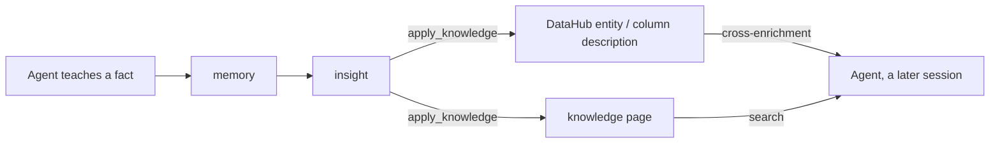

# Agent-Effectiveness Benchmarks

This page publishes results from the agent-effectiveness benchmark
(`bench/`, issue #930): does an agent connected to this platform answer real
data questions more correctly and more efficiently than the same agent
connected to bare data tools — and does the platform's memory layer let a fact
taught in one session survive into later ones? The benchmark ablates the
**platform**, not the model: every run holds the model, prompt scaffold, seed
data, and task set constant and varies only the platform configuration.

The two benchmarks measure **one knowledge system from two angles**, not two
independent features. The system has a **capture/curation half** and a
**surfacing half**, and they are coupled — the first populates what the second
delivers:

- **Capture / curation** — an agent records a fact (`memory`), it becomes an
  insight, and `apply_knowledge` promotes it into a *sink*: a DataHub entity or
  column description, or a knowledge page.
- **Surfacing** — curated knowledge reaches the agent through
  **cross-enrichment** (DataHub metadata is attached to query and describe
  results automatically) and **search** (knowledge pages). Enrichment is one of
  the places knowledge surfaces, alongside knowledge pages — not a standalone
  feature.



The two suites test the two halves. **S1–S3** (the arm ablation) tests the
**surfacing** half: with curated knowledge already present in the sinks, does the
platform reliably deliver it to the agent? **S5** (the lifecycle protocols) tests
the **capture-and-propagation** half: can a brand-new fact be captured, promoted,
and reach a *different* session or user? There is no enrichment value without
knowledge in the sinks, and no cross-session value without surfacing — the
benchmarks are two ends of the same pipe, and the results below read as one
coherent story (surfacing proven; capture-and-propagation maturing).

Methodology, arm definitions, and reproduction commands live in
[`bench/README.md`](https://github.com/txn2/mcp-data-platform/tree/main/bench).
The load harness's throughput numbers are a separate concern; see
[Tuning and Scaling](tuning-and-scaling.md).

Reading rule: the headline is always arm-vs-arm (or, for S5, works-vs-fails) on
a pinned model — the platform's effect. Model identity is disclosed but is
never the subject.

## How to read this page

Every result compares the **same model on the same tasks**, changing only what
the agent is connected to. The shorthand in the tables:

**Arms** — the platform configuration being measured. Each ablates one layer:

| Arm | What the agent is connected to |
| --- | --- |
| **A0 — raw tools** | The underlying data tools directly (`trino_*`, `s3_*`), no semantic provider, no search, all cross-enrichment off. Equivalent to wiring the standalone toolkit libraries. |
| **A1 — enrichment** | A0 plus semantic cross-enrichment: tool results carry DataHub context automatically, but the agent still has no `search` and no `datahub_*` tools. Isolates enrichment from discovery. |
| **A2 — platform** | The shipped semantic-first platform: A1 plus the `search` tool, the search-first gate, and curated knowledge pages. |
| **A3 — lifecycle** | A2 plus the memory / `apply_knowledge` lifecycle. On the single-session S1–S3 tasks A3 has nothing seeded to recall, so it tracks A2; the lifecycle's effect is what the S5 protocols measure. |

**Suites** — tasks grouped by what they test:

| Suite | Question it asks |
| --- | --- |
| **S1 — discovery** | Can the agent find the right table and columns? (straightforward lookups) |
| **S2 — analytical accuracy** | Can the agent compute exact numeric answers (single-table, join, temporal, cross-tab, top-N)? Four tasks emit SQL graded by execution-result comparison. |
| **S3 — knowledge traps** | Questions with a plausible-but-wrong answer, where the disambiguating fact lives in business knowledge, not in the raw data. |
| **S5 — memory lifecycle** | Does a fact taught in one session get captured, recalled, promoted, transferred to a different user, and correctly updated across later, separate sessions? |

**Scores:**

- **Accuracy** — correct graded attempts / graded attempts, averaged across the k = 3 repeats. The bracket is the 95% bootstrap confidence interval.
- **pass^k / pass^3** — a stricter bar than accuracy: a task counts as passed only if it passed **every one of the k = 3** attempts (tau-bench pass^k). "Accuracy" is the per-attempt average; "pass^3" is all-or-nothing per task.
- **Median / p90 tool calls** — how many tool calls the agent made to reach an answer, read from the platform's own audit log (p90 = 90th percentile). Fewer is better — efficiency is a first-class axis, following BIRD's Valid Efficiency Score.
- **`3/3`** (trap table) — passed 3 of 3 attempts on that task; **`0/3`** — failed all three.

## Methodology

**The four arms** are platform config profiles (`bench/config/`), not code
forks — the config surface is the ablation mechanism, which is itself a product
property worth proving. Each arm turns on exactly one more layer: A0 raw tools,
A1 adds cross-enrichment, A2 adds search and curated knowledge, A3 adds the
memory/`apply_knowledge` lifecycle. The arms without a discovery tool (A0, A1)
disable the search-first gate, which is not persona-aware; the DataHub arms (A1,
A2, A3) run against a seeded DataHub quickstart.

**Three model adapters.** The canonical `anthropic` adapter drives an
in-process agent loop against the Messages API with prompt caching on; it
produces all published and regression numbers. A `scripted` adapter replays a
deterministic script with no API key for smoke validation. A `claude-cli`
adapter drives a real Claude Code client (`claude -p`) for subscription/keyless
runs (#949). **Comparability caveat:** `claude -p` reinserts Claude Code's own
system prompt, tool policy, and retries, which shift across Claude Code
releases; within one run the arm-vs-arm delta is internally valid, but
claude-cli numbers are a labeled secondary path and are never mixed with
`anthropic` numbers in a published table. The manifest records the adapter and,
for claude-cli, the client version.

**Grading is deterministic**, scoring only the first line after a mandated
`FINAL ANSWER:` marker: numeric answers compare the first decimal-bearing
number; entity answers must name a correct alias and must not name any of the
task's generated trap answers. SQL-producing S2 tasks are graded BIRD-style — the
grader executes both the candidate and a reference query and compares result
sets as multisets of rows, so two different-but-equivalent queries both pass.
**A pinned LLM judge** scores only the one thing the deterministic graders
cannot: whether an S3 answer carried the required caveat. The judge's agreement
with human labels is measured over a committed 30-item calibration set and
published with any judged scores.

**The audit log is the measurement instrument.** The harness mints a session
handle via `platform_info`, threads it invisibly, and reads efficiency metrics
back from the admin audit API with `delivery: sync`; a run fails loudly when a
session's audit rows fall outside the harness's client-side accounting.
Attempts that fail at the harness level (connect, adapter, audit read-back)
never grade and are reported separately.

**Token basis.** Every attempt records its exact token split, including
`cache_read_tokens` and `cache_creation_tokens`, so a run's spend is reported
from committed data rather than estimated. This page publishes token counts, not
dollar figures: apply the model's current per-token pricing to the counts in the
Reproducibility section to get a cost. Cache reads bill at roughly a tenth of
fresh input, which is what keeps the runs affordable — prompt caching lets the
overwhelming majority of input arrive as cache reads (see the totals below).

**Reproducibility parameters** (shared by both suites): dataset seed 930; k = 3
repeats; a fixed bootstrap resampling seed, so identical inputs produce
identical confidence intervals. The task set and protocol set are content-hashed
and pinned in each run's manifest.

> **Build caveat.** Both suites below were produced on the development platform
> build `v1.102.0-9-gadfb9d90-dirty`, recorded in each manifest. This is a
> deliberate cost decision: the S1–S3 data is complete, reproducible, and
> manifest-pinned, so it is reused as-is rather than regenerated for a cleaner
> tag, and the S5 run was made on the same build for coherence. A future
> release-tagged run can refresh both suites under the identical pipeline if a
> tagged publication warrants it.

## 1. Surfacing half (semantic layer) — S1–S3 arm ablation

Status: full phase-2 suites, four arms, k = 3, 87 tasks × 3 = 261 graded
attempts per arm, zero harness failures.

Manifest:

| Field | Value |
| --- | --- |
| Arms | a0 (raw tools), a1 (enrichment), a2 (platform), a3 (lifecycle) |
| Model | claude-sonnet-5 (anthropic adapter, prompt caching on) |
| Repeats | k = 3 (pass^3 reported) |
| Dataset seed | 930 |
| Task-set hash | `7e727f891ee5` |
| Platform | v1.102.0-9-gadfb9d90-dirty @ commit `a373ff7f98e3` |
| Semantic layer | DataHub quickstart on OpenSearch |
| Attempts | 261 per arm (all graded; zero harness failures) |
| Efficiency source | platform audit API, `delivery: sync` |
| Raw results | `bench/results/phase2-anthropic-k3/` |

### Accuracy by suite

Accuracy is over graded attempts; the bracket is the 95% bootstrap CI.

| Suite | a0 (raw tools) | a1 (enrichment) | a2 (platform) | a3 (lifecycle) |
| --- | --- | --- | --- | --- |
| S1 discovery | 98.0% [94–100] | 98.0% [94–100] | 100.0% [100–100] | 98.0% [94–100] |
| S2 analytical | 100.0% [100–100] | 100.0% [100–100] | 97.8% [95–100] | 97.8% [95–100] |
| S3 knowledge traps | 42.7% [32–55] | 57.3% [45–68] | 98.7% [96–100] | 98.7% [96–100] |
| Overall | 83.1% [79–88] | 87.4% [83–91] | 98.5% [97–100] | 98.1% [96–100] |
| Overall pass^3 | 80% | 86% | 98% | 97% |

S1–S3 is the test of the **surfacing half** of the knowledge system: the
business facts are already present in the sinks (seeded here), and the question is
whether the platform reliably delivers them to the agent through its two
surfacing channels — cross-enrichment and search. It does. The effect
concentrates in S3, exactly where BIRD showed a ~20-point external-knowledge gap
with hand-curated evidence; here the platform surfaces that evidence
automatically. S3 accuracy climbs 42.7% → 57.3% → 98.7% as the two channels come
online, a **+56.0-point** gain for the full platform over bare tools (95% CI +44
to +67). Crucially, the two channels carry different facts: the **cross-enrichment
channel alone** (a1) recovers about a quarter of the gap (+14.7, CI −1 to +31) —
the facts that live in DataHub descriptions — while adding **search over
knowledge pages** (a2) closes nearly all of the rest (the class breakdown below
shows exactly which facts each channel carries). S1 and S2 are near ceiling for
every arm — a capable model finds tables and computes arithmetic without help — so
the platform's value is not in easy lookups but where a fact outside the raw data
disambiguates a plausible-but-wrong answer. This validates delivery; it does not,
by itself, test whether the platform can *acquire* that knowledge in the first
place — that is S5.

### S3 knowledge-trap accuracy by class

Each trap is answerable plausibly-but-wrongly without the knowledge layer. The
six classes separate what enrichment can carry (a fact in column/dataset
metadata) from what requires the curated knowledge pages.

| Trap class | a0 | a1 | a2 | a3 |
| --- | --- | --- | --- | --- |
| units_cents | 61.9% [48–76] | 88.1% [79–98] | 97.6% [93–100] | 97.6% [93–100] |
| net_revenue | 21.2% [9–36] | 48.5% [30–67] | 100.0% [100–100] | 100.0% [100–100] |
| fiscal_calendar | 0.0% [0–0] | 0.0% [0–0] | 100.0% [100–100] | 100.0% [100–100] |
| freshness_cutoff | 91.7% [75–100] | 100.0% [100–100] | 100.0% [100–100] | 100.0% [100–100] |
| tier_boundary | 0.0% [0–0] | 0.0% [0–0] | 93.3% [80–100] | 100.0% [100–100] |
| deprecated_table | 95.2% [86–100] | 95.2% [86–100] | 100.0% [100–100] | 100.0% [100–100] |

The pattern is legible, and it is a clean read on the two surfacing channels.
`units_cents` and `net_revenue` live in DataHub **column and dataset
descriptions**, so the **cross-enrichment channel** alone (a1) lifts them
materially (62→88, 21→49). `fiscal_calendar` and `tier_boundary` live **only in
knowledge pages** — invisible to enrichment — so a0 and a1 score 0% and only the
**search channel** (a2) recovers them. Same knowledge system, two delivery
channels: each trap is defeated exactly when the channel that carries its fact is
switched on. Whichever sink a fact is promoted to, the platform surfaces it.

### Efficiency (median tool calls by suite)

Fewer is better. Read from the audit log, not self-reported.

| Suite | a0 | a1 | a2 | a3 |
| --- | --- | --- | --- | --- |
| S1 discovery | 6 | 5 | 8 | 7 |
| S2 analytical | 6 | 6 | 9 | 9 |
| S3 knowledge traps | 16 | 11 | 10 | 11 |

On the knowledge traps, the platform reaches a **correct** answer in fewer calls
(16 → 10) than bare tools reach a mostly-wrong one: without the disambiguating
fact, the model flails — issuing exploratory queries and reasoning in circles —
whereas the enriched, search-first path retrieves the fact and answers. On the
easy suites the platform pays a small friction cost (a few extra calls, largely
SEARCH_REQUIRED refusals while the model adopts the search-first workflow),
consistent with the platform's value concentrating where knowledge is
load-bearing rather than on trivial lookups.

### Why a2 ties a3 here (and what it does *not* mean)

On S1–S3, arm a3 (platform + memory lifecycle) tracks arm a2 (platform) because
these tasks exercise only the **surfacing** half of the knowledge system. Each
task is one fresh session with the knowledge already seeded in the sinks and
nothing new to capture, so the `memory`/`apply_knowledge` capture path has
nothing to add to what a2 already surfaces. a2 ties a3 because S1–S3 does not
test the capture-and-propagation half — **not** because that half is without
value. Its value is inherently cross-session (teach once, answer forever), which
single-session accuracy cannot capture by construction. And it is that half that
*produces* the sink contents S1–S3 shows are so effective once present — the two
halves are the same pipe. That capture-and-propagation capability is measured
separately, and directly, by the S5 lifecycle protocols below.

## 2. Capture-and-propagation half (memory / knowledge lifecycle) — S5 lifecycle protocols

Status: three full lifecycle runs on the canonical `anthropic` adapter, arm a3,
k = 3 each — one **shared-store** run and two **isolated** replicates. Unlike the
S1–S3 ablation, S5 has no meaningful "memory off" baseline — a recall task with no
memory is trivially 0% — so it does not report an accuracy delta over a baseline.
Instead it measures whether the memory subsystem **works reliably**: across fresh
sessions, is a taught fact captured, recalled, surfaced, promoted to shared
knowledge, transferred to a different user, and correctly updated?

Three runs are reported for a reason worth stating up front. The **shared-store**
run is a single benchmark process: all 45 attempts run against one
knowledge/memory store, so a protocol's three repeats are *not* independent (an
earlier attempt's promotion persists as searchable knowledge). Each **isolated**
run removes that coupling — three independent passes of every protocol at k = 1,
with the platform reset to clean seeded state between passes (fresh Postgres,
DataHub descriptions and knowledge pages re-seeded), then merged into one k = 3
result. Two isolated replicates were run under identical configuration. **The
second replicate is what makes the S5 numbers trustworthy: comparing the two
isolated runs to each other separates a real effect from run-to-run noise, and it
turns out that most of the metric-by-metric differences at this scale are noise.**
The honest scorecard below is therefore read as a *range across runs*, not a set
of point estimates, and the interpretation is built on what stays stable across
all three.

S5 is not single questions but multi-episode **protocols**, each a sequence of
fresh sessions that exercises the teach-once-answer-forever lifecycle and
verifies every state transition through the platform's own admin APIs (the
insights and changesets endpoints), never inferred from a transcript. Each
protocol teaches a **novel** definition — deliberately absent from the seeded
knowledge and catalog — so the intended path to the answer is the taught memory
(recall) or the promoted knowledge (transfer), not a pre-seeded fixture (see the
limitations on re-derivability below). Ground truth is computed from the dataset,
never hand-typed, exactly as the S1–S3 truths. Each attempt consumes two pool
identities (a teacher and a learner) so the search-first gate's per-user
discovery scope never leaks between attempts.

Manifest (both runs share arm a3, model claude-sonnet-5 with prompt caching,
dataset seed 930, protocol-set hash `0920c55292d1`, 15 protocols — 10 promote,
5 supersede — and DataHub-quickstart enrichment with Ollama `nomic-embed-text`
memory embeddings; every lifecycle state transition is verified through the
admin insights + changesets API, never inferred from a transcript):

| Field | Shared-store | Isolated run 1 | Isolated run 2 |
| --- | --- | --- | --- |
| Regime | 45 attempts, one shared store (k-repeats coupled) | 3 independent k = 1 passes merged to k = 3 | 3 independent k = 1 passes merged to k = 3 |
| Platform build | v1.102.0-9-gadfb9d90-dirty | v1.102.0-10-g32d61254-dirty | v1.102.0-10-g32d61254-dirty |
| Transcripts | complete | passes 2–3 lost to a harness bug (metrics complete; see Limitations) | complete (all 3 passes) |
| Raw results | `bench/results/s5-anthropic-k3/` | `bench/results/s5-anthropic-k3-isolated/` | `bench/results/s5-anthropic-k3-isolated-v2/` |

The isolated runs used a later development-build string than the shared-store run
because they rebuilt the platform from the current tree; the platform code
(`cmd/ pkg/ internal/ go.mod go.sum`) is **byte-identical** between the two build
commits (verified by diff), so the difference is benchmark-harness commits only
and the runs are directly comparable.

### Lifecycle scorecard

Each metric is a numerator/denominator over the applicable, non-harness-failed
runs. Duplicate rate is lower-is-better; every other metric is higher-is-better.

| Metric | Shared-store | Isolated run 1 | Isolated run 2 | What it measures |
| --- | --- | --- | --- | --- |
| Capture rate | 80.0% (36/45) | 84.4% (38/45) | 82.2% (37/45) | the agent recorded the taught fact and entity-linked it (verified via the insights API) |
| Personal recall | 84.4% (38/45) | 88.9% (40/45) | 84.4% (38/45) | a fresh same-identity session answered the fact-dependent question correctly — graded on answer-correctness like an S1–S3 question, not on proven retrieval (see limitations) |
| Unprompted surface | 100.0% (36/36) | 100.0% (38/38) | 100.0% (37/37) | among captured runs, `search` surfaced the *saved memory* itself, unprompted — the cleaner "memory was actually used" signal |
| Transfer rate | 42.3% (11/26) | 43.3% (13/30) | 46.7% (14/30) | a *different* identity answered correctly after the reviewer promoted the insight to shared knowledge |
| Update correctness | 100.0% (10/10) | 100.0% (8/8) | 100.0% (7/7) | a correction flipped a later recall to the new value |
| Duplicate rate | 10.0% (1/10) | 0.0% (0/8) | 42.9% (3/7) | supersede left more than one live insight (lower is better) |
| Abstention | 100.0% (45/45) | 100.0% (45/45) | 95.6% (43/45) | the agent refused to fabricate a fact it was never taught |
| Full-lifecycle pass^3 | 20.0% (3/15) | 26.7% (4/15) | 20.0% (3/15) | every applicable stage passed all 3 attempts of the protocol |

**What is stable across all three runs — read these as the firm results.** The
platform surfaced every captured memory unprompted (unprompted surface 100% in
all three) and flipped every detected correction to the new value (update
correctness 100% in all three). Abstention held at 96–100% — the platform did not
fabricate facts it was never taught, the failure mode LongMemEval warns about.
And transfer sits at **42–47% across all three runs**: a fact promoted to shared
knowledge is reused by a different identity under half the time. That is the
clearest, most reproducible finding — a genuine reliability ceiling on
cross-identity transfer, and the sharpest lever for improvement. Where that
ceiling comes from matters, and the two-halves framing localizes it: **S1–S3 has
already validated the surfacing half** — enrichment and search reliably deliver
knowledge that is present in the sinks — so a transfer failure is very unlikely to
be a surfacing failure. It points **upstream, at the capture-and-propagation
half**: either the `apply_knowledge` promotion did not land in the aspect
enrichment reads (see the note in Limitations on entity-type coverage), or the
second identity surfaced the fact but did not use it. Transfer is a capture/
propagation problem, not a delivery problem — which is exactly where to look.

**What is *not* stable — most of the rest, and this is itself the finding.** The
two isolated replicates ran under identical configuration, differing only in the
model's run-to-run stochasticity, yet they disagree materially: duplicate rate is
**0% in one and 42.9% in the other**, pass^3 is 26.7% then 20.0%, and capture and
personal recall each move a few points. The apparent "isolation lift" over the
shared-store run that isolated run 1 alone suggested (capture 80→84%, recall 84→89%,
pass^3 20→27%) is **not reproduced** by isolated run 2 (82%, 84%, 20%) — so that lift
was largely **run-to-run variance, not the shared-store confound**. At this scale
(15 protocols, k = 3, with applicable denominators as small as 7–10 on the
supersede metrics) the sampling noise is wide, and no single run's
capture/recall/duplicate/pass^3 value should be read as a point estimate. The
second replicate earned its place by exposing exactly this: the confound's effect
on the scorecard is within the noise between two otherwise-identical runs. The
robust reading is the **range across runs**, anchored on the cross-run-stable
metrics above.

**Robustness to transient API errors.** All three runs recorded **zero harness
failures and zero episode-level errors** (45/45 attempts graded each), and the
run logs show no overload/rate-limit/5xx/retry markers. The harness excludes any
adapter- or transport-level failure from the metrics and counts it separately, so
a Claude API outage would appear as an excluded harness failure, never as a
silently mis-graded answer; the agent's budget is counted in tool calls, not
wall-clock, so outage latency does not change outcomes. The two isolated
replicates ran about an hour apart, so a sustained outage window would likely
have struck one and not the other — both were clean.

### Limitations

**Run-to-run variance dominates several metrics.** The two isolated replicates
are identical in configuration, so their disagreement is a direct read on
sampling noise: duplicate rate spans 0–43%, pass^3 spans 20–27%, and capture and
recall each move a few points. With 15 protocols and applicable denominators as
small as 7–10 on the supersede metrics, this is expected — these are small
samples. Treat capture, recall, duplicate rate, and pass^3 as ranges, not point
estimates, and weight the cross-run-stable results (unprompted surface, update
correctness, and the ~45% transfer ceiling) most. A larger protocol set and more
replicates would tighten the noisy metrics; that is the natural next investment.

**The shared-store confound is real in mechanism but small in effect.** In the
shared-store run, promotions from earlier attempts persist as globally searchable
knowledge pages, and two consequences are visible in its transcripts:

- **Capture failures from discovery-budget exhaustion.** In some later attempts
  the teacher spent its entire tool-call budget searching for and trying to read
  a page a *prior* attempt had promoted, and hit the 30-call cap before invoking
  the capture tool — recorded correctly as a capture miss (the insights API
  confirms zero insights for that identity). In `lc-house-tier` attempt 2, for
  example, the teacher's transcript ends "I ran out of tool-call budget before I
  could actually write the memory record."
- **Recall can be aided by shared knowledge.** A fresh session can reach the
  right answer via a prior attempt's promoted page rather than its own memory.

The isolated runs remove this coupling by resetting the platform to clean seeded
state between passes (fresh Postgres via a volume wipe, DataHub descriptions and
knowledge pages re-seeded, verified clean before each pass). But the effect that
removal produces is **within the variance between the two isolated replicates** —
so while the mechanism is documented and real, the scorecard cannot claim a
confound cost larger than the run-to-run noise. Reporting all three runs, rather
than a single shared-store-vs-isolated pair, is what makes that honest.

**Personal recall is graded on answer-correctness**, exactly like an S1–S3
question, so some taught definitions being partly re-derivable from the data can
inflate it; read it alongside unprompted surface, which is the cleaner evidence
that the saved memory itself was used.

**Transfer is a capture/propagation limit, not a surfacing one.** Because S1–S3
validates that enrichment and search deliver knowledge already in the sinks, the
~45% transfer ceiling is best diagnosed upstream: the `apply_knowledge` promotion
landing in an aspect enrichment reads (mcp-datahub `GetEntity` fully populates
dataset and dashboard entities but reads other entity types more sparsely, so a
promotion to a different entity type may surface incompletely), and whether the
second identity that *did* see the fact actually used it. This run does not yet
instrument that split; doing so is the natural next step for closing the gap.

**Raw-data note.** Isolated run 1's per-attempt records (final answers, tool-call
counts, tokens, audit) are complete, but a harness bug pointed all three of its
passes at one transcript directory, so only the last pass's turn-by-turn
transcripts survived on disk. No metric or cost derives from the lost
transcripts. The bug is fixed (each pass now writes its own directory) and
isolated run 2 preserves all three passes' transcripts; it is reported alongside
run 1 rather than replacing it.

### Reading S5 correctly

S5 answers a different question than S1–S3. S1–S3 asks "is the platform's
answer more correct?" and reports an accuracy delta between arms. S5 asks "does
the memory subsystem reliably carry a fact across sessions and users?" and
reports whether each stage of that lifecycle works — because the alternative (an
agent with no memory) does not fail *less accurately*, it simply cannot do the
task at all. A recall or transfer task run without the memory layer scores 0% by
construction, so a baseline comparison would be vacuous; the honest measurement
is reliability of the mechanism itself, which is what this scorecard reports.

## 3. Reproducibility and token spend

Both suites are reproducible from committed data and a recorded platform build.
Spend is reported as token counts (input / output / cache-read / cache-write);
apply the model's current per-token pricing to get a dollar figure.

**Semantic layer (S1–S3), reused as-is.** From a booted arm:

```bash
make bench-up BENCH_ARM=a0        # then a1, a2, a3 (a1/a2/a3 need a seeded DataHub quickstart)
make bench-run BENCH_ARM=a0 LLM=anthropic MODEL=claude-sonnet-5 K=3
make bench-compare                # cross-arm tables + bootstrap CIs
```

Token spend across all four arms (1,044 graded attempts), from the committed
per-attempt records: **17,728 fresh input, 1,725,111 output, 80,695,457
cache-read, and 4,555,362 cache-write tokens** (≈ 87.0M total). Prompt caching is
what keeps this affordable: the arms read ~80.7M cached input tokens against only
~4.6M freshly written, so cache reads dominate the input. The lifecycle arm (a3)
is the heaviest single arm because its larger memory/search context is re-sent
each turn.

**Memory layer (S5).** Boot the a3 arm with the metrics port overridden to
avoid the DataHub Kafka :9092 clash, and with `ollama serve` +
`nomic-embed-text` available so supersede detection has an embedding provider:

```bash
make bench-up BENCH_ARM=a3 BENCH_METRICS_ADDR=:9095
make bench-lifecycle LLM=anthropic MODEL=claude-sonnet-5 K=3
make bench-lifecycle-report
```

Token spend for the shared-store S5 run, from the committed records: **2,578
fresh input, 356,015 output, 23,913,219 cache-read, and 1,502,311 cache-write
tokens** (≈ 25.8M total) across the 45 attempts, bounded during the run by a
spend watchdog. The local Ollama embedding adds no API tokens.

Each **isolated** run is three independent single-pass runs with a clean reset
between them, merged into one k = 3 result. Every pass writes to its own
directory so all raw transcripts are preserved:

```bash
D=bench/results/s5-anthropic-k3-isolated-v2
for pass in 1 2 3; do
  make bench-down && make e2e-down          # wipe Postgres volume
  make bench-seed-datahub                    # reset DataHub descriptions to seed
  make bench-up BENCH_ARM=a3 BENCH_METRICS_ADDR=:9095
  build/benchrun -lifecycle -arm a3 -url http://localhost:8098 -credential "$KEY" \
    -protocols bench/protocols -k 1 -llm anthropic -model claude-sonnet-5 \
    -out "$D/pass$pass/lifecycle-a3.json"
done
build/benchrun -lifecycle -merge "$D/pass1/lifecycle-a3.json,$D/pass2/lifecycle-a3.json,$D/pass3/lifecycle-a3.json" \
  -out "$D/lifecycle-a3.json"
```

The two isolated replicates spent, respectively: **2,438 / 296,917 / 21,260,051 /
1,328,127** and **2,438 / 286,587 / 21,315,216 / 1,291,098** tokens (input /
output / cache-read / cache-write; ≈ 22.9M total each) across their 45 attempts,
also watchdog-bounded.

**Regression gate.** Any committed run can serve as a baseline for future runs:

```bash
make bench-run BENCH_ARM=a2 LLM=anthropic K=3 BASELINE=bench/results/phase2-anthropic-k3/full-a2/results.json
```

`benchrun -baseline <results.json>` compares the fresh run to the baseline
suite-by-suite and exits nonzero if any suite regresses beyond the default
thresholds (accuracy or pass^k drop > 5 points, or median tool calls > 1.25×),
so a broken enrichment path or a persona that stops granting search fails CI
loudly. The gate's failure behavior is covered deterministically by unit tests,
and a scripted, no-API-key smoke of the full pipeline (plus a live self-check of
the gate) runs on demand via the `workflow_dispatch` path of the Bench Harness
CI workflow.

**Total published token spend: ≈ 158.6M tokens** — 25,182 fresh input, 2,664,630
output, 147,183,943 cache-read, and 8,676,898 cache-write across all runs
(S1–S3 reused as-is, plus the shared-store and two isolated S5 replicates). Cache
reads are ~93% of the total, which is why prompt caching is the load-bearing cost
control; apply current `claude-sonnet-5` pricing to these counts for a dollar
figure.

## 4. Honest caveats

- Results are model-dependent; the headline is arm-vs-arm (or, for S5,
  works-vs-fails) on a single pinned model, never model-vs-model.
- The seed dataset is small by design (fixed seed, airgapped); absolute
  accuracies are not real-world estimates. What the ablation isolates — the
  platform's effect, holding everything else constant — is the point.
- All runs used development builds, not a release tag: S1–S3 and the
  shared-store S5 run on `v1.102.0-9-gadfb9d90-dirty`, the isolated S5 run on
  `v1.102.0-10-g32d61254-dirty` (adjacent builds differing only by
  benchmark-harness commits). The manifests pin each; a tagged run can refresh
  all under the same pipeline.
- CIs are percentile bootstrap over graded attempts with a fixed resampling
  seed — reproducible, but they do not model task-selection variance.
- S1–S3 tests the surfacing half, not the capture-and-propagation half, so a2
  tying a3 there reflects the test scope, not the value of capture; the two are
  one knowledge system (capture populates the sinks that surfacing delivers),
  and capture-and-propagation is measured by S5.

## 5. Result history

| Date | Suite | Arms | Model | Attempts | Raw results |
| --- | --- | --- | --- | --- | --- |
| 2026-07-13 | 1 (pilot) | a0, a2 | claude-sonnet-5 | 60 | `bench/results/v1.102.0-pilot/` |
| 2026-07-13 | 3 (S5 pilot) | a3 | claude-sonnet-5 | 13 protocols | `bench/results/v1.102.0-s5-partial/` |
| 2026-07-14 | Semantic (S1–S3) | a0, a1, a2, a3 | claude-sonnet-5 | 261/arm | `bench/results/phase2-anthropic-k3/` |
| 2026-07-14 | Memory (S5, shared-store) | a3 | claude-sonnet-5 | 15 protocols × 3 | `bench/results/s5-anthropic-k3/` |
| 2026-07-14 | Memory (S5, isolated run 1) | a3 | claude-sonnet-5 | 15 protocols × 3 passes | `bench/results/s5-anthropic-k3-isolated/` |
| 2026-07-14 | Memory (S5, isolated run 2) | a3 | claude-sonnet-5 | 15 protocols × 3 passes | `bench/results/s5-anthropic-k3-isolated-v2/` |
