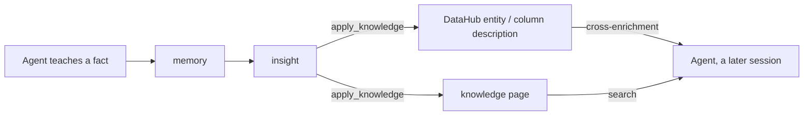

# Knowledge-Layer Benchmark

The platform ships an agent-effectiveness benchmark (`bench/`, issue #930) that
answers one testable question: does an agent connected to the platform's
**semantic knowledge layer** answer real data questions more correctly than the
same agent connected to bare data tools, and can a fact taught in one session
survive into later ones?

This page is the product-framed introduction. The neutral, recomputed-from-raw
numbers, the confidence intervals, the cold-start learning curve, the lifecycle
scorecard, the threats to validity, and the citation live in the canonical
**[Benchmark Report](benchmark-report.md)**.

## What is measured (and what is not)

The benchmark ablates the **knowledge layer specifically**: cross-enrichment,
`search`, and the memory / `apply_knowledge` lifecycle. It is one feature's
evaluation, not a whole-system score. It says nothing about OAuth 2.1 auth,
personas, audit, the MCP and API gateways, the portal, or the raw
Trino/DataHub/S3 toolkits. Every run holds the model, prompt scaffold, seed data,
and task set constant and varies only the platform configuration, so the headline
is always **arm vs arm** on a pinned model, never model vs model. Model identity
is disclosed but is never the subject.

## The headline result

On knowledge-trap questions, answerable plausibly but wrongly without business
context, the knowledge layer lifts accuracy from **42.7% (raw tools) to 98.7%**,
a **+56.0-point** gain with a 95% bootstrap confidence interval of **+44 to +67**
([full ablation](benchmark-report.md#3-results-single-shot-ablation-s1-to-s3)).
On plain discovery and numeric questions, where no business context is required,
the arms are statistically indistinguishable: the effect is specific to
knowledge-gated tasks, not a general accuracy uplift.

!!! note "Read this as arm vs arm, not an absolute score"
    The platform is not "98% accurate." A raw-tools baseline scores 42.7% on the
    same trap suite; the knowledge layer closes that gap. The number is the
    *difference the layer makes*, holding the model and tasks fixed.

## One knowledge system, two halves

The benchmark measures **one knowledge system from two angles**, not two
independent features. The system has a **capture/curation half** and a
**surfacing half**, and they are coupled: the first populates what the second
delivers.

- **Capture / curation.** An agent records a fact (`memory`), it becomes an
  insight, and `apply_knowledge` promotes it into a *sink*: a DataHub entity or
  column description, or a knowledge page.
- **Surfacing.** Curated knowledge reaches the agent through
  **cross-enrichment** (DataHub metadata is attached to query and describe
  results automatically) and **search** (knowledge pages).

The report's two suites test the two halves. **S1 to S3** (the four-arm ablation)
tests the **surfacing** half: with curated knowledge already present in the sinks,
does the platform reliably deliver it to the agent? **S5** (the lifecycle
protocols) tests the **capture-and-propagation** half: can a brand-new fact be
captured, promoted, and reach a *different* session or user? The **cold-start**
study joins them end to end, teaching facts one at a time into an empty layer and
re-evaluating after each promotion. There is no enrichment value without
knowledge in the sinks, and no cross-session value without surfacing: the
benchmarks are two ends of the same pipe.

## Read the full results

- **[Benchmark Report](benchmark-report.md)** is the canonical, citable results
  page: the four-arm ablation with bootstrap confidence intervals, the S3
  knowledge-trap breakdown, the cold-start learning curve, the S5 lifecycle
  scorecard, threats to validity, reproducibility, and the data-availability
  table. Every number is recomputed from committed raw data by
  `bench/report/report.ipynb`.
- **[`bench/README.md`](https://github.com/txn2/mcp-data-platform/tree/main/bench)**
  is the operator manual: how to run every suite, arm definitions, the identity
  pool, grading, and the regression gate.

The load harness's throughput and latency numbers are a separate concern; see
[Tuning and Scaling](tuning-and-scaling.md).
