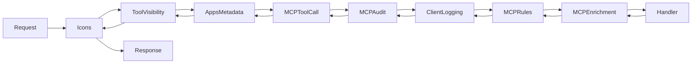

# Middleware Reference

Middleware processes requests and responses at the MCP protocol level. Each middleware intercepts `tools/call` requests before they reach tool handlers, and can process responses on the way back.

## Middleware Architecture



The platform registers up to eight middleware layers. Execution flows left-to-right for requests and right-to-left for responses.

## MCP Middleware Interface

```go
// MCP middleware signature from the go-sdk
type Middleware func(next MethodHandler) MethodHandler

type MethodHandler func(ctx context.Context, method string, req Request) (Result, error)
```

## AddReceivingMiddleware Ordering

`server.AddReceivingMiddleware()` wraps the current handler, making each newly-added middleware the **outermost** layer. The **last** middleware added runs **first**.

To achieve the desired execution order, middleware must be added innermost-first:

```go
// Desired execution: Visibility → Apps → Auth → Audit → Rules → Enrichment → handler
// Add order (innermost first):
server.AddReceivingMiddleware(enrichment)   // innermost
server.AddReceivingMiddleware(rules)
server.AddReceivingMiddleware(audit)
server.AddReceivingMiddleware(auth)         // outermost for tools/call
server.AddReceivingMiddleware(apps)         // apps metadata
server.AddReceivingMiddleware(visibility)   // overall outermost (if configured)
```

This ordering is critical for context propagation. Go's `context.WithValue` creates a new context. Values set in an outer middleware (like `PlatformContext` set by Auth) are visible to inner middleware (like Audit), but not the other way around.

## Platform Context

The platform context carries request-scoped data through the middleware:

```go
type PlatformContext struct {
    // Request identification
    RequestID   string
    StartTime   time.Time

    // User information
    UserID      string
    UserEmail   string
    UserClaims  map[string]any
    Roles       []string
    PersonaName string

    // Tool information
    ToolName    string
    ToolkitKind string
    ToolkitName string
    Connection  string

    // Authorization
    Authorized  bool
    AuthzError  string

    // Results (populated after handler)
    Success      bool
    ErrorMessage string
    Duration     time.Duration
}

// Get context from request context
pc := middleware.GetPlatformContext(ctx)

// Set context in request context
ctx = middleware.WithPlatformContext(ctx, pc)
```

## Built-in Middleware

### MCPToolCallMiddleware

Handles authentication, authorization, and toolkit metadata lookup at the MCP protocol level. Creates the `PlatformContext` that all inner middleware depends on.

```go
func MCPToolCallMiddleware(
    authenticator Authenticator,
    authorizer Authorizer,
    toolkitLookup ToolkitLookup,
) mcp.Middleware
```

**Behavior:**

1. Only intercepts `tools/call` requests (passes through other methods)
2. Extracts tool name from request parameters
3. Creates PlatformContext with request ID and tool name
4. Looks up toolkit metadata (kind, name, connection) via `ToolkitLookup`
5. Runs authenticator to identify user (populates UserID, Email, Roles)
6. Runs authorizer to check tool access (populates PersonaName, Authorized)
7. Returns error result if auth fails, otherwise proceeds

The `toolkitLookup` parameter is optional; if `nil`, toolkit metadata fields remain empty.

### MCPAuditMiddleware

Logs tool calls for compliance and debugging. See [Audit Logging](../server/audit.md) for full documentation.

```go
func MCPAuditMiddleware(logger AuditLogger) mcp.Middleware
```

**Behavior:**

1. Only intercepts `tools/call` requests
2. Records start time
3. Calls next handler
4. Gets PlatformContext (set by MCPToolCallMiddleware)
5. Builds audit event with timing, user, tool, and parameter data
6. Logs asynchronously in a goroutine (does not block response)

If PlatformContext is `nil` (auth middleware didn't run or middleware is misordered), audit logging is skipped with a warning.

### MCPRuleEnforcementMiddleware

Adds operational guidance and warnings to tool responses based on configured rules.

```go
func MCPRuleEnforcementMiddleware(
    engine *tuning.RuleEngine,
    hints *tuning.HintManager,
) mcp.Middleware
```

**Behavior:**

1. Only intercepts `tools/call` requests
2. Calls next handler to get result
3. Evaluates rules (e.g., require DataHub check, warn on deprecated tables)
4. Appends rule messages and tool hints to result content

### MCPSemanticEnrichmentMiddleware

Adds cross-service context to tool results.

```go
func MCPSemanticEnrichmentMiddleware(
    semanticProvider semantic.Provider,
    queryProvider query.Provider,
    storageProvider storage.Provider,
    cfg EnrichmentConfig,
) mcp.Middleware
```

**Behavior:**

1. Only intercepts `tools/call` requests
2. Calls next handler to get result
3. Skips enrichment if result is error
4. Determines toolkit kind from tool name prefix (`trino_`, `datahub_`, `s3_`)
5. Calls appropriate enrichment function based on toolkit
6. Appends semantic context to result content

### MCPToolVisibilityMiddleware

Filters `tools/list` responses to hide tools that don't match configured allow/deny patterns. This reduces LLM token usage for deployments that only use a subset of toolkits. Only registered when patterns are configured.

```go
func MCPToolVisibilityMiddleware(allow, deny []string) mcp.Middleware
```

**Behavior:**

1. Only intercepts `tools/list` responses (passes through all other methods including `tools/call`)
2. Calls next handler to get the full tool list
3. Filters tools using `filepath.Match` patterns
4. No patterns configured = all tools visible
5. Allow only = only matching tools pass
6. Deny only = all tools pass except denied
7. Both = allow first, then deny removes from that set

This is a **visibility filter**, not a security boundary. Persona-level tool filtering via MCPToolCallMiddleware continues to gate `tools/call` independently.

### MCPIconMiddleware

Injects config-driven icons into `tools/list`, `resources/templates/list`, and `prompts/list` responses. Upstream toolkits provide default icons; this middleware allows deployers to override or add custom icons via configuration.

```go
func MCPIconMiddleware(cfg IconsMiddlewareConfig) mcp.Middleware
```

**Behavior:**

1. Intercepts list responses (`tools/list`, `resources/templates/list`, `prompts/list`)
2. Matches tools/resources/prompts by name or URI
3. Appends configured icons to matching entries
4. Passes through all other methods unchanged

Only registered when `icons.enabled: true` in configuration.

### MCPClientLoggingMiddleware

Sends server-to-client log messages via the MCP `logging/setLevel` protocol. Reports enrichment decisions, timing data, and platform diagnostics. Zero overhead if the client hasn't called `setLevel`.

**Behavior:**

1. Only active for `tools/call` requests
2. Sends log messages using the server session's `LoggingMessage` method
3. Messages include enrichment details, query timing, and semantic cache hits
4. No-op if the client hasn't subscribed via `logging/setLevel`

Only registered when `client_logging.enabled: true` in configuration.

### ToolMetadataMiddleware (MCP Apps)

Injects `_meta.ui` fields into `tools/list` responses for tools that have associated MCP Apps.

```go
func ToolMetadataMiddleware(reg *mcpapps.Registry) mcp.Middleware
```

**Behavior:**

1. Intercepts `tools/list` responses (not `tools/call`)
2. For each tool with an associated MCP App, adds UI metadata to the response

## Enrichment Configuration

```go
type EnrichmentConfig struct {
    EnrichTrinoResults          bool  // Add DataHub metadata to Trino results
    EnrichDataHubResults        bool  // Add Trino query availability to DataHub results
    EnrichS3Results             bool  // Add DataHub metadata to S3 results
    EnrichDataHubStorageResults bool  // Add S3 availability to DataHub results
}
```

## Middleware Registration

Middleware is registered in `platform.go` `finalizeSetup()`. The add order is innermost-first because `AddReceivingMiddleware` makes each call the new outermost layer:

```go
// 1. Semantic enrichment (innermost) - enriches responses
if needsEnrichment {
    p.mcpServer.AddReceivingMiddleware(
        middleware.MCPSemanticEnrichmentMiddleware(
            p.semanticProvider, p.queryProvider, p.storageProvider, enrichCfg,
        ),
    )
}

// 2. Rule enforcement - adds operational guidance
if p.ruleEngine != nil {
    p.mcpServer.AddReceivingMiddleware(
        middleware.MCPRuleEnforcementMiddleware(p.ruleEngine, p.hintManager),
    )
}

// 3. Audit - logs tool calls (reads PlatformContext from Auth)
if p.config.Audit.Enabled && p.config.Audit.LogToolCalls {
    p.mcpServer.AddReceivingMiddleware(
        middleware.MCPAuditMiddleware(p.auditLogger),
    )
}

// 4. Auth/Authz - creates PlatformContext (must be outer to Audit)
p.mcpServer.AddReceivingMiddleware(
    middleware.MCPToolCallMiddleware(p.authenticator, p.authorizer, p.toolkitRegistry),
)

// 5. MCP Apps metadata
if p.mcpAppsRegistry != nil && p.mcpAppsRegistry.HasApps() {
    p.mcpServer.AddReceivingMiddleware(
        mcpapps.ToolMetadataMiddleware(p.mcpAppsRegistry),
    )
}

// 6. Tool visibility (overall outermost, only if patterns configured)
if len(p.config.Tools.Allow) > 0 || len(p.config.Tools.Deny) > 0 {
    p.mcpServer.AddReceivingMiddleware(
        middleware.MCPToolVisibilityMiddleware(p.config.Tools.Allow, p.config.Tools.Deny),
    )
}
```

## Interfaces

### Authenticator

```go
type Authenticator interface {
    Authenticate(ctx context.Context) (*UserInfo, error)
}

type UserInfo struct {
    UserID   string
    Email    string
    Claims   map[string]any
    Roles    []string
    AuthType string // "oidc", "apikey", etc.
}
```

### Authorizer

```go
type Authorizer interface {
    // IsAuthorized checks if the user can use the tool.
    // Returns:
    //   - authorized: whether the user is authorized
    //   - personaName: the resolved persona name (for audit logging)
    //   - reason: reason for denial (empty if authorized)
    IsAuthorized(ctx context.Context, userID string, roles []string, toolName string) (authorized bool, personaName string, reason string)
}
```

### ToolkitLookup

```go
type ToolkitLookup interface {
    // GetToolkitForTool returns toolkit info (kind, name, connection) for a tool.
    // Returns found=false if the tool is not found in any registered toolkit.
    GetToolkitForTool(toolName string) (kind, name, connection string, found bool)
}
```

### AuditLogger

```go
type AuditLogger interface {
    Log(ctx context.Context, event AuditEvent) error
}

type AuditEvent struct {
    Timestamp    time.Time      `json:"timestamp"`
    RequestID    string         `json:"request_id"`
    UserID       string         `json:"user_id"`
    UserEmail    string         `json:"user_email"`
    Persona      string         `json:"persona"`
    ToolName     string         `json:"tool_name"`
    ToolkitKind  string         `json:"toolkit_kind"`
    ToolkitName  string         `json:"toolkit_name"`
    Connection   string         `json:"connection"`
    Parameters   map[string]any `json:"parameters"`
    Success      bool           `json:"success"`
    ErrorMessage string         `json:"error_message,omitempty"`
    DurationMS   int64          `json:"duration_ms"`
}
```

## Best Practices

**Understand `AddReceivingMiddleware` wrapping:**
Each call makes the new middleware the outermost layer. Add innermost middleware first. If middleware B reads context values set by middleware A, then A must be outer to B (added after B).

**Check method type:**
Only intercept `tools/call` for tool-specific middleware. Pass through other methods unchanged.

**Use PlatformContext:**
Pass request-scoped data via PlatformContext, not global variables.

**Log asynchronously:**
Audit and logging middleware should not block the response.

**Handle errors gracefully:**
Return MCP error results rather than Go errors for client-facing failures.
